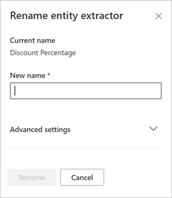

# Extraktor in Microsoft SharePoint Syntex umbenennenRename an extractor in Microsoft SharePoint Syntex

Irgendwann müssen Sie möglicherweise einen Extraktor umbenennen, wenn Sie auf ein extrahiertes Datenfeld mit einem anderen Namen verweisen möchten.At some point, you might need to rename an extractor if you want to refer to an extracted data field by a different name. Beispielsweise beschließt Ihre Organisation, Änderungen an ihren Vertragsdokumenten vorzunehmen, und bezeichnet "Käufer" in ihren Dokumenten als "Kunden".For example, your organization decides to make changes to their contract documents, and refers to “customers” as “clients” in their documents. Wenn Sie in Ihrem Modell ein Feld "Käufer" extrahiert haben, können Sie es in "Kunde" umbenennen.If you were extracting a “Customer” field in your model, you can choose to rename it to “Client.”

Wenn Sie Ihr aktualisiertes Modell mit Ihrer SharePoint-Dokumentbibliothek synchronisieren, wird in Ihrer Dokumentbibliotheksansicht eine neue Spalte "Kunde" angezeigt.When you sync your updated model to your SharePoint document library, you will see a new “Client” column in your document library view. In Ihrer Ansicht wird die Spalte "Käufer" für frühere Aktivitäten beibehalten, die neue Spalte "Kunde" wird jedoch für alle neuen Dokumente aktualisiert, die von Ihrem Modell verarbeitet werden.Your view will retain the “Customer” column for past activity, but will update the new “Client” column for all new documents that are processed by your model. 

> [!IMPORTANT]
>  Stellen Sie sicher, dass Sie Ihr aktualisiertes Modell mit den Dokumentbibliotheken synchronisieren, in denen Sie es zuvor angewendet haben, damit der neue Spaltenname angezeigt wird.Make sure to sync your updated model to the document libraries where you had previously applied it for the new column name to display. 

## Umbenennen eines ExtraktorsRename an extractor

Führen Sie die folgenden Schritte aus, um einen Entitätsextraktor umzubenennen.Follow these steps to rename an entity extractor.

1. Wählen Sie im Inhaltscenter **Modelle** aus, um die Liste ihrer Modelle anzuzeigen.From the content center, select **Models** to see your models list.

2. Wählen Sie auf der Seite **Modelle** in der Spalte **Name** das Modell aus, für das Sie einen Extraktor umbenennen möchten.On the **Models** page, in the **Name** column, select the model for which you want to rename an extractor.

3. Wählen Sie unter **Entitätsextraktoren** den Namen des Extraktors aus, den Sie umbenennen möchten, und wählen Sie dann **Umbenennen** aus.Under **Entity extractors**, select the name of the extractor you want to rename, and then select **Rename**. 

      

4. Im Bereich **Entitätsextraktor umbenennen**:On the **Rename entity extractor** panel:

   a.a. Geben Sie unter **Neuer Name** den neuen Namen des Extraktors ein.Under **New name**, enter the new name of the extractor. 

      

   b.b. (Optional) Wählen Sie unter **Erweiterte Einstellungen**, ob Sie eine vorhandene Sitespalte zuordnen möchten.(Optional) Under **Advanced settings**, select whether you want to associate an existing site column.

5. Wählen Sie **Umbenennen** aus.Select **Rename**.

## Siehe auchSee Also
[Erstellen eines ExtraktorsCreate an extractor](create-an-extractor.md)

[Erstellen einer KlassifizierungCreate a classifier](create-a-classifier.md)

[Ein Modell umbenennenRename a model](rename-a-model.md)

[BeschreibungstypenExplanation types](explanation-types-overview.md)

[Nutzung der Terminologiespeichertaxonomie beim Erstellen eines ExtraktorsLeverage term store taxonomy when creating an extractor](leverage-term-store-taxonomy.md)

[Übersicht über das DokumentenverständnisDocument Understanding overview](document-understanding-overview.md)

[Anwenden eines ModellsApply a model](apply-a-model.md) 
