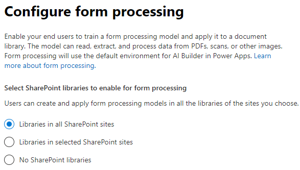

# Einrichten von SharePoint SyntexSet up SharePoint Syntex

Administratoren können das Microsoft 365 Admin Center verwenden, um [Microsoft SharePoint Syntex](index.md) einzurichten.Admins can use the Microsoft 365 admin center to set up [Microsoft SharePoint Syntex](index.md). 

Denken Sie vor dem Beginn über Folgendes nach:Consider the following before you start:

- Auf welchen SharePoint-Websites wird die Formularverarbeitung aktiviert?In which SharePoint sites will you enable form processing? Auf allen, auf einigen oder auf ausgewählten Websites?All of them, some, or select sites?
- Wie werden Sie Ihr Standard-Inhaltscenter nennen?What will you name your default content center?

Sie können Ihre Einstellungen nach der erstmaligen Einrichtung im Microsoft 365 Admin Center ändern.You can change your settings after initial setup in the Microsoft 365 admin center.

Vergewissern Sie sich vor dem Einrichten, dass Sie die beste Möglichkeit zum Einrichten und Konfigurieren des Inhaltsverständnisses in Ihrer Umgebung planen.Prior to setup, make sure to plan for the best way to set up and configure content understanding in your environment. Sie müssen beispielsweise folgende Entscheidungen treffen:For example, you need to make the following decisions:

- Die SharePoint-Websites, auf denen Sie die Verarbeitung von Formularen aktivieren möchten – alle, einige oder ausgewählte Websites.The SharePoint sites in which you want to enable form processing - all of them, some, or selected sites
- Name und Administratoren für Ihr InhaltscenterThe name and admins for your content center

## AnforderungenRequirements 

> [!NOTE]
> Sie müssen über globale Administrator- oder SharePoint-Administratorberechtigungen verfügen, um auf das Microsoft 365 Admin Center zugreifen und SharePoint Syntex einrichten zu können.You must have Global admin or SharePoint admin permissions to be able to access the Microsoft 365 admin center and set up SharePoint Syntex.

Als Administrator können Sie nach dem Einrichten und in den Verwaltungseinstellungen für das Inhaltsverständnis im Microsoft 365 Admin Center jederzeit Änderungen an den ausgewählten Einstellungen vornehmen.As an admin, you can also make changes to your selected settings anytime after setup, and throughout the content understanding management settings in the Microsoft 365 Admin Center.

### LizenzierungLicensing

Um SharePoint Syntex verwenden zu können, muss Ihre Organisation ein entsprechendes Abonnement dafür haben, und jedem Benutzer müssen die folgenden Lizenzen zugewiesen sein:To use SharePoint Syntex, your organization must have a subscription to SharePoint Syntex, and each user must have the following licenses assigned:

- SharePoint SyntexSharePoint Syntex
- SharePoint Syntex – SPO-TypSharePoint Syntex - SPO type
- Gemeinsamer Datendienst für SharePoint SyntexCommon Data Service for SharePoint Syntex

Wenn Sie Ihr SharePoint Syntex-Abonnement zu einem späteren Zeitpunkt kündigen (oder wenn Ihre Testversion abläuft), können Benutzer kein Dokumentverständnis- oder Formularverarbeitungsmodell mehr erstellen oder ausführen, und die Inhaltscenter-Vorlage ist nicht mehr verfügbar.If you cancel your SharePoint Syntex subscription at a future date (or your trial expires), users will no longer be able to create or run document understanding or form processing models, and the content center template will no longer be available. Zusätzlich werden Terminologiespeicher-Berichte, SKOS-Taxonomie-Importe und Inhaltstyp-Push nicht mehr verfügbar sein.Additionally, term store reports, SKOS taxonomy import, and Content type push will no longer be available. Es werden keine Inhalte gelöscht und die Websiteberechtigungen werden nicht verändert.No content will be deleted and site permissions will not be changed.

### KI-Generator-PunkteAI Builder credits

Wenn Sie 300 oder mehr SharePoint Syntex-Lizenzen für SharePoint Syntex in Ihrer Organisation besitzen, werden Ihnen 1 Million KI-Generator-Punkte zugeteilt.If you have 300 or more SharePoint Syntex licenses for SharePoint Syntex in your organization, you will be allocated one million AI Builder credits. Wenn Sie weniger als 300 Lizenzen besitzen, müssen Sie KI-Generator-Punkte erwerben, um die Formularverarbeitung zu verwenden.If you have fewer than 300 licenses, you must purchase AI Builder credits in order to use forms processing.

Sie können die für Sie geeignete KI-Generator-Kapazität mit dem [KI-Generator-Rechner](https://powerapps.microsoft.com/ai-builder-calculator) abschätzen.You can estimate the AI Builder capacity that’s right for you with the [AI Builder calculator](https://powerapps.microsoft.com/ai-builder-calculator).

Wechseln Sie zum [Power Platform Admin Center](https://admin.powerplatform.microsoft.com/resources/capacity), um Ihre Punkte und deren Nutzung zu überprüfen.Go to the [Power Platform admin center](https://admin.powerplatform.microsoft.com/resources/capacity) to check your credits and usage.

## So richten Sie SharePoint Syntex einTo set up SharePoint Syntex

1. Wählen Sie im Microsoft 365 Admin Center **Setup** aus, und zeigen Sie dann den Abschnitt **Dateien und Inhalte** an.In the Microsoft 365 admin center, select **Setup**, and then view the **Files and content** section.

2. Wählen Sie im Abschnitt **Dateien und Inhalte** > **Inhaltsverständnis automatisieren** aus.In the **Files and content** section, select **Automate content understanding**. 

3. Klicken Sie auf der Seite **Inhaltsverständnis automatisieren** auf **Erste Schritte**, um den Setupvorgang zu durchlaufen.On the **Automate content understanding** page, click **Get started** to walk through the setup process. 

    > [!div class="mx-imgBorder"]
    >  

4. Auf der Seite **Formularverarbeitung konfigurieren** können Sie auswählen, ob Sie zulassen möchten, dass Benutzer Formularverarbeitungsmodelle in bestimmten SharePoint-Dokumentbibliotheken erstellen können.On the **Configure Form Processing** page, you can choose if you want to let users be able to create form processing models in specific SharePoint document libraries. Im Menüband "Dokumentbibliothek" wird eine Menüoption zum **Erstellen eines Formularverarbeitungsmodells** in SharePoint-Dokumentbibliotheken verfügbar, in denen es aktiviert ist.A menu option will be available in the document library ribbon to **Create a form processing model** in SharePoint document libraries in which it is enabled.
 
     Für **Welche SharePoint-Bibliotheken sollen die Option zum Erstellen eines Formularverarbeitungsmodells anzeigen** können Sie Folgendes auswählen:For **Which SharePoint libraries should show option to create a form processing model**, you can select: 
      - **Bibliotheken in allen SharePoint-Websites**, damit die Option für alle SharePoint-Bibliotheken in Ihrer Organisation verfügbar gemacht wird.**Libraries in all SharePoint sites** to make it available to all SharePoint libraries in your organization. 
      - **Bibliotheken in ausgewählten SharePoint-Websites**. Wählen Sie dann die Websites aus, auf denen Sie die Option verfügbar machen möchten, oder laden Sie eine Liste mit bis zu 50 Websites hoch.**Libraries in selected SharePoint sites**, and then select the sites in which you want to make it available or upload a list of up to 50 sites. 
      - **Keine SharePoint-Bibliotheken**, wenn Sie die Option nicht auf Websites verfügbar machen möchten (Sie können dies nach der Einrichtung ändern).**No SharePoint libraries** if you don't want to make it available to any sites (you can change this after setup).

   > [!div class="mx-imgBorder"]
   > 

   > [!Note]
   > Wenn Sie eine Website entfernen, nachdem sie hinzugefügt wurde, hat dies keine Auswirkung auf vorhandene Modelle, die auf die Bibliotheken auf dieser Website angewendet werden, oder die Möglichkeit, Dokumentverständnismodelle auf eine Bibliothek anzuwenden.Removing a site after it has been included does not affect existing models applied to the libraries in that site or the ability to apply document understanding models to a library. 
    
5. Auf der Seite **Inhaltscenter erstellen** können Sie eine Website im SharePoint-Inhaltscenter erstellen, auf der Ihre Benutzer Modelle zum Dokumentverständnis erstellen und verwalten können.On the **Create Content Center** page, you can create a SharePoint content center site on which your users can create and manage document understanding models.

    1. Geben Sie für den **Websitenamen** den Namen ein, den Sie Ihrer Inhaltscenter-Website zuweisen möchten.For **Site name**, type the name you want to give your content center site.
    
    1. Die **Websiteadresse** zeigt die URL für Ihre Website basierend auf Ihrer Auswahl für den Websitenamen an.The **Site address** will show the URL for your site, based on what you selected for the site name. Wenn Sie die Einstellungen ändern möchten, klicken Sie auf **Bearbeiten**.If you want to change it, click **Edit**.

       > [!div class="mx-imgBorder"]
       >  

       Wählen Sie **Weiter** aus.Select **Next**.

6. Auf der Seite **Überprüfen und beenden** können Sie sich die ausgewählte Einstellung ansehen und Änderungen vornehmen.On the **Review and finish** page, you can look at your selected setting and choose to make changes. Wenn Sie mit Ihrer Auswahl zufrieden sind, wählen Sie **Aktivieren** aus.If you are satisfied with your selections, select **Activate**.

7. Klicken Sie auf der Bestätigungsseite auf **Fertig**.On the confirmation page, click **Done**.

8. Sie kehren zur Seite **Inhaltsverständnis automatisieren** zurück.You'll be returned to your **Automate content understanding** page. Auf dieser Seite können Sie **Verwalten** auswählen, um Änderungen an Ihren Konfigurationseinstellungen vorzunehmen.From this page, you can select **Manage** to make any changes to your configuration settings. 

## Lizenzen zuweisenAssign licenses

Nachdem Sie SharePoint Syntex konfiguriert haben, müssen Sie Lizenzen für die Benutzer zuweisen, die SharePoint Syntex-Features verwenden werden.Once you have configured SharePoint Syntex, you must assign licenses for the users who will be using any SharePoint Syntex features.

So weisen Sie Lizenzen zuTo assign licenses:

1. Klicken Sie im Microsoft 365 Admin Center auf **Benutzer** > **Aktive Benutzer**.In the Microsoft 365 admin center, under **Users**, click **Active users**.

2. Wählen Sie die Benutzer aus, denen Sie eine Lizenz zuweisen möchten, und wählen Sie **Produktlizenzen verwalten** aus.Select the users that you want to license, and choose **Manage product licenses**.

3. Wählen Sie im Dropdownmenü die Option **Apps** aus.Choose **Apps** from the drop-down menu.

4. Wählen Sie **Apps für SharePoint Syntex anzeigen** aus.Select **Show apps for  SharePoint Syntex**. Stellen Sie sicher, dass unter **Apps** sowohl **Gemeinsamer Datendienst für SharePoint Syntex**, **SharePoint Syntex** wie auch **SharePoint Syntex – SPO-Typ** ausgewählt sind.Under **Apps**, make sure **Common Data Service for SharePoint Syntex**, **SharePoint Syntex**, and **SharePoint Syntex - SPO type** are all selected.

    > [!div class="mx-imgBorder"]
    > 

5. Klicken Sie auf **Änderungen speichern**.Click **Save changes**.

## Weitere Informationen:See also

[Übersicht über das FormularverarbeitungsmodellOverview of the form processing model](/ai-builder/form-processing-model-overview)

[Schrittweise Anleitung zum Erstellen eines Modells für das Dokumentverständnis (Video)Step-by-Step: How to Build a Document Understanding Model (video)](https://www.youtube.com/watch?v=DymSHObD-bg)
