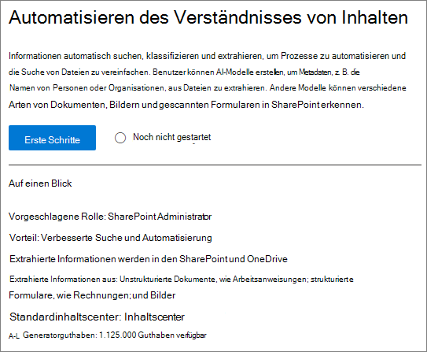
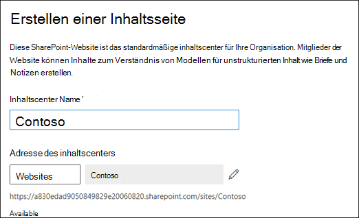

# Einrichten des Inhalts Verständnisses (Vorschau)Set up content understanding (Preview)

> [!Note] 
> Der Inhalt dieses Artikels ist für Project Cortex private Preview.The content in this article is for Project Cortex Private Preview. [Erfahren Sie mehr über Project Cortex](https://aka.ms/projectcortex).[Find out more about Project Cortex](https://aka.ms/projectcortex).

Administratoren können das Microsoft 365 Admin Center verwenden, um das Verständnis von Inhalten einzurichten und zu konfigurieren.Admins can use the Microsoft 365 admin center to set up and configure content understanding. 

Stellen Sie vor dem einrichten sicher, dass Sie die beste Möglichkeit zum Einrichten und Konfigurieren des Inhalts Verständnisses in Ihrer Umgebung planen.Prior to setup, make sure to plan for the best way to set up and configure content understanding in your environment. Beispielsweise müssen Sie Überlegungen zu den folgenden Aspekten treffen:For example, you will need to make considerations about the following:
- Auf welchen SharePoint-Websites wird die Formularverarbeitung aktiviert?Which SharePoint sites will you enable form processing? Alle, einige, oder wählen Sie Websites aus?All of them, some, or select sites?
- Name Ihres inhaltscenters und wer ist der primäre Websiteadministrator?Name of your content center, and who is the primary site admin?

Ein Administrator kann Änderungen an den ausgewählten Einstellungen auch jederzeit nach dem Setup über die Verwaltungseinstellungen für Inhalte im Microsoft 365 Admin Center vornehmen.An admin can also make changes to your selected settings anytime after setup through the content understanding management settings in the Microsoft 365 admin center.

## AnforderungenRequirements 
Sie müssen über globale Administrator-oder SharePoint-Administratorberechtigungen verfügen, um auf das Microsoft 365 Admin Center zugreifen und das Verständnis für Inhalte einrichten zu können.You must have Global Admin or SharePoint admin permissions to be able to access the Microsoft 365 admin center and set up content understanding.

## So richten Sie das Verständnis von Inhalten einTo set up content understanding

1. Wählen Sie im Microsoft 365 Admin Center die Option **Setup**aus, und zeigen Sie dann den Abschnitt **organisatorisches Wissen** an.In the Microsoft 365 admin center, select **Setup**, and then view the **Organizational knowledge** section.
2. Wählen Sie im Abschnitt **organisatorisches Wissen** die Option **Inhalts Verständnis automatisieren**aus.In the **Organizational knowledge** section, select **Automate content understanding**. 

     

3. Klicken Sie auf der Seite zum **Automatisieren des Inhalts Verständnisses** auf **Erste Schritte** , um Sie durch den Setupprozess zu führen.On the **Automate content understanding** page, click **Get started** to walk you through the setup process. 

     

4. Auf der Seite **Formularverarbeitung konfigurieren** können Sie auswählen, ob Benutzer in der Lage sein sollen, Ai Builder zum Erstellen von Formular Verarbeitungs Modellen in bestimmten SharePoint-Dokumentbibliotheken zu verwenden.On the **Configure Form Processing** page, you can choose if you want to let users be able to use AI Builder to create form processing models in specific SharePoint document libraries. Im Menüband der Dokumentbibliothek wird eine Menüoption zur Verfügung stehen, um **ein Formular Verarbeitungsmodell** in SharePoint-Dokumentbibliotheken zu erstellen, in denen es aktiviert ist.A menu option will be available in the document library ribbon to **Create a form processing model** in SharePoint document libraries in which it is enabled.
 
     Für **welche SharePoint-Bibliotheken die Option zum Erstellen eines Formular Verarbeitungsmodells anzeigen soll**, können Sie Folgendes auswählen:For **Which SharePoint libraries should show option to create a form processing model**, you can select: 
    - **Alle SharePoint-Bibliotheken** , um Sie allen SharePoint-Bibliotheken in Ihrem Mandanten zur Verfügung zu stellen.**All SharePoint libraries** to make it available to all SharePoint libraries in your tenant. 
    - **Nur Bibliotheken an ausgewählten Websites**, und wählen Sie dann die Websites aus, in denen Sie verfügbar sein sollen.**Only libraries in selected sites**, and then select the sites in which you want to make it available. 
    - **Keine SharePoint-Bibliotheken** , wenn Sie Sie derzeit nicht für Websites verfügbar machen möchten (Dies können Sie nach dem Setup ändern).**No SharePoint libraries** if you currently don't want to make it available to any sites (you can change this after setup).
 

   

 

   > [!Note]
   > Das Aktivieren dieser Einstellung für eine SharePoint-Dokumentbibliothek wirkt sich nicht auf vorhandene Modelle aus, die auf die Bibliothek angewendet werden, oder auf die Möglichkeit, Dokument Verständnis Modelle auf eine Bibliothek anzuwenden.Enabling this setting on a SharePoint document library does not affect existing models applied to the library or the ability to apply document understanding models to a library. 

    
5. Auf der Seite **inhaltscenter erstellen** können Sie eine SharePoint-inhaltscenter-Website erstellen, auf der Ihre Benutzerdokument Verständnis Modelle erstellen und verwalten können.On the **Create Content Center** page, you can create a SharePoint content center site on which your users can create and manage document understanding models.  
    a.a. Geben Sie unter **Websitename**den Namen ein, den Sie Ihrer inhaltscenter-Website zuweisen möchten.For **Site name**, type the name you want to give your content center site. 
    b.b. Die **Websiteadresse** zeigt basierend auf dem, was Sie für den Websitenamen ausgewählt haben, die URL für Ihre Website an.The **Site address** will show the URL for your site, based on what you selected for the site name. 

    > [!Note] 
    > Sie können zwar eine beliebige unterstützte Sprache auswählen, beachten Sie jedoch, dass Inhalte, die Modelle verstehen, nur für Englisch erstellt werden können.While you can select any supported language, note that content understanding models can only be created for English. 

       

    Wählen Sie **Weiter** aus.Select **Next**.
6. Auf der Seite **Fertig stellen und überprüfen** können Sie sich Ihre ausgewählte Einstellung ansehen und auswählen, dass Sie Änderungen vornehmen möchten.On the **Finish and review** page, you can look at your selected setting and choose to make changes. Wenn Sie mit Ihrer Auswahl zufrieden sind, wählen Sie **aktivieren**aus.If you are satisfied with your selections, select **Activate**.

7. Die Seite zur **Aktivierung des Inhalts Verständnisses** wird angezeigt und bestätigt, dass das System Ihre Formular Verarbeitungseinstellungen hinzugefügt und die Inhalts Center-Website erstellt hat.The **Content understanding activated** page will display, confirming that the system has added your form processing preferences and creating the Content Center site. Wählen Sie **Fertig** aus.Select **Done**.

8. Sie kehren zu Ihrer Seite zum **Automatisieren von Inhalten** zurück.You'll be returned to your **Automate content understanding** page. Auf dieser Seite können Sie **Verwalten** auswählen, um Änderungen an Ihren Konfigurationseinstellungen vorzunehmen.From this page, you can select **Manage** to make any changes to your configuration settings. 

## Siehe auchSee also

  

