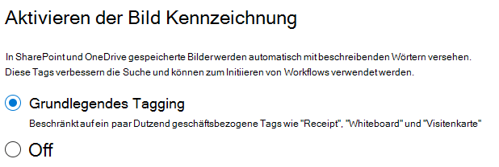

# Einrichten von SharePoint-Syntex

Administratoren können das Microsoft 365 Admin Center zum Einrichten und Microsoft SharePoint-Syntex verwenden. 

Bevor Sie beginnen, sollten Sie Folgendes in Frage stellen:

- Auf welchen SharePoint-Websites wird die Formularverarbeitung aktiviert? Alle, einige, oder wählen Sie Websites aus?
- Wie lautet der Name Ihres inhaltscenters und wer ist der primäre Websiteadministrator?

Sie können Ihre Einstellungen nach dem ersten Setup im Microsoft 365 Admin Center ändern.

Der Inhalt in diesem Artikel ist für die Project Cortex private Preview. [Erfahren Sie mehr über Project Cortex](https://aka.ms/projectcortex).

Stellen Sie vor dem einrichten sicher, dass Sie die beste Möglichkeit zum Einrichten und Konfigurieren des Inhalts Verständnisses in Ihrer Umgebung planen. Sie müssen beispielsweise Überlegungen zu den folgenden Namen von ausführen:

- Die SharePoint-Websites, für die die Formularverarbeitung aktiviert werden soll-alle, einige oder ausgewählte Websites
- Ihr inhaltscenter und der Name des primären Websiteadministrators

## Anforderungen 

> [!NOTE]
> Sie müssen über globale Administrator-oder SharePoint-Administratorberechtigungen verfügen, um auf das Microsoft 365 Admin Center zugreifen und das Verständnis für Inhalte einrichten zu können.

Als Administrator können Sie Änderungen an Ihren ausgewählten Einstellungen jederzeit nach dem Setup und während des Inhalts Grundlegendes zu Verwaltungseinstellungen im Microsoft 365 Admin Center vornehmen.

## So richten Sie SharePoint-Syntex ein

1. Wählen Sie im Microsoft 365 Admin Center die Option **Setup**aus, und zeigen Sie dann den Abschnitt **organisatorisches Wissen** an.

2. Wählen Sie im Abschnitt **organisatorisches Wissen** die Option **Inhalts Verständnis automatisieren**aus. 

     

3. Klicken Sie auf der Seite **SharePoint-Syntex automatisieren** auf **Erste Schritte** , um den Installationsvorgang zu durchlaufen. 

     

4. Wählen Sie auf der Seite Bild Kennzeichnung aktivieren aus, ob Sie die [Bild Kennzeichnung](image-tagging.md)zulassen möchten.

     

5. Auf der Seite **Formularverarbeitung konfigurieren** können Sie auswählen, ob Benutzer in der Lage sein sollen, Ai Builder zum Erstellen von Formular Verarbeitungs Modellen in bestimmten SharePoint-Dokumentbibliotheken zu verwenden. Im Menüband der Dokumentbibliothek wird eine Menüoption zur Verfügung stehen, um **ein Formular Verarbeitungsmodell** in SharePoint-Dokumentbibliotheken zu erstellen, in denen es aktiviert ist.
 
     Für **welche SharePoint-Bibliotheken die Option zum Erstellen eines Formular Verarbeitungsmodells anzeigen soll**, können Sie Folgendes auswählen: 
      - **Alle SharePoint-Bibliotheken** , um Sie allen SharePoint-Bibliotheken in Ihrer Organisation zur Verfügung zu stellen. 
      - **Nur Bibliotheken an ausgewählten Websites**, und wählen Sie dann die Websites aus, in denen Sie verfügbar sein sollen. 

   

   > [!Note]
   > Das Aktivieren dieser Einstellung für eine SharePoint-Dokumentbibliothek wirkt sich nicht auf vorhandene Modelle aus, die auf die Bibliothek angewendet werden, oder auf die Möglichkeit, Dokument Verständnis Modelle auf eine Bibliothek anzuwenden. 
    
6. Auf der Seite **inhaltscenter erstellen** können Sie eine SharePoint-inhaltscenter-Website erstellen, auf der Ihre Benutzerdokument Verständnis Modelle erstellen und verwalten können.  
    a. Geben Sie unter **Websitename**den Namen ein, den Sie Ihrer inhaltscenter-Website zuweisen möchten. 
    b. Die **Websiteadresse** zeigt basierend auf dem, was Sie für den Websitenamen ausgewählt haben, die URL für Ihre Website an. Wenn Sie Sie ändern möchten, klicken Sie auf **Bearbeiten**. 

       

    Wählen Sie **Weiter** aus.

7. Auf der Seite **überprüfen und fertig stellen** können Sie sich Ihre ausgewählte Einstellung ansehen und auswählen, dass Sie Änderungen vornehmen möchten. Wenn Sie mit Ihrer Auswahl zufrieden sind, wählen Sie **aktivieren**aus.

8. Klicken Sie auf der Seite Bestätigung auf **Fertig**.

9. Sie kehren zu Ihrer Seite zum **Automatisieren von Inhalten** zurück. Auf dieser Seite können Sie **Verwalten** auswählen, um Änderungen an Ihren Konfigurationseinstellungen vorzunehmen. 

## Lizenzen zuweisen

Nachdem Sie die SharePoint-Syntex konfiguriert haben, müssen Sie Lizenzen für die Benutzer zuweisen, die die Formularverarbeitung und Dokument Verständnis Features verwenden sollen.

So weisen Sie Lizenzen zu:

1. Klicken Sie im Microsoft 365 Admin Center unter **Benutzer**auf **aktive Benutzer**.

2. Wählen Sie die Benutzer aus, die Sie lizenzieren möchten, und klicken Sie auf **Produktlizenzen verwalten**.

3. Wählen Sie **mehr zuweisen**aus.

4. Wählen Sie **Intelligent Content Services**aus. Stellen Sie sicher, dass unter **apps**die Option **Common Data Service for Intelligent Content Services** und **Intelligent Content Services** ausgewählt ist.

    

5. Klicken Sie auf **Änderungen speichern**.

## Credits für AI Builder

Wenn Sie 300 oder mehr SharePoint-Syntex-Lizenzen für SharePoint-Syntex in Ihrer Organisation haben, werden Ihnen 1 Million AI Builder Credits zugewiesen. Wenn Sie über weniger als 300 Lizenzen verfügen, müssen Sie die Credits von AI Builder erwerben, um die Formularverarbeitung verwenden zu können.

Sie können die Kapazität des AI-Generators schätzen, die für Sie mit dem [AI Builder-Rechner](https://powerapps.microsoft.com/ai-builder-calculator)geeignet ist.

1. Wechseln Sie zum [Power Platform Admin Center](https://admin.powerplatform.microsoft.com/resources/capacity) , um ihre Guthaben und Ihre Nutzung zu überprüfen.

    > [!NOTE]
    > Aktivieren Sie diese Einstellung für eine SharePoint-Dokumentbibliothek wirkt sich nicht auf vorhandene Modelle aus, die auf die Bibliothek angewendet werden, oder auf die Möglichkeit, Dokument Verständnis Modelle auf eine Bibliothek anzuwenden. 
    
2. Auf der Seite **inhaltscenter erstellen** können Sie eine SharePoint-inhaltscenter-Website erstellen, für die Benutzerdokument Verständnis Modelle erstellen und verwalten können.  
    a. Geben Sie unter **Websitename**den gewünschten Namen für die inhaltscenter-Website ein. 
    b. Die **Websiteadresse** zeigt die URL für Ihre Website an, basierend auf dem Websitenamen. 

    > [!NOTE] 
    > Während Sie eine beliebige unterstützte Sprache auswählen können, können Inhalts Verständnis Modelle nur für Englisch erstellt werden. 

       

3. Wählen Sie **Weiter** aus.

4. Schauen Sie sich auf der Seite **Fertig stellen und überprüfen** die ausgewählte Einstellung an, und wählen Sie, um Änderungen vorzunehmen. Wenn Sie mit Ihrer Auswahl zufrieden sind, wählen Sie **aktivieren**aus.

5. Die Seite **Inhalt verstehen aktiviert** wird angezeigt und bestätigt, dass das System Ihre Formular Verarbeitungseinstellungen hinzugefügt und die Inhalts Center-Website erstellt hat. Wählen Sie **Fertig** aus.

6. Sie kehren zu Ihrer Seite zum **Automatisieren von Inhalten** zurück. Auf dieser Seite können Sie **Verwalten** auswählen, um Änderungen an Ihren Konfigurationseinstellungen vorzunehmen. 

## Siehe auch

[Übersicht über das Formular Verarbeitungsmodell](https://docs.microsoft.com/ai-builder/form-processing-model-overview)

[Schritt-für-Schritt: Erstellen eines Dokument Verständnisses des Modells (Video)](https://www.youtube.com/watch?v=DymSHObD-bg)

