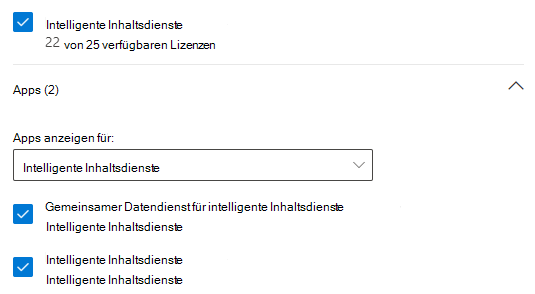

# Einrichten von SharePoint Syntex

Administratoren können das Microsoft 365 Admin Center verwenden, um [Microsoft SharePoint Syntex](index.md) einzurichten. 

Denken Sie vor dem Beginn über Folgendes nach:

- Auf welchen SharePoint-Websites wird die Formularverarbeitung aktiviert? Auf allen, auf einigen oder auf ausgewählten Websites?
- Wie werden Sie Ihr Standard-Inhaltscenter nennen?

Sie können Ihre Einstellungen nach der erstmaligen Einrichtung im Microsoft 365 Admin Center ändern.

Vergewissern Sie sich vor dem Einrichten, dass Sie die beste Möglichkeit zum Einrichten und Konfigurieren des Inhaltsverständnisses in Ihrer Umgebung planen. Sie müssen sich beispielsweise Gedanken über die Benennung von Folgendem machen:

- Die SharePoint-Websites, für die Sie die Verarbeitung von Formularen aktivieren möchten – alle, einige oder ausgewählte Websites.
- Ihr Inhaltscenter und der Name des primären Website-Administrators.

## Anforderungen 

> [!NOTE]
> Sie müssen über globale Administrator- oder SharePoint-Administratorberechtigungen verfügen, um auf das Microsoft 365 Admin Center zugreifen und das Inhaltsverständnis einrichten zu können.

Als Administrator können Sie nach dem Einrichten und in den Verwaltungseinstellungen für das Inhaltsverständnis im Microsoft 365 Admin Center jederzeit Änderungen an den ausgewählten Einstellungen vornehmen.

## So richten Sie SharePoint Syntex ein

1. Wählen Sie im Microsoft 365 Admin Center **Setup**aus, und zeigen Sie dann den Abschnitt **Dateien und Inhalte** an.

2. Wählen Sie im Abschnitt **Dateien und Inhalte** > **Inhaltsverständnis automatisieren** aus. 

3. Klicken Sie auf der Seite **Inhaltsverständnis automatisieren** auf **Erste Schritte**, um den Setupvorgang zu durchlaufen. 

    > [!div class="mx-imgBorder"]
    >  

4. Auf der Seite **Formularverarbeitung konfigurieren** können Sie auswählen, ob Sie zulassen möchten, dass Benutzer Formularverarbeitungsmodelle in bestimmten SharePoint-Dokumentbibliotheken erstellen können. Im Menüband "Dokumentbibliothek" wird eine Menüoption zum **Erstellen eines Formularverarbeitungsmodells** in SharePoint-Dokumentbibliotheken verfügbar, in denen es aktiviert ist.
 
     Für **Welche SharePoint-Bibliotheken sollen die Option zum Erstellen eines Formularverarbeitungsmodells anzeigen** können Sie Folgendes auswählen: 
      - **Alle SharePoint-Bibliotheken**, damit die Option für alle SharePoint-Bibliotheken in Ihrer Organisation verfügbar gemacht wird. 
      - **Nur Bibliotheken in ausgewählten Websites**. Wählen Sie dann die Websites aus, auf denen Sie die Option verfügbar machen möchten, oder laden Sie eine Liste mit bis zu 50 Websites hoch. 
      - **Keine SharePoint-Bibliotheken**, wenn Sie die Option nicht auf Websites verfügbar machen möchten (Sie können dies nach der Einrichtung ändern).

   > [!div class="mx-imgBorder"]
   > 

   > [!Note]
   > Wenn Sie eine Website entfernen, nachdem sie hinzugefügt wurde, hat dies keine Auswirkung auf vorhandene Modelle, die auf die Bibliotheken auf dieser Website angewendet werden, oder die Möglichkeit, Dokumentverständnismodelle auf eine Bibliothek anzuwenden. 
    
5. Auf der Seite **Inhaltscenter erstellen** können Sie eine Website im SharePoint-Inhaltscenter erstellen, auf der Ihre Benutzer Modelle zum Dokumentverständnis erstellen und verwalten können.

    1. Geben Sie für den **Websitenamen** den Namen ein, den Sie Ihrer Inhaltscenter-Website zuweisen möchten.
    
    1. Die **Websiteadresse** zeigt die URL für Ihre Website basierend auf Ihrer Auswahl für den Websitenamen an. Wenn Sie die Einstellungen ändern möchten, klicken Sie auf **Bearbeiten**.

       > [!div class="mx-imgBorder"]
       >  

       Wählen Sie **Weiter** aus.

6. Auf der Seite **Überprüfen und beenden** können Sie sich die ausgewählte Einstellung ansehen und Änderungen vornehmen. Wenn Sie mit Ihrer Auswahl zufrieden sind, wählen Sie **Aktivieren** aus.

7. Klicken Sie auf der Bestätigungsseite auf **Fertig**.

8. Sie kehren zur Seite **Inhaltsverständnis automatisieren** zurück. Auf dieser Seite können Sie **Verwalten** auswählen, um Änderungen an Ihren Konfigurationseinstellungen vorzunehmen. 

## Lizenzen zuweisen

Nachdem Sie SharePoint Syntex konfiguriert haben, müssen Sie Lizenzen für die Benutzer zuweisen, die SharePoint Syntex-Features verwenden werden.

So weisen Sie Lizenzen zu

1. Klicken Sie im Microsoft 365 Admin Center auf **Benutzer** > **Aktive Benutzer**.

2. Wählen Sie die Benutzer aus, denen Sie eine Lizenz zuweisen möchten, und klicken Sie dann auf **Produktlizenzen verwalten**.

3. Wählen Sie **Weitere zuweisen** aus.

4. Wählen Sie **Intelligente Inhaltsdienste** aus. Stellen Sie sicher, dass unter **Apps** die Optionen **Common Data Service für intelligente Inhaltsdienste** und **Intelligente Inhaltsdienste** aktiviert sind.

    > [!div class="mx-imgBorder"]
    > 

5. Klicken Sie auf **Änderungen speichern**.

## KI-Generator-Punkte

Wenn Sie 300 oder mehr SharePoint Syntex-Lizenzen für SharePoint Syntex in Ihrer Organisation besitzen, werden Ihnen 1 Million KI-Generator-Punkte zugeteilt. Wenn Sie weniger als 300 Lizenzen besitzen, müssen Sie KI-Generator-Punkte erwerben, um die Formularverarbeitung zu verwenden.

Sie können die für Sie geeignete KI-Generator-Kapazität mit dem [KI-Generator-Rechner](https://powerapps.microsoft.com/ai-builder-calculator) abschätzen.

Wechseln Sie zum [Power Platform Admin Center](https://admin.powerplatform.microsoft.com/resources/capacity), um Ihre Punkte und deren Nutzung zu überprüfen.

## Weitere Informationen:

[Übersicht über das Formularverarbeitungsmodell](https://docs.microsoft.com/ai-builder/form-processing-model-overview)

[Schrittweise Anleitung zum Erstellen eines Modells für das Dokumentverständnis (Video)](https://www.youtube.com/watch?v=DymSHObD-bg)

