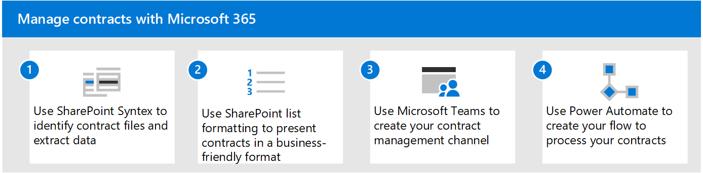

# Verwalten von Verträgen mithilfe einer Microsoft 365-LösungManage contracts using a Microsoft 365 solution

In diesem Artikel wird beschrieben, wie Sie mithilfe von SharePoint Syntex und Komponenten von Microsoft 365 eine Vertragsverwaltungslösung für Ihre Organisation erstellen.This article describes how to create a contracts management solution for your organization by using SharePoint Syntex and components of Microsoft 365. Es bietet Ihnen ein Framework, das Sie bei der Planung und Erstellung einer Lösung unterstützt, die Ihren individuellen Geschäftlichen Anforderungen entspricht.It provides you with a framework to help you plan and create a solution that fits your unique business needs. Obwohl es sich bei dieser Lösung um die Vertragsverwaltung handelt, können Sie sie anpassen, um andere Dokumentverwaltungslösungen zu erstellen, z. B. für Arbeitsanweisungen oder Rechnungen.Even though this solution talks about contract management, you can adapt it to create other document management solutions, such as for statements of work or invoices.

*Dieser Inhaltssatz dokumentiert eine Microsoft 365 Lösung, die von Einem Mol the Modern Work Solution Strategy Team bei Microsoft entwickelt wurde.**This content set documents a Microsoft 365 solution developed by Thomas Molbach with the Modern Work Solution Strategy Team at Microsoft.*

## Identifizieren des GeschäftsproblemsIdentify the business problem

Der erste Schritt bei der Planung Ihres Vertragsverwaltungssystems besteht darin, das Problem zu verstehen, das Sie lösen möchten.The first step in planning your contract management system is to understand the problem you're trying to solve. Für diese Lösung müssen vier wichtige Probleme behoben werden:For this solution, four key issues need to be addressed:

- **Identifizieren von Verträgen.****Identify contracts**. Ihre Organisation arbeitet mit vielen Dokumenten, z. B. Rechnungen, Verträgen, Arbeitsanweisungen usw.Your organization works with many documents, such as invoices, contracts, statements of work, and so on.  Einige sind digitale Objekte, die per E-Mail gesendet werden, und einige sind Papierobjekte, die über herkömmliche E-Mails gesendet werden.Some are digital assets sent through email, and some are paper assets sent through traditional mail. Sie benötigen eine Möglichkeit, alle Kundenverträge aus allen anderen Dokumenten zu identifizieren und diese dann als solche zu klassifizieren.You need a way to identify all customer contracts from all other documents, and then classifying them as such.

- **Nachverfolgen des Verlaufs von Vertragsgenehmigungen.****Track the history of contract approvals**. Ihre Organisation benötigt eine zuverlässige Möglichkeit, um zu ermitteln, ob Verträge genehmigt oder abgelehnt wurden und ob die Zahlung verarbeitet wurde.Your organization needs a reliable way to find whether contracts have been either approved or rejected, and whether payment has been processed. 

- **Website zum Verwalten von Vertragsgenehmigungen.****Site to manage contract approvals**. Ihre Organisation muss eine Website für die Zusammenarbeit einrichten, auf der alle erforderlichen Beteiligten Verträge einfach überprüfen können.Your organization needs to set up a collaborative site in which all required stakeholders can easily review contracts. Projektbeteiligten sollten bei Bedarf den gesamten Vertrag überprüfen können, aber hauptsächlich möchten sie mehrere Schlüsselfelder aus jedem Vertrag sehen (z. B. Kundenname, Auftragsnummer und Gesamtkosten).Stakeholders should be able to review the whole contract if needed, but mostly care about seeing several key fields from each contract (for example, customer name, PO number, and total cost). Projektbeteiligten sollten in der Lage sein, eingehende Verträge einfach zu genehmigen oder abzulehnen.Stakeholders should be able to easily approve or reject incoming contracts.

- **Weitergeleitet überprüfte Verträge.****Route reviewed contracts**. Genehmigte und abgelehnte Verträge müssen über einen bestimmten Workflow weitergeleitet werden.Approved and rejected contracts need to be routed through a specific workflow. Genehmigte Verträge müssen zur Zahlungsverarbeitung an eine Drittanbieteranwendung weitergeleitet werden.Approved contracts need to be routed to a third-party application for payment processing. Abgelehnte Verträge müssen zur weiteren Überprüfung weitergeleitet werden.Rejected contracts need to be routed for additional review.

## Übersicht über die LösungOverview of the solution

  

Dieser Leitfaden zur Vertragsverwaltungslösung umfasst vier Komponenten von Microsoft 365:This contract management solution guidance includes four components of Microsoft 365:

- **Microsoft SharePoint Syntex:** Erstellen Sie Modelle, um Ihre Vertragsdateien zu identifizieren und zu klassifizieren und dann die entsprechenden Daten daraus zu extrahieren.**Microsoft SharePoint Syntex**: Create models to identify and classify your contract files and then extract the appropriate data from them.

- **Microsoft SharePoint Listen:** Verwenden Sie die in modernen SharePoint Listen verfügbaren Formatierungen, um Verträge in einem unternehmensfreundlichen Format darzustellen.**Microsoft SharePoint lists**: Use the formatting available in modern SharePoint lists to present contracts in a business-friendly format.

- **Microsoft Teams:** Verwenden Sie die Funktionalität eines Teams Kanals und zugehöriger Registerkarten, um Ihren Projektbeteiligten die Überprüfung und Verwaltung von Verträgen zu ermöglichen.**Microsoft Teams**: Use the functionality of a Teams channel and associated tabs to allow your stakeholders to review and manage contracts.

- **Power Automate:** Verwenden Sie Flüsse, um Verträge durch den Genehmigungsprozess und dann zu einer Drittanbieteranwendung zur Zahlung zu führen.**Power Automate**: Use flows to guide contracts through the approval process, and then to a third-party application for payment.

### FunktionsweiseHow it all works

  

1. Dokumente werden in eine SharePoint Dokumentbibliothek hochgeladen.Documents are uploaded to a SharePoint document library. Ein SharePoint Syntex Dokumentverständnismodell wurde auf die Dokumentbibliothek angewendet.A SharePoint Syntex document understanding model has been applied to the document library. Es überprüft jede Datei, um festzustellen, ob sie einem "Vertrags"-Inhaltstyp entspricht, nach dem gesucht wird.It checks each file to see if any match a "contract" content type it's trained to look for. Wenn eine Übereinstimmung gefunden wird, klassifiziert sie die Datei als "Vertrag" und aktualisiert den Inhaltstyp für das Dokument.If it finds a match, it classifies the file as a "contract" and updates the content type for the document.

2. Das Modell ruft auch bestimmte Daten aus jeder Vertragsdatei ab, die projektbezogene Interessenvertreter sehen möchten, z. B. *den Betrag für Client,* *Auftragnehmer* und *Gebühren.*The model also pulls out specific data from each contract file that stakeholders are interested in seeing, such as the *Client*, *Contractor*, and *Fee amount*.

    Die folgende Seite ist ein Beispiel für einen Vertrag, für den das Modell zur Identifizierung geschult ist.The following page is an example of a contract that the model is trained to identify.

      

3. In Microsoft Teams sind alle Beteiligten Mitglieder eines sicheren Teams Kanals, in dem alle Verträge in der Dokumentbibliothek zur Genehmigung oder Ablehnung sichtbar sind.In Microsoft Teams, all stakeholders are members of a secure Teams channel in which all contracts in the document library are visible for approval or rejection. Durch die Verwendung Teams Funktionalität werden alle Beteiligten benachrichtigt, wenn neue Verträge überprüft werden müssen.By using Teams functionality, all stakeholders are notified when new contracts need to be reviewed.

4. Mithilfe von Power Automate werden Verträge über den Genehmigungsprozess im Teams Kanal verschoben.By using Power Automate, contracts are moved through the approval process in the Teams channel. Wenn ein Mitglied einen Vertrag genehmigt, wird der Vertragsstatus in "Genehmigt" geändert, alle Mitglieder werden über einen Teams Beitrag benachrichtigt, und es wird ein Positionselement erstellt, um anzuzeigen, dass der Vertrag zur Auszahlung bereit ist.When a member approves a contract, the contract status is changed to approved, all members are notified through a Teams post, and a line item is created to show that the contract is ready for payout. Dieser Prozess kann erweitert werden, um direkt auf eine Finanzanwendung eines Drittanbieters zur Zahlung zu schreiben.This process can be extended to write directly to a third-party financial application for payment.

5. Wenn ein Mitglied einen Vertrag ablehnt, wird der Status in "Abgelehnt" geändert, und alle Mitglieder werden über einen Teams Beitrag benachrichtigt.When a member rejects a contract, the status is changed to rejected, and all members are notified through a Teams post.

6. Das Endergebnis dieser Lösung ist ein automatisierter Geschäftsprozess für Ihre Organisation.The end result of this solution is an automated business process for your organization. Mitarbeiter können die benutzerdefinierte Kachelansicht ganz einfach in Teams verwenden, um den Genehmigungsworkflow Ihrer Dokumente zu initiieren und zu überwachen.Employees can easily use the custom tile view in Teams to initiate and monitor the approval workflow of your documents. 

     

### LizenzierungsanforderungenLicensing requirements

Diese Lösung basiert auf der folgenden Funktionalität, die alle als Teil einer Microsoft 365 Enterprise (E1, E3, E5, F3) oder Business-Lizenz (Basic, Standard oder Premium) verfügbar sind:This solution relies on the following functionality, all available as part of a Microsoft 365 Enterprise (E1, E3, E5, F3) or Business (Basic, Standard, or Premium) license:

- Microsoft SharePoint SyntexMicrosoft SharePoint Syntex
- Microsoft TeamsMicrosoft Teams
- Power AutomatePower Automate

## Erstellen der LösungCreate the solution

In den nächsten Abschnitten wird ausführlich erläutert, wie Sie Ihre Vertragsverwaltungslösung konfigurieren.The next sections will go into detail about how to configure your contracts management solution. Es ist in drei Schritte unterteilt:It's divided into three steps:

- [Schritt 1. Verwenden von SharePoint Syntex zum Identifizieren von Vertragsdateien und Extrahieren von DatenStep 1. Use SharePoint Syntex to identify contract files and extract data](solution-manage-contracts-step1.md)
- [Schritt 2. Verwenden von Microsoft Teams zum Erstellen Ihres VertragsverwaltungskanalsStep 2. Use Microsoft Teams to create your contract management channel](solution-manage-contracts-step2.md)
- [Schritt 3. Verwenden sie Power Automate, um Ihren Flow zur Verarbeitung Ihrer Verträge zu erstellen.Step 3. Use Power Automate to create your flow to process your contracts](solution-manage-contracts-step3.md)
