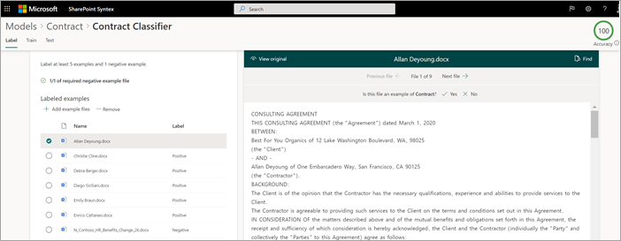

# Schritt 1. Verwenden SharePoint Syntex zum Identifizieren von Vertragsdateien und Extrahieren von Daten

Ihre Organisation benötigt eine Möglichkeit, alle Vertragsdokumente aus den vielen empfangenen Dateien zu identifizieren und zu klassifizieren. Sie möchten auch in der Lage sein, schnell mehrere Schlüsselelemente in jeder der identifizierten Vertragsdateien (z. B. *Client,* *Auftragnehmer* und *Gebührenbetrag) anzeigen zu können.* Verwenden Sie dazu SharePoint [Syntex,](index.md) um ein Dokumentverständnismodell zu erstellen und es auf eine Dokumentbibliothek zu anwenden.

## Übersicht über den Vorgang

[Zur Dokumenterteilung](document-understanding-overview.md) werden KI-Modelle (Artificial Intelligence) verwendet, um die Klassifizierung von Dateien und die Extraktion von Informationen zu automatisieren. Dokumentverständnismodelle sind auch optimal beim Extrahieren von Informationen aus unstrukturierten und semistrukturierten Dokumenten, bei denen die benötigten Informationen nicht in Tabellen oder Formularen enthalten sind, z. B. Verträgen.

1. Zunächst müssen Sie mindestens fünf Beispieldateien finden, mit deren Hilfe Sie das Modell "schulen" können, um nach Merkmalen zu suchen, die spezifisch für den Inhaltstyp sind, den Sie identifizieren möchten (ein Vertrag). 

2. Erstellen SharePoint Syntex ein neues Dokumentverständnismodell. Mithilfe Ihrer Beispieldateien müssen Sie [einen Klassifikator erstellen.](create-a-classifier.md) Indem Sie den Klassifikator mit Ihren Beispieldateien trainieren, vermitteln Sie ihm, nach Merkmalen zu suchen, die speziell für die Verträge Ihres Unternehmens spezifisch sind. Erstellen Sie beispielsweise [eine "Erläuterung",](create-a-classifier.md#create-an-explanation) die nach bestimmten Zeichenfolgen in Ihren Verträgen sucht, z. B. *Servicevertrag,* Vertragsbedingungen *und* *Vergütung.* Sie können Ihre Erklärung sogar so schulen, dass sie in bestimmten Abschnitten des Dokuments oder neben anderen Zeichenfolgen nach diesen Zeichenfolgen sucht. Wenn Sie denken, Dass Sie Ihren Klassifikator mit den benötigten Informationen geschult haben, können Sie Ihr Modell in einem Beispielsatz von Beispieldateien testen, um zu sehen, wie effizient es ist. Nach dem Testen können Sie bei Bedarf Änderungen an Ihren Erläuterungen vornehmen, um sie effizienter zu gestalten. 

3. In Ihrem Modell können Sie einen [Extractor](create-an-extractor.md) erstellen, um bestimmte Datenteile aus jedem Vertrag herausziehen zu können. Für jeden Vertrag sind z. B. die Informationen, über die Sie sich am meisten Gedanken machen, wer der Kunde ist, der Name des Auftragnehmers und die Gesamtkosten.

4. Nachdem Sie ihr Modell erfolgreich erstellt haben, wenden Sie es auf [eine SharePoint Dokumentbibliothek an.](apply-a-model.md) Beim Hochladen von Dokumenten in die Dokumentbibliothek wird Ihr Dokumentverständnismodell ausgeführt und identifiziert und klassifiziert alle Dateien, die dem vertragsinhaltstyp entsprechen, den Sie in Ihrem Modell definiert haben. Alle Als Verträge klassifizierten Dateien werden in einer benutzerdefinierten Bibliotheksansicht angezeigt. Die Dateien zeigen auch die Werte aus jedem Vertrag an, den Sie in Ihrem Extractor definiert haben.

   

5. Wenn Sie Aufbewahrungsanforderungen für Ihre Verträge haben,  können Sie ihr Modell auch verwenden, um eine Aufbewahrungsbezeichnung anzuwenden, die verhindert, dass Ihre Verträge für einen bestimmten Zeitraum gelöscht werden.

## Schritte zum Erstellen und Trainieren Ihres Modells

> [!NOTE]
> Für diese Schritte können Sie die Beispieldateien im [Repository "Contracts Management Solution Assets" verwenden.](https://github.com/pnp/syntex-samples/tree/main/scenario%20assets/Contracts%20Management) Die Beispiele in diesem Repository enthalten sowohl die Dokumentverständnismodelldateien als auch die Dateien, die zum Trainieren des Modells verwendet werden.

### Erstellen eines Vertragsmodells

Der erste Schritt besteht im Erstellen Ihres Vertragsmodells.

1. Wählen Sie im Inhaltscenter **Neu** aus, und dann **Modell erstellen**.

2. Geben Sie **im Modellbereich** Neues Dokumentverständnis im Feld **Name** den Namen des Modells ein. Für diese Vertragsverwaltungslösung können Sie den Modellvertrag *benennen.*

4. Klicken Sie auf **Erstellen**. Dadurch wird eine Homepage für das Modell erstellt. 

    

### Schulen des Modells zum Klassifizieren eines Dateityps

#### Hinzufügen von Beispieldateien für Ihr Modell

Sie müssen mindestens fünf Beispieldateien hinzufügen, die Vertragsdokumente sind, und eine Beispieldatei, die kein Vertragsdokument ist (z. B. eine Arbeitsserklärung). 

1. Wählen Sie **auf > Seite Modelle und Vertrag** unter **Schlüsselaktionen**  >  **Beispieldateien hinzufügen** die Option Dateien hinzufügen **aus.**

   

2. Öffnen Sie auf der Seite **Beispieldateien** für Ihr Modell auswählen den Ordner Vertrag, wählen Sie Dateien aus, die Sie verwenden möchten, und wählen Sie dann **Hinzufügen aus.** Wenn Sie dort keine Beispieldateien haben, wählen Sie Hochladen **aus,** um sie hinzuzufügen.

#### Beschriften der Dateien als positive oder negative Beispiele

1. Wählen Sie **auf > Seite Modelle** und Vertrag unter **Schlüsselaktionen** Dateien klassifizieren und Schulung ausführen die Option  >   **Train classifier aus.**

   

2. Auf der Seite Models **> Contract > Contract classifier** sehen Sie im Viewer oben in der ersten Beispieldatei Text mit der Frage, ob die Datei ein Beispiel für das von Ihnen erstellte Vertragsmodell ist. Wenn es sich um ein positives Beispiel handelt, wählen Sie **Ja** aus. Wenn es sich um ein negatives Beispiel handelt, wählen Sie **Nein** aus.

3. Wählen Sie **in** der Liste Beschriftungsbeispiele auf der linken Seite andere Dateien aus, die Sie als Beispiele verwenden möchten, und beschriften Sie sie. 

     

#### Hinzufügen von mindestens einer Erläuterung zum Trainieren des Klassifizierers 

1. Wählen Sie **auf > Seite > Vertragsklassifikator** die Registerkarte **Train** aus.

2. Im Abschnitt **Trainierte** Dateien wird eine Liste der Beispieldateien angezeigt, die Sie zuvor beschriftet haben. Wählen Sie eine der positiven Dateien aus der Liste aus, um sie im Viewer anzeigen zu können.

3. Wählen Sie **im Abschnitt Erläuterungen** **die Option Neu** und dann Leer **aus.**

4. Auf der Seite **Erklärung erstellen**:

    a. Geben Sie **im Feld Name** den Namen der Erläuterung ein (z. B. &quot;Vereinbarung").

    b. Wählen Sie **im Feld Erläuterungstyp** **die Option Phrasenliste** aus, da Sie eine Textzeichenfolge hinzufügen.

    c. Geben Sie **im Listenfeld Phrase** die Zeichenfolge ein (z. B. "AGREEMENT"). Sie können die Option **Kleinschreibung als vertraulich auswählen,** wenn die Zeichenfolge auf die Zwischen-/Kleinschreibung reagieren muss.

    d. Wählen **Sie Speichern und Trainieren aus.**

     

#### Ihr Modell testen

Sie können Ihr Vertragsmodell an Beispieldateien testen, die noch nicht gesehen wurden. Dies ist optional, kann jedoch eine bewährte Methode sein.

1. Wählen Sie **auf > Seite > Vertrags > klassifikator** die Registerkarte **Test** aus. Dadurch wird das Modell für Ihre unbeschrifteten Beispieldateien ausgeführt.

2. In der **Liste Testdateien** werden ihre Beispieldateien angezeigt und angezeigt, ob sie vom Modell als positiv oder negativ vorhergesagt wurden. Mithilfe dieser Informationen können Sie ermitteln, wie effektiv Ihr Klassifizierer bei der Identifizierung Ihrer Dokumente ist.

     

3. Wenn sie fertig sind, wählen Sie **Training beenden aus.**

### Erstellen und Schulen eines Extractors

1. Wählen Sie **auf > Seite** Modelle und Vertrag unter **Schlüsselaktionen** Extrahieren erstellen und trainieren die Option  >  Extrahieren erstellen **aus.**

   

2. Geben Sie **im Bereich Neue Entitätsextraktor** im Feld **Neuer Name** den Namen des Extraktionselements ein. Nennen Sie es beispielsweise *Client,* wenn Sie den Namen des Clients aus jedem Vertrag extrahieren möchten.

3. Wenn Sie fertig sind, wählen Sie **Erstellen aus.**

#### Beschriften der Entität, die Extrahiert werden soll

Wenn Sie den Extractor erstellen, wird die Extraktionsseite geöffnet. Dort sehen Sie eine Liste Ihrer Beispieldateien, wobei die erste Datei auf der Liste im Viewer angezeigt wird.

 

So beschriften Sie die Entität:

1. Wählen Sie im Viewer die Daten, die aus den Dateien extrahiert werden sollen. Wenn Sie z. B. den *Client* extrahieren möchten, markieren Sie den Clientwert in der ersten Datei (in diesem Beispiel *Best For You Organics*), und wählen Sie dann Speichern **aus.** Der Wert wird aus der Datei  in der Liste Beschriftungsbeispiele unter der **Spalte Bezeichnung** angezeigt.

2. Wählen **Sie Nächste Datei** aus, um die Datei automatisch zu speichern und die nächste Datei in der Liste im Viewer zu öffnen. Oder wählen **Sie Speichern** aus, und wählen Sie dann eine andere Datei aus der Liste **Beschriftungsbeispiele** aus.

3. Wiederholen Sie im Viewer die Schritte 1 und 2, und wiederholen Sie dann, bis Sie die Bezeichnung in allen Dateien gespeichert haben.

Nachdem Sie die Dateien gekennzeichnet haben, wird ein Benachrichtigungsbanner angezeigt, in dem Sie zum Training wechseln. Sie können wählen, ob Sie weitere Dokumente beschriften oder zu Schulungen weiterkommen möchten.

#### Hinzufügen einer Erläuterung

Sie können eine Erläuterung erstellen, die einen Hinweis auf das Entitätsformat selbst und mögliche Variationen in den Beispieldateien enthält. Beispielsweise kann ein Datumswert in vielen verschiedenen Formaten vorliegen, z. B.:

- 14/10/2019
- 14. Oktober 2019
- Montag, 14. Oktober 2019

Um das Startdatum des *Vertrags zu* identifizieren, können Sie eine Muster erläuterung erstellen.

1. Wählen Sie **im Abschnitt Erläuterungen** **die Option Neu** und dann Leer **aus.**

2. Auf der Seite **Erklärung erstellen**:

    a. Geben Sie **im Feld Name** den Namen der Erläuterung ein (z. B. *Date*).

    b. Wählen Sie **im Feld Erläuterungstyp** die Option **Musterliste aus.**

    c. Geben Sie **im Feld Wert** die Datumsvariation an, wie sie in den Beispieldateien angezeigt werden. Wenn Sie z. B. Daten im Format 0/00/0000 haben, geben Sie sämtliche Varianten ein, die in Ihren Dokumenten angezeigt werden, wie z. B.:

    - 0/0/0000
    - 0/00/0000
    - 00/0/0000
    - 00/00/0000

4. Wählen **Sie Speichern und Trainieren aus.**

#### Testen Des Modells erneut

Sie können Ihr Vertragsmodell an Beispieldateien testen, die noch nicht gesehen wurden. Dies ist optional, kann jedoch eine bewährte Methode sein.

1. Wählen Sie **auf > Seite > Vertrags > klassifikator** die Registerkarte **Test** aus. Dadurch wird das Modell für Ihre unbeschrifteten Beispieldateien ausgeführt.

2. In der **Liste Testdateien** werden ihre Beispieldateien angezeigt und angezeigt, ob das Modell die benötigten Informationen extrahieren kann. Mithilfe dieser Informationen können Sie ermitteln, wie effektiv Ihr Klassifizierer bei der Identifizierung Ihrer Dokumente ist.

3. Wenn sie fertig sind, wählen Sie **Training beenden aus.**

### Anwenden des Modells auf eine Dokumentbibliothek

So wenden Sie Ihr Modell auf SharePoint Dokumentbibliothek an:

1. Wählen Sie **auf > Seite Modelle** und Vertrag unter **Schlüsselaktionen** Modell auf Bibliotheken anwenden die Option  >  Modell anwenden **aus.**

   

2. Wählen Sie **im** Bereich Vertrag hinzufügen die SharePoint aus, die die Dokumentbibliothek enthält, auf die Sie das Modell anwenden möchten. Wenn die Website in der Liste nicht angezeigt wird, verwenden Sie das Suchfeld, um Sie zu finden. Klicken Sie auf **Hinzufügen**.

    > [!NOTE]
    > Sie müssen über die Berechtigung *Listen verwalten* oder *Bearbeiten* für die Dokumentbibliothek verfügen, auf die Sie das Modell anwenden möchten.

3. Nachdem Sie die Website ausgewählt haben, wählen Sie die Dokumentbibliothek aus, auf die Sie das Modell anwenden möchten.

4. Da das Modell einem Inhaltstyp zugeordnet ist, fügt es beim Anwenden auf die Bibliothek den Inhaltstyp und dessen Ansicht mit den extrahierten Bezeichnungen hinzu, die als Spalten angezeigt werden. Diese Ansicht ist standardmäßig die Standardansicht der Bibliothek, Sie können jedoch optional festlegen,  dass sie nicht die Standardansicht ist, indem Sie Erweiterte Einstellungen auswählen und das **Kontrollkästchen** Diese neue Ansicht als Standardansicht festlegen deaktivieren.

5. Wählen Sie **Hinzufügen** aus, um das Modell auf die Bibliothek anzuwenden.

6. Auf der **Seite Modelle >** Vertrag  wird im Abschnitt Bibliotheken mit diesem Modell die URL zur SharePoint angezeigt.

    

Nachdem Sie das Modell auf die Dokumentbibliothek angewendet haben, können Sie mit dem Hochladen von Dokumenten auf die Website beginnen und die Ergebnisse sehen.

## Nächster Schritt

[Schritt 2. Erstellen Microsoft Teams Vertragsverwaltungskanals mithilfe von Microsoft Teams](solution-manage-contracts-step2.md)