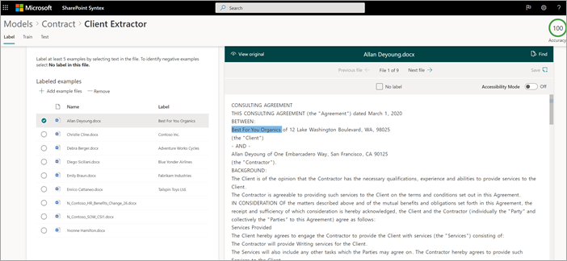

# Schritt 1. Verwenden von SharePoint Syntex zum Identifizieren von Vertragsdateien und Extrahieren von Daten

Ihre Organisation benötigt eine Möglichkeit, alle Vertragsdokumente aus den vielen empfangenen Dateien zu identifizieren und zu klassifizieren. Außerdem möchten Sie schnell mehrere wichtige Elemente in jeder der identifizierten Vertragsdateien anzeigen können (z. B. *Client,* *Auftragnehmer* und *Gebührenbetrag).* Dazu können Sie [SharePoint Syntex](index.md) verwenden, um ein Dokumentverständnismodell zu erstellen und es auf eine Dokumentbibliothek anzuwenden.

## Übersicht über den Vorgang

[Das Dokumentverständnis](document-understanding-overview.md) verwendet KI-Modelle (Künstliche Intelligenz), um die Klassifizierung von Dateien und die Extraktion von Informationen zu automatisieren. Dokumentverständnismodelle sind auch optimal beim Extrahieren von Informationen aus unstrukturierten und halbstrukturierten Dokumenten, in denen die benötigten Informationen nicht in Tabellen oder Formularen, z. B. Verträgen, enthalten sind. 

Dokumentverständnismodelle nutzen die Technik der optischen Zeichenerkennung (OCR), um PDF-, Bild- und TIFF-Dateien zu scannen, und zwar sowohl beim Trainieren eines Modells mit Beispieldateien als auch beim Ausführen des Modells mit Dateien einer Dokumentbibliothek.

1. Zuerst müssen Sie mindestens fünf Beispieldateien finden, mit denen Sie das Modell "trainieren" können, um nach Merkmalen zu suchen, die für den zu identifizierenden Inhaltstyp (einen Vertrag) spezifisch sind. 

2. Erstellen Sie mit SharePoint Syntex ein neues Dokumentverständnismodell. Mithilfe Ihrer Beispieldateien müssen Sie [einen Klassifizierer erstellen.](create-a-classifier.md) Indem Sie den Klassifizierer mit Ihren Beispieldateien schulen, lernen Sie, nach Merkmalen zu suchen, die spezifisch für die in den Verträgen Ihres Unternehmens angezeigten Merkmale sind. Erstellen Sie beispielsweise [eine "Erklärung",](create-a-classifier.md#create-an-explanation) die nach bestimmten Zeichenfolgen sucht, die in Ihren Verträgen enthalten sind, z. B. *Servicevertrag,* *Vertragsbedingungen* und *Vergütung.* Sie können ihre Erklärung sogar trainieren, um nach diesen Zeichenfolgen in bestimmten Abschnitten des Dokuments zu suchen oder sich neben anderen Zeichenfolgen zu befinden. Wenn Sie der Meinung sind, dass Sie Ihren Klassifizierer mit den benötigten Informationen geschult haben, können Sie Ihr Modell anhand einer Beispielgruppe von Beispieldateien testen, um zu sehen, wie effizient er ist. Nach dem Testen können Sie bei Bedarf Änderungen an Ihren Erläuterungen vornehmen, um sie effizienter zu gestalten. 

3. In Ihrem Modell können Sie [einen Extraktor erstellen,](create-an-extractor.md) um bestimmte Datenelemente aus jedem Vertrag abzurufen. Für jeden Vertrag sind beispielsweise die Informationen, um die Sie sich am meisten sorgen, die Person, die der Kunde ist, der Name des Vertrags und die Gesamtkosten.

4. Nachdem Sie das Modell erfolgreich erstellt haben, wenden Sie [es auf eine SharePoint Dokumentbibliothek an.](apply-a-model.md) Beim Hochladen von Dokumenten in die Dokumentbibliothek wird Ihr Dokumentverständnismodell ausgeführt und identifiziert und klassifiziert alle Dateien, die dem in Ihrem Modell definierten Vertragsinhaltstyp entsprechen. Alle Dateien, die als Verträge klassifiziert sind, werden in einer benutzerdefinierten Bibliotheksansicht angezeigt. Die Dateien zeigen auch die Werte aus jedem Vertrag an, den Sie in Ihrem Extraktor definiert haben.

   

5. Wenn Sie Aufbewahrungs- oder Sicherheitsanforderungen für Ihre Verträge haben, können Sie Ihr Modell auch verwenden, um eine [Aufbewahrungsbezeichnung](apply-a-retention-label-to-a-model.md) oder eine [Vertraulichkeitsbezeichnung](apply-a-sensitivity-label-to-a-model.md) anzuwenden, die verhindert, dass Ihre Verträge für einen bestimmten Zeitraum gelöscht werden, oder um einzuschränken, wer auf die Verträge zugreifen kann.

## Schritte zum Erstellen und Trainieren des Modells

> [!NOTE]
> Für diese Schritte können Sie die Beispieldateien im [Repository "Contracts Management Solution Assets"](https://github.com/pnp/syntex-samples/tree/main/scenario%20assets/Contracts%20Management)verwenden. Die Beispiele in diesem Repository enthalten sowohl die Dokumentverständnismodelldateien als auch die Dateien, die zum Trainieren des Modells verwendet werden.

### Erstellen eines Vertragsmodells

Der erste Schritt besteht darin, Das Vertragsmodell zu erstellen.

1. Wählen Sie im Inhaltscenter **Neu** aus, und dann **Modell erstellen**.

2. Geben Sie im **Modellbereich "Neues Dokumentverständnis"** im Feld **"Name"** den Namen des Modells ein. Für diese Vertragsverwaltungslösung können Sie das Modell *"Vertrag"* benennen.

4. Klicken Sie auf **Erstellen**. Dadurch wird eine Homepage für das Modell erstellt. 

    

### Trainieren Des Modells zum Klassifizieren eines Dateityps

#### Hinzufügen von Beispieldateien für Ihr Modell

Sie müssen mindestens fünf Beispieldateien hinzufügen, bei denen es sich um Vertragsdokumente handelt, und eine Beispieldatei, bei der es sich nicht um ein Vertragsdokument handelt (z. B. eine Arbeitserklärung). 

1. On the **Models > Contract** page, under Key **actions** Add  >  **example files,** select Add **files**.

   

2. Öffnen Sie auf der Seite **"Beispieldateien für Ihr Modell auswählen"** den Ordner "Vertrag", wählen Sie dateien aus, die Sie verwenden möchten, und wählen Sie dann **Hinzufügen** aus. Wenn Sie dort keine Beispieldateien haben, wählen Sie **Hochladen** aus, um sie hinzuzufügen.

#### Beschriften Sie die Dateien als positive oder negative Beispiele

1. Wählen Sie auf der Seite **"Modelle > Vertrag"** unter **"Schlüsselaktionen**  >  **Dateien klassifizieren" und "Schulung ausführen"** die Option **"Klassifizierer trainieren"** aus.

   

2. Auf der Seite **"Modelle > Vertrag > Vertragsklassifizierung"** wird im Viewer oben in der ersten Beispieldatei Text angezeigt, in dem Sie gefragt werden, ob die Datei ein Beispiel für das von Ihnen erstellte Vertragsmodell ist. Wenn es sich um ein positives Beispiel handelt, wählen Sie **Ja** aus. Wenn es sich um ein negatives Beispiel handelt, wählen Sie **Nein** aus.

3. Wählen Sie in der Liste **mit bezeichnungsierten Beispielen** auf der linken Seite andere Dateien aus, die Sie als Beispiele verwenden möchten, und bezeichnen Sie sie. 

     

#### Fügen Sie mindestens eine Erklärung hinzu, um den Klassifizierer zu trainieren. 

1. Wählen Sie auf der Seite **&quot;Modelle > Vertrag > Klassifizierer&quot;** die Registerkarte **&quot;Trainieren&quot;** aus.

2. Im Abschnitt **&quot;Trainierte Dateien&quot;** wird eine Liste der Beispieldateien angezeigt, die Sie zuvor bezeichnet haben. Wählen Sie eine der positiven Dateien aus der Liste aus, um sie im Viewer anzuzeigen.

3. Wählen Sie im Abschnitt **&quot;Erklärungen&quot;** die Option **&quot;Neu&quot;** und dann **&quot;Leer&quot;** aus.

4. Auf der Seite **Erklärung erstellen**:

    a. Geben Sie im **Feld &quot;Name&quot;** den Namen der Erklärung ein (z. B. &quot;Vereinbarung").

    b. Wählen Sie im Feld **"Erklärungstyp"** **die Begriffsliste** aus, da Sie eine Textzeichenfolge hinzufügen.

    c. Geben Sie im **Listenfeld Phrase** die Zeichenfolge ein (z. B. "AGREEMENT"). Sie können die **Groß-/Kleinschreibung** auswählen, wenn bei der Zeichenfolge die Groß-/Kleinschreibung beachtet werden muss.

    d. Wählen Sie **"Speichern" und "Trainieren"** aus.

     

#### Ihr Modell testen

Sie können Ihr Vertragsmodell mit Beispieldateien testen, die es noch nicht gesehen hat. Dies ist optional, kann aber eine nützliche bewährte Methode sein.

1. Wählen Sie auf der Seite **"Modelle > Vertrag > Vertragsklassifizierung"** die Registerkarte **"Test"** aus. Dadurch wird das Modell für ihre nicht bezeichneten Beispieldateien ausgeführt.

2. In der Liste **"Testdateien"** werden die Beispieldateien angezeigt und angezeigt, ob das Modell sie als positiv oder negativ vorausgesagt hat. Mithilfe dieser Informationen können Sie ermitteln, wie effektiv Ihr Klassifizierer bei der Identifizierung Ihrer Dokumente ist.

     

3. Wenn Sie fertig sind, wählen Sie **"Schulung beenden" aus.**

### Erstellen und Trainieren eines Extraktors

1. Wählen Sie auf der Seite **"Modelle > Vertrag"** unter **"Wichtige Aktionen**  >  **Erstellen und Trainieren von Extraktoren"** die Option **"Extraktor erstellen"** aus.

   

2. Geben Sie im Feld **Neuer Entitätsextraktionsmodul** im Feld **Neuer** Name den Namen des Extraktors ein. Nennen Sie ihn beispielsweise *Client,* wenn Sie den Namen des Clients aus jedem Vertrag extrahieren möchten.

3. Wenn Sie fertig sind, wählen Sie **Erstellen** aus.

#### Beschriften Sie die Entität, die Sie extrahieren möchten

Wenn Sie den Extraktor erstellen, wird die Extraktorseite geöffnet. Dort sehen Sie eine Liste Ihrer Beispieldateien, wobei die erste Datei auf der Liste im Viewer angezeigt wird.

 

So bezeichnen Sie die Entität:

1. Wählen Sie im Viewer die Daten, die aus den Dateien extrahiert werden sollen. Wenn Sie z. B. den *Client* extrahieren möchten, markieren Sie den Clientwert in der ersten Datei (in diesem Beispiel *"Best For You Organics"),* und wählen Sie dann **Speichern** aus. Sie sehen den Wert, der aus der Datei in der Liste **der bezeichneten Beispiele** unter der Spalte **"Bezeichnung"** angezeigt wird.

2. Wählen Sie **"Nächste Datei"** aus, um die nächste Datei automatisch zu speichern und die nächste Datei in der Liste im Viewer zu öffnen. Oder wählen Sie **"Speichern"** aus, und wählen Sie dann eine andere Datei aus der Liste **der beschrifteten Beispiele** aus.

3. Wiederholen Sie im Viewer die Schritte 1 und 2, und wiederholen Sie dann, bis Sie die Bezeichnung in allen Dateien gespeichert haben.

Nachdem Sie die Dateien beschriftet haben, wird ein Benachrichtigungsbanner angezeigt, das Sie informiert, zum Training zu wechseln. Sie können auswählen, ob Sie weitere Dokumente bezeichnen oder mit dem Training fortsteigen möchten.

#### Hinzufügen einer Erläuterung

Sie können eine Erklärung erstellen, die einen Hinweis auf das Entitätsformat selbst und mögliche Variationen in den Beispieldateien enthält. Beispielsweise kann ein Datumswert in vielen verschiedenen Formaten vorliegen, z. B.:

- 14/10/2019
- 14. Oktober 2019
- Montag, 14. Oktober 2019

Um das *Startdatum* des Vertrags zu identifizieren, können Sie eine Mustererklärung erstellen.

1. Wählen Sie im Abschnitt **"Erklärungen"** die Option **"Neu"** und dann **"Leer"** aus.

2. Auf der Seite **Erklärung erstellen**:

    a. Geben Sie im **Feld "Name"** den Namen der Erklärung ein (z. *B. Datum).*

    b. Wählen Sie im Feld **Erklärungstyp** **die Liste Muster** aus.

    c. Geben Sie im **Feld Wert** die Datumsvariation an, wie sie in den Beispieldateien angezeigt werden. Wenn Sie z. B. Daten im Format 0/00/0000 haben, geben Sie sämtliche Varianten ein, die in Ihren Dokumenten angezeigt werden, wie z. B.:

    - 0/0/0000
    - 0/00/0000
    - 00/0/0000
    - 00/00/0000

4. Wählen Sie **"Speichern" und "Trainieren"** aus.

#### Testen Sie Ihr Modell erneut

Sie können Ihr Vertragsmodell mit Beispieldateien testen, die es noch nicht gesehen hat. Dies ist optional, kann aber eine nützliche bewährte Methode sein.

1. Wählen Sie auf der Seite **"Modelle > Vertrag > Vertragsklassifizierung"** die Registerkarte **"Test"** aus. Dadurch wird das Modell für ihre nicht bezeichneten Beispieldateien ausgeführt.

2. In der Liste **"Testdateien"** werden die Beispieldateien angezeigt, und es wird angezeigt, ob das Modell die benötigten Informationen extrahieren kann. Mithilfe dieser Informationen können Sie ermitteln, wie effektiv Ihr Klassifizierer bei der Identifizierung Ihrer Dokumente ist.

3. Wenn Sie fertig sind, wählen Sie **"Schulung beenden" aus.**

### Anwenden ihres Modells auf eine Dokumentbibliothek

So wenden Sie Ihr Modell auf eine SharePoint Dokumentbibliothek an:

1. Wählen Sie auf der Seite **"Modelle > Vertrag"** unter **"Schlüsselaktionen**  >  **Modell auf Bibliotheken anwenden"** die Option **"Modell anwenden"** aus.

   

2. Wählen Sie im Bereich **"Vertrag hinzufügen"** die SharePoint Website aus, die die Dokumentbibliothek enthält, auf die Sie das Modell anwenden möchten. Wenn die Website in der Liste nicht angezeigt wird, verwenden Sie das Suchfeld, um Sie zu finden. Klicken Sie auf **Hinzufügen**.

    > [!NOTE]
    > Sie müssen über die Berechtigung *Listen verwalten* oder *Bearbeiten* für die Dokumentbibliothek verfügen, auf die Sie das Modell anwenden möchten.

3. Nachdem Sie die Website ausgewählt haben, wählen Sie die Dokumentbibliothek aus, auf die Sie das Modell anwenden möchten.

4. Da das Modell einem Inhaltstyp zugeordnet ist, fügt es, wenn Sie es auf die Bibliothek anwenden, den Inhaltstyp und seine Ansicht mit den extrahierten Bezeichnungen hinzu, die als Spalten angezeigt werden. Diese Ansicht ist standardmäßig die Standardansicht der Bibliothek. Optional können Sie jedoch festlegen, dass es sich nicht um die Standardansicht handelt, indem Sie **die erweiterten Einstellungen** auswählen und das **Kontrollkästchen "Neue Ansicht als Standard** festlegen" deaktivieren.

5. Wählen Sie **Hinzufügen** aus, um das Modell auf die Bibliothek anzuwenden.

6. Auf der Seite **"Modelle > Vertrag"** wird im Abschnitt **"Bibliotheken mit diesem Modell"** die URL zur SharePoint Website aufgeführt.

    

7. Unter **Einstellungen**  >  **Bibliothekseinstellungen:**

   - Fügen Sie eine Spalte mit dem Namen **Status hinzu,** und wählen Sie **"Auswahl"** als Spaltentyp aus.
   - Wenden Sie die Werte **"In",** **"Genehmigt"** und **"Abgelehnt"** an.

Nachdem Sie das Modell auf die Dokumentbibliothek angewendet haben, können Sie mit dem Hochladen von Dokumenten auf die Website beginnen und die Ergebnisse anzeigen.

## Nächster Schritt

[Schritt 2. Verwenden von Microsoft Teams zum Erstellen Ihres Vertragsverwaltungskanals](solution-manage-contracts-step2.md)