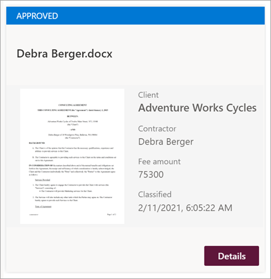

# <a name="step-2-use-microsoft-teams-to-create-your-contract-management-channel"></a><span data-ttu-id="67dfe-104">Schritt 2.</span><span class="sxs-lookup"><span data-stu-id="67dfe-104">Step 2.</span></span> <span data-ttu-id="67dfe-105">Verwenden von Microsoft Teams zum Erstellen Ihres Vertragsverwaltungskanals</span><span class="sxs-lookup"><span data-stu-id="67dfe-105">Use Microsoft Teams to create your contract management channel</span></span>

<span data-ttu-id="67dfe-106">Wenn Ihre Organisation eine Lösung für die Vertragsverwaltung einrichtet, benötigen Sie einen zentralen Ort, an dem Projektbeteiligten Verträge überprüfen und verwalten können.</span><span class="sxs-lookup"><span data-stu-id="67dfe-106">When your organization sets up a contracts management solution, you need a central location in which stakeholders can review and manage contracts.</span></span> <span data-ttu-id="67dfe-107">Zu diesem Zweck können Sie [Microsoft Teams](/microsoftteams/) verwenden, um einen Teams Kanal einzurichten, und die Features in Teams für Folgendes verwenden:</span><span class="sxs-lookup"><span data-stu-id="67dfe-107">For this purpose, you can use [Microsoft Teams](/microsoftteams/) to set up a Teams channel and use the features in Teams to:</span></span>

- <span data-ttu-id="67dfe-108">**Erstellen Sie einen Ort für Projektbeteiligten, um alle Verträge anzuzeigen, die Maßnahmen erfordern.**</span><span class="sxs-lookup"><span data-stu-id="67dfe-108">**Create a location for stakeholders to easily see all contracts that require action.**</span></span> <span data-ttu-id="67dfe-109">In Teams können Sie beispielsweise eine Registerkarte **"Verträge"** im Kanal "Vertragsverwaltung" erstellen, in der Mitglieder eine nützliche Kachelansicht aller Verträge sehen können, die genehmigt werden müssen.</span><span class="sxs-lookup"><span data-stu-id="67dfe-109">For example, in Teams you can create a **Contracts** tab in the Contract Management channel in which members can see a useful tile view of all contracts that need approval.</span></span> <span data-ttu-id="67dfe-110">Sie können die Ansicht auch so konfigurieren, dass jede "Karte" die wichtigen Daten auflistet, die Ihnen wichtig sind (z. B. *Client,* *Auftragnehmer* und *Gebührenbetrag).*</span><span class="sxs-lookup"><span data-stu-id="67dfe-110">You can also configure the view so that each "card" lists the important data you care about (such as *Client*, *Contractor*, and *Fee amount*).</span></span>

     

- <span data-ttu-id="67dfe-112">**Haben Sie einen Ort, an dem Mitglieder miteinander interagieren und wichtige Ereignisse sehen können.**</span><span class="sxs-lookup"><span data-stu-id="67dfe-112">**Have a location for members to interact with each other and see important events.**</span></span> <span data-ttu-id="67dfe-113">Beispielsweise kann in Teams die Registerkarte **"Beiträge"** verwendet werden, um Unterhaltungen zu führen, Updates abzurufen und Aktionen anzuzeigen (z. B. ein Mitglied, das einen Vertrag ablehnt).</span><span class="sxs-lookup"><span data-stu-id="67dfe-113">For example, in Teams, the **Posts** tab can be used to have conversations, get updates, and see actions (such as a member rejecting a contract).</span></span> <span data-ttu-id="67dfe-114">Wenn etwas passiert ist (z. B. ein neuer Vertrag, der zur Genehmigung übermittelt wurde), kann die Registerkarte **"Beiträge"** nicht nur verwendet werden, um ihn anzukündigen, sondern auch, um einen Datensatz darüber zu führen.</span><span class="sxs-lookup"><span data-stu-id="67dfe-114">When something has happened (such as a new contract submitted for approval), the **Posts** tab can be used not only to announce it, but also to keep a record of it.</span></span> <span data-ttu-id="67dfe-115">Und wenn Mitglieder Benachrichtigungen abonnieren, werden sie benachrichtigt, wenn ein Update vorhanden ist.</span><span class="sxs-lookup"><span data-stu-id="67dfe-115">And if members subscribe to notifications, they'll get notified whenever there's an update.</span></span>

     

- <span data-ttu-id="67dfe-117">**Haben Sie einen Ort, an dem Mitglieder genehmigte Verträge sehen können, um zu wissen, wann sie zur Zahlung eingereicht werden können.**</span><span class="sxs-lookup"><span data-stu-id="67dfe-117">**Have a location for members to see approved contracts to know when they can be submitted for payment.**</span></span> <span data-ttu-id="67dfe-118">In SharePoint müssen Sie eine **"For Payout"-Liste** erstellen und Spalten für **den Betrag "Client",** **"Auszahlung"** und **"Gebühren"** einschließen und als Spaltentyp **eine einzelne Textzeile** auswählen.</span><span class="sxs-lookup"><span data-stu-id="67dfe-118">In SharePoint, you'll need to create a **For Payout** list and include columns for **Client**, **Contractor**, and **Fee amount**, selecting **Single line of text** as the column type.</span></span> <span data-ttu-id="67dfe-119">Sie müssen die Liste **"Für Auszahlung"** als Teams Registerkarte im Vertragsverwaltungskanal hinzufügen, ähnlich wie [bei der Registerkarte **"Verträge".**](solution-manage-contracts-step2.md#attach-your-sharepoint-document-library-to-the-contracts-tab) Auf der Registerkarte **"Für Auszahlung"** werden alle Verträge aufgeführt, die zur Zahlung übermittelt werden müssen.</span><span class="sxs-lookup"><span data-stu-id="67dfe-119">You'll need to add the **For Payout** list as a Teams tab in the Contract Management channel, similar to [what you'll do for the **Contracts** tab](solution-manage-contracts-step2.md#attach-your-sharepoint-document-library-to-the-contracts-tab). The **For Payout** tab will list all contracts that will need to be submitted for payment.</span></span> <span data-ttu-id="67dfe-120">Sie können diese Lösung einfach erweitern, um diese Informationen stattdessen direkt in eine Finanzanwendung eines Drittanbieters (z. B. Dynamics CRM) zu schreiben.</span><span class="sxs-lookup"><span data-stu-id="67dfe-120">You can easily extend this solution to instead write this information directly to a third-party financial application (for example, Dynamics CRM).</span></span> 


## <a name="attach-your-sharepoint-document-library-to-the-contracts-tab"></a><span data-ttu-id="67dfe-121">Fügen Sie Ihre SharePoint Dokumentbibliothek an die Registerkarte "Verträge" an.</span><span class="sxs-lookup"><span data-stu-id="67dfe-121">Attach your SharePoint document library to the Contracts tab</span></span>

<span data-ttu-id="67dfe-122">Nachdem Sie in Ihrem Vertragsverwaltungskanal eine Registerkarte **"Verträge"** erstellt haben, müssen Sie [Ihre SharePoint Dokumentbibliothek an diese anfügen.](https://support.microsoft.com/office/add-a-sharepoint-page-list-or-document-library-as-a-tab-in-teams-131edef1-455f-4c67-a8ce-efa2ebf25f0b)</span><span class="sxs-lookup"><span data-stu-id="67dfe-122">After you create a **Contracts** tab in your Contracts Management channel, you need to [attach your SharePoint document library to it](https://support.microsoft.com/office/add-a-sharepoint-page-list-or-document-library-as-a-tab-in-teams-131edef1-455f-4c67-a8ce-efa2ebf25f0b).</span></span> <span data-ttu-id="67dfe-123">Die SharePoint Dokumentbibliothek, die Sie anfügen möchten, ist diejenige, in der Sie ihr SharePoint Syntex Dokumentverständnismodell im vorherigen Abschnitt angewendet haben.</span><span class="sxs-lookup"><span data-stu-id="67dfe-123">The SharePoint document library you want to attach is the one in which you applied your SharePoint Syntex document understanding model to in the previous section.</span></span>

<span data-ttu-id="67dfe-124">Nachdem Sie die SharePoint Dokumentbibliothek angefügt haben, können Sie alle klassifizierten Verträge über eine Standardlistenansicht anzeigen.</span><span class="sxs-lookup"><span data-stu-id="67dfe-124">After you attach the SharePoint document library, you'll be able to view any classified contracts through a default list view.</span></span>

   

## <a name="customize-your-contracts-tab-tile-view"></a><span data-ttu-id="67dfe-126">Anpassen der Kachelansicht der Registerkarte "Verträge"</span><span class="sxs-lookup"><span data-stu-id="67dfe-126">Customize your Contracts tab tile view</span></span>

> [!NOTE]
> <span data-ttu-id="67dfe-127">In diesem Abschnitt wird auf Codebeispiele verwiesen, die in der [ContractTileFormatting.js-Datei](https://github.com/pnp/syntex-samples/blob/main/scenario%20assets/Contracts%20Management/View%20Formatter/ContractTileFormatting.json) enthalten sind, die im [Repository "Contracts Management Solution Assets"](https://github.com/pnp/syntex-samples/tree/main/scenario%20assets/Contracts%20Management)enthalten ist.</span><span class="sxs-lookup"><span data-stu-id="67dfe-127">This section references code examples that are contained in the [ContractTileFormatting.json](https://github.com/pnp/syntex-samples/blob/main/scenario%20assets/Contracts%20Management/View%20Formatter/ContractTileFormatting.json) file that is included in the [Contracts Management Solution Assets repository](https://github.com/pnp/syntex-samples/tree/main/scenario%20assets/Contracts%20Management).</span></span>

<span data-ttu-id="67dfe-128">Während Sie mit Teams Ihre Verträge in einer Kachelansicht anzeigen können, können Sie sie anpassen, um die Vertragsdaten anzuzeigen, die Sie auf der Vertragskarte sichtbar machen möchten.</span><span class="sxs-lookup"><span data-stu-id="67dfe-128">While Teams lets you view your contracts in a tile view, you might want to customize it to view the contract data you want to make visible in the contract card.</span></span> <span data-ttu-id="67dfe-129">Für die Registerkarte **"Verträge"** ist es beispielsweise wichtig, dass Mitglieder den Client, den Vertragsnehmer und den Gebührenbetrag auf der Vertragskarte sehen.</span><span class="sxs-lookup"><span data-stu-id="67dfe-129">For example, for the **Contracts** tab, it is important for members to see the client, contractor, and fee amount on the contract card.</span></span> <span data-ttu-id="67dfe-130">Alle diese Felder wurden aus jedem Vertrag über Ihr SharePoint Syntex Modell extrahiert, das auf Ihre Dokumentbibliothek angewendet wurde.</span><span class="sxs-lookup"><span data-stu-id="67dfe-130">All of these fields were extracted from each contract through your SharePoint Syntex model that was applied to your document library.</span></span> <span data-ttu-id="67dfe-131">Sie möchten auch in der Lage sein, die Kachelkopfleiste für jeden Status in unterschiedliche Farben zu ändern, damit mitglieder leicht sehen können, wo sich der Vertrag im Genehmigungsprozess befindet.</span><span class="sxs-lookup"><span data-stu-id="67dfe-131">You also want to be able to change the tile header bar to different colors for each status so that members can easily see where the contract is in the approval process.</span></span> <span data-ttu-id="67dfe-132">Beispielsweise verfügen alle genehmigten Verträge über eine blaue Kopfzeile.</span><span class="sxs-lookup"><span data-stu-id="67dfe-132">For example, all approved contracts will have a blue header bar.</span></span>

   

<span data-ttu-id="67dfe-134">Für die von Ihnen verwendete benutzerdefinierte Kachelansicht müssen Sie Änderungen an der JSON-Datei vornehmen, die zum Formatieren der aktuellen Kachelansicht verwendet wird.</span><span class="sxs-lookup"><span data-stu-id="67dfe-134">The custom tile view you use requires you to make changes to the JSON file used to format the current tile view.</span></span> <span data-ttu-id="67dfe-135">Sie können auf die JSON-Datei verweisen, die zum Erstellen der Kartenansicht verwendet wird, indem Sie sich die [ContractTileFormatting.js-On-Datei](https://github.com/pnp/syntex-samples/blob/main/scenario%20assets/Contracts%20Management/View%20Formatter/ContractTileFormatting.json) ansehen.</span><span class="sxs-lookup"><span data-stu-id="67dfe-135">You can reference the JSON file used to create the card view by looking at the [ContractTileFormatting.json](https://github.com/pnp/syntex-samples/blob/main/scenario%20assets/Contracts%20Management/View%20Formatter/ContractTileFormatting.json) file.</span></span> <span data-ttu-id="67dfe-136">In den folgenden Abschnitten sehen Sie bestimmte Abschnitte des Codes für Features, die in den Vertragskarten enthalten sind.</span><span class="sxs-lookup"><span data-stu-id="67dfe-136">In the following sections, you'll see specific sections of the code for features that are in the contract cards.</span></span>

<span data-ttu-id="67dfe-137">Wenn Sie den JSON-Code für Ihre Ansicht in Ihrem Teams Kanal anzeigen oder ändern möchten, wählen Sie im Teams Kanal das Dropdownmenü "Ansicht" und dann **"Aktuelle Ansicht formatieren"** aus.</span><span class="sxs-lookup"><span data-stu-id="67dfe-137">If you want to see or make changes to the JSON code for your view in your Teams channel, in the Teams channel, select the view drop-down menu, and then select **Format current view**.</span></span>

   

## <a name="card-size-and-shape"></a><span data-ttu-id="67dfe-139">Kartengröße und -form</span><span class="sxs-lookup"><span data-stu-id="67dfe-139">Card size and shape</span></span>

<span data-ttu-id="67dfe-140">In the [ContractTileFormatting.json](https://github.com/pnp/syntex-samples/blob/main/scenario%20assets/Contracts%20Management/View%20Formatter/ContractTileFormatting.json) file, look at the following section to see the code for how the size and shape of the card is formatted.</span><span class="sxs-lookup"><span data-stu-id="67dfe-140">In the [ContractTileFormatting.json](https://github.com/pnp/syntex-samples/blob/main/scenario%20assets/Contracts%20Management/View%20Formatter/ContractTileFormatting.json) file, look at the following section to see the code for how the size and shape of the card is formatted.</span></span>

```JSON
                  {
                    "elmType": "div",
                    "style": {
                      "background-color": "#f5f5f5",
                      "padding": "5px",
                      "width": "180px"
                    },
                    "children": [
                      {
                        "elmType": "img",
                        "attributes": {
                          "src": "@thumbnail.large"
                        },
                        "style": {
                          "width": "185px",
                          "height": "248px"
                        }
                      }
```

## <a name="contract-status"></a><span data-ttu-id="67dfe-141">Vertragsstatus</span><span class="sxs-lookup"><span data-stu-id="67dfe-141">Contract status</span></span>

<span data-ttu-id="67dfe-142">Mit dem folgenden Code können Sie den Status jeder Titelkarte definieren.</span><span class="sxs-lookup"><span data-stu-id="67dfe-142">The following code lets you define the status of each title card.</span></span> <span data-ttu-id="67dfe-143">Beachten Sie, dass jeder Statuswert (*Neu*, *In Rezension,* *Genehmigt* und *Abgelehnt*) jeweils einen anderen Farbcode anzeigt.</span><span class="sxs-lookup"><span data-stu-id="67dfe-143">Note that each status value (*New*, *In review*, *Approved*, and *Rejected*) will display a different color code for each.</span></span> <span data-ttu-id="67dfe-144">Sehen [ Sie](https://github.com/pnp/syntex-samples/blob/main/scenario%20assets/Contracts%20Management/View%20Formatter/ContractTileFormatting.json) sich imContractTileFormatting.json-Datei den Abschnitt an, der den Status definiert.</span><span class="sxs-lookup"><span data-stu-id="67dfe-144">In the [ContractTileFormatting.json](https://github.com/pnp/syntex-samples/blob/main/scenario%20assets/Contracts%20Management/View%20Formatter/ContractTileFormatting.json) file, look at the section that defines the status.</span></span>

```JSON
          {
            "elmType": "div",
            "children": [
              {
                "elmType": "div",
                "style": {
                  "color": "white",
                  "background-color": "=if([$Status] == 'New', '#00b7c3', if([$Status] == 'In review', '#ffaa44', if([$Status] == 'Approved', '#0078d4', if([$Status] == 'Rejected', '#d13438', '#8378de'))))",
                  "padding": "5px 15px",
                  "height": "auto",
                  "text-transform": "uppercase",
                  "font-size": "12.5px"
                },
                "txtContent": "[$Status]"
              }
```

## <a name="extracted-fields"></a><span data-ttu-id="67dfe-145">Extrahierte Felder</span><span class="sxs-lookup"><span data-stu-id="67dfe-145">Extracted fields</span></span>

<span data-ttu-id="67dfe-146">Jede Vertragskarte zeigt drei Felder an, die für jeden Vertrag extrahiert wurden (*Client,* *Auftragnehmer* und *Gebührenbetrag).*</span><span class="sxs-lookup"><span data-stu-id="67dfe-146">Each contract card will display three fields that were extracted for each contract (*Client*, *Contractor*, and *Fee Amount*).</span></span> <span data-ttu-id="67dfe-147">Darüber hinaus möchten Sie auch die Uhrzeit/das Datum anzeigen, zu dem die Datei vom SharePoint Syntex Modell klassifiziert wurde, mit dem sie identifiziert wurde.</span><span class="sxs-lookup"><span data-stu-id="67dfe-147">Additionally, you also want to display the time/date that the file was classified by the SharePoint Syntex model used to identify it.</span></span>

<span data-ttu-id="67dfe-148">In der [ContractTileFormatting.json-Datei](https://github.com/pnp/syntex-samples/blob/main/scenario%20assets/Contracts%20Management/View%20Formatter/ContractTileFormatting.json) definieren die folgenden Abschnitte diese.</span><span class="sxs-lookup"><span data-stu-id="67dfe-148">In the [ContractTileFormatting.json](https://github.com/pnp/syntex-samples/blob/main/scenario%20assets/Contracts%20Management/View%20Formatter/ContractTileFormatting.json) file, the following sections define each of these.</span></span>

### <a name="client"></a><span data-ttu-id="67dfe-149">Client</span><span class="sxs-lookup"><span data-stu-id="67dfe-149">Client</span></span>

<span data-ttu-id="67dfe-150">In diesem Abschnitt wird definiert, wie "Client" auf der Karte angezeigt wird, und der Wert für den jeweiligen Vertrag wird verwendet.</span><span class="sxs-lookup"><span data-stu-id="67dfe-150">This section defines how "Client" will display on the card, and uses the value for the specific contract.</span></span>

```JSON
                      {
                        "elmType": "div",
                        "style": {
                          "color": "#767676",
                          "font-size": "12px"
                        },
                        "txtContent": "Client"
                      },
                      {
                        "elmType": "div",
                        "style": {
                          "margin-bottom": "12px",
                          "font-size": "16px",
                          "font-weight": "600"
                        },
                        "txtContent": "[$Client]"
                      },
```

### <a name="contractor"></a><span data-ttu-id="67dfe-151">Auftragnehmer</span><span class="sxs-lookup"><span data-stu-id="67dfe-151">Contractor</span></span>

<span data-ttu-id="67dfe-152">In diesem Abschnitt wird definiert, wie die "Benachrichtigung" auf der Karte angezeigt wird, und der Wert für den jeweiligen Vertrag wird verwendet.</span><span class="sxs-lookup"><span data-stu-id="67dfe-152">This section defines how the "Contractor" will display on the card, and uses the value for the specific contract.</span></span>

```JSON
                        {
                          "elmType": "div",
                          "txtContent": "Contractor",
                          "style": {
                            "color": "#767676",
                            "font-size": "12px",
                            "margin-bottom": "2px"
                          }
                        },
                        {
                          "elmType": "div",
                          "style": {
                            "margin-bottom": "12px",
                            "font-size": "14px"
                          },
                          "txtContent": "[$Contractor]"
                        },
```

### <a name="fee-amount"></a><span data-ttu-id="67dfe-153">Gebührenbetrag</span><span class="sxs-lookup"><span data-stu-id="67dfe-153">Fee amount</span></span>

<span data-ttu-id="67dfe-154">In diesem Abschnitt wird definiert, wie der "Gebührenbetrag" auf der Karte angezeigt wird, und der Wert für den jeweiligen Vertrag wird verwendet.</span><span class="sxs-lookup"><span data-stu-id="67dfe-154">This section defines how the "Fee Amount" will display on the card, and uses the value for the specific contract.</span></span>

```JSON
                      {
                        "elmType": "div",
                        "txtContent": "Fee amount",
                        "style": {
                          "color": "#767676",
                          "font-size": "12px",
                          "margin-bottom": "2px"
                        }
                      },
                      {
                        "elmType": "div",
                        "style": {
                          "margin-bottom": "12px",
                          "font-size": "14px"
                        },
                        "txtContent": "[$FeeAmount]"
                      },
```

### <a name="classification-date"></a><span data-ttu-id="67dfe-155">Klassifizierungsdatum</span><span class="sxs-lookup"><span data-stu-id="67dfe-155">Classification date</span></span>

<span data-ttu-id="67dfe-156">In diesem Abschnitt wird definiert, wie "Klassifizierung" auf der Karte angezeigt wird, und der Wert für den jeweiligen Vertrag wird verwendet.</span><span class="sxs-lookup"><span data-stu-id="67dfe-156">This section defines how "Classification" will display on the card, and uses the value for the specific contract.</span></span>

```JSON
                      {
                        "elmType": "div",
                        "txtContent": "Classified",
                        "style": {
                          "color": "#767676",
                          "font-size": "12px",
                          "margin-bottom": "2px"
                        }
                      },
                      {
                        "elmType": "div",
                        "style": {
                          "margin-bottom": "12px",
                          "font-size": "14px"
                        },
                        "txtContent": "[$PrimeLastClassified]"
                      }
```

## <a name="next-step"></a><span data-ttu-id="67dfe-157">Nächster Schritt</span><span class="sxs-lookup"><span data-stu-id="67dfe-157">Next step</span></span>

[<span data-ttu-id="67dfe-158">Schritt 3. Verwenden sie Power Automate, um Ihren Flow zur Verarbeitung Ihrer Verträge zu erstellen.</span><span class="sxs-lookup"><span data-stu-id="67dfe-158">Step 3. Use Power Automate to create your flow to process your contracts</span></span>](solution-manage-contracts-step3.md)
