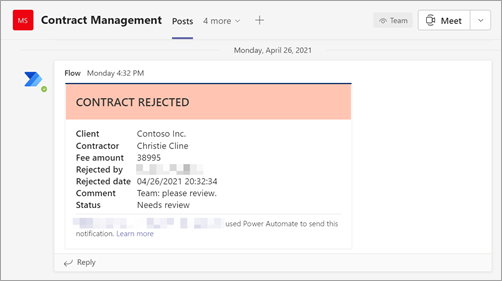

# <a name="step-3-use-power-automate-to-create-your-flow-to-process-your-contracts"></a>Schritt 3: Verwenden Power Automate, um Ihren Fluss zum Verarbeiten Ihrer Verträge zu erstellen

Sie haben ihren Vertragsverwaltungskanal erstellt und Ihre SharePoint angefügt. Im nächsten Schritt erstellen Sie einen Power Automate, um Ihre Verträge zu verarbeiten, die SharePoint Syntex-Modell identifiziert und klassifiziert. Sie können diesen Schritt tun, indem [Sie einen Power Automate In-SharePoint erstellen.](https://support.microsoft.com/office/create-a-flow-for-a-list-or-library-in-sharepoint-or-onedrive-a9c3e03b-0654-46af-a254-20252e580d01)

Für Ihre Vertragsverwaltungslösung möchten Sie einen Power Automate erstellen, um die folgenden Aktionen ausführen zu können:

-  Nachdem ein Vertrag von Ihrem SharePoint klassifiziert wurde, ändern Sie den Vertragsstatus **in In review**.
- Der Vertrag wird dann überprüft und entweder genehmigt oder abgelehnt.
- Bei genehmigten Verträgen werden die Vertragsinformationen auf einer Registerkarte für die Zahlungsverarbeitung bereitgestellt.
- Bei abgelehnten Verträgen wird das Team zur weiteren Analyse benachrichtigt. 

Das folgende Diagramm zeigt den Power Automate für die Vertragsverwaltungslösung.


## <a name="prepare-your-contract-for-review"></a>Vorbereiten ihres Vertrags für die Überprüfung

Wenn ein Vertrag von Ihrem SharePoint Syntex-Dokumentverständnismodell identifiziert und klassifiziert wird, ändert der Power Automate-Fluss zunächst den Status in "In Review".


Ändern Sie nach dem Auschecken der Datei den Statuswert in "In review".


Der nächste Schritt besteht im Erstellen einer adaptiven Karte, die besagt, dass der Vertrag auf die Überprüfung wartet, und sie im Kanal vertragsverwaltung zu veröffentlichen.


Der folgende Code ist die JSON, die für diesen Schritt im Power Automate wird.

```JSON
{
"$schema": "http://adaptivecards.io/schemas/adaptive-card.json",
"type": "AdaptiveCard",
"version": "1.0",
"body": [
    {
    "type": "TextBlock",
    "text": "Contract approval request",
    "size": "large",
    "weight": "bolder",
     "wrap": true
    },
        {
            "type": "Container",
            "items": [
                {
                    "type": "FactSet",
                    "spacing": "Large",
                    "facts": [
                        {
                            "title": "Client",
                            "value": "@{triggerOutputs()?['body/Client']}"
                        },
                        {
                            "title": "Contractor",
                            "value": "@{triggerOutputs()?['body/Contractor']}"
                        },
                        {
                            "title": "Fee amount",
                            "value": "@{triggerOutputs()?['body/FeeAmount']}"
                        },
                        {
                            "title": "Date created",
                            "value": "@{triggerOutputs()?['body/Modified']} "
                        },
                        {
                            "title": "Link",
                            "value": "[@{triggerOutputs()?['body/{FilenameWithExtension}']}](@{triggerOutputs()?['body/{Link}']})"
                        }
                    ]
                }
            ]
         },
    {
    "type": "TextBlock",
    "text": "Comment:"
    },
        {
            "type": "Input.Text",
            "placeholder": "Enter comments",
            "id": "acComments"
        }
],
"actions": [
    {
    "type": "Action.Submit",
    "title": "Approve",
    "data": {
        "x": "Approve"
    }
    },
    {
    "type": "Action.Submit",
    "title": "Reject",
    "data": {
        "x": "Reject"
    }
    }
]
}
```


## <a name="conditional"></a>Bedingt

Im nächsten Schritt müssen Sie eine Bedingung erstellen, in der Ihr Vertrag entweder genehmigt oder abgelehnt wird.


## <a name="if-the-contract-is-approved"></a>Wenn der Vertrag genehmigt wird

Wenn ein Vertrag genehmigt wurde, treten die folgenden Schritte auf:

- Auf der **Registerkarte** Verträge ändert sich der Status auf der Vertragskarte in **Genehmigt**.

   

- In Ihrem Fluss wird der Status in "Genehmigt" geändert.

   

- In dieser Lösung werden die Vertragsdaten  der Registerkarte Auszahlung hinzugefügt, damit die Auszahlungen verwaltet werden können. Dieser Prozess kann so erweitert werden, dass der Fluss die Verträge zur Zahlung durch eine Finanzanwendung eines Drittanbieters (z. B. Dynamics CRM) übermitteln kann.

   

- Im Fluss erstellen Sie das folgende Element, um genehmigte Verträge auf die Registerkarte **Für Auszahlung zu** verschieben.

   

- Eine adaptive Karte mit der Angabe, dass der Vertrag genehmigt wurde, wird erstellt und im Kanal Vertragsverwaltung veröffentlicht.

   

   


   Der folgende Code ist die JSON, die für diesen Schritt im Power Automate wird.

```JSON
{ 
    "type": "AdaptiveCard",
    "body": [
        {
            "type": "Container",
            "style": "emphasis",
            "items": [
                {
                    "type": "ColumnSet",
                    "columns": [
                        {
                            "type": "Column",
                            "items": [
                                {
                                    "type": "TextBlock",
                                    "size": "Large",
                                    "weight": "Bolder",
                                    "text": "CONTRACT APPROVED"
                                }
                            ],
                            "width": "stretch"
                        }
                    ]
                }
            ],
            "bleed": true
        },
        {
            "type": "Container",
            "items": [
                {
                    "type": "FactSet",
                    "spacing": "Large",
                    "facts": [
                        {
                            "title": "Client",
                            "value": "@{triggerOutputs()?['body/Client']}"
                        },
                        {
                            "title": "Contractor",
                            "value": "@{triggerOutputs()?['body/Contractor']}"
                        },
                        {
                            "title": "Fee amount",
                            "value": "@{triggerOutputs()?['body/FeeAmount']}"
                        },
                        {
                            "title": "Approval by",
                            "value": "@{body('Post_an_Adaptive_Card_to_a_Teams_channel_and_wait_for_a_response')?['responder']['displayName']}"
                        },
                        {
                            "title": "Approved date",
                            "value": "@{body('Post_an_Adaptive_Card_to_a_Teams_channel_and_wait_for_a_response')?['responseTime']}"
                        },
                        {
                            "title": "Approval comment",
                            "value": "@{body('Post_an_Adaptive_Card_to_a_Teams_channel_and_wait_for_a_response')?['data']['acComments']}"
                        },
                        {
                            "title": " ",
                            "value": " "
                        },
                        {
                            "title": "Status",
                            "value": "Ready for payout"
                        }
                    ]
                }
            ]
        }
    ],
    "$schema": "http://adaptivecards.io/schemas/adaptive-card.json",
    "version": "1.2",
    "fallbackText": "This card requires Adaptive Cards v1.2 support to be rendered properly."
}
```

## <a name="if-the-contract-is-rejected"></a>Wenn der Vertrag abgelehnt wird

Wenn ein Vertrag abgelehnt wurde, treten die folgenden Schritte auf:

- Auf der **Registerkarte** Verträge wird der Status auf der Vertragskarte in **Abgelehnt geändert.**

   

- In Ihrem Fluss checken Sie die Vertragsdatei aus, ändern den Status in **Abgelehnt** und dann die Datei wieder ein.

   

- In Ihrem Fluss erstellen Sie eine adaptive Karte, die besagt, dass der Vertrag abgelehnt wurde.

   

Der folgende Code ist die JSON, die für diesen Schritt im Power Automate wird.

```JSON
{ 
    "type": "AdaptiveCard",
    "body": [
        {
            "type": "Container",
            "style": "attention",
            "items": [
                {
                    "type": "ColumnSet",
                    "columns": [
                        {
                            "type": "Column",
                            "items": [
                                {
                                    "type": "TextBlock",
                                    "size": "Large",
                                    "weight": "Bolder",
                                    "text": "CONTRACT REJECTED"
                                }
                            ],
                            "width": "stretch"
                        }
                    ]
                }
            ],
            "bleed": true
        },
        {
            "type": "Container",
            "items": [
                {
                    "type": "FactSet",
                    "spacing": "Large",
                    "facts": [
                        {
                            "title": "Client",
                            "value": "@{triggerOutputs()?['body/Client']}"
                        },
                        {
                            "title": "Contractor",
                            "value": "@{triggerOutputs()?['body/Contractor']}"
                        },
                        {
                            "title": "Fee amount",
                            "value": "@{triggerOutputs()?['body/FeeAmount']}"
                        },
                        {
                            "title": "Rejected by",
                            "value": "@{body('Post_an_Adaptive_Card_to_a_Teams_channel_and_wait_for_a_response')?['responder']['displayName']}"
                        },
                        {
                            "title": "Rejected date",
                            "value": "@{body('Post_an_Adaptive_Card_to_a_Teams_channel_and_wait_for_a_response')?['responseTime']}"
                        },
                        {
                            "title": "Comment",
                            "value": "@{body('Post_an_Adaptive_Card_to_a_Teams_channel_and_wait_for_a_response')?['data']['acComments']}"
                        },
                        {
                            "title": " ",
                            "value": " "
                        },
                        {
                            "title": "Status",
                            "value": "Needs review"
                        }
                    ]
                }
            ]
        }
    ],
    "$schema": "http://adaptivecards.io/schemas/adaptive-card.json",
    "version": "1.2",
    "fallbackText": "This card requires Adaptive Cards v1.2 support to be rendered properly."
}
```

- Die Karte wird im Kanal Vertragsverwaltung bereitgestellt.

   