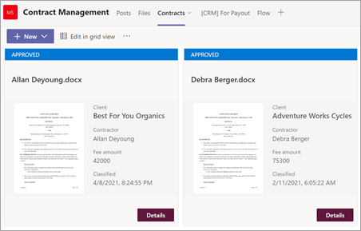

# <a name="step-3-use-power-automate-to-create-your-flow-to-process-your-contracts"></a><span data-ttu-id="cd92e-104">Schritt 3:</span><span class="sxs-lookup"><span data-stu-id="cd92e-104">Step 3.</span></span> <span data-ttu-id="cd92e-105">Verwenden sie Power Automate, um Ihren Flow zur Verarbeitung Ihrer Verträge zu erstellen</span><span class="sxs-lookup"><span data-stu-id="cd92e-105">Use Power Automate to create your flow to process your contracts</span></span>

<span data-ttu-id="cd92e-106">Sie haben Ihren Vertragsverwaltungskanal erstellt und Ihre SharePoint Dokumentbibliothek angefügt.</span><span class="sxs-lookup"><span data-stu-id="cd92e-106">You've created your Contract Management channel and have attached your SharePoint document library.</span></span> <span data-ttu-id="cd92e-107">Der nächste Schritt besteht darin, einen Power Automate Ablauf zu erstellen, um Ihre Verträge zu verarbeiten, die ihr SharePoint Syntex-Modell identifiziert und klassifiziert.</span><span class="sxs-lookup"><span data-stu-id="cd92e-107">The next step is to create a Power Automate flow to process your contracts that your SharePoint Syntex model identifies and classifies.</span></span> <span data-ttu-id="cd92e-108">Sie können diesen Schritt ausführen, indem [Sie einen Power Automate Fluss in Ihrer SharePoint Dokumentbibliothek erstellen.](https://support.microsoft.com/office/create-a-flow-for-a-list-or-library-in-sharepoint-or-onedrive-a9c3e03b-0654-46af-a254-20252e580d01)</span><span class="sxs-lookup"><span data-stu-id="cd92e-108">You can do this step by [creating a Power Automate flow in your SharePoint document library](https://support.microsoft.com/office/create-a-flow-for-a-list-or-library-in-sharepoint-or-onedrive-a9c3e03b-0654-46af-a254-20252e580d01).</span></span>

<span data-ttu-id="cd92e-109">Für Ihre Vertragsverwaltungslösung möchten Sie einen Power Automate Ablauf erstellen, um die folgenden Aktionen auszuführen:</span><span class="sxs-lookup"><span data-stu-id="cd92e-109">For your contracts management solution, you want to create a Power Automate flow to do the following actions:</span></span>

-  <span data-ttu-id="cd92e-110">Nachdem ein Vertrag von Ihrem SharePoint Syntex-Modell klassifiziert wurde, ändern Sie den Vertragsstatus in **"In Review".**</span><span class="sxs-lookup"><span data-stu-id="cd92e-110">After a contract has been classified by your SharePoint Syntex model, change the contract status to **In review**.</span></span>
- <span data-ttu-id="cd92e-111">Der Vertrag wird dann überprüft und entweder genehmigt oder abgelehnt.</span><span class="sxs-lookup"><span data-stu-id="cd92e-111">The contract is then reviewed and is either approved or rejected.</span></span>
- <span data-ttu-id="cd92e-112">Bei genehmigten Verträgen werden die Vertragsinformationen auf einer Registerkarte für die Zahlungsverarbeitung bereitgestellt.</span><span class="sxs-lookup"><span data-stu-id="cd92e-112">For approved contracts, the contract information is posted to a tab for payment processing.</span></span>
- <span data-ttu-id="cd92e-113">Bei abgelehnten Verträgen wird das Team zur weiteren Analyse benachrichtigt.</span><span class="sxs-lookup"><span data-stu-id="cd92e-113">For rejected contracts, the team is notified for further analysis.</span></span> 

<span data-ttu-id="cd92e-114">Das folgende Diagramm zeigt den Power Automate Ablauf für die Vertragsverwaltungslösung.</span><span class="sxs-lookup"><span data-stu-id="cd92e-114">The following diagram shows the Power Automate flow for the contract management solution.</span></span>


## <a name="prepare-your-contract-for-review"></a><span data-ttu-id="cd92e-116">Vorbereiten Ihres Vertrags für die Überprüfung</span><span class="sxs-lookup"><span data-stu-id="cd92e-116">Prepare your contract for review</span></span>

<span data-ttu-id="cd92e-117">Wenn ein Vertrag durch Ihr SharePoint Syntex Dokumentverständnismodell identifiziert und klassifiziert wird, ändert der Power Automate Fluss zuerst den Status **in "In review".**</span><span class="sxs-lookup"><span data-stu-id="cd92e-117">When a contract is identified and classified by your SharePoint Syntex document understanding model, the Power Automate flow will first change the status to **In review**.</span></span>


<span data-ttu-id="cd92e-119">Ändern Sie nach dem Auschecken der Datei den Statuswert in **"In review".**</span><span class="sxs-lookup"><span data-stu-id="cd92e-119">After checking out the file, change the status value to **In review**.</span></span>


<span data-ttu-id="cd92e-121">Der nächste Schritt besteht darin, eine adaptive Karte zu erstellen, die besagt, dass der Vertrag auf die Überprüfung wartet und sie im Vertragsverwaltungskanal veröffentlicht.</span><span class="sxs-lookup"><span data-stu-id="cd92e-121">The next step is to create an adaptive card stating that the contract is waiting for review and posting it to the Contract Management channel.</span></span>


<span data-ttu-id="cd92e-124">Der folgende Code ist der JSON-Code, der für diesen Schritt im Power Automate-Fluss verwendet wird.</span><span class="sxs-lookup"><span data-stu-id="cd92e-124">The following code is the JSON used for this step in the Power Automate flow.</span></span>

```JSON
{
"$schema": "http://adaptivecards.io/schemas/adaptive-card.json",
"type": "AdaptiveCard",
"version": "1.0",
"body": [
    {
    "type": "TextBlock",
    "text": "Contract approval request",
    "size": "large",
    "weight": "bolder",
     "wrap": true
    },
        {
            "type": "Container",
            "items": [
                {
                    "type": "FactSet",
                    "spacing": "Large",
                    "facts": [
                        {
                            "title": "Client",
                            "value": "@{triggerOutputs()?['body/Client']}"
                        },
                        {
                            "title": "Contractor",
                            "value": "@{triggerOutputs()?['body/Contractor']}"
                        },
                        {
                            "title": "Fee amount",
                            "value": "@{triggerOutputs()?['body/FeeAmount']}"
                        },
                        {
                            "title": "Date created",
                            "value": "@{triggerOutputs()?['body/Modified']} "
                        },
                        {
                            "title": "Link",
                            "value": "[@{triggerOutputs()?['body/{FilenameWithExtension}']}](@{triggerOutputs()?['body/{Link}']})"
                        }
                    ]
                }
            ]
         },
    {
    "type": "TextBlock",
    "text": "Comment:"
    },
        {
            "type": "Input.Text",
            "placeholder": "Enter comments",
            "id": "acComments"
        }
],
"actions": [
    {
    "type": "Action.Submit",
    "title": "Approve",
    "data": {
        "x": "Approve"
    }
    },
    {
    "type": "Action.Submit",
    "title": "Reject",
    "data": {
        "x": "Reject"
    }
    }
]
}
```


## <a name="conditional-context"></a><span data-ttu-id="cd92e-125">Bedingter Kontext</span><span class="sxs-lookup"><span data-stu-id="cd92e-125">Conditional context</span></span>

<span data-ttu-id="cd92e-126">Als Nächstes müssen Sie in Ihrem Flow eine Bedingung erstellen, in der Ihr Vertrag entweder  [genehmigt](#if-the-contract-is-approved) oder [abgelehnt](#if-the-contract-is-rejected)wird.</span><span class="sxs-lookup"><span data-stu-id="cd92e-126">In your flow, next you need to create a condition in which your contract will be either  [approved](#if-the-contract-is-approved) or [rejected](#if-the-contract-is-rejected).</span></span>


## <a name="if-the-contract-is-approved"></a><span data-ttu-id="cd92e-128">Wenn der Vertrag genehmigt wurde</span><span class="sxs-lookup"><span data-stu-id="cd92e-128">If the contract is approved</span></span>

<span data-ttu-id="cd92e-129">Wenn ein Vertrag genehmigt wurde, geschieht Folgendes:</span><span class="sxs-lookup"><span data-stu-id="cd92e-129">When a contract has been approved, the following things occur:</span></span>

- <span data-ttu-id="cd92e-130">Auf der Registerkarte **"Verträge"** ändert sich der Status in der Vertragskarte in **"Genehmigt".**</span><span class="sxs-lookup"><span data-stu-id="cd92e-130">On the **Contracts** tab, the status in the contract card will change to **Approved**.</span></span>

   

- <span data-ttu-id="cd92e-132">In Ihrem Flow wird der Status in **Genehmigt** geändert.</span><span class="sxs-lookup"><span data-stu-id="cd92e-132">In your flow, the status is changed to **Approved**.</span></span>

   

- <span data-ttu-id="cd92e-134">In dieser Lösung werden die Vertragsdaten der Registerkarte **"Für Auszahlung"** hinzugefügt, damit die Auszahlungen verwaltet werden können.</span><span class="sxs-lookup"><span data-stu-id="cd92e-134">In this solution, the contract data will be added to the **For Payout** tab so that the payouts can be managed.</span></span> <span data-ttu-id="cd92e-135">Dieser Prozess kann erweitert werden, damit der Fluss die Verträge zur Zahlung durch eine Drittanbieter-Finanzanwendung (z. B. Dynamics CRM) übermitteln kann.</span><span class="sxs-lookup"><span data-stu-id="cd92e-135">This process can be extended to allow the flow to submit the contracts for payment by a third-party financial application (for example, Dynamics CRM).</span></span>

   

- <span data-ttu-id="cd92e-137">Im Fluss erstellen Sie das folgende Element, um genehmigte Verträge auf die Registerkarte **"Für Auszahlung"** zu verschieben.</span><span class="sxs-lookup"><span data-stu-id="cd92e-137">In the flow, you create the following item to move approved contracts to the **For Payout** tab.</span></span>

   

    <span data-ttu-id="cd92e-139">Verwenden Sie die in der folgenden Tabelle aufgeführten Werte, um die Ausdrücke für die von der Teams Karte benötigten Informationen abzurufen.</span><span class="sxs-lookup"><span data-stu-id="cd92e-139">To get the expressions for the information needed from the Teams card, use the values shown in the following table.</span></span>
 
    |<span data-ttu-id="cd92e-140">Name</span><span class="sxs-lookup"><span data-stu-id="cd92e-140">Name</span></span>     |<span data-ttu-id="cd92e-141">Expression</span><span class="sxs-lookup"><span data-stu-id="cd92e-141">Expression</span></span> |
    |---------|-----------|
    | <span data-ttu-id="cd92e-142">Genehmigungsstatus</span><span class="sxs-lookup"><span data-stu-id="cd92e-142">Approval state</span></span>  | <span data-ttu-id="cd92e-143">body('Post_an_Adaptive_Card_to_a_Teams_channel_and_wait_for_a_response')? ['submitActionId']</span><span class="sxs-lookup"><span data-stu-id="cd92e-143">body('Post_an_Adaptive_Card_to_a_Teams_channel_and_wait_for_a_response')?['submitActionId']</span></span>         |
    | <span data-ttu-id="cd92e-144">Genehmigt von</span><span class="sxs-lookup"><span data-stu-id="cd92e-144">Approved by</span></span>     | <span data-ttu-id="cd92e-145">body('Post_an_Adaptive_Card_to_a_Teams_channel_and_wait_for_a_response')? ['responder'] ['displayName']</span><span class="sxs-lookup"><span data-stu-id="cd92e-145">body('Post_an_Adaptive_Card_to_a_Teams_channel_and_wait_for_a_response')?['responder']['displayName']</span></span>        |
    | <span data-ttu-id="cd92e-146">Genehmigungsdatum</span><span class="sxs-lookup"><span data-stu-id="cd92e-146">Approval date</span></span>     | <span data-ttu-id="cd92e-147">body('Post_an_Adaptive_Card_to_a_Teams_channel_and_wait_for_a_response')? ['responseTime']</span><span class="sxs-lookup"><span data-stu-id="cd92e-147">body('Post_an_Adaptive_Card_to_a_Teams_channel_and_wait_for_a_response')?['responseTime']</span></span>         |
    | <span data-ttu-id="cd92e-148">Kommentar</span><span class="sxs-lookup"><span data-stu-id="cd92e-148">Comment</span></span>     | <span data-ttu-id="cd92e-149">body('Post_an_Adaptive_Card_to_a_Teams_channel_and_wait_for_a_response')? ['data'] ['acComments']</span><span class="sxs-lookup"><span data-stu-id="cd92e-149">body('Post_an_Adaptive_Card_to_a_Teams_channel_and_wait_for_a_response')?['data']['acComments']</span></span>         |
    
    <span data-ttu-id="cd92e-150">Das folgende Beispiel zeigt, wie Sie das Formelfeld in Power Automate verwenden, um einen Ausdruck zu schreiben.</span><span class="sxs-lookup"><span data-stu-id="cd92e-150">The following example shows how to use the formula box in Power Automate to write an expression.</span></span>

       

- <span data-ttu-id="cd92e-152">Eine adaptive Karte, die besagt, dass der Vertrag genehmigt wurde, wird erstellt und im Vertragsverwaltungskanal veröffentlicht.</span><span class="sxs-lookup"><span data-stu-id="cd92e-152">An adaptive card stating that the contract has been approved is created and posted to the Contract Management channel.</span></span>

   

   


   <span data-ttu-id="cd92e-155">Der folgende Code ist der JSON-Code, der für diesen Schritt im Power Automate-Fluss verwendet wird.</span><span class="sxs-lookup"><span data-stu-id="cd92e-155">The following code is the JSON used for this step in the Power Automate flow.</span></span>

```JSON
{ 
    "type": "AdaptiveCard",
    "body": [
        {
            "type": "Container",
            "style": "emphasis",
            "items": [
                {
                    "type": "ColumnSet",
                    "columns": [
                        {
                            "type": "Column",
                            "items": [
                                {
                                    "type": "TextBlock",
                                    "size": "Large",
                                    "weight": "Bolder",
                                    "text": "CONTRACT APPROVED"
                                }
                            ],
                            "width": "stretch"
                        }
                    ]
                }
            ],
            "bleed": true
        },
        {
            "type": "Container",
            "items": [
                {
                    "type": "FactSet",
                    "spacing": "Large",
                    "facts": [
                        {
                            "title": "Client",
                            "value": "@{triggerOutputs()?['body/Client']}"
                        },
                        {
                            "title": "Contractor",
                            "value": "@{triggerOutputs()?['body/Contractor']}"
                        },
                        {
                            "title": "Fee amount",
                            "value": "@{triggerOutputs()?['body/FeeAmount']}"
                        },
                        {
                            "title": "Approval by",
                            "value": "@{body('Post_an_Adaptive_Card_to_a_Teams_channel_and_wait_for_a_response')?['responder']['displayName']}"
                        },
                        {
                            "title": "Approved date",
                            "value": "@{body('Post_an_Adaptive_Card_to_a_Teams_channel_and_wait_for_a_response')?['responseTime']}"
                        },
                        {
                            "title": "Approval comment",
                            "value": "@{body('Post_an_Adaptive_Card_to_a_Teams_channel_and_wait_for_a_response')?['data']['acComments']}"
                        },
                        {
                            "title": " ",
                            "value": " "
                        },
                        {
                            "title": "Status",
                            "value": "Ready for payout"
                        }
                    ]
                }
            ]
        }
    ],
    "$schema": "http://adaptivecards.io/schemas/adaptive-card.json",
    "version": "1.2",
    "fallbackText": "This card requires Adaptive Cards v1.2 support to be rendered properly."
}
```

## <a name="if-the-contract-is-rejected"></a><span data-ttu-id="cd92e-156">Wenn der Vertrag abgelehnt wird</span><span class="sxs-lookup"><span data-stu-id="cd92e-156">If the contract is rejected</span></span>

<span data-ttu-id="cd92e-157">Wenn ein Vertrag abgelehnt wurde, geschieht Folgendes:</span><span class="sxs-lookup"><span data-stu-id="cd92e-157">When a contract has been rejected, the following things occur:</span></span>

- <span data-ttu-id="cd92e-158">Auf der Registerkarte **"Verträge"** ändert sich der Status in der Vertragskarte in **"Abgelehnt".**</span><span class="sxs-lookup"><span data-stu-id="cd92e-158">On the **Contracts** tab, the status in the contract card will change to **Rejected**.</span></span>

   

- <span data-ttu-id="cd92e-160">In Ihrem Flow checken Sie die Vertragsdatei aus, ändern den Status in **"Abgelehnt",** und checken dann die Datei wieder ein.</span><span class="sxs-lookup"><span data-stu-id="cd92e-160">In your flow, you check out the contract file, change the status to **Rejected**, and then check the file back in.</span></span>

   

- <span data-ttu-id="cd92e-162">In Ihrem Flow erstellen Sie eine adaptive Karte, die besagt, dass der Vertrag abgelehnt wurde.</span><span class="sxs-lookup"><span data-stu-id="cd92e-162">In your flow, you create an adaptive card stating that the contract has been rejected.</span></span>

   

<span data-ttu-id="cd92e-164">Der folgende Code ist der JSON-Code, der für diesen Schritt im Power Automate-Fluss verwendet wird.</span><span class="sxs-lookup"><span data-stu-id="cd92e-164">The following code is the JSON used for this step in the Power Automate flow.</span></span>

```JSON
{ 
    "type": "AdaptiveCard",
    "body": [
        {
            "type": "Container",
            "style": "attention",
            "items": [
                {
                    "type": "ColumnSet",
                    "columns": [
                        {
                            "type": "Column",
                            "items": [
                                {
                                    "type": "TextBlock",
                                    "size": "Large",
                                    "weight": "Bolder",
                                    "text": "CONTRACT REJECTED"
                                }
                            ],
                            "width": "stretch"
                        }
                    ]
                }
            ],
            "bleed": true
        },
        {
            "type": "Container",
            "items": [
                {
                    "type": "FactSet",
                    "spacing": "Large",
                    "facts": [
                        {
                            "title": "Client",
                            "value": "@{triggerOutputs()?['body/Client']}"
                        },
                        {
                            "title": "Contractor",
                            "value": "@{triggerOutputs()?['body/Contractor']}"
                        },
                        {
                            "title": "Fee amount",
                            "value": "@{triggerOutputs()?['body/FeeAmount']}"
                        },
                        {
                            "title": "Rejected by",
                            "value": "@{body('Post_an_Adaptive_Card_to_a_Teams_channel_and_wait_for_a_response')?['responder']['displayName']}"
                        },
                        {
                            "title": "Rejected date",
                            "value": "@{body('Post_an_Adaptive_Card_to_a_Teams_channel_and_wait_for_a_response')?['responseTime']}"
                        },
                        {
                            "title": "Comment",
                            "value": "@{body('Post_an_Adaptive_Card_to_a_Teams_channel_and_wait_for_a_response')?['data']['acComments']}"
                        },
                        {
                            "title": " ",
                            "value": " "
                        },
                        {
                            "title": "Status",
                            "value": "Needs review"
                        }
                    ]
                }
            ]
        }
    ],
    "$schema": "http://adaptivecards.io/schemas/adaptive-card.json",
    "version": "1.2",
    "fallbackText": "This card requires Adaptive Cards v1.2 support to be rendered properly."
}
```

- <span data-ttu-id="cd92e-165">Die Karte wird im Vertragsverwaltungskanal bereitgestellt.</span><span class="sxs-lookup"><span data-stu-id="cd92e-165">The card is posted in the Contract Management channel.</span></span>

   