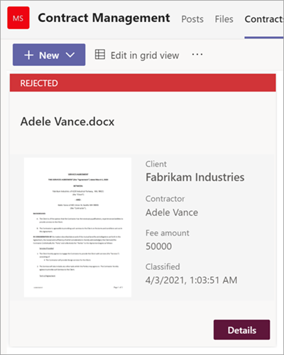

# <a name="step-3-use-power-automate-to-create-your-flow-to-process-your-contracts"></a><span data-ttu-id="4492e-104">Schritt 3:</span><span class="sxs-lookup"><span data-stu-id="4492e-104">Step 3.</span></span> <span data-ttu-id="4492e-105">Verwenden Power Automate, um Ihren Fluss zum Verarbeiten Ihrer Verträge zu erstellen</span><span class="sxs-lookup"><span data-stu-id="4492e-105">Use Power Automate to create your flow to process your contracts</span></span>

<span data-ttu-id="4492e-106">Sie haben ihren Vertragsverwaltungskanal erstellt und Ihre SharePoint angefügt.</span><span class="sxs-lookup"><span data-stu-id="4492e-106">You've created your Contract Management channel and have attached your SharePoint document library.</span></span> <span data-ttu-id="4492e-107">Im nächsten Schritt erstellen Sie einen Power Automate, um Ihre Verträge zu verarbeiten, die SharePoint Syntex-Modell identifiziert und klassifiziert.</span><span class="sxs-lookup"><span data-stu-id="4492e-107">The next step is to create a Power Automate flow to process your contracts that your SharePoint Syntex model identifies and classifies.</span></span> <span data-ttu-id="4492e-108">Sie können diesen Schritt tun, indem [Sie einen Power Automate In-SharePoint erstellen.](https://support.microsoft.com/office/create-a-flow-for-a-list-or-library-in-sharepoint-or-onedrive-a9c3e03b-0654-46af-a254-20252e580d01)</span><span class="sxs-lookup"><span data-stu-id="4492e-108">You can do this step by [creating a Power Automate flow in your SharePoint document library](https://support.microsoft.com/office/create-a-flow-for-a-list-or-library-in-sharepoint-or-onedrive-a9c3e03b-0654-46af-a254-20252e580d01).</span></span>

<span data-ttu-id="4492e-109">Für Ihre Vertragsverwaltungslösung möchten Sie einen Power Automate erstellen, um die folgenden Aktionen ausführen zu können:</span><span class="sxs-lookup"><span data-stu-id="4492e-109">For your contracts management solution, you want to create a Power Automate flow to do the following actions:</span></span>

-  <span data-ttu-id="4492e-110">Nachdem ein Vertrag von Ihrem SharePoint klassifiziert wurde, ändern Sie den Vertragsstatus **in In review**.</span><span class="sxs-lookup"><span data-stu-id="4492e-110">After a contract has been classified by your SharePoint Syntex model, change the contract status to **In review**.</span></span>
- <span data-ttu-id="4492e-111">Der Vertrag wird dann überprüft und entweder genehmigt oder abgelehnt.</span><span class="sxs-lookup"><span data-stu-id="4492e-111">The contract is then reviewed and is either approved or rejected.</span></span>
- <span data-ttu-id="4492e-112">Bei genehmigten Verträgen werden die Vertragsinformationen auf einer Registerkarte für die Zahlungsverarbeitung bereitgestellt.</span><span class="sxs-lookup"><span data-stu-id="4492e-112">For approved contracts, the contract information is posted to a tab for payment processing.</span></span>
- <span data-ttu-id="4492e-113">Bei abgelehnten Verträgen wird das Team zur weiteren Analyse benachrichtigt.</span><span class="sxs-lookup"><span data-stu-id="4492e-113">For rejected contracts, the team is notified for further analysis.</span></span> 

<span data-ttu-id="4492e-114">Das folgende Diagramm zeigt den Power Automate für die Vertragsverwaltungslösung.</span><span class="sxs-lookup"><span data-stu-id="4492e-114">The following diagram shows the Power Automate flow for the contract management solution.</span></span>


## <a name="prepare-your-contract-for-review"></a><span data-ttu-id="4492e-116">Vorbereiten ihres Vertrags für die Überprüfung</span><span class="sxs-lookup"><span data-stu-id="4492e-116">Prepare your contract for review</span></span>

<span data-ttu-id="4492e-117">Wenn ein Vertrag von Ihrem SharePoint Syntex-Dokumentverständnismodell identifiziert und klassifiziert wird, ändert der Power Automate-Fluss zunächst den Status in "In Review".</span><span class="sxs-lookup"><span data-stu-id="4492e-117">When a contract is identified and classified by your SharePoint Syntex document understanding model, the Power Automate flow will first change the status to "In review."</span></span>


<span data-ttu-id="4492e-119">Ändern Sie nach dem Auschecken der Datei den Statuswert in "In review".</span><span class="sxs-lookup"><span data-stu-id="4492e-119">After checking out the file, change the status value to "In review."</span></span>


<span data-ttu-id="4492e-121">Der nächste Schritt besteht im Erstellen einer adaptiven Karte, die besagt, dass der Vertrag auf die Überprüfung wartet, und sie im Kanal vertragsverwaltung zu veröffentlichen.</span><span class="sxs-lookup"><span data-stu-id="4492e-121">The next step is to create an adaptive card stating that the contract is waiting for review and posting it to the Contract Management channel.</span></span>


<span data-ttu-id="4492e-124">Der folgende Code ist die JSON, die für diesen Schritt im Power Automate wird.</span><span class="sxs-lookup"><span data-stu-id="4492e-124">The following code is the JSON used for this step in the Power Automate flow.</span></span>

```JSON
{
"$schema": "http://adaptivecards.io/schemas/adaptive-card.json",
"type": "AdaptiveCard",
"version": "1.0",
"body": [
    {
    "type": "TextBlock",
    "text": "Contract approval request",
    "size": "large",
    "weight": "bolder",
     "wrap": true
    },
        {
            "type": "Container",
            "items": [
                {
                    "type": "FactSet",
                    "spacing": "Large",
                    "facts": [
                        {
                            "title": "Client",
                            "value": "@{triggerOutputs()?['body/Client']}"
                        },
                        {
                            "title": "Contractor",
                            "value": "@{triggerOutputs()?['body/Contractor']}"
                        },
                        {
                            "title": "Fee amount",
                            "value": "@{triggerOutputs()?['body/FeeAmount']}"
                        },
                        {
                            "title": "Date created",
                            "value": "@{triggerOutputs()?['body/Modified']} "
                        },
                        {
                            "title": "Link",
                            "value": "[@{triggerOutputs()?['body/{FilenameWithExtension}']}](@{triggerOutputs()?['body/{Link}']})"
                        }
                    ]
                }
            ]
         },
    {
    "type": "TextBlock",
    "text": "Comment:"
    },
        {
            "type": "Input.Text",
            "placeholder": "Enter comments",
            "id": "acComments"
        }
],
"actions": [
    {
    "type": "Action.Submit",
    "title": "Approve",
    "data": {
        "x": "Approve"
    }
    },
    {
    "type": "Action.Submit",
    "title": "Reject",
    "data": {
        "x": "Reject"
    }
    }
]
}
```


## <a name="conditional"></a><span data-ttu-id="4492e-125">Bedingt</span><span class="sxs-lookup"><span data-stu-id="4492e-125">Conditional</span></span>

<span data-ttu-id="4492e-126">Im nächsten Schritt müssen Sie eine Bedingung erstellen, in der Ihr Vertrag entweder genehmigt oder abgelehnt wird.</span><span class="sxs-lookup"><span data-stu-id="4492e-126">In your flow, next you need to create a condition in which your contract will be either  approved or rejected.</span></span>


## <a name="if-the-contract-is-approved"></a><span data-ttu-id="4492e-128">Wenn der Vertrag genehmigt wird</span><span class="sxs-lookup"><span data-stu-id="4492e-128">If the contract is approved</span></span>

<span data-ttu-id="4492e-129">Wenn ein Vertrag genehmigt wurde, treten die folgenden Schritte auf:</span><span class="sxs-lookup"><span data-stu-id="4492e-129">When a contract has been approved, the following things occur:</span></span>

- <span data-ttu-id="4492e-130">Auf der **Registerkarte** Verträge ändert sich der Status auf der Vertragskarte in **Genehmigt**.</span><span class="sxs-lookup"><span data-stu-id="4492e-130">On the **Contracts** tab, the status in the contract card will change to **Approved**.</span></span>

   

- <span data-ttu-id="4492e-132">In Ihrem Fluss wird der Status in "Genehmigt" geändert.</span><span class="sxs-lookup"><span data-stu-id="4492e-132">In your flow, the status is changed to "Approved."</span></span>

   

- <span data-ttu-id="4492e-134">In dieser Lösung werden die Vertragsdaten  der Registerkarte Auszahlung hinzugefügt, damit die Auszahlungen verwaltet werden können.</span><span class="sxs-lookup"><span data-stu-id="4492e-134">In this solution, the contract data will be added to the **For Payout** tab so that the payouts can be managed.</span></span> <span data-ttu-id="4492e-135">Dieser Prozess kann so erweitert werden, dass der Fluss die Verträge zur Zahlung durch eine Finanzanwendung eines Drittanbieters (z. B. Dynamics CRM) übermitteln kann.</span><span class="sxs-lookup"><span data-stu-id="4492e-135">This process can be extended to allow the flow to submit the contracts for payment by a third-party financial application (for example, Dynamics CRM).</span></span>

   

- <span data-ttu-id="4492e-137">Im Fluss erstellen Sie das folgende Element, um genehmigte Verträge auf die Registerkarte **Für Auszahlung zu** verschieben.</span><span class="sxs-lookup"><span data-stu-id="4492e-137">In the flow, you create the following item to move approved contracts to the **For Payout** tab.</span></span>

   

- <span data-ttu-id="4492e-139">Eine adaptive Karte mit der Angabe, dass der Vertrag genehmigt wurde, wird erstellt und im Kanal Vertragsverwaltung veröffentlicht.</span><span class="sxs-lookup"><span data-stu-id="4492e-139">An adaptive card stating that the contract has been approved is created and posted to the Contract Management channel.</span></span>

   

   


   <span data-ttu-id="4492e-142">Der folgende Code ist die JSON, die für diesen Schritt im Power Automate wird.</span><span class="sxs-lookup"><span data-stu-id="4492e-142">The following code is the JSON used for this step in the Power Automate flow.</span></span>

```JSON
{ 
    "type": "AdaptiveCard",
    "body": [
        {
            "type": "Container",
            "style": "emphasis",
            "items": [
                {
                    "type": "ColumnSet",
                    "columns": [
                        {
                            "type": "Column",
                            "items": [
                                {
                                    "type": "TextBlock",
                                    "size": "Large",
                                    "weight": "Bolder",
                                    "text": "CONTRACT APPROVED"
                                }
                            ],
                            "width": "stretch"
                        }
                    ]
                }
            ],
            "bleed": true
        },
        {
            "type": "Container",
            "items": [
                {
                    "type": "FactSet",
                    "spacing": "Large",
                    "facts": [
                        {
                            "title": "Client",
                            "value": "@{triggerOutputs()?['body/Client']}"
                        },
                        {
                            "title": "Contractor",
                            "value": "@{triggerOutputs()?['body/Contractor']}"
                        },
                        {
                            "title": "Fee amount",
                            "value": "@{triggerOutputs()?['body/FeeAmount']}"
                        },
                        {
                            "title": "Approval by",
                            "value": "@{body('Post_an_Adaptive_Card_to_a_Teams_channel_and_wait_for_a_response')?['responder']['displayName']}"
                        },
                        {
                            "title": "Approved date",
                            "value": "@{body('Post_an_Adaptive_Card_to_a_Teams_channel_and_wait_for_a_response')?['responseTime']}"
                        },
                        {
                            "title": "Approval comment",
                            "value": "@{body('Post_an_Adaptive_Card_to_a_Teams_channel_and_wait_for_a_response')?['data']['acComments']}"
                        },
                        {
                            "title": " ",
                            "value": " "
                        },
                        {
                            "title": "Status",
                            "value": "Ready for payout"
                        }
                    ]
                }
            ]
        }
    ],
    "$schema": "http://adaptivecards.io/schemas/adaptive-card.json",
    "version": "1.2",
    "fallbackText": "This card requires Adaptive Cards v1.2 support to be rendered properly."
}
```

## <a name="if-the-contract-is-rejected"></a><span data-ttu-id="4492e-143">Wenn der Vertrag abgelehnt wird</span><span class="sxs-lookup"><span data-stu-id="4492e-143">If the contract is rejected</span></span>

<span data-ttu-id="4492e-144">Wenn ein Vertrag abgelehnt wurde, treten die folgenden Schritte auf:</span><span class="sxs-lookup"><span data-stu-id="4492e-144">When a contract has been rejected, the following things occur:</span></span>

- <span data-ttu-id="4492e-145">Auf der **Registerkarte** Verträge wird der Status auf der Vertragskarte in **Abgelehnt geändert.**</span><span class="sxs-lookup"><span data-stu-id="4492e-145">On the **Contracts** tab, the status in the contract card will change to **Rejected**.</span></span>

   

- <span data-ttu-id="4492e-147">In Ihrem Fluss checken Sie die Vertragsdatei aus, ändern den Status in **Abgelehnt** und dann die Datei wieder ein.</span><span class="sxs-lookup"><span data-stu-id="4492e-147">In your flow, you check out the contract file, change the status to **Rejected**, and then check the file back in.</span></span>

   

- <span data-ttu-id="4492e-149">In Ihrem Fluss erstellen Sie eine adaptive Karte, die besagt, dass der Vertrag abgelehnt wurde.</span><span class="sxs-lookup"><span data-stu-id="4492e-149">In your flow, you create an adaptive card stating that the contract has been rejected.</span></span>

   

<span data-ttu-id="4492e-151">Der folgende Code ist die JSON, die für diesen Schritt im Power Automate wird.</span><span class="sxs-lookup"><span data-stu-id="4492e-151">The following code is the JSON used for this step in the Power Automate flow.</span></span>

```JSON
{ 
    "type": "AdaptiveCard",
    "body": [
        {
            "type": "Container",
            "style": "attention",
            "items": [
                {
                    "type": "ColumnSet",
                    "columns": [
                        {
                            "type": "Column",
                            "items": [
                                {
                                    "type": "TextBlock",
                                    "size": "Large",
                                    "weight": "Bolder",
                                    "text": "CONTRACT REJECTED"
                                }
                            ],
                            "width": "stretch"
                        }
                    ]
                }
            ],
            "bleed": true
        },
        {
            "type": "Container",
            "items": [
                {
                    "type": "FactSet",
                    "spacing": "Large",
                    "facts": [
                        {
                            "title": "Client",
                            "value": "@{triggerOutputs()?['body/Client']}"
                        },
                        {
                            "title": "Contractor",
                            "value": "@{triggerOutputs()?['body/Contractor']}"
                        },
                        {
                            "title": "Fee amount",
                            "value": "@{triggerOutputs()?['body/FeeAmount']}"
                        },
                        {
                            "title": "Rejected by",
                            "value": "@{body('Post_an_Adaptive_Card_to_a_Teams_channel_and_wait_for_a_response')?['responder']['displayName']}"
                        },
                        {
                            "title": "Rejected date",
                            "value": "@{body('Post_an_Adaptive_Card_to_a_Teams_channel_and_wait_for_a_response')?['responseTime']}"
                        },
                        {
                            "title": "Comment",
                            "value": "@{body('Post_an_Adaptive_Card_to_a_Teams_channel_and_wait_for_a_response')?['data']['acComments']}"
                        },
                        {
                            "title": " ",
                            "value": " "
                        },
                        {
                            "title": "Status",
                            "value": "Needs review"
                        }
                    ]
                }
            ]
        }
    ],
    "$schema": "http://adaptivecards.io/schemas/adaptive-card.json",
    "version": "1.2",
    "fallbackText": "This card requires Adaptive Cards v1.2 support to be rendered properly."
}
```

- <span data-ttu-id="4492e-152">Die Karte wird im Kanal Vertragsverwaltung bereitgestellt.</span><span class="sxs-lookup"><span data-stu-id="4492e-152">The card is posted in the Contract Management channel.</span></span>

   