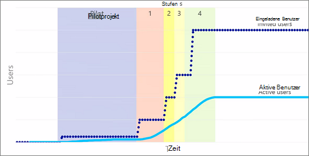

# Planen des Rolloutplans für den Portalstart in SharePoint Online

Bei einem Portal handelt es sich um eine SharePoint-Website in Ihrem Intranet mit einer großen Anzahl von Websitebenutzern, die Inhalte auf der Website nutzen. In großen Organisationen könnten mehrere dieser Portale vorhanden sein, beispielsweise ein Firmenportal und ein Personalportal. In der Regel erstellen und bearbeiten nur relativ wenige Personen die Portalwebsite und deren Inhalte. Die meisten Besucher des Portals können den Inhalt nur lesen und nutzen.

In diesem Artikel wird beschrieben, wie Sie Ihren Bereitstellungs- und Rolloutplan für SharePoint planen. Außerdem werden Ansätze für die Vorgehensweise zur Verfügung gestellt, da herkömmliche Auslastungstests in online nicht SharePoint sind. SharePoint Online ist ein Clouddienst, und die Ladefunktionen, die Integrität und das Gesamtgewicht der Last im Dienst werden von Microsoft verwaltet.

Um beim Erstellen eines erfolgreichen Portals zu helfen, befolgen Sie die grundlegenden Prinzipien, Methoden und Empfehlungen, die im Erstellen, Starten und Verwalten eines fehlerfreien [Portals detailliert sind.](/sharepoint/portal-health) 

Der Bereitstellungsansatz wird unten hervorgehoben.

## Übersicht über die Kapazitätsplanung in SharePoint Online
Um Kapazität effizient zu nutzen und unerwartetes Wachstum zu erreichen, verfügen wir in jeder Farm über Automatisierung, die bestimmte Verwendungsszenarien verfolgt. Während das genaue Wachstum für jeden Mandanten in einer Farm unvorhersehbar ist, ist die aggregierte Summe der Anforderungen im Laufe der Zeit vorhersehbar. Indem wir die Wachstumstrends in SharePoint Online identifizieren, können wir eine zukünftige Expansion planen. Weitere Informationen zur [Kapazitätsplanung und zum Auslastungstest finden](capacity-planning-and-load-testing-sharepoint-online.md)Sie SharePoint Online .

Ein wichtiger Bestandteil eines erfolgreichen Startes ist der unten beschriebene Ansatz "Welle" oder "schrittweises Rollout". 

## Kann ich Testtests SharePoint Online laden?
SharePoint Online ist eine freigegebene umgebung mit mehreren Mandanten, die farmübergreifend ausgewogen ist und die Skalierung regelmäßig angepasst wird. Laden sie eine Umgebung wie SharePoint Online, deren Skalierungsänderungen kontinuierlich nicht nur unerwartete Ergebnisse liefern, sondern auch nicht zulässig sind. 

Weitere Informationen: [Kapazitätsplanung und Auslastungstests SharePoint Online](capacity-planning-and-load-testing-sharepoint-online.md)

## Optimieren von Seiten durch Befolgen empfohlener Richtlinien
Seiten aus einer lokalen Bereitstellung sollten nicht einfach auf SharePoint Online verschoben werden, ohne sie mit den empfohlenen Richtlinien für SharePoint Online zu überprüfen. Der beste Ansatz besteht in der Optimierung jeder Homepage für jede Website oder jedes Portal in SharePoint, da hier die meisten Benutzer in Ihrer Organisation als Ausgangspunkt für Ihre Website(en) zugreifen.

Es sollten einige grundlegende Faktoren berücksichtigt werden:
- Lokale Bereitstellungen können herkömmliche serverseitige Caches wie Objektcache, Ausgabecache und Blobcache nutzen. Bei den Topologieunterschieden in der Cloud sind diese Optionen nicht unbedingt verfügbar, da sie durch die schieren Skalierungsunterschiede weniger praktikabel sind.
- Alle Seiten/Features/Anpassungen, die für die Cloudverbrauch verwendet werden, sollten für eine höhere Latenz sowie für die verteilten Speicherorte von Benutzern optimiert werden, damit Benutzer in verschiedenen Bereichen oder Regionen eine einheitlichere Benutzererfahrung haben. Die Cloud bietet Optimierungen wie Content Delivery Networks (CDN), um eine verteilte Benutzerbasis sowie moderne SharePoint zu optimieren. Die letzte bekannte gute (LKG) wird von unseren OOTB-Webparts (Out of the Box) genutzt.

### Was ist zu tun:
 - Verwenden Sie für alle Websiteseiten in SharePoint Online das Tool "Seitendiagnose", das eine Chromium-Erweiterung ist, die bei der Analyse und Bereitstellung von Anleitungen hilft. Dies kann von Websitebesitzern, Editoren, Administratoren und Entwicklern verwendet werden, da sie als Ausgangspunkt für die Analyse und Optimierung konzipiert ist.
 - Entwickler sollten auch Entwicklungstools wie das Browserentwicklertool F12 sowie STRG-F12 im Browser auf modernen Seiten verwenden. [Fiddler](https://www.telerik.com/download/fiddler) kann auch verwendet werden, um die Größe der Seite (wie groß die Seite in Megabyte ist) und die Anzahl der Aufrufe und Elemente zu überprüfen, die sich auf die gesamte Seitenlast auswirken. 

Dieser Abschnitt war eine kurze Zusammenfassung zum Optimieren von Seiten.  Weitere Informationen finden Sie unter [Erstellen, Starten und Verwalten eines fehlerfreien Portals.](/sharepoint/portal-health)

## Folgen sie einem Wave /Phased Roll-out-Ansatz
Der herkömmliche Big Bang-Ansatz für Websitestarts lässt keine Überprüfung zu, ob Anpassungen, externe Quellen, Dienste oder Prozesse in der richtigen Skalierung getestet wurden. Dies bedeutet nicht, dass es Monate dauern wird, bis sie gestartet wird, es wird jedoch empfohlen, mindestens mehrere Tage lang abhängig von der Größe Ihrer Organisation zu starten. Das Folgen eines Wave-Roll-out-Plans bietet Ihnen daher die Möglichkeit, Probleme anzuhalten und zu beheben, bevor Sie mit der nächsten Phase fortfahren. Dadurch wird die potenzielle Anzahl von Benutzern, die von Problemen betroffen sind, gesenkt. SharePoint, wenn ein Dienst Ihre Kapazität basierend auf der Nutzung und der vorhergesagten Nutzung skaliert, und obwohl wir nicht benötigen, dass Sie uns über Ihren Start benachrichtigen, sollten Sie die Richtlinien befolgen, um den Erfolg sicherzustellen.
  
Wie in der folgenden Abbildung gezeigt, ist die Anzahl der eingeladenen Benutzer häufig deutlich höher als die, die die Website tatsächlich verwenden. Diese Abbildung zeigt eine Strategie zum Rollout einer Version. Diese Methode hilft, Möglichkeiten zur Verbesserung der SharePoint zu ermitteln, bevor die Meisten Benutzer sie sehen.
  

  
In der Pilotphase ist es gut, Feedback von Benutzern zu erhalten, dem die Organisation vertraut und weiß, dass sie sich engagieren wird. Auf diese Weise kann gemessen werden, wie das System verwendet wird und wie es funktioniert.
  
Sammeln Sie während der einzelnen Wellen Feedback von Benutzern zu den Features sowie zur Leistung während jeder Bereitstellungswelle. Dies hat den Vorteil, dass das System langsam eingeführt wird und Verbesserungen vorgenommen werden, wenn das System stärker genutzt wird. Dadurch können wir auch auf die erhöhte Auslastung reagieren, da die Website immer mehr Benutzern zur Verfügung steht und in Kombination mit den Richtlinien für die Seitenoptimierung eine positive Benutzererfahrung gewährleistet.

### Was ist zu tun:
- Entscheiden Sie über den Zeitpunkt der einzelnen Phasen, und stellen Sie sicher, dass Sie über eine Notfall-/Pausenmöglichkeit verfügen, falls Sie Anpassungen vornehmen müssen, bevor Sie fortfahren
- Planen Sie Ihre erste Gruppe von Benutzern, die Sie aktivieren möchten, um sicherzustellen, dass Sie das Feedback erhalten, das Sie benötigen, um vorwärts zu gehen. Dies bedeutet, dass Sie nach Möglichkeit eine aktive Gruppe von Benutzern auswählen, die zeitnah Feedback gibt.
- Wenn Sie jede Welle planen, versuchen Sie, mit einer kleinen Benutzerbasis (weniger als 5000 Benutzer) zu beginnen und dann die Gruppengrößen zu erhöhen, während Sie mit jeder Welle fortfahren. Dies trägt dazu bei, einen gestaffelten Ansatz zu erstellen und ermöglicht möglicherweise einfachere Pausenmöglichkeiten.