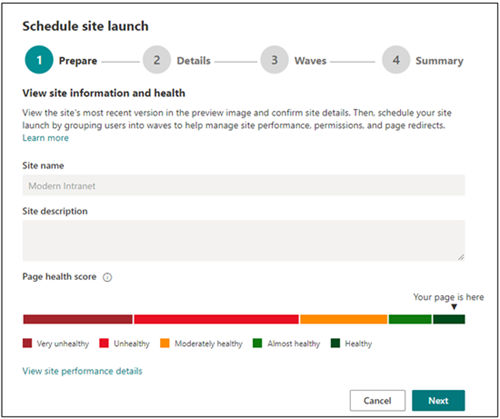

# <a name="launch-your-portal-using-the-sharepoint-portal-launch-scheduler"></a>Starten Des Portals mithilfe des SharePoint Portal-Startplaners

Ein Portal ist eine SharePoint Kommunikationswebsite in Ihrem Intranet mit hohem Datenverkehr – eine Website, die über mehrere Wochen zwischen 10.000 und über 100.000 Besucher verfügt. Verwenden Sie den Portal-Startplaner, um Ihr Portal zu starten, um sicherzustellen, dass Benutzer beim Zugriff auf Ihr neues SharePoint Portal eine reibungslose Anzeige haben.
<br>
<br>
Der Portal-Startplaner soll Ihnen dabei helfen, einen schrittweisen Rollout-Ansatz zu verfolgen, indem Sie Viewer in Wellen stapeln und die URL-Umleitungen für das neue Portal verwalten. Während des Starts jeder Phase können Sie Benutzerfeedback sammeln, die Portalleistung überwachen und den Start anhalten, um Probleme zu beheben, bevor Sie mit der nächsten Welle fortfahren. Erfahren Sie mehr darüber, wie Sie [einen Portalstart in SharePoint planen.](/microsoft-365/Enterprise/Planportallaunchroll-out?view=o365-worldwide) 

**Es gibt zwei Arten von Umleitungen:**

- **Bidirektional:** Starten Eines neuen modernen SharePoint-Portals, um ein vorhandenes SharePoint klassischen oder modernen Portal zu ersetzen
- **Umleiten zu einer temporären Seite:** Starten eines neuen modernen SharePoint-Portals ohne vorhandenes SharePoint Portal

Websiteberechtigungen müssen im Rahmen des Starts separat von Wellen eingerichtet werden. Wenn Sie z. B. ein organisationsweites Portal veröffentlichen, können Sie Berechtigungen auf "Jeder außer externen Benutzern" festlegen und ihre Benutzer dann mithilfe von Sicherheitsgruppen in Wellen aufteilen. Das Hinzufügen einer Sicherheitsgruppe zu einer Welle gibt dieser Sicherheitsgruppe keinen Zugriff auf die Website. 


> [!NOTE]
> - Dieses Feature ist ab Mai 2021 über den **Bereich Einstellungen** auf der Startseite von SharePoint Kommunikationswebsites für Kunden mit gezielter Veröffentlichung verfügbar und wird ab Juli 2021 für alle Kunden verfügbar sein.
> - Die PowerShell-Version dieses Tools ist heute verfügbar.
> - Dieses Feature kann nur auf modernen SharePoint Kommunikationswebsites verwendet werden.
> - Sie müssen über Websitebesitzerberechtigungen verfügen, damit die Website den Start eines Portals anpassen und planen kann.
> - Starts müssen mindestens sieben Tage im Voraus geplant sein, und jede Welle kann ein bis sieben Tage dauern.
> - Die Anzahl der erforderlichen Wellen wird automatisch durch die erwartete Anzahl von Benutzern bestimmt. 
> - Vor dem Planen eines Portalstarts muss die [Seitendiagnose für SharePoint](https://aka.ms/perftool) Tool ausgeführt werden, um sicherzustellen, dass die Startseite der Website fehlerfrei ist.
> - Am Ende des Starts können alle Benutzer mit Berechtigungen für die Website auf die neue Website zugreifen.
> - Wenn Ihre Organisation [Viva Connections](https://docs.microsoft.com/SharePoint/viva-connections)verwendet, wird benutzern möglicherweise das Symbol Ihrer Organisation in der Microsoft Teams App-Leiste angezeigt. Wenn das Symbol ausgewählt ist, können Benutzer jedoch erst auf das Portal zugreifen, wenn ihre Welle gestartet wurde.
> - Dieses Feature ist nicht für Office 365 Deutschland, Office 365 betrieben von 21Vianet (China) oder Microsoft 365 Plänen der US-Regierung verfügbar.

### <a name="understand-the-differences-between-portal-launch-scheduler-options"></a>Grundlegendes zu den Unterschieden zwischen den Optionen des Portal-Startplaners:

Früher konnten Portalstarts nur über SharePoint PowerShell geplant werden. Jetzt stehen Ihnen zwei Optionen zur Verfügung, mit denen Sie den Start Ihres Portals planen und verwalten können. Erfahren Sie mehr über die wichtigsten Unterschiede zwischen beiden Tools:

**SharePoint PowerShell-Version:**

- Administratoranmeldeinformationen sind erforderlich, um [SharePoint PowerShell](https://docs.microsoft.com/powershell/sharepoint/sharepoint-online/introduction-sharepoint-online-management-shell?view=sharepoint-ps) zu verwenden. 
- Mindestanforderung einer Welle 
- Planen des Starts basierend auf der Utc-Zeitzone (Coordinated Universal Time)

**Produktinterne Version:**

- Anmeldeinformationen des Websitebesitzers sind erforderlich 
- Mindestanforderung von zwei Wellen
- Planen Des Starts basierend auf der lokalen Zeitzone des Portals, wie in den regionalen Einstellungen angegeben


## <a name="get-started-using-the-portal-launch-scheduler"></a>Erste Schritte mit dem Portal-Startplaner

1.  Bevor Sie das Portal-Startplanungstool verwenden, [fügen Sie alle Benutzer, die Zugriff auf diese Website benötigen,](https://support.microsoft.com/office/share-a-site-958771a8-d041-4eb8-b51c-afea2eae3658) über **Websiteberechtigungen** als Websitebesitzer, Websitemitglied oder Besucher hinzu.

2.  Beginnen Sie dann mit der Planung des Starts Ihres Portals, indem Sie auf zwei Arten auf den Portal-Startplaner zugreifen:

    **Option 1:** Die ersten Male, in denen Sie Änderungen an Ihrer Startseite bearbeiten und erneut veröffentlichen – oder bis zur Startseite, Version 3.0 – werden Sie aufgefordert, das Portal-Startplanungstool zu verwenden. Wählen Sie **"Start planen"** aus, um mit der Planung vorwärts zu gehen. Oder wählen Sie **Erneut veröffentlichen,** um Ihre Seitenbearbeitungen erneut zu veröffentlichen, ohne den Start zu planen.
    
    
    
    **Option 2:** Sie können jederzeit zur Startseite der SharePoint Kommunikationswebsite navigieren, **Einstellungen** auswählen und dann den **Websitestart planen,** um den Start Ihres Portals zu planen.
    
    

3.  Bestätigen Sie als Nächstes die Integritätsbewertung des Portals, und nehmen Sie bei Bedarf Verbesserungen am Portal vor, indem Sie das Tool ["Seitendiagnose für SharePoint"](https://aka.ms/perftool) verwenden, bis Ihr Portal eine **fehlerfreie** Bewertung erhält. Wählen Sie dann **"Weiter"** aus.

    
       
    > [!NOTE] 
    > Der Websitename und die Beschreibung können nicht über den Portal-Startplaner bearbeitet werden und können stattdessen geändert werden, indem **Sie Einstellungen** und dann **Websiteinformationen** auf der Startseite auswählen.
 
4.  Wählen Sie in der Dropdownliste die **Anzahl der erwarteten Benutzer** aus. Diese Abbildung zeigt die Anzahl der Benutzer, die wahrscheinlich Zugriff auf die Website benötigen. Der Portal-Startplaner bestimmt automatisch die ideale Anzahl von Wellen, abhängig von den erwarteten Benutzern wie folgt:
    
    - Weniger als 10.000 Benutzer: Zwei Wellen
    - 10.000 bis 30.000 Benutzer: Drei Wellen 
    - 30.000+ bis 100.000 Benutzer: Fünf Wellen
    - Mehr als 100.000 Benutzer: Fünf Phasen, und wenden Sie sich über die schritte im Startportal mit mehr als 100.000 Benutzern an Microsoft. 

5.  Ermitteln Sie dann den typ der benötigten **Umleitung:**

    **Option 1: Senden von Benutzern an eine vorhandene SharePoint Seite (bidirektional)** – Verwenden Sie diese Option beim Starten eines neuen modernen SharePoint-Portals, um ein vorhandenes SharePoint-Portal zu ersetzen. Benutzer in aktiven Phasen werden zur neuen Website umgeleitet, unabhängig davon, ob sie zur alten oder neuen Website navigieren. Benutzer in einer nicht gestarteten Welle, die versuchen, auf die neue Website zuzugreifen, werden zurück zur alten Website umgeleitet, bis ihre Welle gestartet wird.
    
    > [!NOTE] 
    > Bei Verwendung der bidirektionalen Option muss die Person, die den Start plant, auch über Berechtigungen des Websitebesitzers für das andere SharePoint Portal verfügen.
       
    **Option 2: Senden von Benutzern an eine automatisch generierte temporäre Seite (temporäre Seitenumleitung)** – Verwenden Sie eine temporäre Seitenumleitung, wenn kein vorhandenes SharePoint-Portal vorhanden ist. Benutzer werden zu einem neuen modernen SharePoint-Portal geleitet, und wenn sich ein Benutzer in einer Welle befindet, die nicht gestartet wurde, werden sie zu einer temporären Seite umgeleitet.
    
    **Option 3: Senden von Benutzern an eine externe Seite** – Geben Sie eine externe URL zu einer temporären Startseite an, bis die Welle des Benutzers gestartet wird.
    
6.  Teilen Sie Ihre Zielgruppe in Wellen auf. Fügen Sie bis zu 20 Sicherheitsgruppen pro Welle hinzu. Wave-Details können bis zum Start jeder Welle bearbeitet werden. Jede Welle kann mindestens einen Tag (24 Stunden) und höchstens sieben Tage dauern. Auf diese Weise können SharePoint und Ihre technische Umgebung sich an die große Anzahl von Websitebenutzern gewöhnen und skalieren. Bei der Planung eines Starts über die Benutzeroberfläche basiert die Zeitzone auf den regionalen Einstellungen der Website. 

    >[!NOTE] 
    > - Der Portal-Startplaner wird standardmäßig auf mindestens 2 Wellen festgelegt. Die PowerShell-Version dieses Tools lässt jedoch eine Welle zu.
    >  - Microsoft 365 Gruppen werden von dieser Version des Portalstartplaners nicht unterstützt.

7. Bestimmen Sie, wer die Website sofort anzeigen muss, und geben Sie ihre Informationen in das **Feld "Benutzer" ein, das vom Wellenfeld ausgenommen ist.** Diese Benutzer werden von den Wellen ausgeschlossen und nicht vor, während oder nach dem Start umgeleitet.

    >[!NOTE]
    > Es können bis zu 50 unterschiedliche Benutzer oder Sicherheitsgruppen hinzugefügt werden. Verwenden Sie Sicherheitsgruppen, wenn Sie mehr als 50 Personen benötigen, um Zugriff auf das Portal zu erhalten, bevor die Wellen gestartet werden. 

8.  Bestätigen Sie die Startdetails des Portals, und wählen Sie **"Zeitplan"** aus. Nachdem der Start geplant wurde, müssen alle Änderungen an der Startseite des SharePoint Portals ein fehlerfreies Diagnoseergebnis erhalten, bevor der Start des Portals fortgesetzt wird.

### <a name="launch-a-portal-with-over-100k-users"></a>Starten eines Portals mit mehr als 100.000 Benutzern

Wenn Sie planen, ein Portal mit mehr als 100.000 Benutzern zu starten, senden Sie eine Supportanfrage gemäß den unten aufgeführten Schritten. Achten Sie darauf, alle angeforderten Informationen einzuschließen.

**Führen Sie die folgenden Schritte aus:**
1. Wechseln Sie zu https://admin.microsoft.com.
2. Stellen Sie sicher, dass Sie die neue Admin Center-Vorschau verwenden
3. Wählen Sie im linken Navigationsbereich **"Support"** und dann **"Neue Serviceanfrage"** aus.

   Damit wird der Bereich **Benötigen Sie Hilfe?** auf der rechten Seite des Bildschirms aktiviert.

4. Wenn **Sie Ihr Problem kurz beschreiben** möchten, geben Sie "Start SharePoint Portal mit 100.000 Benutzern" ein.</br>
5. Wählen Sie dann **"Support kontaktieren"** aus.
6. Geben Sie unter **"Beschreibung"** den Eintrag "Start SharePoint Portal mit 100.000 Benutzern" ein.
7. Füllen Sie die verbleibenden Informationen aus, und wählen Sie dann **"Kontakt"** aus.
8. Stellen Sie nach der Erstellung des Tickets sicher, dass Sie dem Supportmitarbeiter folgende Informationen mitteilen:
   - Portal-URLs 
   - Erwartete Anzahl von Benutzern
   - Geschätzter Startplan

## <a name="make-changes-to-a-scheduled-portal-launch"></a>Vornehmen von Änderungen an einem geplanten Start eines Portals

Startdetails können für jede Welle bis zum Datum des Starts der Welle bearbeitet werden. 

1.  Navigieren Sie zum Bearbeiten der Startdetails des Portals zu **Einstellungen,** und wählen Sie **"Websitestart planen"** aus.
2.  Wählen Sie dann **Bearbeiten** aus.
3.  Wenn Sie die Bearbeitung abgeschlossen haben, wählen Sie **Aktualisieren** aus.


## <a name="delete-a-scheduled-portal-launch"></a>Löschen eines geplanten Portalstarts

Mit dem Portal-Startplanungstool geplante Starts können jederzeit abgebrochen oder gelöscht werden, auch wenn einige Phasen bereits gestartet wurden.

1.  Um den Start Ihres Portals abzubrechen, navigieren Sie zu **Einstellungen** und **planen Sie den Websitestart.**

2.  Wählen Sie dann **"Löschen"** und dann, wenn die folgende Meldung angezeigt wird, erneut **"Löschen"** aus.

    


## <a name="use-the-powershell-portal-launch-scheduler"></a>Verwenden des PowerShell-Portal-Startplaners

Das Tool SharePoint Portal-Startplanung war ursprünglich nur über [SharePoint PowerShell](https://docs.microsoft.com/powershell/sharepoint/sharepoint-online/introduction-sharepoint-online-management-shell?view=sharepoint-ps) verfügbar und wird weiterhin über PowerShell für Kunden unterstützt, die diese Methode bevorzugen. Die gleichen Hinweise zu Beginn dieses Artikels gelten für beide Versionen des Portal-Startplaners. 

>[!NOTE]
> Sie benötigen Administratorberechtigungen, um SharePoint PowerShell verwenden zu können.
> Portalstartdetails für in PowerShell erstellte Starts werden angezeigt und können im neuen Portal-Startplanungstool in SharePoint verwaltet werden.


### <a name="app-setup-and-connecting-to-sharepoint-online"></a>Einrichten von Apps und Herstellen einer Verbindung mit SharePoint Online
1. [Neueste Microsoft Office SharePoint Online-Verwaltungsshell herunterladen](https://go.microsoft.com/fwlink/p/?LinkId=255251).

    > [!NOTE]
    > Wenn Sie eine frühere Version der Microsoft Office SharePoint Online-Verwaltungsshell installiert haben, gehen Sie zu Programme hinzufügen oder entfernen und deinstallieren Sie "SharePoint Online-Verwaltungsshell".<br>Wählen Sie auf der Seite Download Center Ihre Sprache aus, und klicken Sie dann auf „Herunterladen“. Wählen Sie eine x64- oder eine x86-MSI-Datei aus. Laden Sie die x64-Datei herunter, wenn Sie mit der 64-Bit-Version von Windows arbeiten, oder die x86-Datei, wenn Sie mit der 32-Bit-Version arbeiten. Wenn Sie sich nicht sicher sind, ziehen Sie [Welche Version des Windows-Betriebssystems verwende ich?](https://support.microsoft.com/help/13443/windows-which-operating-system) zurate. Nachdem die Sie die Datei heruntergeladen haben, führen Sie die Datei aus und folgen Sie den Schritten im Setup-Assistenten.

2. Stellen Sie eine Verbindung zu Microsoft Office SharePoint Online als [Globaler Admin oder Microsoft Office SharePoint Online-Admin](/sharepoint/sharepoint-admin-role) in Microsoft 365 her. Eine Anleitung dazu finden Sie unter [Erste Schritte mit der Microsoft Office SharePoint Online-Verwaltungsshell](/powershell/sharepoint/sharepoint-online/connect-sharepoint-online).


### <a name="view-any-existing-portal-launch-setups"></a>Anzeigen vorhandener Portalstartsetups

So überprüfen Sie, ob es vorhandene Portalstartkonfigurationen gibt:

   ```PowerShell
   Get-SPOPortalLaunchWaves -LaunchSiteUrl <object> -DisplayFormat <object>
   ```

### <a name="schedule-a-portal-launch-on-the-site"></a>Planen eines Portalstarts auf der Website

Die Anzahl der erforderlichen Wellen hängt von der erwarteten Startgröße ab. 
- Weniger als 10.000 Benutzer: eine Welle
- 10.000 bis 30.000 Benutzer: Drei Wellen 
- 30.000+ bis 100.000 Benutzer: Fünf Wellen
- Mehr als 100.000 Benutzer: Fünf Phasen, und wenden Sie sich an Ihr Microsoft-Kontoteam.

#### <a name="steps-for-bidirectional-redirection"></a>Schritte für die bidirektionale Umleitung

Bidirektionale Umleitung umfasst das Starten eines neuen modernen SharePoint Online-Portals, um ein vorhandenes SharePoint klassischen oder modernen Portal zu ersetzen. Benutzer in aktiven Phasen werden zur neuen Website umgeleitet, unabhängig davon, ob sie zur alten oder neuen Website navigieren. Benutzer in einer nicht gestarteten Welle, die versuchen, auf die neue Website zuzugreifen, werden zurück zur alten Website umgeleitet, bis ihre Welle gestartet wird. 

Wir unterstützen nur die Umleitung zwischen der Standardhomepage auf der alten Website und der Standardstartseite auf der neuen Website. Wenn Sie Administratoren oder Besitzer haben, die Zugriff auf die alten und neuen Websites benötigen, ohne umgeleitet zu werden, stellen Sie sicher, dass sie mithilfe des Parameters aufgeführt `WaveOverrideUsers` werden.

So migrieren Sie Benutzer auf mehrstufige Weise von einer vorhandenen SharePoint-Website zu einer neuen SharePoint Website:

1. Führen Sie den folgenden Befehl aus, um Portalstart-Wellen festzulegen.
   
   ```PowerShell
   New-SPOPortalLaunchWaves -LaunchSiteUrl <object> -RedirectionType Bidirectional -RedirectUrl <string> -ExpectedNumberOfUsers <object> -WaveOverrideUsers <object> -Waves <object>
   ```

   Beispiel:

   ```PowerShell
   New-SPOPortalLaunchWaves -LaunchSiteUrl "https://contoso.sharepoint.com/teams/newsite" -RedirectionType Bidirectional -RedirectUrl "https://contoso.sharepoint.com/teams/oldsite" -ExpectedNumberOfUsers 10kTo30kUsers -WaveOverrideUsers "admin@contoso.com" -Waves ' 
   [{Name:"Wave 1", Groups:["Viewers 1"], LaunchDateUtc:"2020/10/14"}, 
   {Name:"Wave 2", Groups:["Viewers 2"], LaunchDateUtc:"2020/10/15"}, 
   {Name:"Wave 3", Groups:["Viewers 3"], LaunchDateUtc:"2020/10/16"}]'
   ```

2. Vollständige Überprüfung. Es kann 5 bis 10 Minuten dauern, bis die Umleitung die Konfiguration für den gesamten Dienst abgeschlossen hat. 

#### <a name="steps-for-redirection-to-temporary-page"></a>Schritte für die Umleitung zu einer temporären Seite

Die temporäre Seitenumleitung sollte verwendet werden, wenn kein vorhandenes SharePoint-Portal vorhanden ist. Benutzer werden auf mehrstufige Weise zu einem neuen modernen SharePoint Onlineportal geleitet. Wenn sich ein Benutzer in einer Welle befindet, die nicht gestartet wurde, wird er zu einer temporären Seite (beliebige URL) umgeleitet. 

1. Führen Sie den folgenden Befehl aus, um Portalstart-Wellen festzulegen.
   
   ```PowerShell
   New-SPOPortalLaunchWaves -LaunchSiteUrl <object> -RedirectionType ToTemporaryPage -RedirectUrl <string> -ExpectedNumberOfUsers <object> -WaveOverrideUsers <object> -Waves <object>
   ```

   Beispiel:

   ```PowerShell
   New-SPOPortalLaunchWaves -LaunchSiteUrl "https://contoso.sharepoint.com/teams/newsite" -RedirectionType ToTemporaryPage -RedirectUrl "https://portal.contoso.com/UnderConstruction.aspx" -ExpectedNumberOfUsers 10kTo30kUsers -WaveOverrideUsers "admin@contoso.com" -Waves ' 
   [{Name:"Wave 1", Groups:["Viewers 1"], LaunchDateUtc:"2020/10/14"}, 
   {Name:"Wave 2", Groups:["Viewers 2"], LaunchDateUtc:"2020/10/15"}, 
   {Name:"Wave 3", Groups:["Viewers 3"], LaunchDateUtc:"2020/10/16"}]'
   ```

2. Vollständige Überprüfung. Es kann 5 bis 10 Minuten dauern, bis die Umleitung die Konfiguration für den gesamten Dienst abgeschlossen hat. 

### <a name="pause-or-restart-a-portal-launch-on-the-site"></a>Anhalten oder Neustarten eines Portalstarts auf der Website

1. Führen Sie den folgenden Befehl aus, um den Start eines Portals anzuhalten und vorübergehend zu verhindern, dass anstehende Welle-Progressionen auftreten:

   ```PowerShell
   Set-SPOPortalLaunchWaves -Status Pause - LaunchSiteUrl <object>
   ```

2. Überprüfen Sie, ob alle Benutzer zur alten Website umgeleitet werden. 

3. Führen Sie den folgenden Befehl aus, um einen angehaltenen Portalstart neu zu starten:

   ```PowerShell
   Set-SPOPortalLaunchWaves -Status Restart - LaunchSiteUrl <object>
   ```
   
4. Überprüfen Sie, ob die Umleitung jetzt wiederhergestellt wurde. 

### <a name="delete-a-portal-launch-on-the-site"></a>Löschen eines Portalstarts auf der Website

1. Führen Sie den folgenden Befehl aus, um ein Geplantes oder laufendes Starten eines Portals für eine Website zu löschen.

   ```PowerShell
   Remove-SPOPortalLaunchWaves -LaunchSiteUrl <object>
   ```

2. Überprüfen Sie, ob keine Umleitung für alle Benutzer erfolgt.

## <a name="learn-more"></a>Weitere Informationen

[Planen des Rolloutplans ihres Portals in SharePoint Online](./planportallaunchroll-out.md)

[Planen Ihrer Kommunikationswebsite](https://support.microsoft.com/office/plan-your-sharepoint-communication-site-35d9adfe-d5cc-462f-a63a-bae7f2529182)
