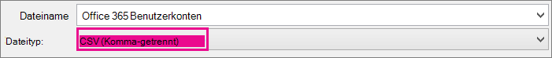

# <a name="add-several-users-at-the-same-time-to-microsoft-365---admin-help"></a><span data-ttu-id="a09a0-105">Hinzufügen mehrerer Benutzer gleichzeitig zu Microsoft 365 - Administratorhilfe</span><span class="sxs-lookup"><span data-stu-id="a09a0-105">Add several users at the same time to Microsoft 365 - Admin Help</span></span>

<span data-ttu-id="a09a0-106">Jede Person in Ihrem Team benötigt ein Benutzerkonto, bevor sie sich anmelden und auf Microsoft 365, z. B. E-Mails und Office.</span><span class="sxs-lookup"><span data-stu-id="a09a0-106">Each person on your team needs a user account before they can sign in and access Microsoft 365 services, such as email and Office.</span></span> <span data-ttu-id="a09a0-107">Wenn das Team viele Personen umfasst, können Sie deren Konten aus einer Excel-Tabelle oder einer anderen, im CSV-Format gespeicherten, Datei gleichzeitig hinzufügen.</span><span class="sxs-lookup"><span data-stu-id="a09a0-107">If you have a lot of people, you can add their accounts all at once from an Excel spreadsheet or other file saved in CSV format.</span></span> <span data-ttu-id="a09a0-108">[Nicht sicher, welches CSV-Format ist?](add-several-users-at-the-same-time.md#not-sure-what-csv-format-is)</span><span class="sxs-lookup"><span data-stu-id="a09a0-108">[Not sure what CSV format is](add-several-users-at-the-same-time.md#not-sure-what-csv-format-is)?</span></span>
  
> [!NOTE]
> <span data-ttu-id="a09a0-109">Wenn Sie das neue Microsoft 365 Admin Center nicht verwenden, können Sie es aktivieren, indem Sie den Umschalter **Das neue Admin Center** am oberen Rand der Startseite auswählen.</span><span class="sxs-lookup"><span data-stu-id="a09a0-109">If you're not using the new Microsoft 365 admin center, you can turn it on by selecting the **Try the new admin center** toggle located at the top of the Home page.</span></span>

## <a name="add-multiple-users-in-the-microsoft-365-admin-center"></a><span data-ttu-id="a09a0-110">Hinzufügen mehrerer Benutzer im Microsoft 365 Admin Center</span><span class="sxs-lookup"><span data-stu-id="a09a0-110">Add multiple users in the Microsoft 365 admin center</span></span>

1. <span data-ttu-id="a09a0-111">Melden Sie sich mit Ihrem Geschäfts- oder Schulkonto bei Microsoft 365 an.</span><span class="sxs-lookup"><span data-stu-id="a09a0-111">Sign in to Microsoft 365 with your work or school account.</span></span>

2. <span data-ttu-id="a09a0-112">Wählen Sie im Admin Center **Benutzer** \> **Aktive Benutzer** aus.</span><span class="sxs-lookup"><span data-stu-id="a09a0-112">In the admin center, choose **Users** \> **Active users**.</span></span>

3. <span data-ttu-id="a09a0-113">Wählen **Sie Mehrere Benutzer hinzufügen aus.**</span><span class="sxs-lookup"><span data-stu-id="a09a0-113">Select **Add multiple users**.</span></span>

4. <span data-ttu-id="a09a0-114">Im Bereich **Mehrere Benutzer importieren** können Sie eine CSV-Beispieldatei mit oder ohne eingetragene Beispieldaten optional herunterladen.</span><span class="sxs-lookup"><span data-stu-id="a09a0-114">On the **Import multiple users** panel, you can optionally download a sample CSV file with or without sample data filled in.</span></span>

    <span data-ttu-id="a09a0-115">Ihre **Kalkulationstabelle** muss die exakt gleichen Spaltenüberschriften wie die erste Beispielüberschrift (Benutzername, Vorname und so weiter) enthalten.</span><span class="sxs-lookup"><span data-stu-id="a09a0-115">Your spreadsheet needs to include the **exact same column headings** as the sample one (User Name, First Name, and so on).</span></span> <span data-ttu-id="a09a0-116">Wenn Sie die Vorlage verwenden, öffnen Sie sie in einem Textbearbeitungstool, z. B. Editor, und erwägen Sie, alle Daten in Zeile 1 allein zu lassen und nur Daten in den Zeilen 2 und darunter ein eingeben.</span><span class="sxs-lookup"><span data-stu-id="a09a0-116">If you use the template, open it in a text editing tool, like Notepad, and consider leaving all the data in row 1 alone, and only entering data in rows 2 and below.</span></span>

    <span data-ttu-id="a09a0-117">Darüber hinaus muss Ihre Tabelle für jeden Benutzer Werte für den Benutzernamen (wie "berend@contoso.com") und einen Anzeigenamen (wie "Berend Klein") enthalten.</span><span class="sxs-lookup"><span data-stu-id="a09a0-117">Your spreadsheet also needs to include values for the user name (like bob@contoso.com) and a display name (like Bob Kelly) for each user.</span></span>

  ```
  User Name,First Name,Last Name,Display Name,Job Title,Department,Office Number,Office Phone,Mobile Phone,Fax,Address,City,State or Province,ZIP or Postal Code,Country or Region
  chris@contoso.com,Chris,Green,Chris Green,IT Manager,Information Technology,123451,123-555-1211,123-555-6641,123-555-6700,1 Microsoft way,Redmond,Wa,98052,United States
  ben@contoso.com,Ben,Andrews,Ben Andrews,IT Manager,Information Technology,123452,123-555-1212,123-555-6642,123-555-6700,1 Microsoft way,Redmond,Wa,98052,United States
  david@contoso.com,David,Longmuir,David Longmuir,IT Manager,Information Technology,123453,123-555-1213,123-555-6643,123-555-6700,1 Microsoft way,Redmond,Wa,98052,United States
  cynthia@contoso.com,Cynthia,Carey,Cynthia Carey,IT Manager,Information Technology,123454,123-555-1214,123-555-6644,123-555-6700,1 Microsoft way,Redmond,Wa,98052,United States
  melissa@contoso.com,Melissa,MacBeth,Melissa MacBeth,IT Manager,Information Technology,123455,123-555-1215,123-555-6645,123-555-6700,1 Microsoft way,Redmond,Wa,98052,United States
  
  ```

5. <span data-ttu-id="a09a0-118">Geben Sie in dem Feld einen Dateipfad ein, oder wählen Sie **Durchsuchen** aus, um zum Speicherort der CSV-Datei zu navigieren. Wählen Sie dann **Überprüfen** aus.</span><span class="sxs-lookup"><span data-stu-id="a09a0-118">Enter a file path into the box, or choose **Browse** to browse to the CSV file location, then choose **Verify**.</span></span>
  
    <span data-ttu-id="a09a0-p104">Wenn es Probleme mit der Datei gibt, wird eine entsprechende Meldung angezeigt. Sie können auch eine Protokolldatei herunterladen.</span><span class="sxs-lookup"><span data-stu-id="a09a0-p104">If there are problems with the file, the problem is displayed in the panel. You can also download a log file.</span></span>

6. <span data-ttu-id="a09a0-121">Im Dialogfeld **Benutzeroptionen festlegen** können Sie den Anmeldestatus festlegen und die Produktlizenz auswählen, die allen Benutzern zugewiesen werden soll.</span><span class="sxs-lookup"><span data-stu-id="a09a0-121">On the **Set user options** dialog you can set the sign-in status and choose the product license that will be assigned to all users.</span></span>

7. <span data-ttu-id="a09a0-122">Im Dialogfeld **Ergebnisse anzeigen** können Sie auswählen, ob die Ergebnisse an Sie selbst oder an andere Benutzer (Kennwörter im Nur-Text-Format) gesendet werden sollen. Außerdem können Sie sehen, wie viele Benutzer erstellt wurden und ob Sie weitere Lizenzen erwerben müssen, um sie einigen der neuen Benutzer zuzuweisen.</span><span class="sxs-lookup"><span data-stu-id="a09a0-122">On the **View your result** dialog you can choose to send the results to either yourself or other users (passwords will be in plain text) and you can see how many users were created, and if you need to purchase more licenses to assign to some of the new users.</span></span>

## <a name="next-steps"></a><span data-ttu-id="a09a0-123">Nächste Schritte</span><span class="sxs-lookup"><span data-stu-id="a09a0-123">Next steps</span></span>

- <span data-ttu-id="a09a0-124">Nachdem diese Personen über Konten verfügen, müssen sie herunterladen und installieren oder neu installieren Microsoft 365 oder [Office 2016](https://support.office.com/article/4414eaaf-0478-48be-9c42-23adc4716658)auf einem PC oder Mac .</span><span class="sxs-lookup"><span data-stu-id="a09a0-124">Now that these people have accounts, they need to [Download and install or reinstall Microsoft 365 or Office 2016 on a PC or Mac](https://support.office.com/article/4414eaaf-0478-48be-9c42-23adc4716658).</span></span> <span data-ttu-id="a09a0-125">Jede Person in Ihrem Team kann Microsoft 365 auf bis zu 5 PCs oder Macs installieren.</span><span class="sxs-lookup"><span data-stu-id="a09a0-125">Each person on your team can install Microsoft 365 on up to 5 PCs or Macs.</span></span>

- <span data-ttu-id="a09a0-126">Jede Person kann auch Office Apps und E-Mails auf einem [mobilen](https://support.office.com/article/7dabb6cb-0046-40b6-81fe-767e0b1f014f) Gerät auf bis zu 5 Tablets und 5 Smartphones einrichten, z. B. iPhones, iPads und Android-Smartphones und -Tablets.</span><span class="sxs-lookup"><span data-stu-id="a09a0-126">Each person can also [Set up Office apps and email on a mobile device](https://support.office.com/article/7dabb6cb-0046-40b6-81fe-767e0b1f014f) on up to 5 tablets and 5 phones, such as iPhones, iPads, and Android phones and tablets.</span></span> <span data-ttu-id="a09a0-127">Hiermit können Office-Dateien von praktisch überall aus bearbeitet werden.</span><span class="sxs-lookup"><span data-stu-id="a09a0-127">This way they can edit Office files from anywhere.</span></span>

    <span data-ttu-id="a09a0-128">Eine [End-to-End-Liste](https://support.office.com/article/6a3a29a0-e616-4713-99d1-15eda62d04fa) der Setupschritte finden Sie unter Einrichten von Microsoft 365 Business.</span><span class="sxs-lookup"><span data-stu-id="a09a0-128">See [Set up Microsoft 365 for business](https://support.office.com/article/6a3a29a0-e616-4713-99d1-15eda62d04fa) for an end-to-end list of the setup steps.</span></span>

## <a name="more-information-about-how-to-add-users-to-microsoft-365"></a><span data-ttu-id="a09a0-129">Weitere Informationen zum Hinzufügen von Benutzern zu Microsoft 365</span><span class="sxs-lookup"><span data-stu-id="a09a0-129">More information about how to add users to Microsoft 365</span></span>

### <a name="not-sure-what-csv-format-is"></a><span data-ttu-id="a09a0-130">Was ist eine CSV-Datei?</span><span class="sxs-lookup"><span data-stu-id="a09a0-130">Not sure what CSV format is?</span></span>

<span data-ttu-id="a09a0-p107">Eine CSV-Datei ist eine Datei mit durch Kommas getrennten Werten. Sie können eine Datei wie diese mit einem beliebigen Text-Editor oder Tabellenkalkulationsprogramm wie beispielsweise Excel erstellen oder bearbeiten.</span><span class="sxs-lookup"><span data-stu-id="a09a0-p107">A CSV file is a file with comma separated values. You can create or edit a file like this with any text editor or spreadsheet program, such as Excel.</span></span>
  
<span data-ttu-id="a09a0-133">Sie können diese [Beispielkalkulationstabelle](https://www.microsoft.com/download/details.aspx?id=45485) als Ausgangspunkt herunterladen.</span><span class="sxs-lookup"><span data-stu-id="a09a0-133">You can download [this sample spreadsheet](https://www.microsoft.com/download/details.aspx?id=45485) as a starting point.</span></span> <span data-ttu-id="a09a0-134">Denken Sie daran Microsoft 365 spaltenüberschriften in der ersten Zeile erforderlich sind, damit Sie sie nicht durch etwas anderes ersetzen.</span><span class="sxs-lookup"><span data-stu-id="a09a0-134">Remember that Microsoft 365 requires column headings in the first row so don't replace them with something else.</span></span> 
  
<span data-ttu-id="a09a0-135">Speichern Sie die Datei unter einem neuen Namen, und geben Sie das Format "CSV" an.</span><span class="sxs-lookup"><span data-stu-id="a09a0-135">Save the file with a new name, and specify CSV format.</span></span>
  

  
<span data-ttu-id="a09a0-p109">Beim Speichern der Datei werden Sie wahrscheinlich darüber informiert, dass einige Features in Ihrer Arbeitsmappe verloren gehen, wenn Sie die Datei im CSV-Format speichern. Dies geht in Ordnung. Klicken Sie auf **Ja**, um den Vorgang fortzusetzen.</span><span class="sxs-lookup"><span data-stu-id="a09a0-p109">When you save the file, you'll probably get a prompt that some features in your workbook will be lost if you save the file in CSV format. This is okay. Click **Yes** to continue.</span></span>
  

  
### <a name="tips-for-formatting-your-spreadsheet"></a><span data-ttu-id="a09a0-141">Tipps zum Formatieren Ihrer Tabelle</span><span class="sxs-lookup"><span data-stu-id="a09a0-141">Tips for formatting your spreadsheet</span></span>

- <span data-ttu-id="a09a0-142">**Benötige ich dieselben Spaltenüberschriften wie in der Beispieltabelle?**</span><span class="sxs-lookup"><span data-stu-id="a09a0-142">**Do I need the same column headings as in the sample spreadsheet?**</span></span> <span data-ttu-id="a09a0-143">Ja.</span><span class="sxs-lookup"><span data-stu-id="a09a0-143">Yes.</span></span> <span data-ttu-id="a09a0-144">Die erste Zeile der Beispieltabelle enthält die Spaltenüberschriften.</span><span class="sxs-lookup"><span data-stu-id="a09a0-144">The sample spreadsheet contains column headings in the first row.</span></span> <span data-ttu-id="a09a0-145">Diese Überschriften sind erforderlich.</span><span class="sxs-lookup"><span data-stu-id="a09a0-145">These headings are required.</span></span> <span data-ttu-id="a09a0-146">Erstellen Sie für jeden Benutzer, den Microsoft 365 hinzufügen möchten, eine Zeile unter der Überschrift.</span><span class="sxs-lookup"><span data-stu-id="a09a0-146">For each user you want to add to Microsoft 365, create a row under the heading.</span></span> <span data-ttu-id="a09a0-147">Wenn Sie spaltenüberschriften hinzufügen, ändern oder löschen, Microsoft 365 benutzer aus den Informationen in der Datei möglicherweise nicht erstellt werden können.</span><span class="sxs-lookup"><span data-stu-id="a09a0-147">If you add, change, or delete any of the column headings, Microsoft 365 might not be able to create users from the information in the file.</span></span>

- <span data-ttu-id="a09a0-p111">**Was kann ich tun, wenn ich nicht über alle Informationen verfüge, die bei jedem Benutzer erforderlich sind?** Der Benutzername und der Anzeigename sind unbedingt erforderlich; Sie können keinen neuen Benutzer ohne diese Angaben hinzufügen. Falls Ihnen einige der anderen Informationen fehlen, wie beispielsweise das Fax, können Sie ein Leerzeichen plus das von Ihnen verwendete Trennzeichen eingeben und so festlegen, dass das Feld leer bleiben soll.</span><span class="sxs-lookup"><span data-stu-id="a09a0-p111">**What if I don't have all the information required for each user?** The user name and display name are required, and you cannot add a new user without this information. If you don't have some of the other information, such as the fax, you can use a space plus a comma to indicate that the field should remain blank.</span></span>

- <span data-ttu-id="a09a0-151">**Wie klein oder groß kann die Kalkulationstabelle sein?**</span><span class="sxs-lookup"><span data-stu-id="a09a0-151">**How small or large can the spreadsheet be?**</span></span> <span data-ttu-id="a09a0-152">Die Kalkulationstabelle muss mindestens zwei Zeilen enthalten.</span><span class="sxs-lookup"><span data-stu-id="a09a0-152">The spreadsheet must have at least two rows.</span></span> <span data-ttu-id="a09a0-153">One is for the column headings (the user data column label) and one for the user.</span><span class="sxs-lookup"><span data-stu-id="a09a0-153">One is for the column headings (the user data column label) and one for the user.</span></span> <span data-ttu-id="a09a0-154">You cannot have more than 251 rows.</span><span class="sxs-lookup"><span data-stu-id="a09a0-154">You cannot have more than 251 rows.</span></span> <span data-ttu-id="a09a0-155">If you need to import more than 250 users, you can create more than one spreadsheet.</span><span class="sxs-lookup"><span data-stu-id="a09a0-155">If you need to import more than 250 users, you can create more than one spreadsheet.</span></span>

- <span data-ttu-id="a09a0-156">**Welche Sprachen kann ich verwenden?**</span><span class="sxs-lookup"><span data-stu-id="a09a0-156">**What languages can I use?**</span></span> <span data-ttu-id="a09a0-157">Beim Erstellen der Kalkulationstabelle können Sie Benutzerdatenspaltenbeschriftungen in beliebigen Sprachen oder Zeichen eingeben, aber Sie dürfen die Reihenfolge der Bezeichnungen nicht ändern, wie im Beispiel gezeigt.</span><span class="sxs-lookup"><span data-stu-id="a09a0-157">When you create your spreadsheet, you can enter user data column labels in any language or characters, but you must not change the order of the labels, as shown in the sample.</span></span> <span data-ttu-id="a09a0-158">You can then make entries into the fields, using any language or characters, and save your file in a Unicode or UTF-8 format.</span><span class="sxs-lookup"><span data-stu-id="a09a0-158">You can then make entries into the fields, using any language or characters, and save your file in a Unicode or UTF-8 format.</span></span>

- <span data-ttu-id="a09a0-p114">**Was geschieht, wenn ich Benutzer aus verschiedenen Ländern oder Regionen hinzufüge?** Erstellen Sie eine separate Tabelle für jeden Bereich. Sie müssen den Assistenten "Massenhinzufügung von Benutzern" mit jeder Tabelle schrittweise durchlaufen. Geben Sie dabei einen einzigen Standort für alle Benutzer an, die in der Datei, mit der Sie arbeiten, enthalten sind.</span><span class="sxs-lookup"><span data-stu-id="a09a0-p114">**What if I'm adding users from different countries or regions?** Create a separate spreadsheet for each area. You'll need to step through the Bulk add users wizard which each spreadsheet, giving a single location of all users included in the file that you're working with.</span></span>

- <span data-ttu-id="a09a0-p115">**Bestehen Beschränkungen bei der Anzahl der Zeichen, die ich verwenden kann?** Die folgende Tabelle zeigt die Beschriftungen für Benutzerdatenspalten sowie die maximale Zeichenanzahl für jedes Element der Beispieltabelle.</span><span class="sxs-lookup"><span data-stu-id="a09a0-p115">**Is there a limit to the number of characters I can use?** The following table shows the user data column labels and the maximum character length for each in the sample spreadsheet.</span></span>

|<span data-ttu-id="a09a0-164">**Beschriftung für Benutzerdatenspalte**</span><span class="sxs-lookup"><span data-stu-id="a09a0-164">**User data column label**</span></span>|<span data-ttu-id="a09a0-165">**Maximale Zeichenanzahl**</span><span class="sxs-lookup"><span data-stu-id="a09a0-165">**Maximum character length**</span></span>|
|:-----|:-----|
|<span data-ttu-id="a09a0-166">Benutzername (erforderlich)</span><span class="sxs-lookup"><span data-stu-id="a09a0-166">User Name (Required)</span></span>  <br/> |<span data-ttu-id="a09a0-167">79, einschließlich des At-Zeichens (@), im Format name@domain. \<extension\> .</span><span class="sxs-lookup"><span data-stu-id="a09a0-167">79 including the at sign (@), in the format name@domain.\<extension\>.</span></span> <span data-ttu-id="a09a0-168">Der Alias des Benutzers darf 50 Zeichen nicht überschreiten, und der Domänenname darf 48 Zeichen nicht überschreiten.</span><span class="sxs-lookup"><span data-stu-id="a09a0-168">The user's alias cannot exceed 50 characters, and the domain name cannot exceed 48 characters.</span></span>  <br/> |
|<span data-ttu-id="a09a0-169">Vorname</span><span class="sxs-lookup"><span data-stu-id="a09a0-169">First Name</span></span>  <br/> |<span data-ttu-id="a09a0-170">64</span><span class="sxs-lookup"><span data-stu-id="a09a0-170">64</span></span>  <br/> |
|<span data-ttu-id="a09a0-171">Nachname</span><span class="sxs-lookup"><span data-stu-id="a09a0-171">Last Name</span></span>  <br/> |<span data-ttu-id="a09a0-172">64</span><span class="sxs-lookup"><span data-stu-id="a09a0-172">64</span></span>  <br/> |
|<span data-ttu-id="a09a0-173">Anzeigename (erforderlich)</span><span class="sxs-lookup"><span data-stu-id="a09a0-173">Display Name (required)</span></span>  <br/> |<span data-ttu-id="a09a0-174">256</span><span class="sxs-lookup"><span data-stu-id="a09a0-174">256</span></span>  <br/> |
|<span data-ttu-id="a09a0-175">Position</span><span class="sxs-lookup"><span data-stu-id="a09a0-175">Job Title</span></span>  <br/> |<span data-ttu-id="a09a0-176">64</span><span class="sxs-lookup"><span data-stu-id="a09a0-176">64</span></span>  <br/> |
|<span data-ttu-id="a09a0-177">Abteilung</span><span class="sxs-lookup"><span data-stu-id="a09a0-177">Department</span></span>  <br/> |<span data-ttu-id="a09a0-178">64</span><span class="sxs-lookup"><span data-stu-id="a09a0-178">64</span></span>  <br/> |
|<span data-ttu-id="a09a0-179">Büronummer</span><span class="sxs-lookup"><span data-stu-id="a09a0-179">Office Number</span></span>  <br/> |<span data-ttu-id="a09a0-180">128</span><span class="sxs-lookup"><span data-stu-id="a09a0-180">128</span></span>  <br/> |
|<span data-ttu-id="a09a0-181">Rufnummer</span><span class="sxs-lookup"><span data-stu-id="a09a0-181">Office Phone</span></span>  <br/> |<span data-ttu-id="a09a0-182">64</span><span class="sxs-lookup"><span data-stu-id="a09a0-182">64</span></span>  <br/> |
|<span data-ttu-id="a09a0-183">Mobiltelefon</span><span class="sxs-lookup"><span data-stu-id="a09a0-183">Mobile Phone</span></span>  <br/> |<span data-ttu-id="a09a0-184">64</span><span class="sxs-lookup"><span data-stu-id="a09a0-184">64</span></span>  <br/> |
|<span data-ttu-id="a09a0-185">Fax</span><span class="sxs-lookup"><span data-stu-id="a09a0-185">Fax</span></span>  <br/> |<span data-ttu-id="a09a0-186">64</span><span class="sxs-lookup"><span data-stu-id="a09a0-186">64</span></span>  <br/> |
|<span data-ttu-id="a09a0-187">Adresse</span><span class="sxs-lookup"><span data-stu-id="a09a0-187">Address</span></span>  <br/> |<span data-ttu-id="a09a0-188">1023</span><span class="sxs-lookup"><span data-stu-id="a09a0-188">1023</span></span>  <br/> |
|<span data-ttu-id="a09a0-189">Ort</span><span class="sxs-lookup"><span data-stu-id="a09a0-189">City</span></span>  <br/> |<span data-ttu-id="a09a0-190">128</span><span class="sxs-lookup"><span data-stu-id="a09a0-190">128</span></span>  <br/> |
|<span data-ttu-id="a09a0-191">Bundesland oder Kanton</span><span class="sxs-lookup"><span data-stu-id="a09a0-191">State or Province</span></span>  <br/> |<span data-ttu-id="a09a0-192">128</span><span class="sxs-lookup"><span data-stu-id="a09a0-192">128</span></span>  <br/> |
|<span data-ttu-id="a09a0-193">PLZ</span><span class="sxs-lookup"><span data-stu-id="a09a0-193">ZIP or Postal Code</span></span>  <br/> |<span data-ttu-id="a09a0-194">40</span><span class="sxs-lookup"><span data-stu-id="a09a0-194">40</span></span>  <br/> |
|<span data-ttu-id="a09a0-195">Land oder Region</span><span class="sxs-lookup"><span data-stu-id="a09a0-195">Country or Region</span></span>  <br/> |<span data-ttu-id="a09a0-196">128</span><span class="sxs-lookup"><span data-stu-id="a09a0-196">128</span></span>  <br/> |

### <a name="still-having-problems-when-adding-users-to-microsoft-365"></a><span data-ttu-id="a09a0-197">Weiterhin Probleme beim Hinzufügen von Benutzern zu Microsoft 365?</span><span class="sxs-lookup"><span data-stu-id="a09a0-197">Still having problems when adding users to Microsoft 365?</span></span>

- <span data-ttu-id="a09a0-p117">**Überprüfen Sie sorgfältig, ob die Tabelle richtig formatiert wurde.** Überprüfen Sie, ob die Spaltenüberschriften mit den Überschriften in der Beispieldatei übereinstimmen. Vergewissern Sie sich, dass Sie die Regeln für die maximale Zeichenanzahl eingehalten haben und dass jedes Feld durch ein Trennzeichen getrennt ist.</span><span class="sxs-lookup"><span data-stu-id="a09a0-p117">**Double-check that the spreadsheet is formatted correctly.** Check the column headings to make sure they match the headings in the sample file. Make sure you're following the rules for character lengths and that each field is separated by a comma.</span></span>

- <span data-ttu-id="a09a0-201">**Wenn die neuen Benutzer nicht sofort in Microsoft 365 werden, warten Sie einige Minuten.**</span><span class="sxs-lookup"><span data-stu-id="a09a0-201">**If you don't see the new users in Microsoft 365 right away, wait a few minutes.**</span></span> <span data-ttu-id="a09a0-202">Es kann einige Zeit dauern, bis Änderungen über alle Dienste in Microsoft 365.</span><span class="sxs-lookup"><span data-stu-id="a09a0-202">It can take a little while for changes to go across all the services in Microsoft 365.</span></span> 

## <a name="related-articles"></a><span data-ttu-id="a09a0-203">Verwandte Artikel</span><span class="sxs-lookup"><span data-stu-id="a09a0-203">Related articles</span></span>

[<span data-ttu-id="a09a0-204">Hinzufügen von Benutzern einzeln oder in Massen zu Microsoft 365</span><span class="sxs-lookup"><span data-stu-id="a09a0-204">Add users individually or in bulk to Microsoft 365</span></span>](/office365/admin/add-users/add-users)