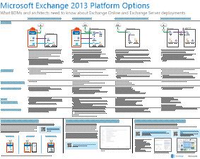

# Architekturmodelle für SharePoint, Exchange, Skype for Business und Lync

Die IT-Poster in diesem Artikel beschreiben die Architekturmodelle und Bereitstellungsoptionen für SharePoint, Exchange, Skype for Business und lync. Sie bieten auch Entwurfsinformationen für die Bereitstellung von SharePoint in Microsoft Azure.
  
Mithilfe von Microsoft 365 können Sie vertraute Zusammenarbeit und Kommunikationsdienste über die Cloud bereitstellen. Mit einigen wenigen Ausnahmen bleibt die Benutzererfahrung gleich, unabhängig davon, ob Sie eine lokale Bereitstellung oder die Verwendung von Microsoft 365 verwalten. 

Diese einheitliche Benutzeroberfläche erschwert die Entscheidung, wo jede Arbeitsauslastung platziert werden soll. Außerdem werden Fragen aufgeworfen:
  
- Wie wählen Sie eine Plattform für einzelne Arbeitslasten aus?
    
- Ist es sinnvoll, Dienste lokal beizubehalten?
    
- In welchem Szenario ist eine hybridbereitstellung angemessen?
    
- Wie passt Azure in das Bild?
    
- Welche Konfigurationen von Office Server-Arbeitsauslastungen werden von Azure unterstützt?
    
> [!TIP]
> Die meisten Poster in diesem Artikel stehen in mehreren Sprachen zur Verfügung. Die verfügbaren Sprachen sind Chinesisch, Englisch, Französisch, Deutsch, Italienisch, Japanisch, Koreanisch, Portugiesisch, Russisch und Spanisch. Wenn Sie ein Poster in einer dieser Sprachen herunterladen möchten, wählen Sie unter dem Miniaturbild des Posters **Weitere Sprachen** aus.
  
Teilen Sie uns Ihre Meinung mit! Senden Sie uns eine E-Mail an [cloudadopt@microsoft.com](mailto:cloudadopt@microsoft.com). 
  
Verwenden Sie die folgenden Links, um die von Ihnen benötigten Poster zu erhalten:
  
- **Architekturmodelle** : Verwenden Sie diese Ressourcen, um die ideale Plattform und Konfiguration für SharePoint 2016 und Skype for Business 2015 zu bestimmen.
    
  - [Architekturmodelle für Microsoft SharePoint 2016](architectural-models-for-sharepoint-exchange-skype-for-business-and-lync.md#SP2016_ArchModel)
    
  - [SharePoint Server 2016-Datenbanken](architectural-models-for-sharepoint-exchange-skype-for-business-and-lync.md#SP2016_Databases)
    
  - [Microsoft Skype for Business 2015 Architekturmodelle](architectural-models-for-sharepoint-exchange-skype-for-business-and-lync.md#SfB2015_ArchModel)
    
- **Plattform** : Verwenden Sie diese Ressourcen, um die ideale Plattform und Konfiguration für SharePoint 2013, Exchange 2013 und lync 2013 zu bestimmen.
    
  - [SharePoint 2013 Plattformoptionen](architectural-models-for-sharepoint-exchange-skype-for-business-and-lync.md#SP2013_Options)
    
  - [Exchange 2013 Plattformoptionen](architectural-models-for-sharepoint-exchange-skype-for-business-and-lync.md#Exch2013_options)
    
  - [Lync 2013 Plattformoptionen](architectural-models-for-sharepoint-exchange-skype-for-business-and-lync.md#Lync2013_Options)
    
- **SharePoint Server 2013 in Azure** : Verwenden Sie diese IT-Poster, um SharePoint Server 2013 Arbeitslasten in Azure-Infrastrukturdiensten zu entwerfen und zu konfigurieren.
    
  - [Internet Websites in Azure mit SharePoint Server 2013](architectural-models-for-sharepoint-exchange-skype-for-business-and-lync.md#Azure_sharepoint2013)
    
  - [Entwurfsbeispiel: Internet Websites in Azure für SharePoint 2013](architectural-models-for-sharepoint-exchange-skype-for-business-and-lync.md#DesignSampleInternetSites)
    
  - [SharePoint-Notfallwiederherstellung in Azure](architectural-models-for-sharepoint-exchange-skype-for-business-and-lync.md#sharepoint_recovery_Azure)
    
## Poster zu Architekturmodellen

Die IT-Poster für SharePoint 2016 und Skype for Business 2015 bieten eine Möglichkeit, Bereitstellungsmethoden in einem einfach zu druckbaren Format zu vergleichen. Auf den Postern werden alle Konfigurations-oder Plattformoptionen aufgelistet. Sie stellen für jede Option die folgenden Informationen bereit:
  
- **Übersicht** : eine kurze Zusammenfassung der Plattform, einschließlich eines konzeptionellen Diagramms.
    
- **Am besten für** : Häufige Szenarien, die für die Plattform ideal geeignet sind.
    
- **Lizenzanforderungen** : die Lizenzen, die Sie für die Bereitstellung benötigen.
    
- **Architekturaufgaben** : die Entscheidungen, die Sie als Architekt treffen müssen.
    
- **IT pro-Aufgaben oder-Zuständigkeiten** : die täglichen Aufgaben, die Ihre IT-Mitarbeiter planen müssen.
    

### Microsoft SharePoint Server 2016-Architekturmodelle

|Element|Beschreibung|
|---|---|
|[          ](https://www.microsoft.com/download/details.aspx?id=52650)   [PDF](https://download.microsoft.com/download/4/F/A/4FA0F94B-EE2F-41DB-A047-D9864FEF41E9/SharePoint2016ArchitecturalModels.pdf)  \| [Visio](https://download.microsoft.com/download/4/F/A/4FA0F94B-EE2F-41DB-A047-D9864FEF41E9/SharePoint2016ArchitecturalModels.vsdx)  \| [Weitere Sprachen](https://www.microsoft.com/download/details.aspx?id=52650)|In diesem IT-Poster werden die lokalen Konfigurationen für SharePoint Online, Azure und SharePoint beschrieben, die von Geschäfts Entscheidungsträgern und Lösungsarchitekten benötigt werden.    - **SharePoint Online (SaaS)** : nutzen Sie SharePoint über ein SaaS-Abonnementmodell (Software as a Service).   - **SharePoint-Hybrid** : Sie können Ihre SharePoint-Websites und-apps in Ihrem eigenen Tempo in die Cloud umsetzen.   - **SharePoint in Azure (IaaS)** : Erweitern der lokalen Umgebung in Azure und Bereitstellen von SharePoint 2016-Servern. (Dieses Modell wird für hohe Verfügbarkeit oder Notfall Wiederherstellungsumgebungen und Entwicklungs-/Testumgebungen empfohlen.)   - **SharePoint lokal** : planen, bereitstellen, warten und Anpassen Ihrer SharePoint-Umgebung in einem Rechenzentrum, das Sie verwalten.|
   

### SharePoint Server 2016-Datenbanken

|Element|Beschreibung|
|---|---|
|   [PDF](https://download.microsoft.com/download/D/5/D/D5DC1121-8BC5-4953-834F-1B5BB03EB691/DBrefguideSPS2016_tabloid.pdf)  \| [Visio](https://download.microsoft.com/download/D/5/D/D5DC1121-8BC5-4953-834F-1B5BB03EB691/DBrefguideSPS2016_tabloid.vsdx)  \| [Weitere Sprachen](https://www.microsoft.com/download/details.aspx?id=55041)|Dieses IT-Poster ist eine Kurzübersicht für SharePoint Server 2016-Datenbanken. Für jede Datenbank werden Details angezeigt:    – Größe   – Hilfestellung zur Skalierung   – E/A-Muster   – Anforderungen     Auf der ersten Seite werden die SharePoint-Systemdatenbanken und die Dienstanwendungen mit mehreren Datenbanken angezeigt. Die zweite Seite zeigt alle Dienstanwendungen mit einzelnen Datenbanken.     Weitere Informationen finden Sie unter [Datenbanktypen und-Beschreibungen in SharePoint Server 2016](https://docs.microsoft.com/SharePoint/technical-reference/database-types-and-descriptions).|
   

### Architekturmodelle für Microsoft Skype for Business 2015

|Element|Beschreibung|
|---|---|
|   [PDF](https://download.microsoft.com/download/7/7/4/7741262C-A60D-41F7-863B-99BF5964FBFE/Skype%20for%20Business%20Architectural%20Models.pdf)  \| [Visio](https://download.microsoft.com/download/7/7/4/7741262C-A60D-41F7-863B-99BF5964FBFE/Skype%20for%20Business%20Architectural%20Models.vsd)  \| [Weitere Sprachen](https://www.microsoft.com/download/details.aspx?id=55022)|Dieses Poster beschreibt Skype for Business Online, lokale, hybride und Cloud Private Branch Exchange (Nebenstellenanlage). Außerdem wird die Integration in Exchange-und SharePoint-Konfigurationen beschrieben, die von Geschäfts Entscheidungsträgern und Lösungsarchitekten benötigt werden.    Das Poster ist für IT-Experten gedacht, um die grundlegenden Architekturmodelle zu sensibilisieren, über die Skype for Business Online und Skype for Business lokal genutzt werden können.   Beginnen Sie mit der Konfiguration, die den Anforderungen und Plänen Ihres Unternehmens am besten entspricht. Prüfen und verwenden Sie bei Bedarf andere Konfigurationen. Beispielsweise sollten Sie die Integration in Exchange und SharePoint oder eine Lösung in Anspruch nehmen, die das Microsoft Cloud-PBX-Angebot nutzt.|
   
## Poster zu Plattformoptionen 

Die IT-Poster für SharePoint 2013, Exchange 2013 und lync 2013 bieten eine Möglichkeit, die Bereitstellungsmethoden auf einen Blick zu vergleichen. Jedes Poster listet alle Konfigurationen oder Plattformoptionen auf. Für jede Option werden die folgenden Informationen bereitgestellt:
  
- **Übersicht** : eine kurze Zusammenfassung der Plattform, einschließlich eines konzeptionellen Diagramms.
    
- **Am besten für** : Häufige Szenarien, die für die Plattform ideal geeignet sind.
    
- **Lizenzanforderungen** : die Lizenzen, die Sie für die Bereitstellung benötigen.
    
- **Architekturaufgaben** : die Entscheidungen, die Sie als Architekt treffen müssen.
    
- **IT pro-Aufgaben oder-Zuständigkeiten** : die täglichen Aufgaben, die Ihre IT-Mitarbeiter planen müssen.
    

## SharePoint 2013-Plattformoptionen

|Element|Beschreibung|
|---|---|
|   [PDF](https://go.microsoft.com/fwlink/p/?LinkId=324594)  \| [Visio](https://go.microsoft.com/fwlink/p/?LinkId=324593)  \| [Weitere Sprachen](https://www.microsoft.com/download/details.aspx?id=40332)|Für geschäftliche Entscheidungsträger und Architekten zeigt dieses Poster die Plattformoptionen für SharePoint 2013, SharePoint in Microsoft 365, lokale hybridbereitstellung mit Microsoft 365, Azure und lokale Bereitstellungen. Es enthält eine Übersicht über die einzelnen Architekturen, Empfehlungen, Lizenzanforderungen und Listen von Architekten-und IT-pro-Aufgaben für jede Plattform. Das Poster zeigt verschiedene SharePoint-Lösungen auf Azure.|
   

## Exchange 2013-Plattformoptionen

|Element|Beschreibung|
|---|---|
|[          ](https://www.microsoft.com/download/details.aspx?id=42676)   [PDF](https://go.microsoft.com/fwlink/p/?LinkID=398740)  \| [Visio](https://go.microsoft.com/fwlink/p/?LinkID=398742)  \| [Weitere Sprachen](https://www.microsoft.com/download/details.aspx?id=42676)|Für Entscheidungsträger und Architekten in Unternehmen werden in diesem Poster die Plattformoptionen für Exchange 2013 beschrieben. Kunden können zwischen Exchange Online mit Microsoft 365, Hybrid Exchange, Exchange Server lokal und gehosteten Exchange auswählen. Das Poster enthält Informationen zu den einzelnen architektonischen Optionen, einschließlich der idealen Szenarien für die einzelnen, der Lizenzanforderungen und der IT pro-Verantwortlichkeiten.|
   

## Lync 2013-Plattformoptionen

|Element|Beschreibung|
|---|---|
|[          ](https://www.microsoft.com/download/details.aspx?id=41677)   [PDF](https://go.microsoft.com/fwlink/p/?LinkID=391837)  \| [Visio](https://go.microsoft.com/fwlink/p/?LinkID=391839)  \| [Weitere Sprachen](https://www.microsoft.com/download/details.aspx?id=41677)|Für Entscheidungsträger und Architekten in Unternehmen werden in diesem Poster die Plattformoptionen für lync 2013 beschrieben. Kunden können zwischen lync online mit Microsoft 365, Hybrid-lync, lync Server lokal und gehosteten lync auswählen. Das IT-Poster enthält Informationen zu den einzelnen architektonischen Optionen, einschließlich der idealen Szenarien für die jeweiligen Lizenzanforderungen und der IT pro-Verantwortlichkeiten.|
   

## Poster zu SharePoint in Azure-Lösungen

Die IT-Poster für SharePoint in Azure zeigen Azure-basierte Lösungen, die SharePoint Server 2013 verwenden.
  

### Internet Websites in Microsoft Azure mit SharePoint Server 2013

|Element|Beschreibung|
|---|---|
|[          ](https://www.microsoft.com/download/details.aspx?id=41992)   [PDF](https://go.microsoft.com/fwlink/p/?LinkId=392552)  \| [Visio](https://go.microsoft.com/fwlink/p/?LinkId=392551)  \| [Weitere Sprachen](https://www.microsoft.com/download/details.aspx?id=41992)|Dieses Poster umreißt wichtige Entwurfsaktivitäten und empfohlene Architektur für mit dem Internet verbundene Websites in Azure.     Weitere Informationen finden Sie in den folgenden Artikeln:     - [Internet Websites in Azure mit SharePoint Server 2013](internet-sites-in-microsoft-azure-using-sharepoint-server-2013.md)   - [Azure-Architekturen für SharePoint 2013](microsoft-azure-architectures-for-sharepoint-2013.md)|
   

### Internet Websites in Azure für SharePoint 2013

|Element|Beschreibung|
|---|---|
|[          ](https://www.microsoft.com/download/details.aspx?id=41991)   [PDF](https://go.microsoft.com/fwlink/p/?LinkId=392549)  \| [Visio](https://go.microsoft.com/fwlink/p/?LinkId=392548)  \| [Weitere Sprachen](https://www.microsoft.com/download/details.aspx?id=41991)|Verwenden Sie dieses Entwurfsbeispiel als Ausgangspunkt für Ihre eigene Architektur einer mit dem Internet verbundenen Website in Azure mit SharePoint Server 2013.    Weitere Informationen finden Sie in den folgenden Artikeln:     - [Internet Websites in Azure mit SharePoint Server 2013](internet-sites-in-microsoft-azure-using-sharepoint-server-2013.md)   - [Azure-Architekturen für SharePoint 2013](microsoft-azure-architectures-for-sharepoint-2013.md)|
   

### SharePoint-Notfallwiederherstellung in Microsoft Azure

|Element|Beschreibung|
|---|---|
|[          ](https://www.microsoft.com/download/details.aspx?id=41993)   [PDF](https://go.microsoft.com/fwlink/p/?LinkId=392555)  \| [Visio](https://go.microsoft.com/fwlink/p/?LinkId=392554)  \| [Weitere Sprachen](https://www.microsoft.com/download/details.aspx?id=41993)|Dieses IT-Poster stellt Architekturprinzipien für eine Notfallwiederherstellungsumgebung in Azure dar.    Weitere Informationen finden Sie in den folgenden Artikeln:     - [SharePoint Server 2013 Notfallwiederherstellung in Azure](sharepoint-server-2013-disaster-recovery-in-microsoft-azure.md)   - [Azure-Architekturen für SharePoint 2013](microsoft-azure-architectures-for-sharepoint-2013.md)|
   
## Weitere Informationen

- [Microsoft 365-Center – Lösungen und Architekturen](../solutions/solution-architecture-center.md)
  
- [Microsoft Cloud-Architekturmodelle](../solutions/cloud-architecture-models.md)
  
- [Microsoft 365 testumgebungsanleitungen](m365-enterprise-test-lab-guides.md)
  
- [Hybridlösungen](hybrid-solutions.md)

