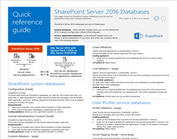

# Architekturmodelle für SharePoint, Exchange, Skype for Business und LyncArchitectural models for SharePoint, Exchange, Skype for Business, and Lync

Die IT-Poster in diesem Artikel beschreiben die Architekturmodelle und Bereitstellungsoptionen für SharePoint, Exchange, Skype for Business und lync.The IT posters in this article describe the architectural models and deployment options for SharePoint, Exchange, Skype for Business, and Lync. Sie bieten auch Entwurfsinformationen für die Bereitstellung von SharePoint in Microsoft Azure.They also provide design information for deploying SharePoint in Microsoft Azure.
  
Mithilfe von Microsoft 365 können Sie vertraute Zusammenarbeit und Kommunikationsdienste über die Cloud bereitstellen.By using Microsoft 365, you can provide familiar collaboration and communication services through the cloud. Mit einigen wenigen Ausnahmen bleibt die Benutzererfahrung gleich, unabhängig davon, ob Sie eine lokale Bereitstellung oder die Verwendung von Microsoft 365 verwalten.With a few exceptions, the user experience remains the same whether you're maintaining an on-premises deployment or using Microsoft 365. 

Diese einheitliche Benutzeroberfläche erschwert die Entscheidung, wo jede Arbeitsauslastung platziert werden soll.This unified user experience complicates the decision of where to place each workload. Außerdem werden Fragen aufgeworfen:It also raises questions:
  
- Wie wählen Sie eine Plattform für einzelne Arbeitslasten aus?How do you choose a platform for individual workloads?
    
- Ist es sinnvoll, Dienste lokal beizubehalten?Does it make sense to keep any service on-premises?
    
- In welchem Szenario ist eine hybridbereitstellung angemessen?In what scenario is a hybrid deployment appropriate?
    
- Wie passt Azure in das Bild?How does Azure fit into the picture?
    
- Welche Konfigurationen von Office Server-Arbeitsauslastungen werden von Azure unterstützt?What configurations of Office server workloads does Azure support?
    
> [!TIP]
> Die meisten Poster in diesem Artikel stehen in mehreren Sprachen zur Verfügung.Most posters in this article are available in multiple languages. Die verfügbaren Sprachen sind Chinesisch, Englisch, Französisch, Deutsch, Italienisch, Japanisch, Koreanisch, Portugiesisch, Russisch und Spanisch.Available languages include Chinese, English, French, German, Italian, Japanese, Korean, Portuguese, Russian, and Spanish. Wenn Sie ein Poster in einer dieser Sprachen herunterladen möchten, wählen Sie unter dem Miniaturbild des Posters **Weitere Sprachen** aus.To download a poster in one of these languages, under the poster thumbnail image, select **More languages**.
  
Teilen Sie uns Ihre Meinung mit!Let us know what you think! Senden Sie uns eine E-Mail an [cloudadopt@microsoft.com](mailto:cloudadopt@microsoft.com).Send us email at [cloudadopt@microsoft.com](mailto:cloudadopt@microsoft.com). 
  
Verwenden Sie die folgenden Links, um die von Ihnen benötigten Poster zu erhalten:Use the following links to get the posters you need:
  
- **Architekturmodelle** : Verwenden Sie diese Ressourcen, um die ideale Plattform und Konfiguration für SharePoint 2016 und Skype for Business 2015 zu bestimmen.**Architectural models** : Use these resources to determine your ideal platform and configuration for SharePoint 2016 and Skype for Business 2015.
    
  - [Architekturmodelle für Microsoft SharePoint 2016Microsoft SharePoint 2016 architectural models](architectural-models-for-sharepoint-exchange-skype-for-business-and-lync.md#SP2016_ArchModel)
    
  - [SharePoint Server 2016-DatenbankenSharePoint Server 2016 databases](architectural-models-for-sharepoint-exchange-skype-for-business-and-lync.md#SP2016_Databases)
    
  - [Microsoft Skype for Business 2015 ArchitekturmodelleMicrosoft Skype for Business 2015 architectural models](architectural-models-for-sharepoint-exchange-skype-for-business-and-lync.md#SfB2015_ArchModel)
    
- **Plattform** : Verwenden Sie diese Ressourcen, um die ideale Plattform und Konfiguration für SharePoint 2013, Exchange 2013 und lync 2013 zu bestimmen.**Platform** : Use these resources to determine your ideal platform and configuration for SharePoint 2013, Exchange 2013, and Lync 2013.
    
  - [SharePoint 2013 PlattformoptionenSharePoint 2013 platform options](architectural-models-for-sharepoint-exchange-skype-for-business-and-lync.md#SP2013_Options)
    
  - [Exchange 2013 PlattformoptionenExchange 2013 platform options](architectural-models-for-sharepoint-exchange-skype-for-business-and-lync.md#Exch2013_options)
    
  - [Lync 2013 PlattformoptionenLync 2013 platform options](architectural-models-for-sharepoint-exchange-skype-for-business-and-lync.md#Lync2013_Options)
    
- **SharePoint Server 2013 in Azure** : Verwenden Sie diese IT-Poster, um SharePoint Server 2013 Arbeitslasten in Azure-Infrastrukturdiensten zu entwerfen und zu konfigurieren.**SharePoint Server 2013 in Azure** : Use these IT posters to design and configure SharePoint Server 2013 workloads in Azure infrastructure services.
    
  - [Internet Websites in Azure mit SharePoint Server 2013Internet sites in Azure using SharePoint Server 2013](architectural-models-for-sharepoint-exchange-skype-for-business-and-lync.md#Azure_sharepoint2013)
    
  - [Entwurfsbeispiel: Internet Websites in Azure für SharePoint 2013Design sample: Internet sites in Azure for SharePoint 2013](architectural-models-for-sharepoint-exchange-skype-for-business-and-lync.md#DesignSampleInternetSites)
    
  - [SharePoint-Notfallwiederherstellung in AzureSharePoint disaster recovery to Azure](architectural-models-for-sharepoint-exchange-skype-for-business-and-lync.md#sharepoint_recovery_Azure)
    
## Poster zu ArchitekturmodellenArchitectural models posters

Die IT-Poster für SharePoint 2016 und Skype for Business 2015 bieten eine Möglichkeit, Bereitstellungsmethoden in einem einfach zu druckbaren Format zu vergleichen.The IT posters for SharePoint 2016 and Skype for Business 2015 provide a way to compare deployment methods in an easy-to-print format. Auf den Postern werden alle Konfigurations-oder Plattformoptionen aufgelistet.The posters list all configuration or platform options. Sie stellen für jede Option die folgenden Informationen bereit:They provide the following information for each option:
  
- **Übersicht** : eine kurze Zusammenfassung der Plattform, einschließlich eines konzeptionellen Diagramms.**Overview** : A brief summary of the platform, including a conceptual diagram.
    
- **Am besten für** : Häufige Szenarien, die für die Plattform ideal geeignet sind.**Best for** : Common scenarios that are ideally suited for the platform.
    
- **Lizenzanforderungen** : die Lizenzen, die Sie für die Bereitstellung benötigen.**License requirements** : The licenses you need for deployment.
    
- **Architekturaufgaben** : die Entscheidungen, die Sie als Architekt treffen müssen.**Architecture tasks** : The decisions you need to make as an architect.
    
- **IT pro-Aufgaben oder-Zuständigkeiten** : die täglichen Aufgaben, die Ihre IT-Mitarbeiter planen müssen.**IT pro tasks or responsibilities** : The daily responsibilities that your IT staff needs to plan for.
    

### Microsoft SharePoint Server 2016-ArchitekturmodelleMicrosoft SharePoint Server 2016 Architectural Models

|ElementItem|BeschreibungDescription|
|---|---|
|[          ](https://www.microsoft.com/download/details.aspx?id=52650)[          ](https://www.microsoft.com/download/details.aspx?id=52650)   [PDF](https://download.microsoft.com/download/4/F/A/4FA0F94B-EE2F-41DB-A047-D9864FEF41E9/SharePoint2016ArchitecturalModels.pdf)  \| [Visio](https://download.microsoft.com/download/4/F/A/4FA0F94B-EE2F-41DB-A047-D9864FEF41E9/SharePoint2016ArchitecturalModels.vsdx)  \| [Weitere Sprachen](https://www.microsoft.com/download/details.aspx?id=52650)[PDF](https://download.microsoft.com/download/4/F/A/4FA0F94B-EE2F-41DB-A047-D9864FEF41E9/SharePoint2016ArchitecturalModels.pdf)  \| [Visio](https://download.microsoft.com/download/4/F/A/4FA0F94B-EE2F-41DB-A047-D9864FEF41E9/SharePoint2016ArchitecturalModels.vsdx)  \| [More languages](https://www.microsoft.com/download/details.aspx?id=52650)|In diesem IT-Poster werden die lokalen Konfigurationen für SharePoint Online, Azure und SharePoint beschrieben, die von Geschäfts Entscheidungsträgern und Lösungsarchitekten benötigt werden.This IT poster describes the SharePoint Online, Azure, and SharePoint on-premises configurations that business decision makers and solutions architects need to know about.    - **SharePoint Online (SaaS)** : nutzen Sie SharePoint über ein SaaS-Abonnementmodell (Software as a Service).- **SharePoint Online (SaaS)** : Consume SharePoint through a software as a service (SaaS) subscription model.   - **SharePoint-Hybrid** : Sie können Ihre SharePoint-Websites und-apps in Ihrem eigenen Tempo in die Cloud umsetzen.- **SharePoint hybrid** : Move your SharePoint sites and apps to the cloud at your own pace.   - **SharePoint in Azure (IaaS)** : Erweitern der lokalen Umgebung in Azure und Bereitstellen von SharePoint 2016-Servern.- **SharePoint in Azure (IaaS)** : Extend your on-premises environment into Azure, and deploy SharePoint 2016 servers there. (Dieses Modell wird für hohe Verfügbarkeit oder Notfall Wiederherstellungsumgebungen und Entwicklungs-/Testumgebungen empfohlen.)(This model is recommended for high availability or disaster recovery environments and dev/test environments.)   - **SharePoint lokal** : planen, bereitstellen, warten und Anpassen Ihrer SharePoint-Umgebung in einem Rechenzentrum, das Sie verwalten.- **SharePoint on-premises** : Plan, deploy, maintain, and customize your SharePoint environment in a datacenter that you maintain.|
   

### SharePoint Server 2016-DatenbankenSharePoint Server 2016 Databases

|ElementItem|BeschreibungDescription|
|---|---|
|   [PDF](https://download.microsoft.com/download/D/5/D/D5DC1121-8BC5-4953-834F-1B5BB03EB691/DBrefguideSPS2016_tabloid.pdf)  \| [Visio](https://download.microsoft.com/download/D/5/D/D5DC1121-8BC5-4953-834F-1B5BB03EB691/DBrefguideSPS2016_tabloid.vsdx)  \| [Weitere Sprachen](https://www.microsoft.com/download/details.aspx?id=55041)[PDF](https://download.microsoft.com/download/D/5/D/D5DC1121-8BC5-4953-834F-1B5BB03EB691/DBrefguideSPS2016_tabloid.pdf)  \| [Visio](https://download.microsoft.com/download/D/5/D/D5DC1121-8BC5-4953-834F-1B5BB03EB691/DBrefguideSPS2016_tabloid.vsdx)  \| [More languages](https://www.microsoft.com/download/details.aspx?id=55041)|Dieses IT-Poster ist eine Kurzübersicht für SharePoint Server 2016-Datenbanken.This IT poster is a quick reference for SharePoint Server 2016 databases. Für jede Datenbank werden Details angezeigt:You'll see details for each database:    – Größe- Size   – Hilfestellung zur Skalierung- Scaling guidance   – E/A-Muster- I/O patterns   – Anforderungen- Requirements     Auf der ersten Seite werden die SharePoint-Systemdatenbanken und die Dienstanwendungen mit mehreren Datenbanken angezeigt.The first page shows the SharePoint system databases and the service applications that have multiple databases. Die zweite Seite zeigt alle Dienstanwendungen mit einzelnen Datenbanken.The second page shows all of the service applications that have single databases.     Weitere Informationen finden Sie unter [Datenbanktypen und-Beschreibungen in SharePoint Server 2016](https://docs.microsoft.com/SharePoint/technical-reference/database-types-and-descriptions).For more information, see [Database types and descriptions in SharePoint Server 2016](https://docs.microsoft.com/SharePoint/technical-reference/database-types-and-descriptions).|
   

### Architekturmodelle für Microsoft Skype for Business 2015Microsoft Skype for Business 2015 Architectural Models

|ElementItem|BeschreibungDescription|
|---|---|
|   [PDF](https://download.microsoft.com/download/7/7/4/7741262C-A60D-41F7-863B-99BF5964FBFE/Skype%20for%20Business%20Architectural%20Models.pdf)  \| [Visio](https://download.microsoft.com/download/7/7/4/7741262C-A60D-41F7-863B-99BF5964FBFE/Skype%20for%20Business%20Architectural%20Models.vsd)  \| [Weitere Sprachen](https://www.microsoft.com/download/details.aspx?id=55022)[PDF](https://download.microsoft.com/download/7/7/4/7741262C-A60D-41F7-863B-99BF5964FBFE/Skype%20for%20Business%20Architectural%20Models.pdf)  \| [Visio](https://download.microsoft.com/download/7/7/4/7741262C-A60D-41F7-863B-99BF5964FBFE/Skype%20for%20Business%20Architectural%20Models.vsd)  \| [More languages](https://www.microsoft.com/download/details.aspx?id=55022)|Dieses Poster beschreibt Skype for Business Online, lokale, hybride und Cloud Private Branch Exchange (Nebenstellenanlage).This poster describes Skype for Business Online, on-premises, hybrid, and cloud private branch exchange (PBX). Außerdem wird die Integration in Exchange-und SharePoint-Konfigurationen beschrieben, die von Geschäfts Entscheidungsträgern und Lösungsarchitekten benötigt werden.It also describes integration with Exchange and SharePoint configurations that business decision makers and solutions architects need to know about.    Das Poster ist für IT-Experten gedacht, um die grundlegenden Architekturmodelle zu sensibilisieren, über die Skype for Business Online und Skype for Business lokal genutzt werden können.The poster is intended for IT pros to raise awareness of the fundamental architectural models through which Skype for Business Online and Skype for Business on-premises can be consumed.   Beginnen Sie mit der Konfiguration, die den Anforderungen und Plänen Ihres Unternehmens am besten entspricht.Start with the configuration that best suits your organization's needs and plans. Prüfen und verwenden Sie bei Bedarf andere Konfigurationen.Consider and use other configurations as needed. Beispielsweise sollten Sie die Integration in Exchange und SharePoint oder eine Lösung in Anspruch nehmen, die das Microsoft Cloud-PBX-Angebot nutzt.For example, you might want to consider integration with Exchange and SharePoint or a solution that takes advantage of the Microsoft cloud PBX offering.|
   
## Poster zu Plattformoptionen Platform options posters

Die IT-Poster für SharePoint 2013, Exchange 2013 und lync 2013 bieten eine Möglichkeit, die Bereitstellungsmethoden auf einen Blick zu vergleichen.The IT posters for SharePoint 2013, Exchange 2013, and Lync 2013 provide a way to compare the deployment methods at a glance. Jedes Poster listet alle Konfigurationen oder Plattformoptionen auf.Each poster lists all of the configurations or platform options. Für jede Option werden die folgenden Informationen bereitgestellt:It provides the following information for each option:
  
- **Übersicht** : eine kurze Zusammenfassung der Plattform, einschließlich eines konzeptionellen Diagramms.**Overview** : A brief summary of the platform, including a conceptual diagram.
    
- **Am besten für** : Häufige Szenarien, die für die Plattform ideal geeignet sind.**Best for** : Common scenarios that are ideally suited for the platform.
    
- **Lizenzanforderungen** : die Lizenzen, die Sie für die Bereitstellung benötigen.**License requirements** : The licenses you need for deployment.
    
- **Architekturaufgaben** : die Entscheidungen, die Sie als Architekt treffen müssen.**Architecture tasks** : The decisions you need to make as an architect.
    
- **IT pro-Aufgaben oder-Zuständigkeiten** : die täglichen Aufgaben, die Ihre IT-Mitarbeiter planen müssen.**IT pro tasks or responsibilities** : The daily responsibilities that your IT staff needs to plan for.
    

## SharePoint 2013-PlattformoptionenSharePoint 2013 Platform Options

|ElementItem|BeschreibungDescription|
|---|---|
|   [PDF](https://go.microsoft.com/fwlink/p/?LinkId=324594)  \| [Visio](https://go.microsoft.com/fwlink/p/?LinkId=324593)  \| [Weitere Sprachen](https://www.microsoft.com/download/details.aspx?id=40332)[PDF](https://go.microsoft.com/fwlink/p/?LinkId=324594)  \| [Visio](https://go.microsoft.com/fwlink/p/?LinkId=324593)  \| [More languages](https://www.microsoft.com/download/details.aspx?id=40332)|Für geschäftliche Entscheidungsträger und Architekten zeigt dieses Poster die Plattformoptionen für SharePoint 2013, SharePoint in Microsoft 365, lokale hybridbereitstellung mit Microsoft 365, Azure und lokale Bereitstellungen.For business decision makers and architects, this poster shows the platform options for SharePoint 2013, SharePoint in Microsoft 365, on-premises hybrid with Microsoft 365, Azure, and on-premises-only deployments. Es enthält eine Übersicht über die einzelnen Architekturen, Empfehlungen, Lizenzanforderungen und Listen von Architekten-und IT-pro-Aufgaben für jede Plattform.It includes an overview of each architecture, recommendations, license requirements, and lists of architect and IT pro tasks for each platform. Das Poster zeigt verschiedene SharePoint-Lösungen auf Azure.The poster highlights several SharePoint solutions on Azure.|
   

## Exchange 2013-PlattformoptionenExchange 2013 Platform Options

|ElementItem|BeschreibungDescription|
|---|---|
|[          ](https://www.microsoft.com/download/details.aspx?id=42676)[          ](https://www.microsoft.com/download/details.aspx?id=42676)   [PDF](https://go.microsoft.com/fwlink/p/?LinkID=398740)  \| [Visio](https://go.microsoft.com/fwlink/p/?LinkID=398742)  \| [Weitere Sprachen](https://www.microsoft.com/download/details.aspx?id=42676)[PDF](https://go.microsoft.com/fwlink/p/?LinkID=398740)  \| [Visio](https://go.microsoft.com/fwlink/p/?LinkID=398742)  \| [More languages](https://www.microsoft.com/download/details.aspx?id=42676)|Für Entscheidungsträger und Architekten in Unternehmen werden in diesem Poster die Plattformoptionen für Exchange 2013 beschrieben.For business decision makers and architects, this poster describes the platform options for Exchange 2013. Kunden können zwischen Exchange Online mit Microsoft 365, Hybrid Exchange, Exchange Server lokal und gehosteten Exchange auswählen.Customers can choose from Exchange Online with Microsoft 365, hybrid Exchange, Exchange Server on-premises, and hosted Exchange. Das Poster enthält Informationen zu den einzelnen architektonischen Optionen, einschließlich der idealen Szenarien für die einzelnen, der Lizenzanforderungen und der IT pro-Verantwortlichkeiten.The poster details each architectural option, including the ideal scenarios for each, the license requirements, and IT pro responsibilities.|
   

## Lync 2013-PlattformoptionenLync 2013 Platform Options

|ElementItem|BeschreibungDescription|
|---|---|
|[          ](https://www.microsoft.com/download/details.aspx?id=41677)[          ](https://www.microsoft.com/download/details.aspx?id=41677)   [PDF](https://go.microsoft.com/fwlink/p/?LinkID=391837)  \| [Visio](https://go.microsoft.com/fwlink/p/?LinkID=391839)  \| [Weitere Sprachen](https://www.microsoft.com/download/details.aspx?id=41677)[PDF](https://go.microsoft.com/fwlink/p/?LinkID=391837)  \| [Visio](https://go.microsoft.com/fwlink/p/?LinkID=391839)  \| [More languages](https://www.microsoft.com/download/details.aspx?id=41677)|Für Entscheidungsträger und Architekten in Unternehmen werden in diesem Poster die Plattformoptionen für lync 2013 beschrieben.For business decision makers and architects, this poster describes the platform options for Lync 2013. Kunden können zwischen lync online mit Microsoft 365, Hybrid-lync, lync Server lokal und gehosteten lync auswählen.Customers can choose from Lync Online with Microsoft 365, hybrid Lync, Lync Server on-premises, and hosted Lync. Das IT-Poster enthält Informationen zu den einzelnen architektonischen Optionen, einschließlich der idealen Szenarien für die jeweiligen Lizenzanforderungen und der IT pro-Verantwortlichkeiten.The IT poster details each architectural option, including the ideal scenarios for each, the license requirements, and IT pro responsibilities.|
   

## Poster zu SharePoint in Azure-LösungenSharePoint in Azure solutions posters

Die IT-Poster für SharePoint in Azure zeigen Azure-basierte Lösungen, die SharePoint Server 2013 verwenden.The IT posters for SharePoint in Azure show Azure-based solutions that use SharePoint Server 2013.
  

### Internet Websites in Microsoft Azure mit SharePoint Server 2013Internet Sites in Microsoft Azure Using SharePoint Server 2013

|ElementItem|BeschreibungDescription|
|---|---|
|[          ](https://www.microsoft.com/download/details.aspx?id=41992)[          ](https://www.microsoft.com/download/details.aspx?id=41992)   [PDF](https://go.microsoft.com/fwlink/p/?LinkId=392552)  \| [Visio](https://go.microsoft.com/fwlink/p/?LinkId=392551)  \| [Weitere Sprachen](https://www.microsoft.com/download/details.aspx?id=41992)[PDF](https://go.microsoft.com/fwlink/p/?LinkId=392552)  \| [Visio](https://go.microsoft.com/fwlink/p/?LinkId=392551)  \| [More languages](https://www.microsoft.com/download/details.aspx?id=41992)|Dieses Poster umreißt wichtige Entwurfsaktivitäten und empfohlene Architektur für mit dem Internet verbundene Websites in Azure.This poster outlines key design activities and recommended architecture for internet-facing sites in Azure.     Weitere Informationen finden Sie in den folgenden Artikeln:For more information, see the following articles:     - [Internet Websites in Azure mit SharePoint Server 2013](internet-sites-in-microsoft-azure-using-sharepoint-server-2013.md)- [Internet sites in Azure using SharePoint Server 2013](internet-sites-in-microsoft-azure-using-sharepoint-server-2013.md)   - [Azure-Architekturen für SharePoint 2013](microsoft-azure-architectures-for-sharepoint-2013.md)- [Azure architectures for SharePoint 2013](microsoft-azure-architectures-for-sharepoint-2013.md)|
   

### Internet Websites in Azure für SharePoint 2013Internet sites in Azure for SharePoint 2013

|ElementItem|BeschreibungDescription|
|---|---|
|[          ](https://www.microsoft.com/download/details.aspx?id=41991)[          ](https://www.microsoft.com/download/details.aspx?id=41991)   [PDF](https://go.microsoft.com/fwlink/p/?LinkId=392549)  \| [Visio](https://go.microsoft.com/fwlink/p/?LinkId=392548)  \| [Weitere Sprachen](https://www.microsoft.com/download/details.aspx?id=41991)[PDF](https://go.microsoft.com/fwlink/p/?LinkId=392549)  \| [Visio](https://go.microsoft.com/fwlink/p/?LinkId=392548)  \| [More languages](https://www.microsoft.com/download/details.aspx?id=41991)|Verwenden Sie dieses Entwurfsbeispiel als Ausgangspunkt für Ihre eigene Architektur einer mit dem Internet verbundenen Website in Azure mit SharePoint Server 2013.Use this design sample as a starting point for your own architecture of an internet-facing site in Azure using SharePoint Server 2013.    Weitere Informationen finden Sie in den folgenden Artikeln:For more information, see the following articles:     - [Internet Websites in Azure mit SharePoint Server 2013](internet-sites-in-microsoft-azure-using-sharepoint-server-2013.md)- [Internet sites in Azure using SharePoint Server 2013](internet-sites-in-microsoft-azure-using-sharepoint-server-2013.md)   - [Azure-Architekturen für SharePoint 2013](microsoft-azure-architectures-for-sharepoint-2013.md)- [Azure architectures for SharePoint 2013](microsoft-azure-architectures-for-sharepoint-2013.md)|
   

### SharePoint-Notfallwiederherstellung in Microsoft AzureSharePoint Disaster Recovery to Microsoft Azure

|ElementItem|BeschreibungDescription|
|---|---|
|[          ](https://www.microsoft.com/download/details.aspx?id=41993)[          ](https://www.microsoft.com/download/details.aspx?id=41993)   [PDF](https://go.microsoft.com/fwlink/p/?LinkId=392555)  \| [Visio](https://go.microsoft.com/fwlink/p/?LinkId=392554)  \| [Weitere Sprachen](https://www.microsoft.com/download/details.aspx?id=41993)[PDF](https://go.microsoft.com/fwlink/p/?LinkId=392555)  \| [Visio](https://go.microsoft.com/fwlink/p/?LinkId=392554)  \| [More languages](https://www.microsoft.com/download/details.aspx?id=41993)|Dieses IT-Poster stellt Architekturprinzipien für eine Notfallwiederherstellungsumgebung in Azure dar.This IT poster shows architecture principles for a disaster recovery environment in Azure.    Weitere Informationen finden Sie in den folgenden Artikeln:For more information, see the following articles:     - [SharePoint Server 2013 Notfallwiederherstellung in Azure](sharepoint-server-2013-disaster-recovery-in-microsoft-azure.md)- [SharePoint Server 2013 disaster recovery in Azure](sharepoint-server-2013-disaster-recovery-in-microsoft-azure.md)   - [Azure-Architekturen für SharePoint 2013](microsoft-azure-architectures-for-sharepoint-2013.md)- [Azure architectures for SharePoint 2013](microsoft-azure-architectures-for-sharepoint-2013.md)|
   
## Weitere InformationenSee also

- [Microsoft 365-Center – Lösungen und ArchitekturenMicrosoft 365 solution and architecture center](../solutions/solution-architecture-center.md)
  
- [Microsoft Cloud-ArchitekturmodelleMicrosoft cloud architecture models](../solutions/cloud-architecture-models.md)
  
- [Microsoft 365 testumgebungsanleitungenMicrosoft 365 test lab guides](m365-enterprise-test-lab-guides.md)
  
- [HybridlösungenHybrid solutions](hybrid-solutions.md)

