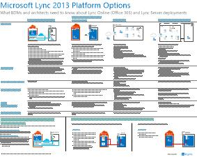

# Architekturmodelle für SharePoint, Exchange, Skype for Business und Lync

Auf diesen IT-Postern werden die Architekturmodelle und Bereitstellungsoptionen für SharePoint, Exchange, Skype for Business und Lync beschrieben und Entwurfsinformationen für die Bereitstellung von SharePoint in Microsoft Azure zur Verfügung gestellt.
  
Mit Microsoft 365 können Sie die Dienste für Zusammenarbeit und Kommunikation, mit denen Ihre Benutzern vertraut sind, als cloudbasierten Dienst bereitstellen. Mit wenigen Ausnahmen bleibt die Benutzererfahrung gleich, unabhängig davon, ob Sie eine lokale Bereitstellung beibehalten oder Microsoft 365 verwenden. Diese einheitliche Benutzeroberfläche macht es nicht ganz so einfach zu entscheiden, wo jede Verarbeitungslast platziert werden soll, und es ergeben sich Fragen wie:
  
- Wie entscheiden Sie, welche Plattform für Ihre einzelnen Verarbeitungslasten verwendet werden soll?
    
- Ist es sinnvoll, Dienste lokal beizubehalten?
    
- In welchen Szenarien ist eine Hybridbereitstellung geeignet?
    
- Wie passt Microsoft Azure ins Bild?
    
- Was sind die unterstützten Konfigurationen für Office Server-Arbeitslasten in Azure?
    
> [!TIP]
> Die meisten der Poster auf dieser Seite sind in mehreren Sprachen erhältlich, darunter Chinesisch, Englisch, Französisch, Deutsch, Italienisch, Japanisch, Koreanisch, Portugiesisch, Russisch und Spanisch. Um ein Poster in einer dieser Sprachen herunterzuladen, klicken Sie auf den Link **Weitere Sprachen** für das betreffende Poster.
  
Geben Sie uns Feedback, indem Sie eine E-Mail an [cloudadopt@microsoft.com](mailto:cloudadopt@microsoft.com) senden. 
  
Diese Seite ist mit den folgenden Postern verknüpft:
  
- **Poster zu Architekturmodellen** Sie können diese Ressourcen verwenden, um Ihre ideale Plattform und Konfiguration für SharePoint 2016 und Skype for Business 2015 zu bestimmen.
    
  - [Microsoft SharePoint 2016-Architekturmodelle](architectural-models-for-sharepoint-exchange-skype-for-business-and-lync.md#SP2016_ArchModel)
    
  - [SharePoint Server 2016-Datenbanken](architectural-models-for-sharepoint-exchange-skype-for-business-and-lync.md#SP2016_Databases)
    
  - [Architekturmodelle für Microsoft Skype for Business 2015](architectural-models-for-sharepoint-exchange-skype-for-business-and-lync.md#SfB2015_ArchModel)
    
- **Poster zu Plattformoptionen** Sie können diese Ressourcen verwenden, um Ihre ideale Plattform und Konfiguration für SharePoint 2013, Exchange 2013 und Lync 2013 zu bestimmen.
    
  - [SharePoint 2013-Plattformoptionen](architectural-models-for-sharepoint-exchange-skype-for-business-and-lync.md#SP2013_Options)
    
  - [Exchange 2013-Plattformoptionen](architectural-models-for-sharepoint-exchange-skype-for-business-and-lync.md#Exch2013_options)
    
  - [Lync 2013-Plattformoptionen](architectural-models-for-sharepoint-exchange-skype-for-business-and-lync.md#Lync2013_Options)
    
- **Poster zu SharePoint Server 2013 in Azure-Lösungen** Sie können diese IT-Poster verwenden, um den Entwurf und die Konfiguration für SharePoint Server 2013-Arbeitslasten in Azure-Infrastrukturdiensten zu bestimmen.
    
  - [Internetwebsites in Microsoft Azure mit SharePoint Server 2013](architectural-models-for-sharepoint-exchange-skype-for-business-and-lync.md#Azure_sharepoint2013)
    
  - [Entwurfsbeispiel: Internetwebsites in Microsoft Azure für SharePoint 2013](architectural-models-for-sharepoint-exchange-skype-for-business-and-lync.md#DesignSampleInternetSites)
    
  - [SharePoint-Notfallwiederherstellung in Microsoft Azure](architectural-models-for-sharepoint-exchange-skype-for-business-and-lync.md#sharepoint_recovery_Azure)
    
## Poster zu Architekturmodellen

Diese neuen IT-Poster für SharePoint 2016 und Skype for Business 2015 bieten eine Möglichkeit, die unterschiedlichen Bereitstellungsmethoden in einem einfach zu druckenden Format zu vergleichen. Jedes Poster enthält eine Liste aller zur Verfügung stehenden Konfigurationen oder Plattformoptionen und bietet Ihnen die folgenden Informationen für die einzelnen Optionen:
  
- **Übersicht** Eine kurze Zusammenfassung der Plattform, z. B. ein konzeptionelles Diagramm.
    
- **Am besten für** Gängige Szenarien, die für die jeweilige Plattform ideal geeignet sind.
    
- **Lizenzanforderungen** Die Lizenzen, die Sie für die Bereitstellung benötigen.
    
- **Architekturaufgaben** Die Entscheidungen, die Sie als Architekt treffen müssen.
    
- **IT Pro-Aufgaben und -Zuständigkeiten** Die täglichen Aufgaben, die Ihre IT-Mitarbeiter planen müssen.
    

### Microsoft SharePoint 2016-Architekturmodelle

|**Element**|**Beschreibung**|
|:-----|:-----|
|[          ](https://www.microsoft.com/download/details.aspx?id=52650)   [PDF](https://download.microsoft.com/download/4/F/A/4FA0F94B-EE2F-41DB-A047-D9864FEF41E9/SharePoint2016ArchitecturalModels.pdf)  \| [Visio](https://download.microsoft.com/download/4/F/A/4FA0F94B-EE2F-41DB-A047-D9864FEF41E9/SharePoint2016ArchitecturalModels.vsdx)  \| [Weitere Sprachen](https://www.microsoft.com/download/details.aspx?id=52650)   | Dieses IT-Poster beschreibt SharePoint Online-, Microsoft Azure- und lokale SharePoint-Konfigurationen, die Entscheidungsträger im Unternehmen und Lösungsarchitekten kennen müssen.    - **SharePoint Online (SaaS)** – Nutzen Sie SharePoint über ein SaaS-Abonnementmodell (Software as a Service).   - **SharePoint-Hybrid** – Verschieben Sie Ihre SharePoint-Websites und -Apps nach Ihrem eigenen Zeitplan in die Cloud.   - **SharePoint in Azure (IaaS)** – Sie erweitern Ihre lokale Umgebung in Microsoft Azure und stellen SharePoint 2016-Server dort bereit. (Dies wird für hohe Verfügbarkeit/Notfallwiederherstellung und Test-/Entwicklungsumgebungen empfohlen.)  - **SharePoint lokal** – Die Planung, Bereitstellung, Verwaltung und Anpassung Ihrer SharePoint-Umgebung erfolgt in einem von Ihnen verwalteten Rechenzentrum.   |
   

### SharePoint Server 2016-Datenbanken

|**Element**|**Beschreibung**|
|:-----|:-----|
|[          ](https://www.microsoft.com/download/details.aspx?id=55041)   [PDF](https://download.microsoft.com/download/D/5/D/D5DC1121-8BC5-4953-834F-1B5BB03EB691/DBrefguideSPS2016_tabloid.pdf)  \| [Visio](https://download.microsoft.com/download/D/5/D/D5DC1121-8BC5-4953-834F-1B5BB03EB691/DBrefguideSPS2016_tabloid.vsdx)  \| [Weitere Sprachen](https://www.microsoft.com/download/details.aspx?id=55041)   | Dieses IT-Poster ist eine Kurzübersicht für SharePoint Server 2016-Datenbanken. Jede Datenbank weist die folgenden Details auf:    – Größe   – Hilfestellung zur Skalierung   – E/A-Muster   – Anforderungen     Die erste Seite enthält die SharePoint-Systemdatenbanken und die Dienstanwendungen, die mehrere Datenbanken aufweisen. Auf der zweiten Seite sind alle Dienstanwendungen verzeichnet, die über Einzeldatenbanken verfügen.    Weitere Informationen zu den SharePoint Server 2016-Datenbanken finden Sie unter [Datenbanktypen und -beschreibungen in SharePoint Server 2016](https://docs.microsoft.com/SharePoint/technical-reference/database-types-and-descriptions).   |
   

### Architekturmodelle für Microsoft Skype for Business 2015

|**Element**|**Beschreibung**|
|:-----|:-----|
|[          ](https://www.microsoft.com/download/details.aspx?id=55022)   [PDF](https://download.microsoft.com/download/7/7/4/7741262C-A60D-41F7-863B-99BF5964FBFE/Skype%20for%20Business%20Architectural%20Models.pdf)  \| [Visio](https://download.microsoft.com/download/7/7/4/7741262C-A60D-41F7-863B-99BF5964FBFE/Skype%20for%20Business%20Architectural%20Models.vsd)  \| [Weitere Sprachen](https://www.microsoft.com/download/details.aspx?id=55022)   |Dieses Poster beschreibt die Konfiguration von Skype for Business Online, lokale Konfigurationen sowie Hybrid- und Cloud-PBX-Konfigurationen und deren Integration in Exchange- und SharePoint-Konfigurationen, die Entscheidungsträger im Unternehmen und Lösungsarchitekten kennen müssen.    Es richtet sich an IT-Experten und soll auf die unterschiedlichen Architekturmodelle aufmerksam machen, über die Skype for Business Online sowie eine lokale Skype for Business-Konfiguration genutzt werden können.   Beginnen Sie mit der Konfiguration, die sich optimal für die Anforderungen und Zukunftspläne Ihrer Organisation eignet. Ziehen Sie bei Bedarf andere Konfigurationen in Erwägung. Es kann beispielsweise sinnvoll sein, die Integration mit Exchange und SharePoint oder eine Lösung in Betracht zu ziehen, die das Angebot von Microsoft für eine Nebenstellenanlage in der Cloud nutzt.    |
   
## Poster zu Plattformoptionen 

Diese IT-Poster für SharePoint 2013, Exchange 2013 und Lync 2013 bieten eine Möglichkeit, die unterschiedlichen Bereitstellungsmethoden auf einen Blick auf einem großen Poster zu vergleichen. Jedes Poster enthält eine Liste aller zur Verfügung stehenden Konfigurationen oder Plattformoptionen und bietet Ihnen die folgenden Informationen für die einzelnen Optionen:
  
- **Übersicht** Eine kurze Zusammenfassung der Plattform, z. B. ein konzeptionelles Diagramm.
    
- **Am besten für** Gängige Szenarien, die für die jeweilige Plattform ideal geeignet sind.
    
- **Lizenzanforderungen** Die Lizenzen, die Sie für die Bereitstellung benötigen.
    
- **Architekturaufgaben** Die Entscheidungen, die Sie als Architekt treffen müssen.
    
- **IT Pro-Aufgaben und -Zuständigkeiten** Die täglichen Aufgaben, die Ihre IT-Mitarbeiter planen müssen.
    

## SharePoint 2013-Plattformoptionen

****

|**Element**|**Beschreibung**|
|:-----|:-----|
|[          ](https://www.microsoft.com/download/details.aspx?id=40332)   [PDF](https://go.microsoft.com/fwlink/p/?LinkId=324594)  \| [Visio](https://go.microsoft.com/fwlink/p/?LinkId=324593)  \| [Weitere Sprachen](https://www.microsoft.com/download/details.aspx?id=40332)   |Für Entscheidungsträger in Unternehmen und Architekten zeigt dieses Modell die Plattformoptionen für SharePoint 2013, SharePoint in Microsoft 365, lokale Hybridumgebungen mit Microsoft 365, Azure und reine lokale Bereitstellungen. Es enthält einen Überblick über jede Architektur, Empfehlungen, Lizenzanforderungen und Listen der Aufgaben von Architekten und IT-Experten für jede Plattform. Mehrere SharePoint-Lösungen auf Azure werden hervorgehoben.   |
   

## Exchange 2013-Plattformoptionen

****

|**Element**|**Beschreibung**|
|:-----|:-----|
|[          ](https://www.microsoft.com/download/details.aspx?id=42676)   [PDF](https://go.microsoft.com/fwlink/p/?LinkID=398740)  \| [Visio](https://go.microsoft.com/fwlink/p/?LinkID=398742)  \| [Weitere Sprachen](https://www.microsoft.com/download/details.aspx?id=42676)   |Für Entscheidungsträger in Unternehmen und Architekten beschreibt dieses Modell die verfügbaren Plattformoptionen für Exchange 2013. Kunden können zwischen Exchange Online mit Microsoft 365, hybridem Exchange, lokalem Exchange Server und gehostetem Exchange wählen. Das Poster enthält Details zu jeder Architekturoption, einschließlich der jeweils idealen Szenarios für die jeweilige Option, die Lizenzvoraussetzungen und die Zuständigkeiten von IT-Experten.   |
   

## Lync 2013-Plattformoptionen

****

|**Element**|**Beschreibung**|
|:-----|:-----|
|[          ](https://www.microsoft.com/download/details.aspx?id=41677)   [PDF](https://go.microsoft.com/fwlink/p/?LinkID=391837)  \| [Visio](https://go.microsoft.com/fwlink/p/?LinkID=391839)  \| [Weitere Sprachen](https://www.microsoft.com/download/details.aspx?id=41677)   |Für Entscheidungsträger in Unternehmen und Architekten beschreibt dieses Modell die verfügbaren Plattformoptionen für Lync 2013. Kunden können zwischen Lync Online mit Microsoft 365, hybridem Lync, lokalem Lync Server und gehostetem Lync wählen. Das IT-Poster enthält Details zu jeder Architekturoption, einschließlich der jeweils idealen Szenarios für die jeweilige Option, die Lizenzvoraussetzungen und die Zuständigkeiten von IT-Experten.    |
   

## Poster zu SharePoint in Azure-Lösungen

Auf diesen IT-Postern sind Azure-basierte Lösungen, die SharePoint Server 2013 verwenden, im Großformat dargestellt.
  

### Internetwebsites in Microsoft Azure mit SharePoint Server 2013

****

|**Element**|**Beschreibung**|
|:-----|:-----|
|[          ](https://www.microsoft.com/download/details.aspx?id=41992)   [PDF](https://go.microsoft.com/fwlink/p/?LinkId=392552)  \| [Visio](https://go.microsoft.com/fwlink/p/?LinkId=392551)  \| [Weitere Sprachen](https://www.microsoft.com/download/details.aspx?id=41992)   |Dieses Poster stellt wichtige Designaktivitäten und empfohlene Architekturentscheidungen für Websites in Azure heraus.     Weitere Informationen finden Sie in den folgenden Artikeln:     - [Internetwebsites in Microsoft Azure mit SharePoint Server 2013](internet-sites-in-microsoft-azure-using-sharepoint-server-2013.md)   - [Microsoft Azure-Architekturen für SharePoint 2013](microsoft-azure-architectures-for-sharepoint-2013.md)   |
   

### Entwurfsbeispiel: Internetwebsites in Microsoft Azure für SharePoint 2013

****

|**Element**|**Beschreibung**|
|:-----|:-----|
|[          ](https://www.microsoft.com/download/details.aspx?id=41991)   [PDF](https://go.microsoft.com/fwlink/p/?LinkId=392549)  \| [Visio](https://go.microsoft.com/fwlink/p/?LinkId=392548)  \| [Weitere Sprachen](https://www.microsoft.com/download/details.aspx?id=41991)   |Verwenden Sie dieses Designbeispiel als Ausgangspunkt für Ihre eigene Architekturwebsite in Azure mit SharePoint Server 2013.    Weitere Informationen finden Sie in den folgenden Artikeln:     - [Internetwebsites in Microsoft Azure mit SharePoint Server 2013](internet-sites-in-microsoft-azure-using-sharepoint-server-2013.md)   - [Microsoft Azure-Architekturen für SharePoint 2013](microsoft-azure-architectures-for-sharepoint-2013.md)   |
   

### SharePoint-Notfallwiederherstellung in Microsoft Azure

****

|**Element**|**Beschreibung**|
|:-----|:-----|
|[          ](https://www.microsoft.com/download/details.aspx?id=41993)   [PDF](https://go.microsoft.com/fwlink/p/?LinkId=392555)  \| [Visio](https://go.microsoft.com/fwlink/p/?LinkId=392554)  \| [Weitere Sprachen](https://www.microsoft.com/download/details.aspx?id=41993)   |Dieses IT-Poster stellt Architekturprinzipien für eine Notfallwiederherstellungsumgebung in Azure dar.    Weitere Informationen finden Sie in den folgenden Artikeln:     - [SharePoint Server 2013 – Notfallwiederherstellung in Microsoft Azure](sharepoint-server-2013-disaster-recovery-in-microsoft-azure.md)   - [Microsoft Azure-Architekturen für SharePoint 2013](microsoft-azure-architectures-for-sharepoint-2013.md)   |
   
## Siehe auch

[Microsoft 365 Lösungs- und Architektur-Center](../solutions/solution-architecture-center.md)
  
[Illustrationen zu Microsoft Cloud für Enterprise-Architekten](../solutions/cloud-architecture-models.md)
  
[Microsoft 365 Test Umgebungs Anleitungen](m365-enterprise-test-lab-guides.md)
  
[Hybridlösungen](hybrid-solutions.md)

