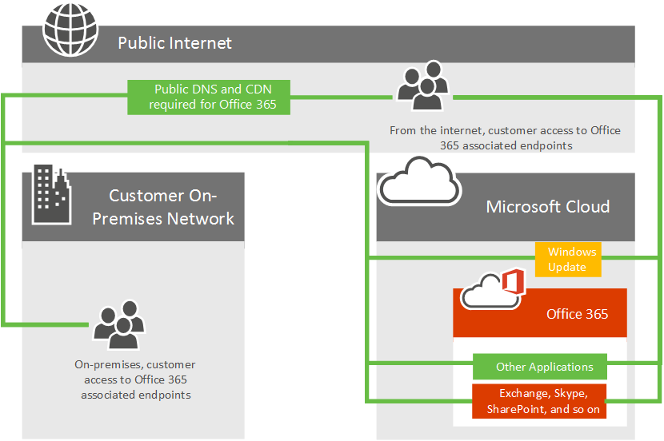

# Azure ExpressRoute für Office 365

*Dieser Artikel gilt sowohl für Microsoft 365 Enterprise als auch für Office 365 Enterprise.*

Erfahren Sie, wie Azure ExpressRoute mit Office 365 verwendet wird und wie Sie das Netzwerkimplementierungsprojekt planen, das erforderlich ist, wenn Sie Azure ExpressRoute für die Verwendung mit Office 365 bereitstellen. Infrastruktur- und Plattformdienste, die in Azure ausgeführt werden, profitieren häufig durch die Behandlung von Überlegungen zur Netzwerkarchitektur und -leistung. In diesen Fällen wird ExpressRoute für Azure empfohlen. Software as a Service-Angebote wie Office 365 und Dynamics 365 wurden so entwickelt, dass sie sicher und zuverlässig über das Internet zugegriffen werden können. Informationen zur Internetleistung und -sicherheit sowie zu Denkmöglichkeiten von Azure ExpressRoute für Office 365 finden Sie im Artikel Bewertung der [Office 365-Netzwerkkonnektivität.](assessing-network-connectivity.md)

> [!NOTE]
> Microsoft Defender for Endpoint wird in Azure Express Route nicht unterstützt.

> [!NOTE]
> Die Microsoft-Autorisierung ist erforderlich, um ExpressRoute für Office 365 zu verwenden. Microsoft überprüft jede Kundenanforderung und autorisiert expressRoute für die Office 365-Nutzung, wenn die behördliche Anforderung eines Kunden eine direkte Konnektivität vorsingt. Wenn Sie solche Anforderungen haben, wenden Sie sich bitte an Ihren Microsoft-Kontomitarbeiter, um mit einer Microsoft-Überprüfung zu beginnen. Nicht autorisierte Abonnements, die Routenfilter für Office 365 erstellen möchten, erhalten [eine Fehlermeldung.](https://support.microsoft.com/kb/3181709)

Sie können jetzt eine direkte Netzwerkverbindung zu Office 365 für ausgewählten Office 365-Netzwerkdatenverkehr hinzufügen. Azure ExpressRoute bietet eine direkte Verbindung, eine vorhersagbare Leistung und verfügt über eine Sla zu 99,95 % für die Microsoft-Netzwerkkomponenten. Sie benötigen weiterhin eine Internetverbindung für Dienste, die über Azure ExpressRoute nicht unterstützt werden.

## Planen von Azure ExpressRoute für Office 365

Zusätzlich zur Internetverbindung können Sie eine Teilmenge ihres Office 365-Netzwerkdatenverkehrs über eine direkte Verbindung routen, die Vorhersehbarkeit und eine 99,95 %-SLA für die Microsoft-Netzwerkkomponenten bietet. Azure ExpressRoute bietet Ihnen diese dedizierte Netzwerkverbindung zu Office 365 und anderen Microsoft Cloud Services.

Unabhängig davon, ob Sie über ein vorhandenes MPLS-WAN verfügen, kann ExpressRoute auf drei Arten zur Netzwerkarchitektur hinzugefügt werden. über einen unterstützten Cloud Exchange Co-Location-Anbieter, einen Ethernet-Punkt-zu-Punkt-Verbindungsanbieter oder über einen MPLS-Verbindungsanbieter. Sehen Sie [sich an, welche Anbieter in Ihrer Region verfügbar sind.](/azure/expressroute/expressroute-locations) Die direkte ExpressRoute-Verbindung ermöglicht die Konnektivität zu den Anwendungen, die unter [What Office 365 services are included? weiter](azure-expressroute.md#BKMK_WhatDoIGet) unten beschrieben sind. Der Netzwerkdatenverkehr für alle anderen Anwendungen und Dienste durchläuft weiterhin das Internet.

Sehen Sie sich das folgende Diagramm mit hoher Ebene an, das einen typischen Office 365-Kunden zeigt, der über das Internet eine Verbindung mit den Rechenzentren von Microsoft für den Zugriff auf alle Microsoft-Anwendungen wie Office 365, Windows Update und TechNet herstellen kann. Kunden verwenden einen ähnlichen Netzwerkpfad, unabhängig davon, ob sie eine Verbindung über ein lokales Netzwerk oder über eine unabhängige Internetverbindung herstellen.

Sehen Sie sich nun das aktualisierte Diagramm an, das einen Office 365-Kunden zeigt, der sowohl das Internet als auch ExpressRoute verwendet, um eine Verbindung mit Office 365 herzustellen. Beachten Sie, dass einige Verbindungen wie öffentliche DNS- und Inhaltszustellungsnetzwerkknoten weiterhin die öffentliche Internetverbindung benötigen. Beachten Sie außerdem, dass die Benutzer des Kunden, die sich nicht im verbundenen ExpressRoute-Gebäude befinden, über das Internet eine Verbindung herstellen.

Möchten Sie noch weitere Informationen? Erfahren Sie, [wie Sie Ihren Netzwerkdatenverkehr mit Azure ExpressRoute für Office 365](https://support.office.com/article/e1da26c6-2d39-4379-af6f-4da213218408) verwalten, und erfahren Sie, wie Sie Azure [ExpressRoute für Office 365 konfigurieren.](/azure/expressroute/expressroute-faqs) Wir haben auch eine 10-teilige [Azure ExpressRoute für Office 365-Schulungsreihe](https://channel9.msdn.com/series/aer) auf Kanal 9 aufgezeichnet, um die Konzepte gründlicher zu erläutern.

## Welche Office 365-Dienste sind enthalten?

In der folgenden Tabelle sind die Office 365-Dienste aufgeführt, die über ExpressRoute unterstützt werden. Lesen Sie den [Artikel Office 365-Endpunkte,](./urls-and-ip-address-ranges.md) um zu verstehen, welche Netzwerkanforderungen für diese Anwendungen eine Internetverbindung erfordern.

|**Enthaltene Anwendungen**|
|:-----|
|Exchange Online1   Exchange Online Protection1   Delve1   |
|Skype for Business Online1   Microsoft Teams 1   |
|SharePoint Online1   OneDrive for Business1   Project Online1   |
|Portal und freigegeben1   Azure Active Directory (Azure AD) 1   Azure AD Connect1   Office1   |

1 Für jede dieser Anwendungen gelten Internetkonnektivitätsanforderungen, die über ExpressRoute nicht unterstützt werden. Weitere Informationen finden Sie im [Artikel office 365-Endpunkte.](./urls-and-ip-address-ranges.md)

Die Dienste, die nicht in ExpressRoute für Office 365 enthalten sind, sind Microsoft 365 Apps for Enterprise-Clientdownloads, Lokale Identitätsanbieter-Anmeldung und Office 365-Dienst (betrieben von 21 Vianet) in China.

## Implementieren von ExpressRoute für Office 365

Die Implementierung von ExpressRoute erfordert die Beteiligung von Netzwerk- und Anwendungsbesitzern und eine sorgfältige Planung, um die neue Netzwerkroutingarchitektur, bandbreitenanforderungen, wo Sicherheit implementiert wird, hohe Verfügbarkeit und so weiter zu bestimmen. Um ExpressRoute zu implementieren, müssen Sie:

1. Verstehen Sie die Anforderungen, die ExpressRoute in Ihrer Office 365-Konnektivitätsplanung erfüllt. Verstehen Sie, welche Anwendungen das Internet oder ExpressRoute verwenden, und planen Sie Ihre Anforderungen an Netzwerkkapazität, Sicherheit und hohe Verfügbarkeit im Kontext der Verwendung des Internets und des ExpressRoute für Office 365-Datenverkehrs vollständig.

2. Ermitteln Sie die Ausgangs- und Peeringstandorte für Internet- und ExpressRoute-Datenverkehr1.

3. Ermitteln Sie die im Internet und in ExpressRoute-Verbindungen erforderliche Kapazität.

4. Verfügen Sie über einen Plan für die Implementierung von Sicherheit und anderen Standardperimetersteuerelementen1.

5. Verfügen Sie über ein gültiges Microsoft Azure-Konto, um ExpressRoute zu abonnieren.

6. Wählen Sie ein Konnektivitätsmodell und einen [genehmigten Anbieter aus.](/azure/expressroute/expressroute-locations) Denken Sie daran, dass Kunden mehrere Konnektivitätsmodelle oder Partner auswählen können, und der Partner muss nicht mit Dem vorhandenen Netzwerkanbieter identisch sein.

7. Überprüfen Sie die Bereitstellung, bevor Datenverkehr an ExpressRoute weitergeleitet wird.

8. Implementieren Sie [optional QoS,](https://support.office.com/article/ExpressRoute-and-QoS-in-Skype-for-Business-Online-20c654da-30ee-4e4f-a764-8b7d8844431d) und bewerten Sie die regionale Expansion.

1 Wichtige Leistungsüberlegungen. Entscheidungen hier können sich erheblich auf die Wartezeit auswirken, was für Anwendungen wie Skype for Business von entscheidender Bedeutung ist.

Weitere Referenzen finden Sie in unserer [Routinganleitung](https://support.office.com/article/Routing-with-ExpressRoute-for-Office-365-e1da26c6-2d39-4379-af6f-4da213218408) zusätzlich zur [ExpressRoute-Dokumentation.](/azure/expressroute/expressroute-introduction)

Wenn Sie ExpressRoute für Office 365 erwerben möchten,  müssen Sie mit einem oder mehreren genehmigten Anbietern zusammenarbeiten, um die gewünschten Nummern- und Größenkreise mit einem ExpressRoute Premium-Abonnement bereitstellen zu können. Es sind keine zusätzlichen Lizenzen für Office 365 zu erwerben.

Mit diesem kurzen Link gelangen Sie wieder hierher zurück: [https://aka.ms/expressrouteoffice365]()

Bereit für die Anmeldung für [ExpressRoute für Office 365](https://aka.ms/ert)?

## Verwandte Themen

[Bewerten der Office 365-Netzwerkkonnektivität](assessing-network-connectivity.md)

[Verwalten von ExpressRoute für Office 365-Verbindungen](managing-expressroute-for-connectivity.md)

[Routing mit ExpressRoute für Office 365](routing-with-expressroute.md)

[Netzwerkplanung mit ExpressRoute für Office 365](network-planning-with-expressroute.md)

[Implementierung von ExpressRoute für Office 365](implementing-expressroute.md)

[Verwenden von BGP-Communitys in ExpressRoute für Office 365-Szenarien](bgp-communities-in-expressroute.md)

[Medienqualität und Netzwerkverbindungsleistung in Skype for Business Online](https://support.office.com/article/5fe3e01b-34cf-44e0-b897-b0b2a83f0917)

[Office 365-Leistungsoptimierung mit Basisplänen und Leistungsverlauf](performance-tuning-using-baselines-and-history.md)

[Plan zur Problembehandlung für Office 365](performance-troubleshooting-plan.md)

[URLs und IP-Adressbereiche für Office 365](urls-and-ip-address-ranges.md)

[Office 365-Netzwerk- und Leistungsoptimierung](network-planning-and-performance.md)

## Siehe auch

[Übersicht zu Microsoft 365 Enterprise](microsoft-365-overview.md)
