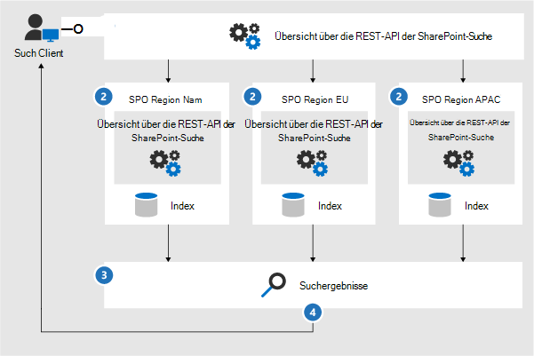
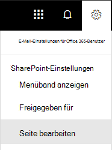

# <a name="configure-search-for-microsoft-365-multi-geo"></a><span data-ttu-id="8e4c1-104">Konfigurieren der Suche für Microsoft 365 Multi-Geo</span><span class="sxs-lookup"><span data-stu-id="8e4c1-104">Configure Search for Microsoft 365 Multi-Geo</span></span>

<span data-ttu-id="8e4c1-105">In einer Multi-Geo-Umgebung besitzt jeder geografische Standort einen eigenen Suchindex und ein Suchcenter.</span><span class="sxs-lookup"><span data-stu-id="8e4c1-105">In a multi-geo environment, each geo location has its own search index and Search Center.</span></span> <span data-ttu-id="8e4c1-106">Wenn ein Benutzer eine Suche durchführt, wird die Abfrage in alle Indizes aufgefächert, und die zurückgegebenen Ergebnisse werden zusammengeführt.</span><span class="sxs-lookup"><span data-stu-id="8e4c1-106">When a user searches, the query is fanned out to all the indexes, and the returned results are merged.</span></span>

<span data-ttu-id="8e4c1-107">Ein Benutzer an einem geografischen Standort kann zum Beispiel nach Inhalten an einem anderen Standort oder auf einer SharePoint-Website suchen, die auf einen anderen geografischen Standort eingeschränkt ist.</span><span class="sxs-lookup"><span data-stu-id="8e4c1-107">For example, a user in one geo location can search for content stored in another geo location, or for content on a SharePoint site that's restricted to a different geo location.</span></span> <span data-ttu-id="8e4c1-108">Wenn der Benutzer Zugriff auf diese Inhalte hat, liefert die Suche das Ergebnis.</span><span class="sxs-lookup"><span data-stu-id="8e4c1-108">If the user has access to this content, search will show the result.</span></span>

## <a name="which-search-clients-work-in-a-multi-geo-environment"></a><span data-ttu-id="8e4c1-109">Welche Suchclients können in einer Multi-Geo-Umgebung verwendet werden?</span><span class="sxs-lookup"><span data-stu-id="8e4c1-109">Which search clients work in a multi-geo environment?</span></span>

<span data-ttu-id="8e4c1-110">Diese Clients können von allen geografischen Standorten Ergebnisse zurückgeben:</span><span class="sxs-lookup"><span data-stu-id="8e4c1-110">These clients can return results from all geo locations:</span></span>

- <span data-ttu-id="8e4c1-111">OneDrive for Business</span><span class="sxs-lookup"><span data-stu-id="8e4c1-111">OneDrive for Business</span></span>
- <span data-ttu-id="8e4c1-112">Delve</span><span class="sxs-lookup"><span data-stu-id="8e4c1-112">Delve</span></span>
- <span data-ttu-id="8e4c1-113">Die SharePoint-Homepage</span><span class="sxs-lookup"><span data-stu-id="8e4c1-113">The SharePoint home page</span></span>
- <span data-ttu-id="8e4c1-114">Das Suchcenter</span><span class="sxs-lookup"><span data-stu-id="8e4c1-114">The Search Center</span></span>
- <span data-ttu-id="8e4c1-115">Benutzerdefinierte Suchanwendungen, die die SharePoint-Suche-API verwenden</span><span class="sxs-lookup"><span data-stu-id="8e4c1-115">Custom search applications that use the SharePoint Search API</span></span>

### <a name="onedrive-for-business"></a><span data-ttu-id="8e4c1-116">OneDrive for Business</span><span class="sxs-lookup"><span data-stu-id="8e4c1-116">OneDrive for Business</span></span>

<span data-ttu-id="8e4c1-117">Sobald die Multi-Geo-Umgebung eingerichtet wurde, erhalten Benutzer, die eine Suche in OneDrive durchführen, Ergebnisse aus allen geografischen Standorten.</span><span class="sxs-lookup"><span data-stu-id="8e4c1-117">As soon as the multi-geo environment has been set up, users that search in OneDrive get results from all geo locations.</span></span>

### <a name="delve"></a><span data-ttu-id="8e4c1-118">Delve</span><span class="sxs-lookup"><span data-stu-id="8e4c1-118">Delve</span></span>

<span data-ttu-id="8e4c1-119">Sobald die Multi-Geo-Umgebung eingerichtet wurde, erhalten Benutzer, die eine Suche in Delve durchführen, Ergebnisse aus allen geografischen Standorten.</span><span class="sxs-lookup"><span data-stu-id="8e4c1-119">As soon as the multi-geo environment has been set up, users that search in Delve get results from all geo locations.</span></span>

<span data-ttu-id="8e4c1-120">Der Delve-Feed und die Profilkarte zeigen nur eine Vorschau der Dateien an, die an dem zentralen Standort gespeichert sind.</span><span class="sxs-lookup"><span data-stu-id="8e4c1-120">The Delve feed and the profile card only show previews of files that are stored in the central location.</span></span> <span data-ttu-id="8e4c1-121">Für Dateien, die sich an Satellitenstandorten befinden, wird stattdessen das Symbol für den Dateityp angezeigt.</span><span class="sxs-lookup"><span data-stu-id="8e4c1-121">For files that are stored in satellite locations, the icon for the file type is shown instead.</span></span>

### <a name="the-sharepoint-home-page"></a><span data-ttu-id="8e4c1-122">Die SharePoint-Homepage</span><span class="sxs-lookup"><span data-stu-id="8e4c1-122">The SharePoint home page</span></span>

<span data-ttu-id="8e4c1-p105">Sobald die Multi-Geo-Umgebung eingerichtet wurde, werden Benutzern Neuigkeiten, zuletzt verwendete und gefolgte Websites von mehreren geografischen Standorten auf ihrer SharePoint-Homepage angezeigt. Wenn sie das Suchfeld auf der SharePoint-Homepage verwenden, werden die Ergebnisse aus mehreren geografischen Standorten zusammengeführt.</span><span class="sxs-lookup"><span data-stu-id="8e4c1-p105">As soon as the multi-geo environment has been set up, users will see news, recent and followed sites from multiple geo locations on their SharePoint home page. If they use the search box on the SharePoint home page, they'll get merged results from multiple geo locations.</span></span>

### <a name="the-search-center"></a><span data-ttu-id="8e4c1-125">Das Suchcenter</span><span class="sxs-lookup"><span data-stu-id="8e4c1-125">The Search Center</span></span>

<span data-ttu-id="8e4c1-p106">Sobald die Multi-Geo-Umgebung eingerichtet wurde, zeigt jedes Suchcenter weiterhin nur die Ergebnisse vom eigenen geografischen Standort an. Administratoren müssen [die Einstellungen für jedes Suchcenter ändern](#_Set_up_a_1), um Ergebnisse aus allen geografischen Standorten zu erhalten. Anschließend erhalten Benutzer, die eine Suche im Suchcenter durchführen, Ergebnisse aus allen geografischen Standorten.</span><span class="sxs-lookup"><span data-stu-id="8e4c1-p106">After the multi-geo environment has been set up, each Search Center continues to only show results from their own geo location. Admins must [change the settings of each Search Center](#_Set_up_a_1) to get results from all geo locations. Afterwards, users that search in the Search Center get results from all geo locations.</span></span>

### <a name="custom-search-applications"></a><span data-ttu-id="8e4c1-129">Benutzerdefinierte Suchanwendungen</span><span class="sxs-lookup"><span data-stu-id="8e4c1-129">Custom search applications</span></span>

<span data-ttu-id="8e4c1-p107">Wie üblich interagieren benutzerdefinierte Suchanwendungen mit den Suchindizes, indem die vorhandenen SharePoint-Suche-REST-APIs verwendet werden. Um Ergebnisse aus allen oder einigen geografischen Standorten zu erhalten, muss die Anwendung [die API aufrufen und die neuen Multi-Geo-Abfrageparameter](#_Get_custom_search) zu der Anforderung hinzufügen. Dadurch wird die Abfrage in alle geografischen Standorte aufgefächert.</span><span class="sxs-lookup"><span data-stu-id="8e4c1-p107">As usual, custom search applications interact with the search indexes by using the existing SharePoint Search REST APIs. To get results from all, or some geo locations, the application must [call the API and include the new Multi-Geo query parameters](#_Get_custom_search) in the request. This triggers a fan out of the query to all geo locations.</span></span>

## <a name="whats-different-about-search-in-a-multi-geo-environment"></a><span data-ttu-id="8e4c1-133">Welche Unterschiede gibt es bei der Suche in einer Multi-Geo-Umgebung?</span><span class="sxs-lookup"><span data-stu-id="8e4c1-133">What's different about search in a multi-geo environment?</span></span>

<span data-ttu-id="8e4c1-134">Einige Suchfunktionen, die Sie möglicherweise bereits kennen, funktionieren in einer Multi-Geo-Umgebung anders.</span><span class="sxs-lookup"><span data-stu-id="8e4c1-134">Some search features you might be familiar with, work differently in a multi-geo environment.</span></span>

<table>
<thead>
<tr class="header">
<th align="left"><span data-ttu-id="8e4c1-135"><strong>Feature</strong></span><span class="sxs-lookup"><span data-stu-id="8e4c1-135"><strong>Feature</strong></span></span></th>
<th align="left"><span data-ttu-id="8e4c1-136"><strong>Funktionsweise</strong></span><span class="sxs-lookup"><span data-stu-id="8e4c1-136"><strong>How it works</strong></span></span></th>
<th align="left"><span data-ttu-id="8e4c1-137"><strong>Problemumgehung</strong></span><span class="sxs-lookup"><span data-stu-id="8e4c1-137"><strong>Workaround</strong></span></span></th>
</tr>
</thead>
<tbody>
<tr class="odd">
<td align="left"><span data-ttu-id="8e4c1-138">Höhergestufte Ergebnisse</span><span class="sxs-lookup"><span data-stu-id="8e4c1-138">Promoted results</span></span></td>
<td align="left"><span data-ttu-id="8e4c1-139">Sie können Abfrageregeln mit höhergestuften Ergebnissen auf verschiedenen Ebenen erstellen: für den gesamten Mandanten, für eine Websitesammlung oder für eine Website.</span><span class="sxs-lookup"><span data-stu-id="8e4c1-139">You can create query rules with promoted results at different levels: for the whole tenant, for a site collection, or for a site.</span></span> <span data-ttu-id="8e4c1-140">Definieren Sie in einer Multi-Geo-Umgebung höhergestufte Ergebnisse auf der Mandantenebene, wenn die Ergebnisse in den Suchcentern an allen geografischen Standorten höhergestuft werden sollen.</span><span class="sxs-lookup"><span data-stu-id="8e4c1-140">In a multi-geo environment, define promoted results at the tenant level to promote the results to the Search Centers in all geo locations.</span></span> <span data-ttu-id="8e4c1-141">Wenn Sie nur Ergebnisse im Suchcenter, das sich am geografischen Standort der Websitesammlung oder Website befindet, höherstufen möchten, definieren Sie die höhergestuften Ergebnisse auf der Websitesammlungs- oder Websiteebene.</span><span class="sxs-lookup"><span data-stu-id="8e4c1-141">If you only want to promote results in the Search Center that's in the geo location of the site collection or site, define the promoted results at the site collection or site level.</span></span> <span data-ttu-id="8e4c1-142">Diese Ergebnisse werden nicht an anderen geografischen Standorten höhergestuft.</span><span class="sxs-lookup"><span data-stu-id="8e4c1-142">These results are not promoted in other geo locations.</span></span></td>
<td align="left"><span data-ttu-id="8e4c1-143">Wenn Sie keine unterschiedlichen höhergestuften Ergebnisse pro geografischem Standort benötigen, zum Beispiel verschiedene Regeln für Reisen, wird empfohlen, höhergestufte Ergebnisse auf Mandantenebene zu definieren.</span><span class="sxs-lookup"><span data-stu-id="8e4c1-143">If you don't need different promoted results per geo location, for example different rules for traveling, we recommend defining promoted results at the tenant level.</span></span></td>
</tr>
<tr class="even">
<td align="left"><span data-ttu-id="8e4c1-144">Sucheinschränkungen</span><span class="sxs-lookup"><span data-stu-id="8e4c1-144">Search refiners</span></span></td>
<td align="left"><span data-ttu-id="8e4c1-p109">Die Suche gibt Einschränkungen aus allen geografischen Standorten eines Mandanten zurück und aggregiert diese dann. Die Aggregation ist die beste Bemühung und bedeutet, dass die Anzahl der Einschränkungen nicht exakt 100%ig ist. Für die meisten suchgesteuerten Szenarien ist diese Genauigkeit ausreichend. </span><span class="sxs-lookup"><span data-stu-id="8e4c1-p109">Search returns refiners from all the geo locations of a tenant and then aggregates them. The aggregation is a best effort, meaning that the refiner counts might not be 100% accurate. For most search-driven scenarios, this accuracy is sufficient. </span></span></td>
<td align="left"><span data-ttu-id="8e4c1-148">Führen Sie für suchgesteuerte Anwendungen, die von der Vollständigkeit der Einschränkungen abhängig sind, eine Abfrage für jeden geografischen Standort getrennt voneinander durch.</span><span class="sxs-lookup"><span data-stu-id="8e4c1-148">For search-driven applications that depend on refiner completeness, query each geo location independently.</span></span></td>
</tr>
<tr class="odd">
<td align="left"></td>
<td align="left"><span data-ttu-id="8e4c1-149">Das dynamische Zuordnen von Buckets für numerische Einschränkungen wird von der Multi-Geo-Suche nicht unterstützt.</span><span class="sxs-lookup"><span data-stu-id="8e4c1-149">Multi-geo search doesn't support dynamic bucketing for numerical refiners.</span></span></td>
<td align="left"><span data-ttu-id="8e4c1-150">Verwenden Sie <a href="/sharepoint/dev/general-development/query-refinement-in-sharepoint">den Parameter "Discretize" für</a> numerische Einschränkungen.</span><span class="sxs-lookup"><span data-stu-id="8e4c1-150">Use the <a href="/sharepoint/dev/general-development/query-refinement-in-sharepoint">"Discretize" parameter</a> for numerical refiners.</span></span></td>
</tr>
<tr class="even">
<td align="left"><span data-ttu-id="8e4c1-151">Dokument-IDs</span><span class="sxs-lookup"><span data-stu-id="8e4c1-151">Document IDs</span></span></td>
<td align="left"><span data-ttu-id="8e4c1-152">Wenn Sie eine suchgesteuerte Anwendung entwickeln, die von Dokument-IDs abhängig ist, müssen Sie beachten, dass die Dokument-IDs in einer Multi-Geo-Umgebung nicht standortübergreifend eindeutig sind, sie sind jeweils pro Standort eindeutig.</span><span class="sxs-lookup"><span data-stu-id="8e4c1-152">If you're developing a search-driven application that depends on document IDs, note that document IDs in a multi-geo environment aren't unique across geo locations, they are unique per geo location.</span></span></td>
<td align="left"><span data-ttu-id="8e4c1-153">Es wurde eine Spalte hinzugefügt, die den geografischen Standort identifiziert.</span><span class="sxs-lookup"><span data-stu-id="8e4c1-153">We've added a column that identifies the geo location.</span></span> <span data-ttu-id="8e4c1-154">Verwenden Sie diese Spalte, um Eindeutigkeit zu erreichen.</span><span class="sxs-lookup"><span data-stu-id="8e4c1-154">Use this column to achieve uniqueness.</span></span> <span data-ttu-id="8e4c1-155">Diese Spalte heißt "GeoLocationSource".</span><span class="sxs-lookup"><span data-stu-id="8e4c1-155">This column is named "GeoLocationSource".</span></span></td>
</tr>
<tr class="odd">
<td align="left"><span data-ttu-id="8e4c1-156">Anzahl der Ergebnisse</span><span class="sxs-lookup"><span data-stu-id="8e4c1-156">Number of results</span></span></td>
<td align="left"><span data-ttu-id="8e4c1-157">Auf der Seite mit den Suchergebnissen werden die kombinierten Ergebnisse von den geografischen Standorten angezeigt, die Seite darf jedoch 500 Ergebnisse nicht überschreiten.</span><span class="sxs-lookup"><span data-stu-id="8e4c1-157">The search results page shows combined results from the geo locations, but it's not possible to page beyond 500 results.</span></span></td>
<td align="left"></td>
</tr>
<tr class="even">
<td align="left"><span data-ttu-id="8e4c1-158">Hybridsuche</span><span class="sxs-lookup"><span data-stu-id="8e4c1-158">Hybrid search</span></span></td>
<td align="left"><span data-ttu-id="8e4c1-159">In einer SharePoint-Hybridumgebung mit <a href="/sharepoint/hybrid/learn-about-cloud-hybrid-search-for-sharepoint">Cloudhybridsuche</a> werden lokale Inhalte dem Microsoft 365-Index des zentralen Standorts hinzugefügt.</span><span class="sxs-lookup"><span data-stu-id="8e4c1-159">In a hybrid SharePoint environment with <a href="/sharepoint/hybrid/learn-about-cloud-hybrid-search-for-sharepoint">cloud hybrid search</a>,  on-premises content is added to the Microsoft 365 index of the central location.</span></span></td>
<td align="left"></td>
</tr>
</tbody>
</table>

## <a name="whats-not-supported-for-search-in-a-multi-geo-environment"></a><span data-ttu-id="8e4c1-160">Was wird bei der Suche in einer Multi-Geo-Umgebung nicht unterstützt?</span><span class="sxs-lookup"><span data-stu-id="8e4c1-160">What's not supported for search in a multi-geo environment?</span></span>

<span data-ttu-id="8e4c1-161">Einige Suchfunktionen, die Sie möglicherweise bereits kennen, werden in einer Multi-Geo-Umgebung nicht unterstützt.</span><span class="sxs-lookup"><span data-stu-id="8e4c1-161">Some of the search features you might be familiar with, aren't supported in a multi-geo environment.</span></span>

<table>
<thead>
<tr class="header">
<th align="left"><span data-ttu-id="8e4c1-162"><strong>Suchfunktion</strong></span><span class="sxs-lookup"><span data-stu-id="8e4c1-162"><strong>Search feature</strong></span></span></th>
<th align="left"><span data-ttu-id="8e4c1-163"><strong>Hinweis</strong></span><span class="sxs-lookup"><span data-stu-id="8e4c1-163"><strong>Note</strong></span></span></th>
</tr>
</thead>
<tbody>
<tr class="odd">
<td align="left"><span data-ttu-id="8e4c1-164">Nur-App-Authentifizierung</span><span class="sxs-lookup"><span data-stu-id="8e4c1-164">App-only authentication</span></span></td>
<td align="left"><span data-ttu-id="8e4c1-165">Nur-App-Authentifizierung (privilegierter Zugriff von Diensten) wird bei der Multi-Geo-Suche nicht unterstützt.</span><span class="sxs-lookup"><span data-stu-id="8e4c1-165">App-only authentication (privileged access from services) isn't supported in multi-geo search.</span></span></td>
</tr>
<tr class="even">
<td align="left"><span data-ttu-id="8e4c1-166">Gastbenutzer</span><span class="sxs-lookup"><span data-stu-id="8e4c1-166">Guest users</span></span></td>
<td align="left"><span data-ttu-id="8e4c1-167">Gastbenutzer erhalten nur Ergebnisse von dem geografischen Standort, aus dem Sie die Suche durchführen.</span><span class="sxs-lookup"><span data-stu-id="8e4c1-167">Guest users only get results from the geo location that they're searching from.</span></span></td>
</tr>
</tbody>
</table>

## <a name="how-does-search-work-in-a-multi-geo-environment"></a><span data-ttu-id="8e4c1-168">Wie funktioniert die Suche in einer Multi-Geo-Umgebung?</span><span class="sxs-lookup"><span data-stu-id="8e4c1-168">How does search work in a multi-geo environment?</span></span>

<span data-ttu-id="8e4c1-169">Alle Suchclients verwenden die vorhandenen SharePoint-Suche-REST-APIs für die Interaktion mit den Suchindizes.</span><span class="sxs-lookup"><span data-stu-id="8e4c1-169">All the search clients use the existing SharePoint Search REST APIs to interact with the search indexes.</span></span>



1. <span data-ttu-id="8e4c1-171">Ein Suchclient ruft den REST-Endpunkt für die Suche mit der Abfrageeigenschaft „EnableMultiGeoSearch= true“ auf.</span><span class="sxs-lookup"><span data-stu-id="8e4c1-171">A search client calls the Search REST endpoint with the query property EnableMultiGeoSearch= true.</span></span>
2. <span data-ttu-id="8e4c1-172">Die Abfrage wird an alle geografischen Standorte im Mandanten gesendet.</span><span class="sxs-lookup"><span data-stu-id="8e4c1-172">The query is sent to all geo locations in the tenant.</span></span>
3. <span data-ttu-id="8e4c1-173">Die Suchergebnisse von jedem geografischen Standort werden zusammengeführt und bewertet.</span><span class="sxs-lookup"><span data-stu-id="8e4c1-173">Search results from each geo location are merged and ranked.</span></span>
4. <span data-ttu-id="8e4c1-174">Der Client erhält einheitliche Suchergebnisse.</span><span class="sxs-lookup"><span data-stu-id="8e4c1-174">The client gets unified search results.</span></span>

<span data-ttu-id="8e4c1-175"><span id="_Set_up_a" class="anchor"><span id="_Ref501388384" class="anchor"></span></span>Beachten Sie, dass die Suchergebnisse erst dann zusammengeführt werden, wenn die Ergebnisse von allen geografischen Standorten abgerufen wurden.</span><span class="sxs-lookup"><span data-stu-id="8e4c1-175"><span id="_Set_up_a" class="anchor"><span id="_Ref501388384" class="anchor"></span></span>Notice that we don't merge the search results until we've received results from all the geo locations.</span></span> <span data-ttu-id="8e4c1-176">Dies bedeutet, dass Multi-Geo-Suchen im Vergleich zu den Suchen in einer Umgebung mit nur einem geografischen Standort eine zusätzliche Wartezeit aufweisen.</span><span class="sxs-lookup"><span data-stu-id="8e4c1-176">This means that multi-geo searches have additional latency compared to searches in an environment with only one geo location.</span></span>

<span id="_Set_up_a_1" class="anchor"><span id="_Ref505252370" class="anchor"></span></span>
## <a name="get-a-search-center-to-show-results-from-all-geo-locations"></a><span data-ttu-id="8e4c1-177">Anzeigen der Ergebnisse von allen geografischen Standorten in einem Suchcenter</span><span class="sxs-lookup"><span data-stu-id="8e4c1-177">Get a Search Center to show results from all geo locations</span></span>

<span data-ttu-id="8e4c1-178">Jedes Suchcenter verfügt über mehrere Suchsparten, und Sie müssen jede Sparte einzeln einrichten.</span><span class="sxs-lookup"><span data-stu-id="8e4c1-178">Each Search Center has several verticals and you have to set up each vertical individually.</span></span>

1. <span data-ttu-id="8e4c1-179">Stellen Sie sicher, dass Sie diese Schritte mit einem Konto ausführen, das über die Berechtigung zum Bearbeiten der Suchergebnisseite und des Suchergebnisse-Webparts verfügt.</span><span class="sxs-lookup"><span data-stu-id="8e4c1-179">Ensure that you perform these steps with an account that has permission to edit the search results page and the Search Result Web Part.</span></span>

2. <span data-ttu-id="8e4c1-180">Navigieren Sie zur Seite mit den Suchergebnissen (siehe [Liste](https://support.office.com/article/174d36e0-2f85-461a-ad9a-8b3f434a4213) der Suchergebnisseiten).</span><span class="sxs-lookup"><span data-stu-id="8e4c1-180">Navigate to the search results page (see the [list](https://support.office.com/article/174d36e0-2f85-461a-ad9a-8b3f434a4213) of search results pages)</span></span>

3. <span data-ttu-id="8e4c1-p112">Wählen Sie die Sparte, die Sie einrichten möchten, klicken Sie in der oberen rechten Ecke auf das Zahnradsymbol für **Einstellungen**, und klicken Sie auf **Seite bearbeiten**. Die Seite mit den Suchergebnissen wird im Bearbeitungsmodus geöffnet.</span><span class="sxs-lookup"><span data-stu-id="8e4c1-p112">Select the vertical to set up, click **Settings** gear icon in the upper, right corner, and then click **Edit Page**. The search results page opens in Edit mode.</span></span>

   

4. <span data-ttu-id="8e4c1-184">Bewegen Sie im Suchergebnisse-Webpart den Mauszeiger in die obere rechte Ecke des Webparts, klicken Sie auf den Pfeil, und klicken Sie dann im Menü auf **Webpart bearbeiten**.</span><span class="sxs-lookup"><span data-stu-id="8e4c1-184">In the Search Results Web Part, move the pointer to the upper, right corner of the web part, click the arrow, and then click **Edit Web Part** on the menu.</span></span> <span data-ttu-id="8e4c1-185">Der Toolbereich für das Suchergebnisse-Webpart wird unter dem Menüband oben rechts auf der Seite geöffnet.</span><span class="sxs-lookup"><span data-stu-id="8e4c1-185">The Search Results Web Part tool pane opens under the ribbon in the top right of the page.</span></span>

   

5. <span data-ttu-id="8e4c1-187">Wählen Sie im Webpart-Toolbereich im Abschnitt **Einstellungen** unter **Einstellungen für das Ergebnissteuerelement** die Option **Multi-Geo-Ergebnisse anzeigen**, damit das Suchergebnisse-Webpart Ergebnisse von allen geografischen Standorten anzeigt.</span><span class="sxs-lookup"><span data-stu-id="8e4c1-187">In the Web Part tool pane, in the **Settings** section, under **Results control settings**, select **Show Multi-Geo results** to get the Search Results Web Part to show results from all geo locations.</span></span>

6. <span data-ttu-id="8e4c1-188">Klicken Sie auf **OK**, um Ihre Änderungen zu speichern und den Webpart-Toolbereich zu schließen.</span><span class="sxs-lookup"><span data-stu-id="8e4c1-188">Click **OK** to save your change and close the Web Part tool pane.</span></span>

7. <span data-ttu-id="8e4c1-189">Überprüfen Sie Ihre Änderungen an dem Suchergebnisse-Webpart, indem Sie im Hauptmenü auf der Registerkarte „Seite“ auf **Einchecken** klicken.</span><span class="sxs-lookup"><span data-stu-id="8e4c1-189">Check your changes to the Search Results Web Part by clicking **Check-In** on the Page tab of the main menu.</span></span>

8. <span data-ttu-id="8e4c1-190">Veröffentlichen Sie die Änderungen über den Link in der Notiz oben auf der Seite.</span><span class="sxs-lookup"><span data-stu-id="8e4c1-190">Publish the changes by using the link provided in the note at the top of the page.</span></span>

<span id="_Get_custom_search" class="anchor"><span id="_Ref501388387" class="anchor"></span></span>
## <a name="get-custom-search-applications-to-show-results-from-all-or-some-geo-locations"></a><span data-ttu-id="8e4c1-191">Anzeigen von Ergebnissen von allen oder einigen geografischen Standorten in benutzerdefinierten Suchanwendungen</span><span class="sxs-lookup"><span data-stu-id="8e4c1-191">Get custom search applications to show results from all or some geo locations</span></span>

<span data-ttu-id="8e4c1-192">Benutzerdefinierte Suchanwendungen erhalten Ergebnisse aus allen oder einigen geografischen Speicherorten, indem Abfrageparameter mit der Anforderung an die Rest-API für die SharePoint-Suche angegeben werden.</span><span class="sxs-lookup"><span data-stu-id="8e4c1-192">Custom search applications get results from all, or some, geo locations by specifying query parameters with the request to the SharePoint Search REST API.</span></span> <span data-ttu-id="8e4c1-193">Abhängig von den Abfrageparametern wird die Abfrage an alle geografischen Speicherorte oder an einige geografische Standorte gefächert.</span><span class="sxs-lookup"><span data-stu-id="8e4c1-193">Depending on the query parameters, the query is fanned out to all geo locations, or to some geo locations.</span></span> <span data-ttu-id="8e4c1-194">Wenn Sie z. B. nur eine Teilmenge von geografischen Standorten abfragen müssen, um relevante Informationen zu finden, können Sie den Lüfter nur auf diese beschränken.</span><span class="sxs-lookup"><span data-stu-id="8e4c1-194">For example, if you only need to query a subset of geo locations to find relevant information, you can control the fan out to only these.</span></span> <span data-ttu-id="8e4c1-195">Wenn die Anforderung erfolgreich ist, gibt die REST-API für die SharePoint-Suche Antwortdaten zurück.</span><span class="sxs-lookup"><span data-stu-id="8e4c1-195">If the request succeeds, the SharePoint Search REST API returns response data.</span></span>

### <a name="requirement"></a><span data-ttu-id="8e4c1-196">Anforderung</span><span class="sxs-lookup"><span data-stu-id="8e4c1-196">Requirement</span></span>

<span data-ttu-id="8e4c1-p115">Sie müssen für jeden geografischen Standort sicherstellen, dass allen Benutzer in der Organisation die Berechtigungsstufe **Lesen** für die Stammwebsite erteilt wurde (z. B. contoso **APAC**.sharepoint.com/ und contoso **EU**.sharepoint.com/). [Weitere Informationen zu Berechtigungen](https://support.office.com/article/understanding-permission-levels-in-sharepoint-87ecbb0e-6550-491a-8826-c075e4859848).</span><span class="sxs-lookup"><span data-stu-id="8e4c1-p115">For each geo location, you must ensure that all users in the organization have been granted the **Read** permission level for the root website (for example contoso **APAC**.sharepoint.com/ and contoso **EU**.sharepoint.com/). [Learn about permissions](https://support.office.com/article/understanding-permission-levels-in-sharepoint-87ecbb0e-6550-491a-8826-c075e4859848).</span></span>

### <a name="query-parameters"></a><span data-ttu-id="8e4c1-199">Abfrageparameter</span><span class="sxs-lookup"><span data-stu-id="8e4c1-199">Query parameters</span></span>

<span data-ttu-id="8e4c1-200">EnableMultiGeoSearch – Dies ist ein boolescher Wert, der angibt, ob die Abfrage in Indizes anderer geografischer Standorte des Multi-Geo-Mandanten aufgefächert werden soll.</span><span class="sxs-lookup"><span data-stu-id="8e4c1-200">EnableMultiGeoSearch - This is a Boolean value that specifies whether the query shall be fanned out to the indexes of other geo locations of the multi-geo tenant.</span></span> <span data-ttu-id="8e4c1-201">Legen Sie ihn auf **true** fest, um die Abfrage aufzufächern, oder auf **false**, wenn die Abfrage nicht aufgefächert werden soll.</span><span class="sxs-lookup"><span data-stu-id="8e4c1-201">Set it to **true** to fan out the query; **false** to not fan out the query.</span></span> <span data-ttu-id="8e4c1-202">Wenn Sie diesen Parameter nicht angeben, lautet der Standardwert **false**, außer wenn Sie einen Rest API-Aufruf für eine Website durchführen, die die Vorlage "Enterprise-Suchcenter" verwendet. In diesem Fall lautet der Standardwert **true**.</span><span class="sxs-lookup"><span data-stu-id="8e4c1-202">If you don't include this parameter, the default value is **false**, except when making a REST API call against a site which uses the Enterprise Search Center template, in this case the default value is **true**.</span></span> <span data-ttu-id="8e4c1-203">Wenn Sie den Parameter in einer Nicht-Multi-Geo-Umgebung verwenden, wird der Parameter ignoriert.</span><span class="sxs-lookup"><span data-stu-id="8e4c1-203">If you use the parameter in an environment that isn't multi-geo, the parameter is ignored.</span></span>

<span data-ttu-id="8e4c1-204">ClientType – Dies ist eine Zeichenfolge.</span><span class="sxs-lookup"><span data-stu-id="8e4c1-204">ClientType - This is a string.</span></span> <span data-ttu-id="8e4c1-205">Geben Sie einen eindeutigen Clientnamen für jede Suchanwendung ein.</span><span class="sxs-lookup"><span data-stu-id="8e4c1-205">Enter a unique client name for each search application.</span></span> <span data-ttu-id="8e4c1-206">Wenn Sie diesen Parameter nicht angeben, wird die Abfrage nicht in andere geografische Standorte aufgefächert.</span><span class="sxs-lookup"><span data-stu-id="8e4c1-206">If you don't include this parameter, the query is not fanned out to other geo locations.</span></span>

<span data-ttu-id="8e4c1-207">MultiGeoSearchConfiguration – Dies ist eine optionale Liste mit geografischen Standorten im Multi-Geo-Mandanten, für die die Abfrage aufgefächert werden soll, wenn **EnableMultiGeoSearch** auf **true** festgelegt ist.</span><span class="sxs-lookup"><span data-stu-id="8e4c1-207">MultiGeoSearchConfiguration - This is an optional list of which geo locations in the multi-geo tenant to fan the query out to when **EnableMultiGeoSearch** is **true**.</span></span> <span data-ttu-id="8e4c1-208">Wenn Sie diesen Parameter nicht angeben oder leer lassen, wird die Abfrage für alle geografischen Speicherorte aufgefächert.</span><span class="sxs-lookup"><span data-stu-id="8e4c1-208">If you don't include this parameter, or leave it blank, the query is fanned out to all geo locations.</span></span> <span data-ttu-id="8e4c1-209">Geben Sie für jeden geografischen Standort die folgenden Elemente im JSON-Format an:</span><span class="sxs-lookup"><span data-stu-id="8e4c1-209">For each geo location, enter the following items, in JSON format:</span></span>

<table>
<thead>
<tr class="header">
<th align="left"><span data-ttu-id="8e4c1-210">Element</span><span class="sxs-lookup"><span data-stu-id="8e4c1-210">Item</span></span></th>
<th align="left"><span data-ttu-id="8e4c1-211">Beschreibung</span><span class="sxs-lookup"><span data-stu-id="8e4c1-211">Description</span></span></th>
</tr>
</thead>
<tbody>
<tr class="odd">
<td align="left"><span data-ttu-id="8e4c1-212">DataLocation</span><span class="sxs-lookup"><span data-stu-id="8e4c1-212">DataLocation</span></span></td>
<td align="left"><span data-ttu-id="8e4c1-213">Der geografische Standort, zum Beispiel NAM.</span><span class="sxs-lookup"><span data-stu-id="8e4c1-213">The geo location, for example NAM.</span></span></td>
</tr>
<tr class="even">
<td align="left"><span data-ttu-id="8e4c1-214">EndPoint</span><span class="sxs-lookup"><span data-stu-id="8e4c1-214">EndPoint</span></span></td>
<td align="left"><span data-ttu-id="8e4c1-215">Der Endpunkt für die Verbindung, zum Beispiel https://contoso.sharepoint.com</span><span class="sxs-lookup"><span data-stu-id="8e4c1-215">The endpoint to connect to, for example https://contoso.sharepoint.com</span></span></td>
</tr>
<tr class="odd">
<td align="left"><span data-ttu-id="8e4c1-216">SourceId</span><span class="sxs-lookup"><span data-stu-id="8e4c1-216">SourceId</span></span></td>
<td align="left"><span data-ttu-id="8e4c1-217">Die GUID der Ergebnisquelle, zum Beispiel B81EAB55-3140-4312-B0F4-9459D1B4FFE.</span><span class="sxs-lookup"><span data-stu-id="8e4c1-217">The GUID of the result source, for example B81EAB55-3140-4312-B0F4-9459D1B4FFEE.</span></span></td>
</tr>
</tbody>
</table>

<span data-ttu-id="8e4c1-p119">Wenn Sie DataLocation oder Endpunkt weglassen, oder wenn DataLocation doppelt vorhanden ist, tritt bei der Anforderung ein Fehler auf. [Informationen zu dem Endpunkt von geografischen Standorten eines Mandanten können Sie mithilfe von Microsoft Graph](/sharepoint/dev/solution-guidance/multigeo-discovery) abrufen.</span><span class="sxs-lookup"><span data-stu-id="8e4c1-p119">If you omit DataLocation or EndPoint, or if a DataLocation is duplicated, the request fails. [You can get information about the endpoint of a tenant's geo locations by using Microsoft Graph](/sharepoint/dev/solution-guidance/multigeo-discovery).</span></span>

### <a name="response-data"></a><span data-ttu-id="8e4c1-220">Antwortdaten</span><span class="sxs-lookup"><span data-stu-id="8e4c1-220">Response data</span></span>

<span data-ttu-id="8e4c1-p120">MultiGeoSearchStatus – Dies ist eine Eigenschaft, die die SharePoint-Suche-API als Reaktion auf eine Anforderung zurückgibt. Der Wert der Eigenschaft ist eine Zeichenfolge und bietet die folgenden Informationen zu den Ergebnissen, die die SharePoint-Suche-API zurückgibt:</span><span class="sxs-lookup"><span data-stu-id="8e4c1-p120">MultiGeoSearchStatus – This is a property that the SharePoint Search API returns in response to a request. The value of the property is a string and gives the following information about the results that the SharePoint Search API returns:</span></span>

<table>
<thead>
<tr class="header">
<th align="left"><span data-ttu-id="8e4c1-223">Wert</span><span class="sxs-lookup"><span data-stu-id="8e4c1-223">Value</span></span></th>
<th align="left"><span data-ttu-id="8e4c1-224">Beschreibung</span><span class="sxs-lookup"><span data-stu-id="8e4c1-224">Description</span></span></th>
</tr>
</thead>
<tbody>
<tr class="odd">
<td align="left"><span data-ttu-id="8e4c1-225">Vollständig</span><span class="sxs-lookup"><span data-stu-id="8e4c1-225">Full</span></span></td>
<td align="left"><span data-ttu-id="8e4c1-226">Vollständige Ergebnisse von <strong>allen</strong> geografischen Standorten.</span><span class="sxs-lookup"><span data-stu-id="8e4c1-226">Full results from <strong>all</strong> the geo locations.</span></span></td>
</tr>
<tr class="even">
<td align="left"><span data-ttu-id="8e4c1-227">Teilweise</span><span class="sxs-lookup"><span data-stu-id="8e4c1-227">Partial</span></span></td>
<td align="left"><span data-ttu-id="8e4c1-p121">Teilweise Ergebnisse von einem oder mehreren geografischen Standorten. Die Ergebnisse sind aufgrund eines vorübergehenden Fehlers unvollständig.</span><span class="sxs-lookup"><span data-stu-id="8e4c1-p121">Partial results from one or more geo locations. The results are incomplete due to a transient error.</span></span></td>
</tr>
</tbody>
</table>

### <a name="query-using-the-rest-service"></a><span data-ttu-id="8e4c1-230">Abfrage mithilfe des REST-Diensts</span><span class="sxs-lookup"><span data-stu-id="8e4c1-230">Query using the REST service</span></span>

<span data-ttu-id="8e4c1-p122">Mit einer GET-Anforderung geben Sie die Abfrageparameter in der URL an. Mit einer POST-Anforderung übergeben Sie die Abfrageparameter im Text im JSON-Format.</span><span class="sxs-lookup"><span data-stu-id="8e4c1-p122">With a GET request, you specify the query parameters in the URL. With a POST request, you pass the query parameters in the body in JavaScript Object Notation (JSON) format.</span></span>

#### <a name="request-headers"></a><span data-ttu-id="8e4c1-233">Anforderungsheader</span><span class="sxs-lookup"><span data-stu-id="8e4c1-233">Request headers</span></span>

<table>
<thead>
<tr class="header">
<th align="left"><span data-ttu-id="8e4c1-234">Name</span><span class="sxs-lookup"><span data-stu-id="8e4c1-234">Name</span></span></th>
<th align="left"><span data-ttu-id="8e4c1-235">Wert</span><span class="sxs-lookup"><span data-stu-id="8e4c1-235">Value</span></span></th>
</tr>
</thead>
<tbody>
<tr class="odd">
<td align="left"><span data-ttu-id="8e4c1-236">Content-Type</span><span class="sxs-lookup"><span data-stu-id="8e4c1-236">Content-Type</span></span></td>
<td align="left"><span data-ttu-id="8e4c1-237">application/json;odata=verbose</span><span class="sxs-lookup"><span data-stu-id="8e4c1-237">application/json;odata=verbose</span></span></td>
</tr>
</tbody>
</table>

#### <a name="sample-get-request-thats-fanned-out-to-all-geo-locations"></a><span data-ttu-id="8e4c1-238">Beispiel für eine GET-Anforderung, die für **alle** geografischen Standorte aufgefächert wird</span><span class="sxs-lookup"><span data-stu-id="8e4c1-238">Sample GET request that's fanned out to **all** geo locations</span></span>

<span data-ttu-id="8e4c1-239"> https:// \<tenant\> / \_ api/search/query?querytext='sharepoint'&Properties='EnableMultiGeoSearch:true'&ClientType='my \_ client \_ id'</span><span class="sxs-lookup"><span data-stu-id="8e4c1-239">https:// \<tenant\>/\_api/search/query?querytext='sharepoint'&Properties='EnableMultiGeoSearch:true'&ClientType='my\_client\_id'</span></span>

#### <a name="sample-get-request-to-fan-out-to-some-geo-locations"></a><span data-ttu-id="8e4c1-240">Beispiel für eine GET-Anforderung, die für **einige** geografischen Standorte aufgefächert wird</span><span class="sxs-lookup"><span data-stu-id="8e4c1-240">Sample GET request to fan out to **some** geo locations</span></span>

<span data-ttu-id="8e4c1-241"> https:// \<tenant\> / \_ api/search/query?querytext='site'&ClientType='my_client_id'&Properties='EnableMultiGeoSearch:true, MultiGeoSearchConfiguration:[{DataLocation \\ :"NAM" \\ ,Endpoint \\ :"https \\ ://contosoNAM.sharepoint.com" \\ ,SourceId \\ :"B81EAB55-3140-4312-B0F4-9459D1B4FFEE"} \\ ,{DataLocation \\ :"CAN" \\ ,Endpoint \\ :"https \\ ://contosoCAN.sharepoint-df.com"}]'</span><span class="sxs-lookup"><span data-stu-id="8e4c1-241">https:// \<tenant\>/\_api/search/query?querytext='site'&ClientType='my_client_id'&Properties='EnableMultiGeoSearch:true, MultiGeoSearchConfiguration:[{DataLocation\\:"NAM"\\,Endpoint\\:"https\\://contosoNAM.sharepoint.com"\\,SourceId\\:"B81EAB55-3140-4312-B0F4-9459D1B4FFEE"}\\,{DataLocation\\:"CAN"\\,Endpoint\\:"https\\://contosoCAN.sharepoint-df.com"}]'</span></span>

> [!NOTE]
> <span data-ttu-id="8e4c1-242">Kommas und Doppelpunkten in der Liste der geografischen Standorte für die Eigenschaft MultiGeoSearchConfiguration wird ein **umgekehrtes Schrägstrichzeichen** vorangestellt.</span><span class="sxs-lookup"><span data-stu-id="8e4c1-242">Commas and colons in the list of geo locations for the MultiGeoSearchConfiguration property are preceded by the **backslash** character.</span></span> <span data-ttu-id="8e4c1-243">Dies hat den Grund, dass in GET-Anforderungen Doppelpunkte zum Trennen von Eigenschaften und Kommas zum Trennen von Argumenten von Eigenschaften verwendet werden.</span><span class="sxs-lookup"><span data-stu-id="8e4c1-243">This is because GET requests use colons to separate properties and commas to separate arguments of properties.</span></span> <span data-ttu-id="8e4c1-244">Ohne den umgekehrten Schrägstrich als Escapezeichen würde die MultiGeoSearchConfiguration-Eigenschaft falsch interpretiert.</span><span class="sxs-lookup"><span data-stu-id="8e4c1-244">Without the backslash as an escape character, the MultiGeoSearchConfiguration property is interpreted wrongly.</span></span>

#### <a name="sample-post-request-thats-fanned-out-to-all-geo-locations"></a><span data-ttu-id="8e4c1-245">Beispiel für eine POST-Anforderung, die für **alle** geografischen Standorte aufgefächert wird</span><span class="sxs-lookup"><span data-stu-id="8e4c1-245">Sample POST request that's fanned out to **all** geo locations</span></span>

```text
    {
    "request": {
            "__metadata": {
            "type": "Microsoft.Office.Server.Search.REST.SearchRequest"
        },
        "Querytext": "sharepoint",
        "Properties": {
            "results": [
                {
                    "Name": "EnableMultiGeoSearch",
                    "Value": {
                        "QueryPropertyValueTypeIndex": 3,
                        "BoolVal": true
                    }
                }
            ]
        },
        "ClientType": "my_client_id"
        }
    }
```

#### <a name="sample-post-request-thats-fanned-out-to-some-geo-locations"></a><span data-ttu-id="8e4c1-246">Beispiel für eine POST-Anforderung, die für **einige** geografische Standorte aufgefächert wird</span><span class="sxs-lookup"><span data-stu-id="8e4c1-246">Sample POST request that's fanned out to **some** geo locations</span></span>

```text
    {
        "request": {
            "Querytext": "SharePoint",
            "ClientType": "my_client_id",
            "Properties": {
                "results": [
                    {
                        "Name": "EnableMultiGeoSearch",
                        "Value": {
                            "QueryPropertyValueTypeIndex": 3,
                            "BoolVal": true
                        }
                    },
                    {
                        "Name": "MultiGeoSearchConfiguration",
                        "Value": {
                        "StrVal": "[{\"DataLocation\":\"NAM\",\"Endpoint\":\"https://contoso.sharepoint.com\",\"SourceId\":\"B81EAB55-3140-4312-B0F4-9459D1B4FFEE\"},{\"DataLocation\":\"CAN\",\"Endpoint\":\"https://contosoCAN.sharepoint.com\"}]",
                            "QueryPropertyValueTypeIndex": 1
                        }
                    }
                ]
            }
        }
    }
```

### <a name="query-using-csom"></a><span data-ttu-id="8e4c1-247">Abfrage mithilfe von CSOM</span><span class="sxs-lookup"><span data-stu-id="8e4c1-247">Query using CSOM</span></span>

<span data-ttu-id="8e4c1-248">Im Folgenden finden Sie ein Beispiel für eine CSOM-Abfrage, die für **alle** geografischen Standorte aufgefächert wird:</span><span class="sxs-lookup"><span data-stu-id="8e4c1-248">Here's a sample CSOM query that's fanned out to **all** geo locations:</span></span>

```text
var keywordQuery = new KeywordQuery(ctx);
keywordQuery.QueryText = query.SearchQueryText;
keywordQuery.ClientType = <enter a string here>;
keywordQuery["EnableMultiGeoSearch"] = true;
```