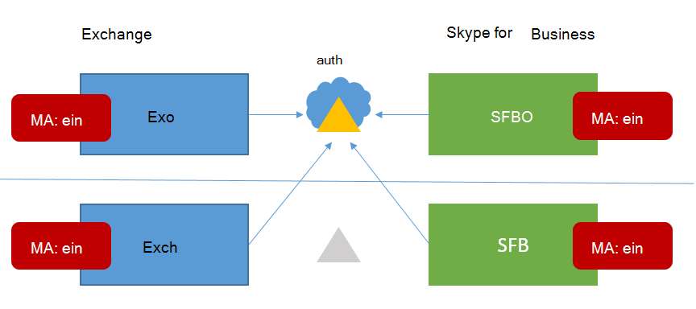

# <a name="how-to-configure-skype-for-business-on-premises-to-use-hybrid-modern-authentication"></a>Lokale Konfiguration von Skype for Business derart, dass die moderne Hybridauthentifizierung verwendet wird

*Dieser Artikel gilt sowohl für Microsoft 365 Enterprise als auch für Office 365 Enterprise.*

Moderne Authentifizierung ist eine Methode der Identitätsverwaltung, die eine sicherere Benutzerauthentifizierung und -autorisierung bietet und für Skype for Business-Server lokal und Exchange-Server lokal und für hybride Hybride mit geteilter Skype for Business verfügbar ist.
  
 **Wichtig** Möchten Sie mehr über die moderne Authentifizierung (Modern Authentication, MA) erfahren und warum Sie diese in Ihrem Unternehmen oder Ihrer Organisation verwenden möchten? Überprüfen [Sie dieses Dokument,](hybrid-modern-auth-overview.md) um eine Übersicht zu erhalten. Wenn Sie wissen müssen, welche Skype for Business Topologien mit MA unterstützt werden, ist dies hier dokumentiert!
  
 **Bevor wir beginnen,** verwende ich die folgenden Begriffe:
  
- Moderne Authentifizierung (Modern Authentication, MA)

- Hybride moderne Authentifizierung (Hybrid Modern Authentication, HMA)

- Exchange lokal (EXCH)

- Exchange Online (EXO)

- Skype for Business lokal (SFB)

- Skype for Business Online (SFBO)

Wenn eine Grafik in diesem Artikel über ein Objekt verfügt, das ausgegraut oder  abgeblendet ist, bedeutet dies, dass das in Grau dargestellte Element nicht in der MA-spezifischen Konfiguration enthalten ist.
  
## <a name="read-the-summary"></a>Lesen der Zusammenfassung

Diese Zusammenfassung bricht den Prozess in Schritte auf, die andernfalls während der Ausführung verloren gehen könnten, und ist gut für eine allgemeine Prüfliste, um zu verfolgen, wo Sie sich im Prozess befinden.
  
1. Stellen Sie zunächst sicher, dass Alle Voraussetzungen erfüllt sind.

1. Da viele Voraussetzungen sowohl für Skype for Business als auch für Exchange sind, finden Sie im **Übersichtsartikel** eine Checkliste vor dem [Req](hybrid-modern-auth-overview.md). Gehen Sie  *dazu vor,*  bevor Sie mit den Schritten in diesem Artikel beginnen.

1. Sammeln Sie die HMA-spezifischen Informationen, die Sie in einer Datei benötigen, oder OneNote.

1. Aktivieren Sie die moderne Authentifizierung für EXO (wenn sie noch nicht aktiviert ist).

1. Aktivieren Sie die moderne Authentifizierung für SFBO (wenn sie noch nicht aktiviert ist).

1. Aktivieren Sie die hybride moderne Authentifizierung für Exchange lokal.

1. Aktivieren Sie die hybride moderne Authentifizierung für Skype for Business lokal.

Diese Schritte aktivieren MA für SFB, SFBO, EXCH und EXO , d. h. alle Produkte, die an einer HMA-Konfiguration von SFB und SFBO teilnehmen können (einschließlich Abhängigkeiten von EXCH/EXO). Anders ausgedrückt: Wenn Ihre Benutzer in einem Teil der Hybridlösung (EXO + SFBO, EXO + SFB, EXCH + SFBO oder EXCH + SFB) postfächer erstellt werden, sieht Das fertige Produkt wie dies aus:
  

  
Wie Sie sehen können, gibt es vier verschiedene Orte zum Aktivieren von MA! Für eine optimale Benutzeroberfläche wird empfohlen, ma an allen vier dieser Speicherorte zu aktivieren. Wenn Sie ma nicht an allen diesen Speicherorten aktivieren können, passen Sie die Schritte so an, dass Sie MA nur an den Speicherorten aktivieren, die für Ihre Umgebung erforderlich sind.
  
Im Thema [Supportability finden Sie Skype for Business mit MA](/skypeforbusiness/plan-your-deployment/modern-authentication/topologies-supported) für unterstützte Topologien.
  
 **Wichtig** Überprüfen Sie, ob alle Voraussetzungen erfüllt sind, bevor Sie beginnen. Diese Informationen finden Sie unter [Hybrid modern authentication overview and prerequisites](hybrid-modern-auth-overview.md).
  
## <a name="collect-all-hma-specific-info-youll-need"></a>Sammeln aller HMA-spezifischen Informationen, die Sie benötigen

Nachdem Sie überprüft haben, ob [](hybrid-modern-auth-overview.md) Sie die Voraussetzungen für die Verwendung der modernen Authentifizierung erfüllt haben (siehe hinweis oben), sollten Sie eine Datei erstellen, um die Informationen zu speichern, die Sie zum Konfigurieren von HMA in den folgenden Schritten benötigen. Beispiele in diesem Artikel:
  
- **SIP/SMTP-Domäne**

  - Ex. contoso.com (wird mit Office 365)

- **Mandanten-ID**

  - Die GUID, die Ihren Office 365 (bei der Anmeldung von contoso.onmicrosoft.com).

- **URLs des SFB 2015 CU5-Webdiensts**

Sie benötigen interne und externe Webdienst-URLs für alle bereitgestellten SfB 2015-Pools. Um diese zu erhalten, führen Sie folgendes aus Skype for Business Verwaltungsshell aus:
  
```powershell
Get-CsService -WebServer | Select-Object PoolFqdn, InternalFqdn, ExternalFqdn | FL
```

- Ex. Intern: https://lyncwebint01.contoso.com

- Ex. Extern: https://lyncwebext01.contoso.com

Wenn Sie einen server Standard Edition, ist die interne URL leer. Verwenden Sie in diesem Fall den Poolfqdn für die interne URL.
  
## <a name="turn-on-modern-authentication-for-exo"></a>Aktivieren der modernen Authentifizierung für EXO

Folgen Sie den Anweisungen hier: [Exchange Online: Aktivieren Ihres Mandanten für die moderne Authentifizierung.](https://social.technet.microsoft.com/wiki/contents/articles/32711.exchange-online-how-to-enable-your-tenant-for-modern-authentication.aspx)
  
## <a name="turn-on-modern-authentication-for-sfbo"></a>Aktivieren der modernen Authentifizierung für SFBO

Folgen Sie den Anweisungen hier: [Skype for Business Online: Aktivieren Sie Ihren Mandanten für die moderne Authentifizierung.](https://social.technet.microsoft.com/wiki/contents/articles/34339.skype-for-business-online-enable-your-tenant-for-modern-authentication.aspx)
  
## <a name="turn-on-hybrid-modern-authentication-for-exchange-on-premises"></a>Aktivieren der hybriden modernen Authentifizierung für Exchange lokal

Folgen Sie den Anweisungen hier: Konfigurieren Exchange Server lokalen Authentifizierung für die [Verwendung der modernen Hybridauthentifizierung](configure-exchange-server-for-hybrid-modern-authentication.md).
  
## <a name="turn-on-hybrid-modern-authentication-for-skype-for-business-on-premises"></a>Aktivieren der modernen Hybridauthentifizierung für Skype for Business Lokalen

### <a name="add-on-premises-web-service-urls-as-spns-in-azure-active-directory"></a>Hinzufügen von lokalen Webdienst-URLs als SPNs in Azure Active Directory

Jetzt müssen Sie Befehle ausführen, um die URLs (die zuvor gesammelt wurden) als Dienstprinzipale in SFBO hinzuzufügen.
  
 **Hinweis** Dienstprinzipalnamen (Service Principal Names, SPNs) identifizieren Webdienste und ordnen sie einem Sicherheitsprinzipal (z. B. einem Kontonamen oder einer Gruppe) zu, damit der Dienst im Namen eines autorisierten Benutzers agieren kann. Clients, die sich auf einem Server authentifizieren, verwenden Informationen, die in SPNs enthalten sind.
  
1. Stellen Sie zunächst eine Verbindung mit Azure Active Directory (Azure AD) mit [diesen Anweisungen bereit.](/powershell/azure/active-directory/overview?view=azureadps-1.0)

2. Führen Sie diesen Befehl lokal aus, um eine Liste der URLs des SFB-Webdiensts zu erhalten.

   Beachten Sie, dass die AppPrincipalId mit `00000004` beginnt. Dies entspricht Skype for Business Online.

   Notieren Sie sich (und Screenshot für einen späteren Vergleich) die Ausgabe dieses Befehls, der eine SE- und WS-URL enthält, aber hauptsächlich aus SPNs besteht, die mit `00000004-0000-0ff1-ce00-000000000000/` beginnen.

```powershell
Get-MsolServicePrincipal -AppPrincipalId 00000004-0000-0ff1-ce00-000000000000 | Select -ExpandProperty ServicePrincipalNames
```

3. Wenn die internen **oder** externen SFB-URLs aus der lokalen Liste fehlen (z. B. und wir müssen diese bestimmten Datensätze https://lyncwebint01.contoso.com dieser Liste https://lyncwebext01.contoso.com) hinzufügen.

    Ersetzen Sie die  *folgenden Beispiel-URLs* durch die tatsächlichen URLs in den Befehlen Hinzufügen!
  
```powershell
$x= Get-MsolServicePrincipal -AppPrincipalId 00000004-0000-0ff1-ce00-000000000000
$x.ServicePrincipalnames.Add("https://lyncwebint01.contoso.com/")
$x.ServicePrincipalnames.Add("https://lyncwebext01.contoso.com/")
Set-MSOLServicePrincipal -AppPrincipalId 00000004-0000-0ff1-ce00-000000000000 -ServicePrincipalNames $x.ServicePrincipalNames
```
  
4. Überprüfen Sie, ob Ihre neuen Datensätze hinzugefügt wurden, indem Sie den **Befehl Get-MsolServicePrincipal** aus Schritt 2 erneut ausführen und die Ausgabe überprüfen. Vergleichen Sie die Liste oder den Screenshot von vorher mit der neuen Liste der SPNs. Sie können auch die neue Liste für Ihre Datensätze screenshoten. Wenn Sie erfolgreich waren, werden die beiden neuen URLs in der Liste angezeigt. In unserem Beispiel enthält die Liste der SPNs nun die spezifischen URLs https://lyncwebint01.contoso.com und https://lyncwebext01.contoso.com/ .

### <a name="create-the-evosts-auth-server-object"></a>Erstellen des EvoSTS Auth Server-Objekts

Führen Sie den folgenden Befehl in Skype for Business Verwaltungsshell aus.
  
```powershell
New-CsOAuthServer -Identity evoSTS -MetadataURL https://login.windows.net/common/FederationMetadata/2007-06/FederationMetadata.xml -AcceptSecurityIdentifierInformation $true -Type AzureAD
```

### <a name="enable-hybrid-modern-authentication"></a>Aktivieren der modernen Hybridauthentifizierung

Dies ist der Schritt, der ma tatsächlich aktiviert. Alle vorherigen Schritte können im Voraus ausgeführt werden, ohne den Clientauthentifizierungsfluss zu ändern. Wenn Sie bereit sind, den Authentifizierungsfluss zu ändern, führen Sie diesen Befehl in der Skype for Business Verwaltungsshell aus.

```powershell
Set-CsOAuthConfiguration -ClientAuthorizationOAuthServerIdentity evoSTS
```

## <a name="verify"></a>Überprüfen

Sobald Sie HMA aktiviert haben, verwendet die nächste Anmeldung eines Clients den neuen Authentifizierungsfluss. Beachten Sie, dass nur das Aktivieren von HMA keine erneute Authentifizierung für einen Client auslöst. Die Clients authentifizieren sich basierend auf der Lebensdauer der Authentifizierungstoken und/oder -zerts, die sie haben.
  
Um zu testen, ob HMA funktioniert, nachdem Sie es aktiviert haben, melden Sie sich von einem SFB-Testclient Windows ab, und klicken Sie auf "Meine Anmeldeinformationen löschen". Melden Sie sich erneut an. Der **Client** sollte nun den modernen Authentifizierungsfluss verwenden, und Ihre Anmeldung enthält nun eine Office 365-Eingabeaufforderung für ein "Arbeits- oder Schulkonto", das direkt vor dem Kontakt des Clients mit dem Server angezeigt wird und Sie anmeldet.
  
Sie sollten auch die "Konfigurationsinformationen" für Skype for Business für eine "OAuth Authority" überprüfen. Halten Sie dazu auf Dem Clientcomputer die STRG-TASTE gedrückt, und klicken Sie gleichzeitig mit der rechten Maustaste auf das Skype for Business-Symbol im Windows Benachrichtigungsfach. Klicken **Sie im angezeigten** Menü auf Konfigurationsinformationen. Suchen Sie im Skype for Business Konfigurationsinformationen, die auf dem Desktop angezeigt werden, nach folgendem:
  

  
Sie sollten auch die STRG-TASTE gedrückt halten, während Sie mit der rechten Maustaste auf das Symbol für den Outlook-Client klicken (auch im Windows-Benachrichtigungsfach) und auf "Verbindungsstatus" klicken. Suchen Sie nach der SMTP-Adresse des Clients für den AuthN-Typ "Bearer", der das in OAuth verwendete \* Bearertoken darstellt.
  
## <a name="related-articles"></a>Verwandte Artikel

[Link zurück zur Übersicht über die moderne Authentifizierung](hybrid-modern-auth-overview.md).
  
Müssen Sie wissen, wie Sie die moderne Authentifizierung (Modern Authentication, ADAL) für Ihre Skype for Business verwenden? Hier finden Sie [Schritte.](./hybrid-modern-auth-overview.md)