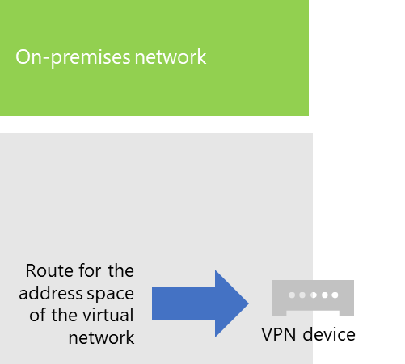

# <a name="connect-an-on-premises-network-to-a-microsoft-azure-virtual-network"></a><span data-ttu-id="7970e-103">Verbinden eines lokalen Netzwerks mit einem virtuellen Microsoft Azure-Netzwerk</span><span class="sxs-lookup"><span data-stu-id="7970e-103">Connect an on-premises network to a Microsoft Azure virtual network</span></span>

<span data-ttu-id="7970e-p101">Ein standortübergreifendes virtuelles Azure-Netzwerk ist mit Ihrem lokalen Netzwerk verbunden, sodass Ihr Netzwerk durch Subnetze und virtuelle Computer, die in Azure-Infrastrukturdiensten gehostet werden, erweitert wird. Mit dieser Verbindung können Computer in Ihrem lokalen Netzwerk direkt auf virtuelle Computer zugreifen, und umgekehrt.</span><span class="sxs-lookup"><span data-stu-id="7970e-p101">A cross-premises Azure virtual network is connected to your on-premises network, extending your network to include subnets and virtual machines hosted in Azure infrastructure services. This connection lets computers on your on-premises network to directly access virtual machines in Azure and vice versa.</span></span> 

<span data-ttu-id="7970e-106">Beispielsweise muss ein Verzeichnissynchronisierungsserver, der auf einem virtuellen Azure-Computer ausgeführt wird, Ihre lokalen Domänencontroller auf Änderungen an Konten abfragen und diese Änderungen mit Ihrem Microsoft 365-Abonnement synchronisieren.</span><span class="sxs-lookup"><span data-stu-id="7970e-106">For example, a directory synchronization server running on an Azure virtual machine needs to query your on-premises domain controllers for changes to accounts and synchronize those changes with your Microsoft 365 subscription.</span></span> <span data-ttu-id="7970e-107">In diesem Artikel erfahren Sie, wie Sie ein standortübergreifendes virtuelles Azure-Netzwerk mithilfe einer Standort-zu-Standort-VPN-Verbindung einrichten, die zum Hosten virtueller Azure-Computer bereit ist.</span><span class="sxs-lookup"><span data-stu-id="7970e-107">This article shows you how to set up a cross-premises Azure virtual network using a site-to-site virtual private network (VPN) connection that is ready to host Azure virtual machines.</span></span>

## <a name="configure-a-cross-premises-azure-virtual-network"></a><span data-ttu-id="7970e-108">Konfigurieren eines standortübergreifenden virtuellen Azure-Netzwerks</span><span class="sxs-lookup"><span data-stu-id="7970e-108">Configure a cross-premises Azure virtual network</span></span>

<span data-ttu-id="7970e-p103">Die virtuellen Computer in Azure müssen nicht von Ihrer lokalen Umgebung isoliert sein. Um virtuelle Azure-Computer mit Ihren lokalen Netzwerkressourcen zu verbinden, müssen Sie ein standortübergreifendes virtuelles Azure-Netzwerk konfigurieren. Das folgende Diagramm zeigt die erforderlichen Komponenten zum Bereitstellen eines standortübergreifenden virtuellen Azure-Netzwerks mit einem virtuellen Computer in Azure.</span><span class="sxs-lookup"><span data-stu-id="7970e-p103">Your virtual machines in Azure don't have to be isolated from your on-premises environment. To connect Azure virtual machines to your on-premises network resources, you must configure a cross-premises Azure virtual network. The following diagram shows the required components to deploy a cross-premises Azure virtual network with a virtual machine in Azure.</span></span>
  

 
<span data-ttu-id="7970e-p104">In diesem Diagramm sind zwei Netzwerke über eine Standort-zu-Standort-VPN-Verbindung verbunden: das lokale Netzwerk und das virtuelle Azure-Netzwerk. Für die Standort-zu-Standort-VPN-Verbindung gilt Folgendes:</span><span class="sxs-lookup"><span data-stu-id="7970e-p104">In the diagram, there are two networks connected by a site-to-site VPN connection: the on-premises network and the Azure virtual network. The site-to-site VPN connection is:</span></span>

- <span data-ttu-id="7970e-115">Sie besteht zwischen zwei Endpunkten, die adressierbar sind und sich im öffentlichen Internet befinden.</span><span class="sxs-lookup"><span data-stu-id="7970e-115">Between two endpoints that are addressable and located on the public Internet.</span></span>
- <span data-ttu-id="7970e-116">Die Standort-zu-Standort-VPN-Verbindung wird von einem VPN-Gerät im lokalen Netzwerk und einem Azure-VPN-Gateway im virtuellen Azure-Netzwerk beendet.</span><span class="sxs-lookup"><span data-stu-id="7970e-116">Terminated by a VPN device on the on-premises network and an Azure VPN gateway on the Azure virtual network.</span></span>

<span data-ttu-id="7970e-p105">In dem virtuellen Azure-Netzwerk werden virtuelle Computer gehostet. Von den virtuellen Computern im virtuellen Azure-Netzwerk stammender Netzwerkdatenverkehr wird an das VPN-Gateway weitergeleitet, das den Datenverkehr anschließend über die Standort-zu-Standort-Verbindung an das VPN-Gerät im lokalen Netzwerk weiterleitet. Die Routinginfrastruktur des lokalen Netzwerks leitet dann den Datenverkehr an sein Ziel weiter.</span><span class="sxs-lookup"><span data-stu-id="7970e-p105">The Azure virtual network hosts virtual machines. Network traffic originating from virtual machines on the Azure virtual network gets forwarded to the VPN gateway, which then forwards the traffic across the site-to-site VPN connection to the VPN device on the on-premises network. The routing infrastructure of the on-premises network then forwards the traffic to its destination.</span></span>

>[!Note]
><span data-ttu-id="7970e-p106">Sie können Sie auch [ExpressRoute](https://azure.microsoft.com/services/expressroute/) verwenden, bei dem es sich um eine direkte Verbindung zwischen Ihrer Organisation und dem Microsoft-Netzwerk handelt. Datenverkehr über ExpressRoute wird nicht über das öffentliche Internet übertragen. In diesem Artikel wird die Verwendung von ExpressRoute nicht beschrieben.</span><span class="sxs-lookup"><span data-stu-id="7970e-p106">You can also use [ExpressRoute](https://azure.microsoft.com/services/expressroute/), which is a direct connection between your organization and Microsoft's network. Traffic over ExpressRoute does not travel over the public Internet. This article does not describe the use of ExpressRoute.</span></span>
>
  
<span data-ttu-id="7970e-123">Um die VPN-Verbindung zwischen dem virtuellen Azure-Netzwerk und Ihrem lokalen Netzwerk einzurichten, führen Sie die folgenden Schritte aus:</span><span class="sxs-lookup"><span data-stu-id="7970e-123">To set up the VPN connection between your Azure virtual network and your on-premises network, follow these steps:</span></span> 
  
1. <span data-ttu-id="7970e-124">**Lokal:** Definieren und erstellen Sie eine lokale Netzwerkroute für den Adressraum des virtuellen Azure-Netzwerks, die auf das lokale VPN-Gerät verweist.</span><span class="sxs-lookup"><span data-stu-id="7970e-124">**On-premises:** Define and create an on-premises network route for the address space of the Azure virtual network that points to your on-premises VPN device.</span></span>
    
2. <span data-ttu-id="7970e-125">**Microsoft Azure** Richten Sie ein virtuelles Azure-Netzwerk mit einer Standort-zu-Standort-VPN-Verbindung ein.</span><span class="sxs-lookup"><span data-stu-id="7970e-125">**Microsoft Azure:** Create an Azure virtual network with a site-to-site VPN connection.</span></span> 
    
3. <span data-ttu-id="7970e-126">**Lokal:** Konfigurieren Sie Ihr lokales VPN-Gerät auf Hardware- oder Softwarebasis zum Beenden der VPN-Verbindung, die IPsec (Internet Protocol Security) verwendet.</span><span class="sxs-lookup"><span data-stu-id="7970e-126">**On premises:** Configure your on-premises hardware or software VPN device to terminate the VPN connection, which uses Internet Protocol security (IPsec).</span></span>
    
<span data-ttu-id="7970e-127">Nachdem Sie die Standort-zu-Standort VPN-Verbindung hergestellt haben, fügen Sie den Subnetzen des virtuellen Netzwerks virtuelle Azure-Computer hinzu.</span><span class="sxs-lookup"><span data-stu-id="7970e-127">After you establish the site-to-site VPN connection, you add Azure virtual machines to the subnets of the virtual network.</span></span>
  
## <a name="plan-your-azure-virtual-network"></a><span data-ttu-id="7970e-128">Planen des virtuellen Azure-Netzwerks</span><span class="sxs-lookup"><span data-stu-id="7970e-128">Plan your Azure virtual network</span></span>
<a name="PlanningVirtual"></a>

### <a name="prerequisites"></a><span data-ttu-id="7970e-129">Voraussetzungen</span><span class="sxs-lookup"><span data-stu-id="7970e-129">Prerequisites</span></span>
<a name="Prerequisites"></a>

- <span data-ttu-id="7970e-p107">Ein Azure-Abonnement. Informationen zu Azure-Abonnements finden Sie auf der [Seite zum Erwerben von Azure](https://azure.microsoft.com/pricing/purchase-options/).</span><span class="sxs-lookup"><span data-stu-id="7970e-p107">An Azure subscription. For information about Azure subscriptions, go to the [How To Buy Azure page](https://azure.microsoft.com/pricing/purchase-options/).</span></span>
    
- <span data-ttu-id="7970e-132">Ein verfügbarer privater IPv4-Adressraum, der dem virtuellen Netzwerk und den Subnetzen zugewiesen wird, der über ausreichende Wachstumskapazität zur Unterstützung der jetzt und künftig benötigten virtuellen Computer verfügt.</span><span class="sxs-lookup"><span data-stu-id="7970e-132">An available private IPv4 address space to assign to the virtual network and its subnets, with sufficient room for growth to accommodate the number of virtual machines needed now and in the future.</span></span>
    
- <span data-ttu-id="7970e-p108">Ein verfügbares VPN-Gerät in Ihrem lokalen Netzwerk zum Beenden der Standort-zu-Standort-VPN-Verbindung, das die Anforderungen von IPsec erfüllt. Weitere Informationen finden Sie unter [Informationen zu VPN-Geräten für VPN-Gatewayverbindungen zwischen Standorten](/azure/vpn-gateway/vpn-gateway-about-vpn-devices).</span><span class="sxs-lookup"><span data-stu-id="7970e-p108">An available VPN device in your on-premises network to terminate the site-to-site VPN connection that supports the requirements for IPsec. For more information, see [About VPN devices for site-to-site virtual network connections](/azure/vpn-gateway/vpn-gateway-about-vpn-devices).</span></span>
    
- <span data-ttu-id="7970e-135">Änderungen an Ihrer Routinginfrastruktur, damit der an den Adressraum des virtuellen Azure-Netzwerks geleitete Datenverkehr an das VPN-Gerät weitergeleitet wird, das die Standort-zu-Standort-VPN-Verbindung hostet.</span><span class="sxs-lookup"><span data-stu-id="7970e-135">Changes to your routing infrastructure so that traffic routed to the address space of the Azure virtual network gets forwarded to the VPN device that hosts the site-to-site VPN connection.</span></span>
    
- <span data-ttu-id="7970e-136">Ein Webproxy, der Computern, die mit dem lokalen Netzwerk verbunden sind, und dem virtuellen Azure-Netzwerk Zugriff auf das Internet bietet.</span><span class="sxs-lookup"><span data-stu-id="7970e-136">A web proxy that gives computers that are connected to the on-premises network and the Azure virtual network access to the Internet.</span></span>
    
### <a name="solution-architecture-design-assumptions"></a><span data-ttu-id="7970e-137">Entwurfsannahmen für die Lösungsarchitektur</span><span class="sxs-lookup"><span data-stu-id="7970e-137">Solution architecture design assumptions</span></span>

<span data-ttu-id="7970e-138">Die folgende Liste enthält die Entwurfsentscheidungen, die für diese Lösungsarchitektur getroffen wurden.</span><span class="sxs-lookup"><span data-stu-id="7970e-138">The following list represents the design choices that have been made for this solution architecture.</span></span> 
  
- <span data-ttu-id="7970e-p109">Diese Lösung verwendet ein einzelnes virtuelles Azure-Netzwerk mit einer einzelnen Standort-zu-Standort-VPN-Verbindung. Das virtuelle Azure-Netzwerk hostet ein einzelnes Subnetz, das mehrere virtuelle Computer enthalten kann.</span><span class="sxs-lookup"><span data-stu-id="7970e-p109">This solution uses a single Azure virtual network with a site-to-site VPN connection. The Azure virtual network hosts a single subnet that can contain multiple virtual machines.</span></span> 
    
- <span data-ttu-id="7970e-p110">Sie können RRAS (Routing- und RAS-Dienst) in Windows Server 2016 oder Windows Server 2012 verwenden, um eine IPsec-Standort-zu-Standort-VPN-Verbindung zwischen dem lokalen Netzwerk und dem virtuellen Azure-Netzwerk herzustellen. Sie können auch andere Optionen wie Cisco- und Juniper Networks-VPN-Geräte wählen.</span><span class="sxs-lookup"><span data-stu-id="7970e-p110">You can use the Routing and Remote Access Service (RRAS) in Windows Server 2016 or Windows Server 2012 to establish an IPsec site-to-site VPN connection between the on-premises network and the Azure virtual network. You can also use other options, such as Cisco or Juniper Networks VPN devices.</span></span>
    
- <span data-ttu-id="7970e-p111">Das lokale Netzwerk kann weiterhin Netzwerkdienste wie Active Directory Domain Services (AD DS), Domain Name System (DNS) und Proxy-Server enthalten. Je nach Ihren Anforderungen kann es von Vorteil sein, einige der Netzwerkressourcen in dem virtuellen Azure-Netzwerk zu betreiben.</span><span class="sxs-lookup"><span data-stu-id="7970e-p111">The on-premises network might still have network services like Active Directory Domain Services (AD DS), Domain Name System (DNS), and proxy servers. Depending on your requirements, it might be beneficial to place some of these network resources in the Azure virtual network.</span></span>
    
<span data-ttu-id="7970e-p112">Bestimmen Sie bei einem vorhandenen virtuellen Azure-Netzwerk mit einem oder mehreren Subnetzen, ob es genügend Adressraum für ein weiteres Subnetz zum Hosten Ihrer erforderlichen virtuellen Computer den Anforderungen entsprechend gibt. Wenn Sie keinen verbleibenden Adressraum für ein weiteres Subnetz haben, erstellen Sie ein zusätzliches virtuelles Netzwerk, das über eine eigene Standort-zu-Standort-zu-Standort-VPN-Verbindung verfügt.</span><span class="sxs-lookup"><span data-stu-id="7970e-p112">For an existing Azure virtual network with one or more subnets, determine whether there is remaining address space for an additional subnet to host your needed virtual machines, based on your requirements. If you don't have remaining address space for an additional subnet, create an additional virtual network that has its own site-to-site VPN connection.</span></span>
  
### <a name="plan-the-routing-infrastructure-changes-for-the-azure-virtual-network"></a><span data-ttu-id="7970e-147">Planen der Änderungen der Routinginfrastruktur für das virtuelle Azure-Netzwerk</span><span class="sxs-lookup"><span data-stu-id="7970e-147">Plan the routing infrastructure changes for the Azure virtual network</span></span>

<span data-ttu-id="7970e-148">Sie müssen Ihre lokale Routinginfrastruktur für das Weiterleiten von Datenverkehr, der für den Adressraum des virtuellen Azure-Netzwerk bestimmt ist, an das lokale VPN-Gerät konfigurieren, auf dem die Standort-zu-Standort-zu-Standort-VPN-Verbindung gehostet wird.</span><span class="sxs-lookup"><span data-stu-id="7970e-148">You must configure your on-premises routing infrastructure to forward traffic destined for the address space of the Azure virtual network to the on-premises VPN device that is hosting the site-to-site VPN connection.</span></span>
  
<span data-ttu-id="7970e-149">Die genaue Methode zum Aktualisieren Ihrer Routinginfrastruktur hängt von der Verwaltung der Routinginformationen ab. Die sind die Möglichkeiten:</span><span class="sxs-lookup"><span data-stu-id="7970e-149">The exact method of updating your routing infrastructure depends on how you manage routing information, which can be:</span></span>
  
- <span data-ttu-id="7970e-150">Die Routingtabelle wird abhängig von manueller Konfiguration aktualisiert.</span><span class="sxs-lookup"><span data-stu-id="7970e-150">Routing table updates based on manual configuration.</span></span>
    
- <span data-ttu-id="7970e-151">Aktualisierungen der Routingtabelle basieren auf Routingprotokollen, wie z. B. Routing Information Protocol (RIP) oder Open Shortest Path First (OSPF).</span><span class="sxs-lookup"><span data-stu-id="7970e-151">Routing table updates based on routing protocols, such as Routing Information Protocol (RIP) or Open Shortest Path First (OSPF).</span></span>
    
<span data-ttu-id="7970e-152">Wenden Sie sich an Ihre Routingspezialisten, um sicherzustellen, dass der Datenverkehr an das virtuelle Azure-Netzwerk an das lokale VPN-Gerät weitergeleitet wird.</span><span class="sxs-lookup"><span data-stu-id="7970e-152">Consult with your routing specialist to make sure that traffic destined for the Azure virtual network is forwarded to the on-premises VPN device.</span></span>
  
### <a name="plan-for-firewall-rules-for-traffic-to-and-from-the-on-premises-vpn-device"></a><span data-ttu-id="7970e-153">Planen von Firewallregeln für ein- und ausgehenden Datenverkehr des lokalen VPN-Geräts</span><span class="sxs-lookup"><span data-stu-id="7970e-153">Plan for firewall rules for traffic to and from the on-premises VPN device</span></span>

<span data-ttu-id="7970e-154">Wenn sich Ihr VPN-Gerät in einem Umkreisnetzwerk mit einer Firewall zwischen dem Umkreisnetzwerk und dem Internet befindet, müssen Sie möglicherweise die Firewall mit den folgenden Regeln konfigurieren, um die Standort-zu-Standort-VPN-Verbindung zuzulassen.</span><span class="sxs-lookup"><span data-stu-id="7970e-154">If your VPN device is on a perimeter network that has a firewall between the perimeter network and the Internet, you might have to configure the firewall for the following rules to allow the site-to-site VPN connection.</span></span>
  
- <span data-ttu-id="7970e-155">Datenverkehr an das VPN-Gerät (eingehend aus dem Internet):</span><span class="sxs-lookup"><span data-stu-id="7970e-155">Traffic to the VPN device (incoming from the Internet):</span></span>
    
  - <span data-ttu-id="7970e-156">Ziel-IP-Adresse des VPN-Geräts und IP-Protokoll 50</span><span class="sxs-lookup"><span data-stu-id="7970e-156">Destination IP address of the VPN device and IP protocol 50</span></span>
    
  - <span data-ttu-id="7970e-157">Ziel-IP-Adresse des VPN-Geräts und UDP-Zielport 500</span><span class="sxs-lookup"><span data-stu-id="7970e-157">Destination IP address of the VPN device and UDP destination port 500</span></span>
    
  - <span data-ttu-id="7970e-158">Ziel-IP-Adresse des VPN-Geräts und UDP-Zielport 4500</span><span class="sxs-lookup"><span data-stu-id="7970e-158">Destination IP address of the VPN device and UDP destination port 4500</span></span>
    
- <span data-ttu-id="7970e-159">Datenverkehr von dem VPN-Gerät (ausgehend an das Internet):</span><span class="sxs-lookup"><span data-stu-id="7970e-159">Traffic from the VPN device (outgoing to the Internet):</span></span>
    
  - <span data-ttu-id="7970e-160">Quell-IP-Adresse des VPN-Geräts und IP-Protokoll 50</span><span class="sxs-lookup"><span data-stu-id="7970e-160">Source IP address of the VPN device and IP protocol 50</span></span>
    
  - <span data-ttu-id="7970e-161">Quell-IP-Adresse des VPN-Geräts und UDP-Quellport 500</span><span class="sxs-lookup"><span data-stu-id="7970e-161">Source IP address of the VPN device and UDP source port 500</span></span>
    
  - <span data-ttu-id="7970e-162">Quell-IP-Adresse des VPN-Geräts und UDP-Quellport 4500</span><span class="sxs-lookup"><span data-stu-id="7970e-162">Source IP address of the VPN device and UDP source port 4500</span></span>
    
### <a name="plan-for-the-private-ip-address-space-of-the-azure-virtual-network"></a><span data-ttu-id="7970e-163">Planen des privaten IP-Adressbereichs des virtuellen Azure-Netzwerks</span><span class="sxs-lookup"><span data-stu-id="7970e-163">Plan for the private IP address space of the Azure virtual network</span></span>

<span data-ttu-id="7970e-164">Der private IP-Adressbereich des virtuellen Azure-Netzwerks muss in der Lage sein, von Azure verwendete Adressen aufzunehmen, um das virtuelle Netzwerk mit mindestens einem Subnetz zu hosten, das genügend Adressen für Ihre virtuellen Azure-Computer bietet.</span><span class="sxs-lookup"><span data-stu-id="7970e-164">The private IP address space of the Azure virtual network must be able to accommodate addresses used by Azure to host the virtual network and with at least one subnet that has enough addresses for your Azure virtual machines.</span></span>
  
<span data-ttu-id="7970e-165">Um die Anzahl der Adressen zu bestimmen, die für das Subnetz erforderlich sind, zählen Sie die Anzahl der virtuellen Computer, die Sie aktuell benötigen, schätzen Sie künftiges Wachstum ab, und verwenden Sie dann die folgende Tabelle, um die Größe des Subnetzes zu ermitteln.</span><span class="sxs-lookup"><span data-stu-id="7970e-165">To determine the number of addresses needed for the subnet, count the number of virtual machines that you need now, estimate for future growth, and then use the following table to determine the size of the subnet.</span></span>
  
|<span data-ttu-id="7970e-166">**Anzahl der benötigten virtuellen Computer**</span><span class="sxs-lookup"><span data-stu-id="7970e-166">**Number of virtual machines needed**</span></span>|<span data-ttu-id="7970e-167">**Anzahl der erforderlichen Hostbits**</span><span class="sxs-lookup"><span data-stu-id="7970e-167">**Number of host bits needed**</span></span>|<span data-ttu-id="7970e-168">**Größe des Subnetzes**</span><span class="sxs-lookup"><span data-stu-id="7970e-168">**Size of the subnet**</span></span>|
|:-----|:-----|:-----|
|<span data-ttu-id="7970e-169">1-3</span><span class="sxs-lookup"><span data-stu-id="7970e-169">1-3</span></span>  <br/> |<span data-ttu-id="7970e-170">3</span><span class="sxs-lookup"><span data-stu-id="7970e-170">3</span></span>  <br/> |<span data-ttu-id="7970e-171">/29</span><span class="sxs-lookup"><span data-stu-id="7970e-171">/29</span></span>  <br/> |
|<span data-ttu-id="7970e-172">4-11</span><span class="sxs-lookup"><span data-stu-id="7970e-172">4-11</span></span>  <br/> |<span data-ttu-id="7970e-173">4 </span><span class="sxs-lookup"><span data-stu-id="7970e-173">4</span></span>  <br/> |<span data-ttu-id="7970e-174">/28</span><span class="sxs-lookup"><span data-stu-id="7970e-174">/28</span></span>  <br/> |
|<span data-ttu-id="7970e-175">12-27</span><span class="sxs-lookup"><span data-stu-id="7970e-175">12-27</span></span>  <br/> |<span data-ttu-id="7970e-176">5 </span><span class="sxs-lookup"><span data-stu-id="7970e-176">5</span></span>  <br/> |<span data-ttu-id="7970e-177">/27</span><span class="sxs-lookup"><span data-stu-id="7970e-177">/27</span></span>  <br/> |
|<span data-ttu-id="7970e-178">28-59</span><span class="sxs-lookup"><span data-stu-id="7970e-178">28-59</span></span>  <br/> |<span data-ttu-id="7970e-179">6 </span><span class="sxs-lookup"><span data-stu-id="7970e-179">6</span></span>  <br/> |<span data-ttu-id="7970e-180">/26</span><span class="sxs-lookup"><span data-stu-id="7970e-180">/26</span></span>  <br/> |
|<span data-ttu-id="7970e-181">60-123</span><span class="sxs-lookup"><span data-stu-id="7970e-181">60-123</span></span>  <br/> |<span data-ttu-id="7970e-182">7 </span><span class="sxs-lookup"><span data-stu-id="7970e-182">7</span></span>  <br/> |<span data-ttu-id="7970e-183">/25</span><span class="sxs-lookup"><span data-stu-id="7970e-183">/25</span></span>  <br/> |
   
### <a name="planning-worksheet-for-configuring-your-azure-virtual-network"></a><span data-ttu-id="7970e-184">Arbeitsblatt für die Planung der Konfiguration des virtuellen Azure-Netzwerks</span><span class="sxs-lookup"><span data-stu-id="7970e-184">Planning worksheet for configuring your Azure virtual network</span></span>
<span data-ttu-id="7970e-185"><a name="worksheet"> </a></span><span class="sxs-lookup"><span data-stu-id="7970e-185"><a name="worksheet"> </a></span></span>

<span data-ttu-id="7970e-186">Vor dem Erstellen eines virtuellen Azure-Netzwerks zum Hosten von virtuellen Computern müssen Sie die erforderlichen Einstellungen in den folgenden Tabellen festlegen.</span><span class="sxs-lookup"><span data-stu-id="7970e-186">Before you create an Azure virtual network to host virtual machines, you must determine the settings needed in the following tables.</span></span>
  
<span data-ttu-id="7970e-187">Füllen Sie für die Einstellungen des virtuellen Netzwerks Tabelle V aus.</span><span class="sxs-lookup"><span data-stu-id="7970e-187">For the settings of the virtual network, fill in Table V.</span></span>
  
 <span data-ttu-id="7970e-188">**Tabelle V: Konfiguration eines standortübergreifenden virtuellen Netzwerks**</span><span class="sxs-lookup"><span data-stu-id="7970e-188">**Table V: Cross-premises virtual network configuration**</span></span>
  
|<span data-ttu-id="7970e-189">**Element**</span><span class="sxs-lookup"><span data-stu-id="7970e-189">**Item**</span></span>|<span data-ttu-id="7970e-190">**Configuration-Element**</span><span class="sxs-lookup"><span data-stu-id="7970e-190">**Configuration element**</span></span>|<span data-ttu-id="7970e-191">**Beschreibung**</span><span class="sxs-lookup"><span data-stu-id="7970e-191">**Description**</span></span>|<span data-ttu-id="7970e-192">**Wert**</span><span class="sxs-lookup"><span data-stu-id="7970e-192">**Value**</span></span>|
|:-----|:-----|:-----|:-----|
|<span data-ttu-id="7970e-193">1.</span><span class="sxs-lookup"><span data-stu-id="7970e-193">1.</span></span>  <br/> |<span data-ttu-id="7970e-194">Name des virtuellen Netzwerks</span><span class="sxs-lookup"><span data-stu-id="7970e-194">Virtual network name</span></span>  <br/> |<span data-ttu-id="7970e-195">Ein Name, der dem virtuellen Azure-Netzwerk zugewiesen wird (z. B. DirSyncNet)</span><span class="sxs-lookup"><span data-stu-id="7970e-195">A name to assign to the Azure virtual network (example DirSyncNet).</span></span>  <br/> | |
|<span data-ttu-id="7970e-197">2.</span><span class="sxs-lookup"><span data-stu-id="7970e-197">2.</span></span>  <br/> |<span data-ttu-id="7970e-198">Adresse des virtuellen Netzwerks</span><span class="sxs-lookup"><span data-stu-id="7970e-198">Virtual network location</span></span>  <br/> |<span data-ttu-id="7970e-199">Das Azure-Rechenzentrum, das das virtuelle Netzwerk enthalten soll (z. B. USA (Westen)).</span><span class="sxs-lookup"><span data-stu-id="7970e-199">The Azure datacenter that will contain the virtual network (such as West US).</span></span>  <br/> |  <br/> |
|<span data-ttu-id="7970e-201">3.</span><span class="sxs-lookup"><span data-stu-id="7970e-201">3.</span></span>  <br/> |<span data-ttu-id="7970e-202">IP-Adresse des VPN-Geräts</span><span class="sxs-lookup"><span data-stu-id="7970e-202">VPN device IP address</span></span>  <br/> |<span data-ttu-id="7970e-p113">Die öffentliche IPv4-Adresse der Schnittstelle des VPN-Geräts im Internet. Fragen Sie Ihre IT-Abteilung nach dieser Adresse.</span><span class="sxs-lookup"><span data-stu-id="7970e-p113">The public IPv4 address of your VPN device's interface on the Internet. Work with your IT department to determine this address.</span></span>  <br/> |  <br/> |
|<span data-ttu-id="7970e-206">4.</span><span class="sxs-lookup"><span data-stu-id="7970e-206">4.</span></span>  <br/> |<span data-ttu-id="7970e-207">Adressraum des virtuellen Netzwerks</span><span class="sxs-lookup"><span data-stu-id="7970e-207">Virtual network address space</span></span>  <br/> |<span data-ttu-id="7970e-p114">Der Adressraum (in einem einzigen privaten Adresspräfix definiert) für das virtuelle Netzwerk. Fragen Sie Ihre IT-Abteilung nach diesem Adressraum. Der Adressraum sollte im CIDR-Format (Classless Interdomain Routing, klassenloses domänenübergreifendes Routing) angegeben werden, auch Netzwerkpräfixformat genannt. Beispiel: 10.24.64.0/20.</span><span class="sxs-lookup"><span data-stu-id="7970e-p114">The address space (defined in a single private address prefix) for the virtual network. Work with your IT department to determine this address space. The address space should be in Classless Interdomain Routing (CIDR) format, also known as network prefix format. An example is 10.24.64.0/20.</span></span>  <br/> | <br/> |
|<span data-ttu-id="7970e-213">5.</span><span class="sxs-lookup"><span data-stu-id="7970e-213">5.</span></span>  <br/> |<span data-ttu-id="7970e-214">Gemeinsam verwendeter IPsec-Schlüssel</span><span class="sxs-lookup"><span data-stu-id="7970e-214">IPsec shared key</span></span>  <br/> |<span data-ttu-id="7970e-p115">Eine aus 32 zufällig ausgewählten alphanumerischen Zeichen bestehende Zeichenfolge, die zur Authentifizierung beider Seiten der Standort-zu-Standort-VPN-Verbindung verwendet wird. Fragen Sie Ihre IT- oder Sicherheitsabteilung nach diesem Schlüsselwert, und bewahren Sie diesen an einem sicheren Ort auf. Alternativ finden Sie weitere Informationen dazu unter [Create a random string for an IPsec preshared key](https://social.technet.microsoft.com/wiki/contents/articles/32330.create-a-random-string-for-an-ipsec-preshared-key.aspx).</span><span class="sxs-lookup"><span data-stu-id="7970e-p115">A 32-character random, alphanumeric string that will be used to authenticate both sides of the site-to-site VPN connection. Work with your IT or security department to determine this key value and then store it in a secure location. Alternately, see [Create a random string for an IPsec preshared key](https://social.technet.microsoft.com/wiki/contents/articles/32330.create-a-random-string-for-an-ipsec-preshared-key.aspx).  </span></span><br/> | <br/> |
   
<span data-ttu-id="7970e-219">Füllen Sie für die Subnetze dieser Lösung Tabelle S aus.</span><span class="sxs-lookup"><span data-stu-id="7970e-219">Fill in Table S for the subnets of this solution.</span></span>
  
- <span data-ttu-id="7970e-p116">Legen Sie für das erste Subnetz einen 28-Bit-Adressraum (mit einer /28-Präfixlänge) für das Azure-Gatewaysubnetz fest. Informationen zum Bestimmen dieses Adressraums finden Sie unter [Calculating the gateway subnet address space for Azure virtual networks](/archive/blogs/solutions_advisory_board/calculating-the-gateway-subnet-address-space-for-azure-virtual-networks).</span><span class="sxs-lookup"><span data-stu-id="7970e-p116">For the first subnet, determine a 28-bit address space (with a /28 prefix length) for the Azure gateway subnet. See [Calculating the gateway subnet address space for Azure virtual networks](/archive/blogs/solutions_advisory_board/calculating-the-gateway-subnet-address-space-for-azure-virtual-networks) for information about how to determine this address space.</span></span>
    
- <span data-ttu-id="7970e-222">Geben Sie für das zweite Subnetz einen Anzeigenamen, einen auf dem Adressraum des virtuellen Netzwerks basierenden einzelnen IP-Adressraum und einen beschreibenden Zweck an.</span><span class="sxs-lookup"><span data-stu-id="7970e-222">For the second subnet, specify a friendly name, a single IP address space based on the virtual network address space, and a descriptive purpose.</span></span>
    
<span data-ttu-id="7970e-p117">Fragen Sie Ihre IT-Abteilung nach diesen Adressräumen, die aus dem Adressraum des virtuellen Netzwerks bestimmt werden. Beide Adressräume muss im CIDR-Format eingegeben werden.</span><span class="sxs-lookup"><span data-stu-id="7970e-p117">Work with your IT department to determine these address spaces from the virtual network address space. Both address spaces should be in CIDR format.</span></span>
  
 <span data-ttu-id="7970e-225">**Tabelle S: Subnetze im virtuellen Netzwerk**</span><span class="sxs-lookup"><span data-stu-id="7970e-225">**Table S: Subnets in the virtual network**</span></span>
  
|<span data-ttu-id="7970e-226">**Element**</span><span class="sxs-lookup"><span data-stu-id="7970e-226">**Item**</span></span>|<span data-ttu-id="7970e-227">**Subnetzname**</span><span class="sxs-lookup"><span data-stu-id="7970e-227">**Subnet name**</span></span>|<span data-ttu-id="7970e-228">**Subnetzadressraum**</span><span class="sxs-lookup"><span data-stu-id="7970e-228">**Subnet address space**</span></span>|<span data-ttu-id="7970e-229">**Zweck**</span><span class="sxs-lookup"><span data-stu-id="7970e-229">**Purpose**</span></span>|
|:-----|:-----|:-----|:-----|
|<span data-ttu-id="7970e-230">1.</span><span class="sxs-lookup"><span data-stu-id="7970e-230">1.</span></span>  <br/> |<span data-ttu-id="7970e-231">GatewaySubnet</span><span class="sxs-lookup"><span data-stu-id="7970e-231">GatewaySubnet</span></span>  <br/> |  <br/> |<span data-ttu-id="7970e-233">Das von dem Azure-Gateway verwendete Subnetz.</span><span class="sxs-lookup"><span data-stu-id="7970e-233">The subnet used by the Azure gateway.</span></span>  <br/> |
|<span data-ttu-id="7970e-234">2.</span><span class="sxs-lookup"><span data-stu-id="7970e-234">2.</span></span>  <br/> |  <br/> |  <br/> |  <br/> |
   
<span data-ttu-id="7970e-p118">Füllen Sie für die lokalen DNS-Server, die von den virtuellen Computern im virtuellen Netzwerk verwendet werden sollen, Tabelle D aus. Geben Sie jedem DNS-Server einen Anzeigenamen und eine einzelne IP-Adresse. Der Anzeigename muss nicht mit dem Hostnamen oder dem Computernamen des DNS-Servers übereinstimmen.  Auch wenn hierfür nur zwei Einträge vorgesehen sind, können Sie noch weitere hinzufügen. Erarbeiten Sie diese Liste gemeinsam mit Ihrer IT-Abteilung.</span><span class="sxs-lookup"><span data-stu-id="7970e-p118">For the on-premises DNS servers that you want the virtual machines in the virtual network to use, fill in Table D. Give each DNS server a friendly name and a single IP address. This friendly name does not need to match the host name or computer name of the DNS server. Note that two blank entries are listed, but you can add more. Work with your IT department to determine this list.</span></span>
  
 <span data-ttu-id="7970e-242">**Tabelle D: Lokale DNS-Server**</span><span class="sxs-lookup"><span data-stu-id="7970e-242">**Table D: On-premises DNS servers**</span></span>
  
|<span data-ttu-id="7970e-243">**Element**</span><span class="sxs-lookup"><span data-stu-id="7970e-243">**Item**</span></span>|<span data-ttu-id="7970e-244">**Anzeigename des DNS-Servers**</span><span class="sxs-lookup"><span data-stu-id="7970e-244">**DNS server friendly name**</span></span>|<span data-ttu-id="7970e-245">**IP-Adresse des DNS-Servers**</span><span class="sxs-lookup"><span data-stu-id="7970e-245">**DNS server IP address**</span></span>|
|:-----|:-----|:-----|
|<span data-ttu-id="7970e-246">1.</span><span class="sxs-lookup"><span data-stu-id="7970e-246">1.</span></span>  <br/> |  <br/> |  <br/> |
|<span data-ttu-id="7970e-249">2.</span><span class="sxs-lookup"><span data-stu-id="7970e-249">2.</span></span>  <br/> |  <br/> |  <br/> |
   
<span data-ttu-id="7970e-p119">Um Pakete aus dem virtuellen Azure-Netzwerk an das Organisationsnetzwerk über die Standort-zu-Standort-VPN-Verbindung weiterzuleiten, müssen Sie das virtuelle Netzwerk mit einem lokalen Netzwerk konfigurieren. Dieses lokale Netzwerk enthält eine Liste der Adressräume (im CIDR-Format) für alle Standorte in Ihrem lokalen Organisationsnetzwerk, die die virtuellen Computer im virtuellen Netzwerk erreichen müssen. Dies können alle Standorte im lokalen Netzwerk oder nur eine Teilmenge sein. Die Liste der Adressräume, die Ihr lokales Netzwerk definiert, muss eindeutig sein und darf nicht mit den für andere virtuelle Netzwerke verwendeten Adressräumen überlappen.</span><span class="sxs-lookup"><span data-stu-id="7970e-p119">To route packets from the Azure virtual network to your organization network across the site-to-site VPN connection, you must configure the virtual network with a local network. This local network has a list of the address spaces (in CIDR format) for all of the locations on your organization's on-premises network that the virtual machines in the virtual network must reach. This can be all of the locations on the on-premises network or a subset. The list of address spaces that define your local network must be unique and must not overlap with the address spaces used for this virtual network or your other cross-premises virtual networks.</span></span>
  
<span data-ttu-id="7970e-p120">Für die Teilmenge der Adressräume für das lokale Netzwerk füllen Sie Tabelle L aus. Auch wenn hierfür nur drei Einträge vorgesehen sind, können Sie noch weitere hinzufügen. Erarbeiten Sie diese Liste gemeinsam mit Ihrer IT-Abteilung.</span><span class="sxs-lookup"><span data-stu-id="7970e-p120">For the set of local network address spaces, fill in Table L. Note that three blank entries are listed but you will typically need more. Work with your IT department to determine this list.</span></span>
  
 <span data-ttu-id="7970e-258">**Tabelle L: Adresspräfixe für das lokale Netzwerk**</span><span class="sxs-lookup"><span data-stu-id="7970e-258">**Table L: Address prefixes for the local network**</span></span>
  
|<span data-ttu-id="7970e-259">**Element**</span><span class="sxs-lookup"><span data-stu-id="7970e-259">**Item**</span></span>|<span data-ttu-id="7970e-260">**Adressraum des lokalen Netzwerks**</span><span class="sxs-lookup"><span data-stu-id="7970e-260">**Local network address space**</span></span>|
|:-----|:-----|
|<span data-ttu-id="7970e-261">1.</span><span class="sxs-lookup"><span data-stu-id="7970e-261">1.</span></span>  <br/> |  <br/> |
|<span data-ttu-id="7970e-263">2.</span><span class="sxs-lookup"><span data-stu-id="7970e-263">2.</span></span>  <br/> |  <br/> |
|<span data-ttu-id="7970e-265">3.</span><span class="sxs-lookup"><span data-stu-id="7970e-265">3.</span></span>  <br/> |  <br/> |
   
## <a name="deployment-roadmap"></a><span data-ttu-id="7970e-267">Roadmap für die Bereitstellung</span><span class="sxs-lookup"><span data-stu-id="7970e-267">Deployment roadmap</span></span>
<span data-ttu-id="7970e-268"><a name="DeploymentRoadmap"> </a></span><span class="sxs-lookup"><span data-stu-id="7970e-268"><a name="DeploymentRoadmap"> </a></span></span>

<span data-ttu-id="7970e-269">Das Erstellen des standortübergreifenden virtuellen Netzwerks und das Hinzufügen virtueller Computer in Azure umfasst drei Phasen:</span><span class="sxs-lookup"><span data-stu-id="7970e-269">Creating the cross-premises virtual network and adding virtual machines in Azure consists of three phases:</span></span>
  
- <span data-ttu-id="7970e-270">Phase 1: Vorbereiten Ihres lokalen Netzwerks.</span><span class="sxs-lookup"><span data-stu-id="7970e-270">Phase 1: Prepare your on-premises network.</span></span>
    
- <span data-ttu-id="7970e-271">Phase 2: Erstellen des standortübergreifenden virtuellen Netzwerks in Azure.</span><span class="sxs-lookup"><span data-stu-id="7970e-271">Phase 2: Create the cross-premises virtual network in Azure.</span></span>
    
- <span data-ttu-id="7970e-272">Phase 3 (optional): Hinzufügen virtueller Computer.</span><span class="sxs-lookup"><span data-stu-id="7970e-272">Phase 3 (Optional): Add virtual machines.</span></span>
    
### <a name="phase-1-prepare-your-on-premises-network"></a><span data-ttu-id="7970e-273">Phase 1: Vorbereiten Ihres lokalen Netzwerks</span><span class="sxs-lookup"><span data-stu-id="7970e-273">Phase 1: Prepare your on-premises network</span></span>
<a name="Phase1"></a>

<span data-ttu-id="7970e-p121">Sie müssen Ihr lokales Netzwerk mit einer Route konfigurieren, die auf den Router am Rand des lokalen Netzwerks verweist und letztendlich für den Adressraum des virtuellen Netzwerks bestimmten Datenverkehr an diesen Router leitet. Wenden Sie sich an Ihren Netzwerkadministrator, um zu erfahren, wie die Route der Routing-Infrastruktur Ihres lokalen Netzwerks hinzugefügt wird.</span><span class="sxs-lookup"><span data-stu-id="7970e-p121">You must configure your on-premises network with a route that points to and ultimately delivers traffic destined for the address space of the virtual network to the router on the edge of the on-premises network. Consult with your network administrator to determine how to add the route to the routing infrastructure of your on-premises network.</span></span>
  
<span data-ttu-id="7970e-276">Nachfolgend sehen Sie die daraus resultierende Konfiguration.</span><span class="sxs-lookup"><span data-stu-id="7970e-276">Here is your resulting configuration.</span></span>
  

  
### <a name="phase-2-create-the-cross-premises-virtual-network-in-azure"></a><span data-ttu-id="7970e-278">Phase 2: Erstellen des standortübergreifenden virtuellen Netzwerks in Azure</span><span class="sxs-lookup"><span data-stu-id="7970e-278">Phase 2: Create the cross-premises virtual network in Azure</span></span>
<a name="Phase2"></a>

<span data-ttu-id="7970e-p122">Öffnen Sie zunächst eine Azure PowerShell-Eingabeaufforderung. Informationen zum Vorgehen, wenn Sie Azure PowerShell nicht installiert haben, finden Sie unter [Erste Schritte mit Azure PowerShell](/powershell/azure/get-started-azureps).</span><span class="sxs-lookup"><span data-stu-id="7970e-p122">First, open an Azure PowerShell prompt. If you have not installed Azure PowerShell, see [Get started with Azure PowerShell](/powershell/azure/get-started-azureps).</span></span>

 
<span data-ttu-id="7970e-281">Melden Sie sich dann bei Ihrem Azure-Konto mit diesem Befehl an.</span><span class="sxs-lookup"><span data-stu-id="7970e-281">Next, login to your Azure account with this command.</span></span>
  
```powershell
Connect-AzAccount
```

<span data-ttu-id="7970e-282">Rufen Sie den Namen Ihres Abonnements mithilfe des folgenden Befehls ab.</span><span class="sxs-lookup"><span data-stu-id="7970e-282">Get your subscription name using the following command.</span></span>
  
```powershell
Get-AzSubscription | Sort SubscriptionName | Select SubscriptionName
```

<span data-ttu-id="7970e-p123">Legen Sie Ihr Azure-Abonnement mit diesen Befehlen fest. Ersetzen Sie alles innerhalb der Anführungszeichen, einschließlich der Zeichen „<“ und „>“, durch den entsprechenden Abonnementnamen.</span><span class="sxs-lookup"><span data-stu-id="7970e-p123">Set your Azure subscription with these commands. Replace everything within the quotes, including the < and > characters, with the correct subscription name.</span></span>
  
```powershell
$subscrName="<subscription name>"
Select-AzSubscription -SubscriptionName $subscrName
```

<span data-ttu-id="7970e-p124">Im nächsten Schritt wird eine neue Ressourcengruppe für das virtuelle Netzwerk erstellt. Verwenden Sie zum Ermitteln eines eindeutigen Ressourcengruppennamens diesen Befehl, mit dem die vorhandenen Ressourcengruppen aufgeführt werden.</span><span class="sxs-lookup"><span data-stu-id="7970e-p124">Next, create a new resource group for your virtual network. To determine a unique resource group name, use this command to list your existing resource groups.</span></span>
  
```powershell
Get-AzResourceGroup | Sort ResourceGroupName | Select ResourceGroupName
```

<span data-ttu-id="7970e-287">Erstellen Sie die neue Ressourcengruppe mit diesen Befehlen.</span><span class="sxs-lookup"><span data-stu-id="7970e-287">Create your new resource group with these commands.</span></span>
  
```powershell
$rgName="<resource group name>"
$locName="<Table V - Item 2 - Value column>"
New-AzResourceGroup -Name $rgName -Location $locName
```

<span data-ttu-id="7970e-288">Erstellen Sie als Nächstes das virtuelle Azure-Netzwerk.</span><span class="sxs-lookup"><span data-stu-id="7970e-288">Next, you create the Azure virtual network.</span></span>
  
```powershell
# Fill in the variables from previous values and from Tables V, S, and D
$rgName="<name of your new resource group>"
$locName="<Azure location of your new resource group>"
$vnetName="<Table V - Item 1 - Value column>"
$vnetAddrPrefix="<Table V - Item 4 - Value column>"
$gwSubnetPrefix="<Table S - Item 1 - Subnet address space column>"
$SubnetName="<Table S - Item 2 - Subnet name column>"
$SubnetPrefix="<Table S - Item 2 - Subnet address space column>"
$dnsServers=@( "<Table D - Item 1 - DNS server IP address column>", "<Table D - Item 2 - DNS server IP address column>" )
$locShortName=(Get-AzResourceGroup -Name $rgName).Location

# Create the Azure virtual network and a network security group that allows incoming remote desktop connections to the subnet that is hosting virtual machines
$gatewaySubnet=New-AzVirtualNetworkSubnetConfig -Name "GatewaySubnet" -AddressPrefix $gwSubnetPrefix
$vmSubnet=New-AzVirtualNetworkSubnetConfig -Name $SubnetName -AddressPrefix $SubnetPrefix
New-AzVirtualNetwork -Name $vnetName -ResourceGroupName $rgName -Location $locName -AddressPrefix $vnetAddrPrefix -Subnet $gatewaySubnet,$vmSubnet -DNSServer $dnsServers
$rule1=New-AzNetworkSecurityRuleConfig -Name "RDPTraffic" -Description "Allow RDP to all VMs on the subnet" -Access Allow -Protocol Tcp -Direction Inbound -Priority 100 -SourceAddressPrefix Internet -SourcePortRange * -DestinationAddressPrefix * -DestinationPortRange 3389
New-AzNetworkSecurityGroup -Name $SubnetName -ResourceGroupName $rgName -Location $locShortName -SecurityRules $rule1
$vnet=Get-AzVirtualNetwork -ResourceGroupName $rgName -Name $vnetName
$nsg=Get-AzNetworkSecurityGroup -Name $SubnetName -ResourceGroupName $rgName
Set-AzVirtualNetworkSubnetConfig -VirtualNetwork $vnet -Name $SubnetName -AddressPrefix $SubnetPrefix -NetworkSecurityGroup $nsg
$vnet | Set-AzVirtualNetwork
```

<span data-ttu-id="7970e-289">Nachfolgend sehen Sie die daraus resultierende Konfiguration.</span><span class="sxs-lookup"><span data-stu-id="7970e-289">Here is your resulting configuration.</span></span>
  

  
<span data-ttu-id="7970e-291">Verwenden Sie anschließend diese Befehle zum Erstellen der Gateways für die Standort-zu-Standort-VPN-Verbindung.</span><span class="sxs-lookup"><span data-stu-id="7970e-291">Next, use these commands to create the gateways for the site-to-site VPN connection.</span></span>
  
```powershell
# Fill in the variables from previous values and from Tables V and L
$vnetName="<Table V - Item 1 - Value column>"
$localGatewayIP="<Table V - Item 3 - Value column>"
$localNetworkPrefix=@( <comma-separated, double-quote enclosed list of the local network address prefixes from Table L, example: "10.1.0.0/24", "10.2.0.0/24"> )
$vnetConnectionKey="<Table V - Item 5 - Value column>"
$vnet=Get-AzVirtualNetwork -Name $vnetName -ResourceGroupName $rgName
# Attach a virtual network gateway to a public IP address and the gateway subnet
$publicGatewayVipName="PublicIPAddress"
$vnetGatewayIpConfigName="PublicIPConfig"
New-AzPublicIpAddress -Name $vnetGatewayIpConfigName -ResourceGroupName $rgName -Location $locName -AllocationMethod Dynamic
$publicGatewayVip=Get-AzPublicIpAddress -Name $vnetGatewayIpConfigName -ResourceGroupName $rgName
$vnetGatewayIpConfig=New-AzVirtualNetworkGatewayIpConfig -Name $vnetGatewayIpConfigName -PublicIpAddressId $publicGatewayVip.Id -SubnetId $vnet.Subnets[0].Id
# Create the Azure gateway
$vnetGatewayName="AzureGateway"
$vnetGateway=New-AzVirtualNetworkGateway -Name $vnetGatewayName -ResourceGroupName $rgName -Location $locName -GatewayType Vpn -VpnType RouteBased -IpConfigurations $vnetGatewayIpConfig
# Create the gateway for the local network
$localGatewayName="LocalNetGateway"
$localGateway=New-AzLocalNetworkGateway -Name $localGatewayName -ResourceGroupName $rgName -Location $locName -GatewayIpAddress $localGatewayIP -AddressPrefix $localNetworkPrefix
# Create the Azure virtual network VPN connection
$vnetConnectionName="S2SConnection"
$vnetConnection=New-AzVirtualNetworkGatewayConnection -Name $vnetConnectionName -ResourceGroupName $rgName -Location $locName -ConnectionType IPsec -SharedKey $vnetConnectionKey -VirtualNetworkGateway1 $vnetGateway -LocalNetworkGateway2 $localGateway
```

<span data-ttu-id="7970e-292">Nachfolgend sehen Sie die daraus resultierende Konfiguration.</span><span class="sxs-lookup"><span data-stu-id="7970e-292">Here is your resulting configuration.</span></span>
  

  
<span data-ttu-id="7970e-p125">Konfigurieren Sie im nächsten Schritt das lokale VPN-Gerät zum Herstellen einer Verbindung mit dem Azure-VPN-Gateway. Weitere Informationen finden Sie unter [Informationen zu VPN-Geräten für Standort-zu-Standort-Verbindungen im virtuellen Azure-Netzwerk](/azure/vpn-gateway/vpn-gateway-about-vpn-devices).</span><span class="sxs-lookup"><span data-stu-id="7970e-p125">Next, configure your on-premises VPN device to connect to the Azure VPN gateway. For more information, see [About VPN Devices for site-to-site Azure Virtual Network connections](/azure/vpn-gateway/vpn-gateway-about-vpn-devices).</span></span>
  
<span data-ttu-id="7970e-296">Zum Konfigurieren Ihres VPN-Geräts benötigen Sie Folgendes:</span><span class="sxs-lookup"><span data-stu-id="7970e-296">To configure your VPN device, you will need the following:</span></span>
  
- <span data-ttu-id="7970e-297">Die öffentliche IPv4-Adresse des Azure-VPN-Gateways für das virtuelle Netzwerk.</span><span class="sxs-lookup"><span data-stu-id="7970e-297">The public IPv4 address of the Azure VPN gateway for your virtual network.</span></span> <span data-ttu-id="7970e-298">Verwenden Sie den Befehl **Get-AzPublicIpAddress -Name $vnetGatewayIpConfigName -ResourceGroupName $rgName** zum Anzeigen dieser Adresse.</span><span class="sxs-lookup"><span data-stu-id="7970e-298">Use the **Get-AzPublicIpAddress -Name $vnetGatewayIpConfigName -ResourceGroupName $rgName** command to display this address.</span></span>
    
- <span data-ttu-id="7970e-299">Der vorinstallierte IPsec-Schlüssel für die Standort-zu-Standort-VPN-Verbindung (Tabelle V - Element 5 - Spalte „Wert").</span><span class="sxs-lookup"><span data-stu-id="7970e-299">The IPsec pre-shared key for the site-to-site VPN connection (Table V- Item 5 - Value column).</span></span>
    
<span data-ttu-id="7970e-300">Nachfolgend sehen Sie die daraus resultierende Konfiguration.</span><span class="sxs-lookup"><span data-stu-id="7970e-300">Here is your resulting configuration.</span></span>
  

  
### <a name="phase-3-optional-add-virtual-machines"></a><span data-ttu-id="7970e-302">Phase 3 (optional): Hinzufügen virtueller Computer</span><span class="sxs-lookup"><span data-stu-id="7970e-302">Phase 3 (Optional): Add virtual machines</span></span>

<span data-ttu-id="7970e-p127">Erstellen Sie die virtuellen Computer, die Sie in Azure benötigen. Weitere Informationen finden Sie unter [Erstellen eines virtuellen Windows-Computers im Azure-Portal](https://go.microsoft.com/fwlink/p/?LinkId=393098).</span><span class="sxs-lookup"><span data-stu-id="7970e-p127">Create the virtual machines you need in Azure. For more information, see [Create a Windows virtual machine with the Azure portal](https://go.microsoft.com/fwlink/p/?LinkId=393098).</span></span>
  
<span data-ttu-id="7970e-305">Verwenden Sie die folgenden Einstellungen:</span><span class="sxs-lookup"><span data-stu-id="7970e-305">Use the following settings:</span></span>
  
- <span data-ttu-id="7970e-p128">Wählen Sie auf der Registerkarte **Grundlagen** das gleiche Abonnement und die Ressourcengruppe als virtuelles Netzwerk aus. Sie benötigen diese Informationen später für die Anmeldung auf dem virtuellen Computer. Wählen Sie im Abschnitt **Instanzdetails** die entsprechende Größe des virtuellen Computers aus. Bewahren Sie den Benutzernamen des Administratorkontos und das Kennwort an einem sicheren Ort auf.</span><span class="sxs-lookup"><span data-stu-id="7970e-p128">On the **Basics** tab, select the same subscription and resource group as your virtual network. You will need these later to sign in to the virtual machine. In the **Instance details** section, choose the appropriate virtual machine size. Record the administrator account user name and password in a secure location.</span></span> 
    
- <span data-ttu-id="7970e-p129">Wählen Sie auf der Registerkarte **Netzwerk** den Namen des virtuellen Netzwerks und das Subnetz zum Hosten virtueller Computer (nicht das Gateway-Subnetz) aus. Alle anderen Einstellungen bleiben bei ihren Standardwerten.</span><span class="sxs-lookup"><span data-stu-id="7970e-p129">On the **Networking** tab, select the name of your virtual network and the subnet for hosting virtual machines (not the GatewaySubnet). Leave all other settings at their default values.</span></span>
    
<span data-ttu-id="7970e-p130">Überprüfen Sie, ob der virtuelle Computer das DNS korrekt verwendet, indem Sie Ihr internes DNS prüfen, um sicherzustellen, dass die Adresse (A)-Einträge für Ihren neuen virtuellen Computer hinzugefügt wurden. Für den Zugriff auf das Internet müssen Ihre virtuellen Azure-Computer für die Verwendung des Proxyservers Ihres lokalen Netzwerks konfiguriert werden. Fragen Sie den Netzwerkadministrator nach zusätzlichen Konfigurationsschritten, die auf dem Server erfolgen müssen.</span><span class="sxs-lookup"><span data-stu-id="7970e-p130">Verify that your virtual machine is using DNS correctly by checking your internal DNS to ensure that Address (A) records were added for you new virtual machine. To access the Internet, your Azure virtual machines must be configured to use your on-premises network's proxy server. Contact your network administrator for additional configuration steps to perform on the server.</span></span>
  
<span data-ttu-id="7970e-315">Nachfolgend sehen Sie die daraus resultierende Konfiguration.</span><span class="sxs-lookup"><span data-stu-id="7970e-315">Here is your resulting configuration.</span></span>
  

  
## <a name="next-step"></a><span data-ttu-id="7970e-317">Nächster Schritt</span><span class="sxs-lookup"><span data-stu-id="7970e-317">Next step</span></span>
  
[<span data-ttu-id="7970e-318">Bereitstellen der Microsoft 365-Verzeichnissynchronisierung in Microsoft Azure</span><span class="sxs-lookup"><span data-stu-id="7970e-318">Deploy Microsoft 365 Directory Synchronization in Microsoft Azure</span></span>](deploy-microsoft-365-directory-synchronization-dirsync-in-microsoft-azure.md)