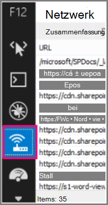

# <a name="content-delivery-networks-cdns"></a>Netzwerke für die Inhaltsübermittlung (CDNs)

*Dieser Artikel gilt sowohl für Microsoft 365 Enterprise als auch für Office 365 Enterprise.*

CDNs helfen Office 365 schnell und zuverlässig für Endbenutzer zu halten. Cloud-Dienste wie Office 365 verwenden CDNs zum Zwischenspeichern von statischen Objekten näher an den Browsern, die Sie anfordern, um die Downloads zu beschleunigen und die erkannte Endbenutzer Wartezeit zu verringern. Die Informationen in diesem Thema helfen Ihnen, sich über Inhalts Übermittlungs Netzwerke (CDNs) und deren Verwendung durch Office 365 zu informieren.

## <a name="what-exactly-is-a-cdn"></a>Was genau ist ein CDN?

Ein CDN ist ein geografisch verteiltes Netzwerk, das aus Proxy-und Dateiservern in Rechenzentren besteht, die über Hochgeschwindigkeits-Backbone-Netzwerke miteinander verbunden sind. CDNs werden verwendet, um Wartezeit und Ladezeiten für eine bestimmte Gruppe von Dateien und Objekten in einer Website oder einem Dienst zu verringern. Ein CDN kann viele Tausende von Endpunkten haben, um eingehende Anforderungen von einem beliebigen Standort aus optimal zu warten.

CDNs werden häufig verwendet, um schnellere Downloads generischer Inhalte für eine Website oder einen Dienst wie JavaScript-Dateien, Symbole und Bilder bereitzustellen, und Sie können auch privaten Zugriff auf Benutzer Inhalte wie Dateien in SharePoint Online Dokumentbibliotheken, Streaming Media-Dateien und benutzerdefinierten Code gewähren.

CDNs werden von den meisten Enterprise-Cloud-Diensten verwendet. Cloud-Dienste wie Office 365 haben Millionen von Kunden, die gleichzeitig eine Mischung aus proprietären Inhalten (beispielsweise e-Mails) und generischem Inhalt (wie Symbole) herunterladen. Es ist effizienter, Bilder, die jeder verwendet, wie Symbole, so nah wie möglich auf dem Computer des Benutzers zu platzieren. Es ist nicht praktisch, wenn jeder clouddienst CDN-Rechenzentren erstellt, in denen dieser generische Inhalt in allen Ballungsräumen oder sogar in allen wichtigen Internet-Hubs auf der ganzen Welt gespeichert ist, sodass einige dieser CDNs gemeinsam verwendet werden.

## <a name="how-do-cdns-make-services-work-faster"></a>Wie können CDNs Dienste schneller arbeiten?

Wenn Sie häufig verwendete Objekte wie Website Bilder und Symbole immer wieder herunterladen, kann dies eine Netzwerkbandbreite sein, die für das Herunterladen wichtiger persönlicher Inhalte wie e-Mail oder Dokumente besser verwendet werden kann. Da Office 365 eine Architektur mit CDNs verwendet, können die Symbole, Skripts und anderen generischen Inhalte von Servern heruntergeladen werden, die den Clientcomputern näher sind, wodurch die Downloads schneller werden. Dies bedeutet einen schnelleren Zugriff auf Ihre persönlichen Inhalte, der sicher in Office 365-Rechenzentren gespeichert wird.

CDNs hilft, die Leistung des Cloud-Diensts auf verschiedene Arten zu verbessern:

- CDNs verschieben Sie einen Teil der Netzwerk-und Dateidownload Last weg vom clouddienst, indem Sie Cloud-Dienst Ressourcen für die Bereitstellung von Benutzerinhalten und anderen Diensten freigeben, indem Sie Anforderungen für statische Ressourcen nicht mehr erfüllen müssen.
- CDNs sind speziell für die Bereitstellung von Dateizugriff mit niedriger Latenz durch Implementierung von Hochleistungsnetzwerken und Dateiservern sowie durch die Nutzung von aktualisierten Netzwerkprotokollen wie [http/2](https://en.wikipedia.org/wiki/HTTP/2) mit hocheffizienter Komprimierung und Anforderungs Multiplexing konzipiert.
- CDN-Netzwerke verwenden viele global verteilte Endpunkte, um den Benutzern Inhalte so nah wie möglich zur Verfügung zu stellen.

## <a name="the-office-365-cdn"></a>Das Office 365 CDN

Das integrierte Office 365 Inhalts Übermittlungs Netzwerk (CDN) ermöglicht es Office 365 Administratoren, eine bessere Leistung für die SharePoint Online Seiten Ihrer Organisation bereitzustellen, indem statische Objekte näher an den Browsern, die Sie anfordern, zwischengespeichert werden, was dazu beiträgt, Downloads zu beschleunigen und die Wartezeit zu verringern. Das Office 365 CDN verwendet das [http/2-Protokoll](https://en.wikipedia.org/wiki/HTTP/2) , um die Komprimierung und Downloadgeschwindigkeit zu verbessern.

> [!NOTE]
> Das Office 365 CDN steht nur Mandanten in der **Produktionsumgebung** (weltweit) zur Verfügung. Die Mandanten in der US-Regierung, in China und in Deutschland unterstützen derzeit nicht die Office 365 CDN.

Das Office 365-Netzwerk für die Inhaltsübermittlung besteht aus mehreren CDNs, über die Sie statische Objekte an mehreren Speicherorten hosten können, oder aus _Ursprüngen_, die aus globalen Hochgeschwindigkeitsnetzwerken bedient werden. In Abhängigkeit von der Art der Inhalte, die Sie im Office 365-Netzwerk für die Inhaltsübermittlung hosten möchten, können Sie **öffentliche** Ursprünge, **private** Ursprünge oder beides hinzufügen.


Auf Inhalte in **öffentlichen** Ursprüngen im Office 365-Netzwerk für die Inhaltsübermittlung kann anonym zugegriffen werden und von jeder Person, die URLs zu gehosteten Objekten aufweist. Da der Zugriff auf Inhalte in öffentlichen Ursprüngen anonym ist, sollten Sie diese nur zum Zwischenspeichern von nicht vertraulichen generischen Inhalten verwenden, z. B. JavaScript-Dateien, Skripts, Symbole oder Bilder. Das Office 365-Netzwerk für die Inhaltsübermittlung wird standardmäßig zum Herunterladen von allgemeinen Ressourcenobjekten verwenden, z. B. die Office 365-Clientanwendungen von einem öffentlichen Ursprung.

**Private** Ursprünge im Office 365 CDN bieten privaten Zugriff auf Benutzer Inhalte wie SharePoint Online Dokumentbibliotheken, Websites und proprietäre Bilder. Der Zugriff auf Inhalte in private Ursprüngen wird mit dynamisch generierten Token geschützt, auf diese Inhalte kann daher nur von Benutzern mit Berechtigungen für die ursprüngliche Dokumentbibliothek oder den ursprünglichen Speicherort zugegriffen werden. Private Ursprünge Office 365-Netzwerk für die Inhaltsübermittlung können nur für SharePoint Online-Inhalte verwendet werden, und Sie können auf Objekte nur über Umleitung von Ihrem SharePoint Online-Mandanten zugreifen.

Das Office 365-Netzwerk für die Inhaltsübermittlung ist in Ihrem SharePoint Online-Abonnement enthalten.

Weitere Informationen zur Verwendung des Office 365 CDN finden Sie unter [Verwenden des Office 365 Inhalts Zustellungs Netzwerks mit SharePoint Online](use-microsoft-365-cdn-with-spo.md).

Wenn Sie eine Reihe von kurzen Videos sehen möchten, die konzeptionelle und howto-Informationen zur Verwendung des Office 365 CDN bereitstellen, besuchen Sie den [YouTube-Kanal SharePoint Developer Patterns and Practices](https://aka.ms/sppnp-videos).

## <a name="other-microsoft-cdns"></a>Andere Microsoft-CDNs

Obwohl es sich nicht um einen Teil des Office 365 CDN handelt, können Sie diese CDNs in Ihrem Office 365-Mandanten für den Zugriff auf SharePoint-Entwicklungsbibliotheken, benutzerdefinierten Code und andere Zwecke verwenden, die außerhalb des Bereichs des Office 365 CDN liegen.

### <a name="azure-cdn"></a>Azure CDN

>[!NOTE]
>Ab Q3 2020 werden SharePoint Online mit dem Zwischenspeichern von Videos im Azure CDN beginnen, um eine verbesserte Videowiedergabe und Zuverlässigkeit zu unterstützen. Beliebte Videos werden aus dem CDN-Endpunkt gestreamt, der dem Benutzer am nächsten ist. Diese Daten verbleiben innerhalb der Microsoft 365-Konformitäts Grenze. Hierbei handelt es sich um einen kostenlosen Dienst für alle Mandanten, für den keine Kunden Aktion konfiguriert werden muss.

Sie können das **Azure CDN** verwenden, um Ihre eigene CDN-Instanz zum Hosten von benutzerdefinierten Webparts, Bibliotheken und anderen Ressourcenobjekten bereitzustellen, mit deren Hilfe Sie Zugriffsschlüssel auf Ihren CDN-Speicher anwenden und eine bessere Kontrolle über Ihre CDN-Konfiguration ausüben. Die Verwendung des Azure CDN ist nicht kostenlos und erfordert ein Azure-Abonnement.

Weitere Informationen zum Konfigurieren einer Azure CDN-Instanz finden Sie unter [Quick Start: Integrieren eines Azure-speicherkontos in Azure CDN](https://docs.microsoft.com/azure/cdn/cdn-create-a-storage-account-with-cdn).

Ein Beispiel dafür, wie das Azure CDN zum Hosten von SharePoint-Webparts verwendet werden kann, finden Sie unter [Bereitstellen des clientseitigen SharePoint-Webparts in Azure CDN](https://docs.microsoft.com/sharepoint/dev/spfx/web-parts/get-started/deploy-web-part-to-cdn).

Informationen zum Azure CDN PowerShell-Modul finden Sie unter [Manage Azure CDN with PowerShell](https://docs.microsoft.com/azure/cdn/cdn-manage-powershell).

### <a name="microsoft-ajax-cdn"></a>Microsoft AJAX CDN

Das **AJAX CDN** von Microsoft ist ein schreibgeschütztes CDN, das viele beliebte Entwicklungsbibliotheken wie jQuery (und alle anderen Bibliotheken), ASP.NET AJAX, Bootstrap, Knockout.js und andere bietet.
  
Um diese Skripts in Ihr Projekt einzuschließen, ersetzen Sie einfach alle Verweise auf diese öffentlich verfügbaren Bibliotheken durch Verweise auf die CDN-Adresse, anstatt Sie in Ihr Projekt selbst einzubeziehen. Verwenden Sie beispielsweise den folgenden Code, um eine Verknüpfung mit jQuery zu erstellen:

``` html
<script src=https://ajax.aspnetcdn.com/ajax/jquery-2.1.1.js> </script>
```

Weitere Informationen zur Verwendung des Microsoft AJAX CDN finden Sie unter [Microsoft AJAX CDN](https://docs.microsoft.com/aspnet/ajax/cdn/overview).

## <a name="how-does-office-365-use-content-from-a-cdn"></a>Wie verwendet Office 365 Inhalte aus einem CDN?

Unabhängig davon, welche CDN Sie für Ihren Office 365 Mandanten konfigurieren, ist der grundlegende Datenabruf Prozess identisch.

1. Ihr Client (ein Browser oder eine Office-Clientanwendung) fordert Daten von Office 365 an.

2. Office 365 die Daten entweder direkt an Ihren Client zurückgibt oder, wenn die Daten Teil einer Reihe von Inhalten sind, die vom CDN gehostet werden, leitet ihren Client an die CDN-URL um.

    a. Wenn die Daten bereits in einem _öffentlichen_ Ursprung zwischengespeichert sind, lädt Ihr Client die Daten direkt vom nächstgelegenen CDN-Standort zu Ihrem Client herunter.

    b. Wenn die Daten bereits in einem _privaten_ Ursprung zwischengespeichert sind, überprüft der CDN-Dienst die Berechtigungen Ihres Office 365 Benutzerkontos auf den Ursprung. Wenn Sie über Berechtigungen verfügen, generiert SharePoint Online dynamisch eine benutzerdefinierte URL aus dem Pfad zum Objekt im CDN und zwei Zugriffstoken und gibt die benutzerdefinierte URL an Ihren Client zurück. Anschließend lädt Ihr Client die Daten direkt vom nächstgelegenen CDN-Standort zu Ihrem Client herunter, indem Sie die benutzerdefinierte URL verwenden.

3. Wenn die Daten nicht im CDN zwischengespeichert werden, fordert der CDN-Knoten die Daten von Office 365 an und speichert dann die Daten für einen bestimmten Zeitraum zwischen, nachdem der Client die Daten heruntergeladen hat.

Das CDN stellt das nächstgelegene Rechenzentrum für den Browser des Benutzers dar und lädt mithilfe der Umleitung die angeforderten Daten von dort herunter. Die CDN-Umleitung ist schnell und kann Benutzern eine Menge Downloadzeit sparen.

## <a name="how-should-i-set-up-my-network-so-that-cdns-work-best-with-office-365"></a>Wie richte ich mein Netzwerk so ein, dass CDNs am besten mit Office 365 funktioniert?

Das Minimieren der Wartezeit zwischen Clients in Ihrem Netzwerk und CDN-Endpunkten ist die zentrale Überlegung, um eine optimale Leistung sicherzustellen. Sie können die in [Managing Office 365 Endpoints](managing-office-365-endpoints.md) beschriebenen bewährten Methoden verwenden, um sicherzustellen, dass die Netzwerkkonfiguration es Clientbrowsern ermöglicht, direkt auf das CDN zuzugreifen, anstatt CDN-Datenverkehr über zentrale Proxys weiterzuleiten, um eine unnötige Wartezeit zu vermeiden.

Sie können auch Office 365 Grundlegendes zur [Netzwerkkonnektivität](https://aka.ms/o365networkingprinciples) lesen, um die Konzepte für die Optimierung Office 365 Netzwerkleistung zu verstehen.

## <a name="is-there-a-list-of-all-the-cdns-that-office-365-uses"></a>Gibt es eine Liste aller CDNs, die Office 365 verwendet?

Die CDNs, die von Office 365 verwendet werden, können immer geändert werden, und in vielen Fällen sind mehrere CDN-Partner in dem Fall konfiguriert, dass eine nicht verfügbar ist. Der primäre CDNs, der von Office 365 verwendet wird, sind:

|CDN  |Company  |Verwendung  |Link  |
|---------|---------|---------|---------|
|Office 365 CDN     |Akamai         |Generische Objekte im öffentlichen Ursprung, SharePoint-Benutzer Inhalte in privater Herkunft         |[Verwenden des Office 365 Content Delivery Network mit SharePoint Online](use-microsoft-365-cdn-with-spo.md)         |
|Azure CDN     |Microsoft         |Benutzerdefinierter Code, SharePoint-Framework-Lösungen         |[Microsoft Azure CDN](https://azure.microsoft.com/documentation/services/cdn/)         |
|Microsoft AJAX CDN (schreibgeschützt)     |Microsoft         |Allgemeine Bibliotheken für AJAX, jQuery, ASP.net, Bootstrap, Knockout.js etc.         |[Microsoft AJAX CDN](https://docs.microsoft.com/aspnet/ajax/cdn/overview)         |

## <a name="what-performance-gains-does-a-cdn-provide"></a>Welche Leistungssteigerungen bietet ein CDN?

Es gibt viele Faktoren bei der Messung bestimmter Leistungsunterschiede zwischen direkt von Office 365 heruntergeladenen Daten und Daten, die aus einem bestimmten CDN heruntergeladen wurden, wie etwa Ihrem Standort relativ zu Ihrem Mandanten und dem nächstgelegenen CDN-Endpunkt, der Anzahl von Objekten auf einer Seite, die vom CDN bedient werden, und vorübergehenden Änderungen in der Netzwerkwartezeit und Bandbreite. Ein einfacher a/B-Test kann jedoch helfen, den Unterschied in der Downloadzeit für eine bestimmte Datei anzuzeigen.

Die folgenden Screenshots illustrieren den Unterschied in der Downloadgeschwindigkeit zwischen dem systemeigenen Dateispeicherort in Office 365 und der gleichen Datei, die im [Microsoft AJAX-Inhalts Zustellungs Netzwerk](https://docs.microsoft.com/aspnet/ajax/cdn/overview)gehostet wird. Diese Screenshots befinden sich auf der Registerkarte " **Netzwerk** " im Internet Explorer 11 Entwicklertools. Diese Screenshots zeigen die Wartezeit für die beliebte Bibliothek jQuery. Um diesen Bildschirm anzuzeigen, drücken Sie in Internet Explorer **F12** , und wählen Sie die Registerkarte **Netzwerk** aus, die mit einem WLAN-Symbol symbolisiert wird.
  

  
Dieser Screenshot zeigt die Bibliothek, die in den gestaltungsvorlagenkatalog auf der SharePoint Online Website hochgeladen wurde. Die Zeit, die zum Hochladen der Bibliothek benötigt wird, beträgt 1,51 Sekunden.
  

  
Der zweite Screenshot zeigt dieselbe Datei an, die vom CDN von Microsoft bereitgestellt wurde. Dieses Mal beträgt die Wartezeit etwa 496 Millisekunden. Dies ist eine große Verbesserung und zeigt, dass eine ganze Sekunde die gesamte Zeit zum Herunterladen des Objekts abrasiert wird.
  


## <a name="is-my-data-safe"></a>Sind meine Daten sicher?

Wir achten sorgfältig darauf, dass die Daten, die Ihr Unternehmen ausführen, geschützt werden. Die im Office 365 CDN gespeicherten Daten werden sowohl in der Transit-als auch in der Rest-Datenbank verschlüsselt, und der Zugriff auf Daten im Office 365 SharePoint CDN wird durch Office 365 Benutzerberechtigungen und Token-Autorisierung gesichert. Anforderungen für Daten im Office 365 SharePoint CDN müssen von Ihrem Office 365 Mandanten verwiesen (umgeleitet) werden, oder es wird kein Autorisierungstoken generiert.

Um sicherzustellen, dass Ihre Daten sicher bleiben, wird empfohlen, dass Sie niemals Benutzer Inhalte oder andere vertrauliche Daten in einem öffentlichen CDN speichern. Da der Zugriff auf Daten in einem öffentlichen CDN anonym ist, sollten öffentliche CDNs nur zum Hosten von generischem Inhalt wie Webskript Dateien, Symbolen, Bildern und anderen nicht vertraulichen Objekten verwendet werden.

> [!NOTE]
> Drittanbieter-CDN-Anbieter verfügen möglicherweise über Datenschutz-und Konformitätsstandards, die von den vom Office 365 Trust Center skizzierten Verpflichtungen abweichen. Daten, die über den CDN-Dienst zwischengespeichert werden, entsprechen möglicherweise nicht den Microsoft-Daten Verarbeitungsbedingungen (Standardrichtlinientag) und liegen möglicherweise außerhalb der Kompatibilitäts Grenzen des Office 365 Trust Centers.

Ausführliche Informationen zu Datenschutz und Datenschutz für Office 365 CDN-Anbieter finden Sie in den folgenden Themen:  

- Erfahren Sie mehr über Office 365 Schutz und Datenschutz im [Microsoft Trust Center](https://www.microsoft.com/trustcenter) .
- Erfahren Sie mehr über die Datenschutz-und Datensicherheit von Akamai im [Akamai Privacy Trust Center](https://www.akamai.com/us/en/about/compliance/data-protection-at-akamai.jsp) .
- Weitere Informationen zur Azure-Datenschutz-und Datensicherheit im [Azure Trust Center](https://azure.microsoft.com/overview/trusted-cloud/)

## <a name="how-can-i-secure-my-network-with-all-these-3rd-party-services"></a>Wie kann ich mein Netzwerk mit all diesen Drittanbieterdiensten sichern?

Durch die Nutzung einer umfassenden Gruppe von Partnerdiensten können Office 365 die Anforderungen an die Verfügbarkeit skalieren und erfüllen sowie die Benutzerfreundlichkeit bei der Verwendung von Office 365 verbessern. Zu den von Office 365 genutzten Drittanbieterdiensten gehören sowohl Zertifikatsperrlisten als auch wie CRL.Microsoft.com oder SA.symcb.com und CDNs; wie R3.res.Outlook.com. Jeder von Office 365 generierte CDN-FQDN ist ein benutzerdefinierter FQDN für Office 365. Wenn Sie auf Anforderung von Office 365 an einen FQDN gesendet werden, können Sie sicher sein, dass der CDN-Anbieter den FQDN und den zugrunde liegenden Inhalt an diesem Speicherort steuert.
  
Für Kunden, die Anforderungen für ein Microsoft-oder Office 365-Rechenzentrum aus Anforderungen abtrennen möchten, die für einen Drittanbieter bestimmt sind, haben wir Anleitungen zum [Verwalten von Office 365 Endpunkten](https://support.office.com/article/99cab9d4-ef59-4207-9f2b-3728eb46bf9a)verfasst.

## <a name="is-there-a-list-of-all-the-fqdns-that-leverage-cdns"></a>Gibt es eine Liste aller FQDNs, die CDNs nutzen?

Die Liste der FQDNs und Ihre Nutzung von CDNs ändern sich im Laufe der Zeit. Auf der Seite "veröffentlichte [Office 365 URLs und IP-Adressbereiche](https://go.microsoft.com/fwlink/p/?LinkID=293744) " erhalten Sie Informationen zu den neuesten FQDNs, die CDNs nutzen.

Sie können auch die [IP-Adresse und den URL-Webdienst Office 365](microsoft-365-ip-web-service.md) verwenden, um die aktuellen Office 365-URLs und IP-Adressbereiche anzufordern, die als CSV oder JSON formatiert sind.

## <a name="can-i-use-my-own-cdn-and-cache-content-on-my-local-network"></a>Kann ich eigene CDN-und Cacheinhalte in meinem lokalen Netzwerk verwenden?

Wir suchen ständig nach neuen Wegen zur Unterstützung unserer Kundenanforderungen und erforschen derzeit die Verwendung von Caching-Proxy Lösungen und anderen lokalen CDN-Lösungen.

Obwohl es sich nicht um einen Teil des Office 365 CDN handelt, können Sie auch das **Azure CDN** zum Hosten benutzerdefinierter Webparts, Bibliotheken und anderer Ressourcenobjekte verwenden, mit denen Sie Zugriffstasten auf Ihren CDN-Speicher anwenden und eine bessere Kontrolle über Ihre CDN-Konfiguration ausüben können. Die Verwendung des Azure CDN ist nicht kostenlos und erfordert ein Azure-Abonnement. Weitere Informationen zum Konfigurieren einer Azure CDN-Instanz finden Sie unter [Quick Start: Integrieren eines Azure-speicherkontos in Azure CDN](https://docs.microsoft.com/azure/cdn/cdn-create-a-storage-account-with-cdn).

## <a name="im-using-azure-expressroute-for-office-365-does-that-change-things"></a>Ich verwende Azure Express Route für Office 365, ändert sich die Situation?

[Azure Express Route für Office 365](azure-expressroute.md) stellt eine dedizierte Verbindung mit Office 365 Infrastruktur bereit, die aus dem öffentlichen Internet getrennt ist. Dies bedeutet, dass Clients weiterhin eine Verbindung über nicht-Express Route Verbindungen herstellen müssen, um eine Verbindung mit CDNs und einer anderen Microsoft-Infrastruktur herzustellen, die nicht explizit in der Liste der von Express Route unterstützten Dienste enthalten ist. Weitere Informationen zum Weiterleiten von spezifischem Datenverkehr wie Anforderungen für CDNs finden Sie unter [Office 365 Network Traffic Management](routing-with-expressroute.md).

## <a name="can-i-use-cdns-with-sharepoint-server-on-premises"></a>Kann ich CDNs mit SharePoint Server lokal verwenden?

Die Verwendung von CDNs ist nur in einem SharePoint Online Kontext sinnvoll und sollte mit SharePoint Server vermieden werden. Dies liegt daran, dass alle Vorteile rund um den geografischen Standort nicht wahr sind, wenn sich der Server ohnehin lokal oder geografisch geschlossen befindet. Wenn außerdem eine Netzwerkverbindung zu den Servern besteht, auf denen Sie gehostet wird, kann die Website ohne Internet Verbindung verwendet werden und kann daher die CDN-Dateien nicht abrufen. Andernfalls sollten Sie ein CDN verwenden, wenn es eine verfügbare und stabile für die Bibliothek und Dateien, die Sie für Ihre Website benötigen.
  
Mit diesem kurzen Link gelangen Sie wieder hierher zurück: [https://aka.ms/o365cdns](https://aka.ms/o365cdns)
  
## <a name="see-also"></a>Weitere Artikel

[Prinzipien von Office 365-Netzwerkverbindungen](https://aka.ms/o365networkingprinciples)

[Bewerten der Office 365-Netzwerkkonnektivität](assessing-network-connectivity.md)

[Verwalten von Office 365-Endpunkten](managing-office-365-endpoints.md)

[URLs und IP-Adressbereiche für Office 365](https://go.microsoft.com/fwlink/p/?LinkID=293744)

[Verwenden des Office 365 Content Delivery Network mit SharePoint Online](use-microsoft-365-cdn-with-spo.md)

[Microsoft Trust Center](https://www.microsoft.com/trustcenter)

[Optimieren der Leistung von Office 365](tune-microsoft-365-performance.md)
