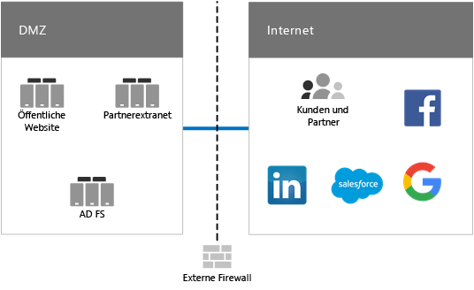
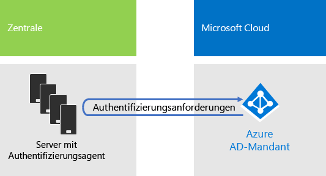
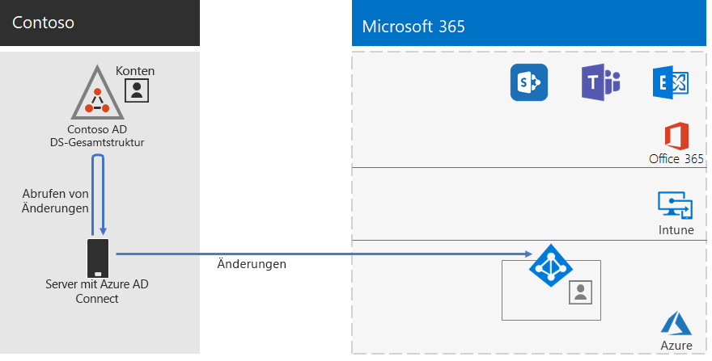
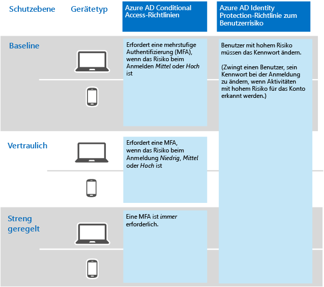

# Identität für die Contoso CorporationIdentity for the Contoso Corporation

**Zusammenfassung:** Wie Contoso IDaaS (Identity as a Service) nutzt und eine cloudbasierte Authentifizierung für seine Mitarbeiter und eine Verbundauthentifizierung für Partner und Kunden bereitstellt.**Summary:** How Contoso takes advantage of Identity as a Service (IDaaS) and provides cloud-based authentication for its employees and federated authentication for its partners and customers.

Microsoft bietet mit Azure Active Directory (AD) eine IDaaS (Identity as a Service, Identität als Dienst) in seinen Cloudangeboten. Um Microsoft 365 Enterprise einzuführen, muss für die IDaaS-Lösung von Contoso dessen lokaler Identitätsanbieter genutzt und Verbundauthentifizierung mit den vorhandenen vertrauenswürdigen Drittanbieter-Identitätsanbietern einbezogen werden.Microsoft provides an Identity as a Service (IDaaS) across its cloud offerings with Azure Active Directory (AD). To adopt Microsoft 365 Enterprise, Contoso's IDaaS solution had to leverage their on-premises identity provider and still include federated authentication with their existing trusted, third-party identity providers.

## Contosos Windows Server Active Directory-GesamtstrukturContoso's Windows Server AD forest

Contoso verwendet eine einzige Windows Server Active Directory-Gesamtstruktur für „contoso.com“ mit sieben Unterdomänen (eine für jede Region der Erde). Die Zentrale, Regionalstellen und Zweigstellen enthalten Domänencontroller für die lokale Authentifizierung und Autorisierung.Contoso uses a single Windows Server Active Directory (AD) forest for contoso.com with seven sub-domains, one for each region of the world. The headquarters, regional hub offices, and satellite offices contain domain controllers for local authentication and authorization.

Abbildung 1 zeigt die Contoso-Gesamtstruktur mit regionalen Domänen für die unterschiedlichen Regionen, die Regionalstellen enthalten.Figure 1 shows the Contoso forest with regional domains for the different parts of the world that contain regional hubs.

 
**Abbildung 1: Gesamtstruktur und Domänen von Contoso weltweit****Figure 1: Contoso's forest and domains worldwide**

Contoso möchte die Konten und Gruppen in der „contoso.com“-Gesamtstruktur zur Authentifizierung und Autorisierung seiner cloudbasierten Apps und Arbeitslasten verwenden.Contoso wants to use the accounts and groups in the contoso.com forest for authentication and authorization for its cloud-based apps and workloads.

## Contosos Infrastruktur der VerbundauthentifizierungContoso's federated authentication infrastructure

Contoso lässt Folgendes zu:Contoso allows:

- Kunden können ihre Microsoft-, Facebook- oder Google Mail-Konten verwenden, um sich bei ihren öffentlichen Websites anzumelden.Customers to use their Microsoft, Facebook, or Google Mail accounts to sign in to their public web site.
- Lieferanten und Partner können ihre LinkedIn-, Salesforce- oder Google Mail-Konten verwenden, um sich beim Partnerextranet anzumelden.Vendors and partners to use their LinkedIn, Salesforce, or Google Mail accounts to sign in to the partner extranet.

Abbildung 2 zeigt die Contoso-DMZ mit einer öffentlichen Website, einem Partnerextranet und einer Reihe von Active Directory Federation Services-Servern (AD FS). Die DMZ ist mit dem Internet verbunden, das Kunden, Partner und Internetdienste enthält.Figure 2 shows the Contoso DMZ containing a public web site, a partner extranet, and a set of Active Directory Federation Services (AD FS) servers. The DMZ is connected to the Internet that contains customers, partners, and Internet services.

**Abbildung 2: Contosos Unterstützung für die Verbundauthentifizierung für Kunden und Partner****Figure 2: Contoso's support for federated authentication for customers and partners**
 
AD FS-Server in der DMZ authentifizieren Kundenanmeldeinformationen für Zugriff auf die öffentliche Website und Partneranmeldeinformationen für Zugriff auf das Partnerextranet.AD FS servers in the DMZ authenticate customer credentials for access to the public web site and partner credentials for access to the partner extranet.

Contoso hat sich entschlossen, seine Infrastruktur beizubehalten und diese für die Kunden- und Partnerauthentifizierung zu verwenden. Die Identitätsingenieure bei Contoso befassen sich mit der Konvertierung dieser Infrastruktur in die Azure AD-Lösungen [B2B](https://docs.microsoft.com/azure/active-directory/b2b/hybrid-organizations) und [B2C](https://docs.microsoft.com/azure/active-directory-b2c/solution-articles).Contoso decided to keep this infrastructure and dedicate it to customer and partner authentications. Contoso identity engineers are investigating the conversion of this infrastructure to Azure AD [B2B](https://docs.microsoft.com/azure/active-directory/b2b/hybrid-organizations) and [B2C](https://docs.microsoft.com/azure/active-directory-b2c/solution-articles) solutions.

## Hybrididentität mit Durchsatzauthentifizierung für cloudbasierte AuthentifizierungHybrid identity with pass-through authentication for cloud-based authentication

Contoso wollte seine lokale Windows Server Active Directory-Gesamtstruktur für die Authentifizierung bei Microsoft 365 nutzen. Deshalb wurde eine Durchsatzauthentifizierung mit Kennworthashsynchronisierung eingeführt.Contoso wanted to leverage its on-premises Windows Server AD forest for authentication to Microsoft 365 cloud resources. It decided on pass-through authentication (PTA) with password hash synchronization (PHS).

### DurchsatzauthentifizierungPTA authentication

Für die Authentifizierung von Benutzeranmeldeinformationen verwendet Contoso die Durchsatzauthentifizierung. Wenn ein Contoso-Benutzer auf cloudbasierte Ressourcen zugreift, werden die gesendeten Anmeldeinformationen von Azure AD an einen Server im Rechenzentrum der Contoso-Zentrale übergeben, auf dem ein Authentifizierungs-Agent ausgeführt wird. Die Benutzeranmeldeinformationen werden im Auftrag von Azure AD von einem dieser Authentifizierungsserver überprüft.For authentication of user credentials, Contoso is using PTA. When a Contoso user accesses a cloud-based resources, the credentials it sends are passed by Azure AD to a server running an Authentication Agent in the Contoso headquarters datacenter. One of these Authentication Agent servers validates the user credentials on behalf of Azure AD.

In Abbildung 3 ist eine Reihe von Servern in der Contoso-Zentrale dargestellt, auf denen der Authentifizierungs-Agent ausgeführt wird und die Authentifizierungsanforderungen verarbeiten, die ihnen von Azure AD übergeben wurden.Figure 3 shows a set of servers in the Contoso headquarters running the Authentication Agent, which process authentication requests passed to it from Azure AD. 

 
**Abbildung 3: Infrastruktur der Durchsatzauthentifizierung bei Contoso****Figure 3: Contoso's pass-through authentication infrastructure**

Contoso hat sich für die Durchsatzauthentifizierung entschieden, um alle Sicherheitsanforderungen zu erfüllen. Dabei werden alle Authentifizierungsversuche auf unmittelbare Änderungen an Benutzerkontostatus, Kennwortrichtlinien und Anmeldestunden überprüft, die an der lokalen Windows Server AD-Gesamtstruktur erfolgen.Contoso chose PTA to fulfill its security requirement that all authentication attempts be evaluated for immediate changes to user account states, password policies, and sign-in hours made to the on-premises Windows Server AD forest.

### Kennworthashsynchronisierung (PHS)PHS

Bei der Kennworthashsynchronisierung wird die lokale Windows Server AD-Gesamtstruktur mit dem Azure AD-Mandanten ihres Microsoft 365 Enterprise-Abonnements synchronisiert, wobei Benutzer- und Gruppenkonten sowie eine Hashversion von Benutzerkontokennwörtern kopiert werden. Contoso hat sich für die Kennwortsynchronisierung entschieden, um eine alternative Authentifizierungsmethode direkt mit dem Azure AD-Mandanten bereitzustellen, falls die Durchsatzauthentifizierung nicht verfügbar ist.PHS synchronizes the on-premises Windows Server AD forest with the Azure AD tenant of their Microsoft 365 Enterprise subscription, copying user and group accounts and a hashed version of user account passwords. Contoso decided on PHS to provide an alternate method of authentication directly with the Azure AD tenant in the event that PTA is not available.

Um die laufende Verzeichnissynchronisierung durchzuführen, hat Contoso das Azure AD Connect-Tool auf einem Server im Rechenzentrum in Paris bereitgestellt. Abbildung 4 zeigt die Server mit Azure AD Connect, die die Windows Server Active Directory-Gesamtstruktur von Contoso auf Änderungen abfragt und diese Änderungen dann mit dem Azure AD-Mandanten synchronisiert.To perform the ongoing directory synchronization, Contoso has deployed the Azure AD Connect tool on a server in its Paris datacenter. Figure 4 shows the server running Azure AD Connect polling the Contoso Windows Server AD forest for changes and then synchronizing those changes with the Azure AD tenant.

 
**Abbildung 4: Infrastruktur für die PHS-Verzeichnissynchronisierung von Contoso****Figure 4: Contoso's PHS directory synchronization infrastructure**

## Richtlinien für bedingten Zugriff für IdentitätConditional access policies for identity

Contoso hat eine Reihe von [Richtlinien für bedingten Zugriff](identity-access-policies.md) in Azure AD erstellt, um sicherzustellen, dass eine mehrstufige Authentifizierung und Kennwortänderungen erzwungen werden, wenn Azure AD feststellt, dass ein Anmelderisiko für eine Authentifizierungsanfrage besteht.Contoso created a set of Azure AD [conditional access policies](identity-access-policies.md) to ensure that multi-factor authentication and password changes are enforced when Azure AD determines there is sign-in risk for an authentication request.

Abbildung 5 zeigt die resultierenden Richtlinien für bedingten Zugriff für Identität.Figure 5 shows their resulting set of conditional access policies for identity.

 
**Abbildung 5: Identitätsbasierte Richtlinien für bedingen Zugriff****Figure 5: Contoso’s identity-based conditional access policies**

## Nächster SchrittNext step

[Erfahren Sie](contoso-win10.md), wie Contoso seine System Center Configuration Manager-Infrastruktur verwendet, um Windows 10 Enterprise über die Organisation hinweg bereitzustellen und auf dem neuesten Stand zu halten.[Learn](contoso-win10.md) how Contoso is leveraging its System Center Configuration Manager infrastructure to deploy and keep current Windows 10 Enterprise across its organization.

## Siehe auchSee also

[Microsoft 365 EnterpriseIdentity for Microsoft 365 Enterprise](identity-infrastructure.md)

[BereitstellungshandbuchDeployment guide](deploy-microsoft-365-enterprise.md)

[TestumgebungsanleitungenTest lab guides](m365-enterprise-test-lab-guides.md)
