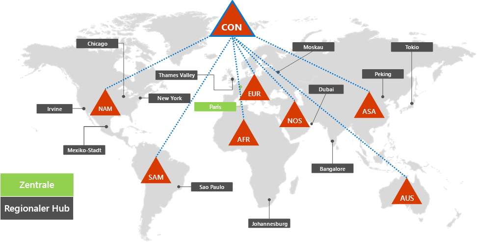
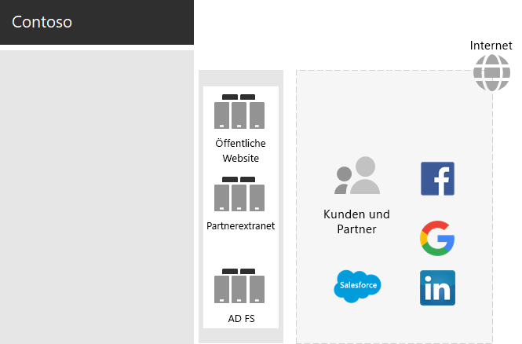
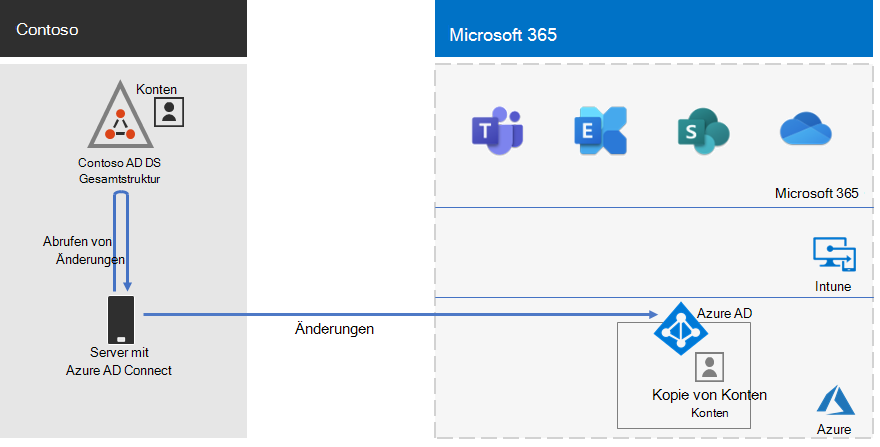
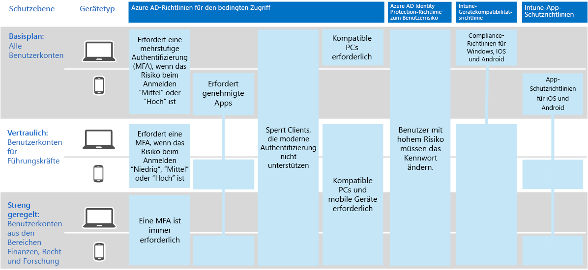

# Identität für die Contoso Corporation

Microsoft stellt Identity as a Service (IDaaS) über seine Cloudangebote über Azure Active Directory (Azure AD) bereit. Um Microsoft 365 enterprise zu übernehmen, musste die Contoso IDaaS-Lösung ihren lokalen Identitätsanbieter verwenden und die Verbundauthentifizierung mit ihren vorhandenen vertrauenswürdigen Identitätsanbietern von Drittanbietern umfassen.

## Die Gesamtstruktur "Contoso Active Directory Domain Services"

Contoso verwendet eine einzelne Active Directory Domain Services (AD DS)-Gesamtstruktur für contoso com mit sieben Unterdomänen, eine für jede Region \. der Welt. Die Zentrale, die Regionalstellen und die Zweigstellen enthalten Domänencontroller für die lokale Authentifizierung und Autorisierung.

Hier sehen Sie die Contoso-Gesamtstruktur mit regionalen Domänen für die verschiedenen Teile der Welt, die regionale Hubs enthalten.

 
Contoso hat beschlossen, die Konten und Gruppen in der contoso com-Gesamtstruktur für die Authentifizierung und Autorisierung für seine \. Microsoft 365-Workloads und -Dienste zu verwenden.

## Die Contoso-Verbundauthentifizierungsinfrastruktur

Contoso lässt Folgendes zu:

- Kunden können ihre Microsoft-, Facebook- oder Google Mail-Konten verwenden, um sich bei der öffentlichen Website des Unternehmens zu anmelden.
- Anbieter und Partner können ihre LinkedIn-, Salesforce- oder Google Mail-Konten verwenden, um sich beim Partner-Extranet des Unternehmens zu anmelden.

Hier sehen Sie die Contoso-DMZ mit einer öffentlichen Website, einem Partner-Extranet und einer Reihe von Active Directory Federation Services (AD FS)-Servern. Die DMZ ist mit dem Internet verbunden, das Kunden, Partner und Internetdienste enthält.

 
AD FS-Server in der DMZ erleichtern die Authentifizierung von Kundenanmeldeinformationen durch ihre Identitätsanbieter für den Zugriff auf die öffentliche Website und Partneranmeldeinformationen für den Zugriff auf das Partner-Extranet.

Contoso hat beschlossen, diese Infrastruktur zu behalten und sie der Kunden- und Partnerauthentifizierung zu widmen. Die Identitätsarchitekten bei Contoso befassen sich mit der Konvertierung dieser Infrastruktur in die Azure AD-Lösungen [B2B](/azure/active-directory/b2b/hybrid-organizations) und [B2C](/azure/active-directory-b2c/solution-articles).

## Hybrididentität mit Kennwort-Hash-Synchronisierung für cloudbasierte Authentifizierung

Contoso wollte seine lokale AD DS-Gesamtstruktur für die Authentifizierung bei Microsoft 365-Cloudressourcen verwenden. Sie hat sich für die Verwendung der Kennworthashsynchronisierung (Password Hash Synchronization, PHS) entschieden.

PHS synchronisiert die lokale AD #A0 mit dem Azure #A1 ihres Microsoft 365 #A1 und kopiert Benutzer- und Gruppenkonten sowie eine Hashversion von Benutzerkontenkennwörtern.

Für die Verzeichnissynchronisierung hat Contoso das Azure AD Connect-Tool auf einem Server im Pariser Rechenzentrum bereitgestellt.

Hier ist der Server, auf dem Azure AD Connect ausgeführt wird, der die Contoso AD DS-Gesamtstruktur auf Änderungen abruft und diese Änderungen dann mit dem Azure AD-Mandanten synchronisiert.

 
## Richtlinien für bedingten Zugriff für Identitäts- und Gerätezugriff

Contoso hat eine Gruppe von Azure AD- und Intune-[Richtlinien für bedingten Zugriff](../security/office-365-security/identity-access-policies.md) für drei Schutzebenen erstellt:

- *Grundlegende* Schutzbestimmungen gelten für alle Benutzerkonten.
- *Vertrauliche* Schutzmaßnahmen gelten für leitende Führungskräfte und Führungskräfte.
- *Streng regulierte* Schutzbestimmungen gelten für bestimmte Benutzer in den Finanz-, Rechts- und Forschungsabteilungen, die Zugriff auf streng regulierte Daten haben.

Hier sehen Sie den resultierenden Satz von Richtlinien für den bedingten Zugriff für Contoso-Identität und Geräte.

 
## Nächster Schritt

Erfahren Sie, wie Contoso seine Microsoft Endpoint Configuration Manager-Infrastruktur verwendet, um [Windows 10 Enterprise](contoso-win10.md) in der gesamten Organisation zu bereitstellen und auf dem aktuellen Stand zu halten.

## Siehe auch

[Identitäts-Roadmap für Microsoft 365](identity-roadmap-microsoft-365.md)

[Übersicht über Microsoft 365 Enterprise](microsoft-365-overview.md)

[Testumgebungsanleitungen](m365-enterprise-test-lab-guides.md)