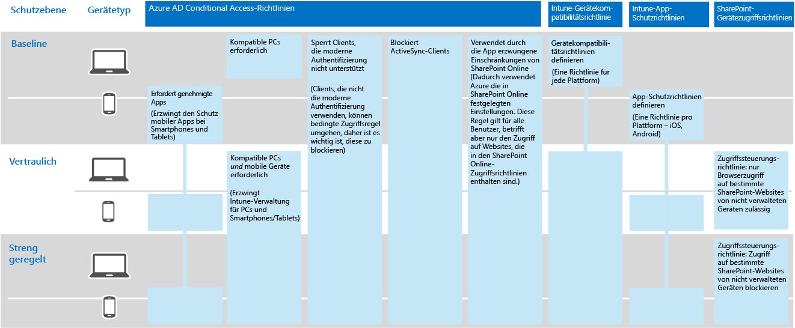

# Informationsschutz für die Contoso Corporation

**Zusammenfassung:** Verstehen, wie Contoso Features für den Informationsschutz in Microsoft 365 Enterprise verwendet, um digitale Datenbestände in der Cloud zu sichern.

Contoso ist die Sicherheit und der Schutz seiner Informationen äußerst wichtig. So würde zum Beispiel der unbefugte Zugriff auf das geistige Eigentum des Unternehmens, das heißt die Beschreibung von Produktdesigns und eigene Herstellungstechniken, oder dessen Zerstörung zu einem enormen Wettbewerbsnachteil führen.

Bevor das Unternehmen seine vertraulichen und wertvollen Datenbestände in die Cloud verschob, stellte es sicher, dass die seine lokalen Informationsklassifizierung und Schutzanforderungen in den cloudbasierten Diensten von Microsoft 365 Enterprise unterstützt und implementiert wurden.

## Contosos Datensicherheitsklassifizierung

Contoso führte eine Analyse der Daten durch und ermittelte die folgenden Stufen.

||||
|:-------|:-----|:-----|
| **Stufe 1: Baseline** | **Stufe 2: Vertraulich** | **Stufe 3: Hochgradig reguliert** |
| Daten sind verschlüsselt und nur für authentifizierte Benutzer verfügbar     Dies gilt für alle Daten, die lokal und in cloudbasierten Speichern und Arbeitslasten gespeichert sind, z. B. Office 365. Daten werden verschlüsselt, während sie sich im Dienst und im Übergang zwischen dem Dienst und Clientgeräten befinden.    Beispiele für die Daten der Stufe 1 sind normale Geschäftskommunikation (E-Mail) und Dateien für Mitarbeiter in der Verwaltung, im Vertrieb oder im Kundendienst. | Stufe 1 plus strenger Authentifizierung und Schutz vor Datenverlust:     Eine starke Authentifizierung umfasst eine mehrstufige Authentifizierung mit SMS-Validierung. Durch eine Verhinderung von Datenverlust wird sichergestellt, dass vertrauliche oder kritische Informationen das lokale Netzwerk nicht verlassen.    Beispiele für Daten der Stufe 2 sind Finanz- und rechtliche Informationen sowie Forschungs- und Entwicklungsdaten für neue Produkte. | Stufe 2 plus höchstmöglicher Verschlüsselung, Authentifizierung und Überwachung.      Die höchstmögliche, den regionalen Regelungen entsprechende Verschlüsselung für gespeicherte Daten oder Daten in der Cloud kombiniert mit mehrstufiger Authentifizierung über Smartcards und präzise Überwachung und Benachrichtigung.     Beispiele für Daten der Stufe 3 sind personenbezogene Kunden- und Partnerdaten sowie technische Produktspezifikationen und proprietäre Fertigungsverfahren.  |
||||

## Contosos Datenrichtlinien
In der folgenden Tabelle sind die Informationsrichtlinien von Contoso aufgeführt.

|||||
|:-------|:-----|:-----|:-----|
|  | **Access** | **Datenaufbewahrung** | **Schutz von Daten** |
| Stufe 1: Geringer Geschäftswert (Baseline) | Zugriff auf alles zulassen  | 6 Monate | Verschlüsselung verwenden |
| Stufe 2: Mittlerer Geschäftswert (Vertraulich) | Zugriff für Mitarbeiter, Subunternehmer und Partner von Contoso zulassen     Mehrstufige Authentifizierung (MFA), Transport Layer Security (TLS) und mobile Anwendungsverwaltung (Mobile Application Management, MAM) verwenden | 2 Jahre  | Hashwerte für Datenintegrität verwenden  |
| Stufe 3: Hoher Geschäftswert (Hochgradig reguliert) | Zugriff für Manager und Führungskräfte in Technik und Fertigung zulassen     Rechteverwaltungssystem (Rights Management System, RMS) nur mit verwalteten Netzwerkgeräten  | 7 Jahre  | Digitale Signaturen für Nachweisbarkeit (Unleugbarkeit) verwenden  |
|||||

## Contosos Weg zum Informationsschutz mit Microsoft 365 Enterprise

Contoso führte die folgenden Schritte aus, um Microsoft 365 Enterprise für seine Anforderungen zum Informationsschutz vorzubereiten:

1. Ermitteln, welche Informationen geschützt werden müssen

   Contoso führte eine umfassende Prüfung der vorhandenen digitalen Datenbestände durch, die sich auf lokalen SharePoint-Websites und auf Dateifreigaben befinden, und klassifizierte sie einzeln.

2. Festlegen des Zugriffs, der Aufbewahrung und der Informationsschutzrichtlinien für Datenstufen

   Basierend auf den Datenstufen ermittelte Contoso detaillierte Richtlinienanforderungen, die zum Schützen vorhandener digitaler Datenbestände während des Verschiebens in die Cloud verwendet wurden.

3. Erstellen von Azure Information Protection-Bezeichnungen und ihrer Einstellungen für die verschiedenen Informationsstufen

   Contoso passte die Azure Information Protection-Bezeichnungen durch Titel an, die seinen Datenstufen entsprechen, und konfigurierte die Bezeichnungen für vertrauliche und hochgradig regulierte Datenbestände für die Verschlüsselung mit dem Azure-Cloudschlüssel. Das Unternehmen erstellte untergeordnete Bezeichnungen der Bezeichnung „Hochgradig reguliert“ für bestimmte Typen von Geschäftsgeheimnisdaten und beschränkte den Zugriff auf bestimmte Forschungs- und Entwicklungsgruppen. Contoso hat darüber hinaus den Azure Information Protection-Client auf allen Windows-PCs und Geräten bereitgestellt.

4. Erstellen geschützter SharePoint Online-Websites für vertrauliche und hochgradig regulierten Daten mit Berechtigungen, die den Zugriff einschränken

   Sowohl sensible als auch hochgradig regulierte Seiten wurden als [isolierte Websites](https://docs.microsoft.com/office365/enterprise/isolated-sharepoint-online-team-sites) konfiguriert, in denen die Standardberechtigungen für SharePoint Online-Teamwebsites zu Azure AD-Gruppen angepasst wurden. Sensible und hochgradig regulierte SharePoint Online-Websites wurden ebenfalls mit einem standardmäßigen Office 365-Etikett konfiguriert. Dateien, die auf hochgradig regulierten SharePoint Online-Websites gespeichert werden, werden durch ein Azure Information Protection (API) Unter-Etikett einer Bereichsrichtlinie geschützt. Weitere Informationen finden Sie im Szenario [Microsoft Teams und SharePoint Online-Websites für hochgradig regulierte Daten](teams-sharepoint-online-sites-highly-regulated-data.md).

5.  Verschieben der Daten von den lokalen SharePoint-Websites und Dateifreigaben in die neuen SharePoint Online-Websites

    Die Dateien, die in die neuen SharePoint Online-Websites migriert wurden, übernahmen die standardmäßigen Office 365-Bezeichnungen, die der Website zugewiesen waren.

6.  Schulen der Mitarbeiter im Hinblick auf die Verwendung von Azure Information Protection-Bezeichnungen für neue Dokumente, die Interaktion mit den Contoso-IT-Mitarbeitern beim Erstellen neuer SharePoint Online-Websites und das stetige Speichern von digitalen Datenbeständen in SharePoint Online-Websites

    Folgendes galt als der schwierigste Teil des Informationsschutzübergangs in die Cloud: Die IT-Mitarbeiter von Contoso und das Management mussten die schlechten Angewohnheiten der Mitarbeiter, wenn es um Informationsspeicherung geht, ändern und sie anhalten, digitale Datenbestände immer mit Bezeichnungen zu versehen und nie lokale Dateifreigaben zu verwenden.

## Bedingte Zugriffsrichtlinien für Informationsschutz

Contoso konfigurierte zusammen mit seiner Identitäts- und Verwaltungsstruktur für die mobile Geräteverwaltung sowie als Teil des Exchange Online-Rollouts die folgenden Sätze von bedingten Zugriffsrichtlinien und wendete sie auf die entsprechenden Azure AD-Gruppen an:

- [Richtlinien für den verwalteten und nicht verwalteten Zugriff auf Geräteanwendungen](identity-access-policies.md)
- [Exchange Online-Zugriffsrichtlinien](secure-email-recommended-policies.md)
- [SharePoint-Zugriffsrichtlinien](sharepoint-file-access-policies.md)

Abbildung 1 zeigt den von Contoso erstellten Satz von Informationsschutzrichtlinien.

**Abbildung 1: Bedinge Zugriffsrichtlinien für Geräte, Exchange Online und SharePoint Online**
 
>[!Note]
>Contoso konfigurierte darüber hinaus zusätzliche bedingte Zugriffsrichtlinien für Identität und Anmeldung. Siehe [Identität für die Contoso Corporation](contoso-identity.md).
>

Diese Richtlinien stellen Folgendes sicher:

- App-Schutzrichtlinien definieren, welche Apps zulässig sind und die Aktionen, die diese Apps mit den Unternehmensdaten ausführen kann.
- PCs und mobile Geräte müssen diesen Richtlinien entsprechen.
- Exchange Online verwendet die Nachrichtenverschlüsselung von Office 365 für Exchange Online.
- SharePoint Online verwendet die durch die App erzwungenen Einschränkungen.
- SharePoint Online verwendet Zugriffssteuerungsrichtlinien für den reinen Browserzugriff und zum Blockieren des Zugriffs über nicht verwaltete Geräte.

## Zuordnen von Microsoft 365 Enterprise-Features zu den Datenstufen von Contoso

Die folgende Tabelle zeigt die Zuordnung der Datenstufen von Contoso zu den Informationsschutzfeatures in Microsoft 365 Enterprise.

|||||
|:-------|:-----|:-----|:-----|
| | **Office 365** | **Windows 10 und Office 365 ProPlus** | **EMS** |
| Stufe 1: Baseline  | Bedingte Zugriffsrichtlinien für SharePoint Online und Exchange Online   Berechtigungen für SharePoint Online-Websites | Azure Information Protection Client   BitLocker   Windows Information Protection | Bedingte Zugriffsrichtlinien für Geräte und MAM-Richtlinien (Mobile Application Management) |
| Stufe 2: Hochgradig vertraulich | Stufe 1: Baseline plus:     Azure Information Protection-Bezeichnungen   Office 365-Bezeichnungen in SharePoint Online-Websites   Office 365-DLP (Data Loss Prevention, Verhinderung von Datenverlust) für SharePoint Online und Exchange Online   Isolierte SharePoint Online-Websites  | Stufe 1: Baseline plus:     Azure Information Protection-Bezeichnungen für digitale Datenbestände   Office 365 Advanced Data Governance | Stufe 1: Baseline |
| Stufe 3: Hochgradig reguliert | Stufe 2: Hochgradig vertraulich plus:    BYOK-Verschlüsselung („Bring Your Own Key“, Bereitstellen eines eigenen Schlüssels) und Schutz von Geschäftsgeheimnissen   Azure Key Vault für Branchenlösungen, die mit Diensten von Office 365 interagieren | Stufe 2: Hochgradig vertraulich | Stufe 1: Baseline |
|||||

## Nächster Schritt

[Sehen Sie sich an](contoso-security-summary.md), wie Contoso das volle Spektrum der Microsoft 365 Enterprise-Sicherheitsfeatures für Identitäts- und Zugriffsverwaltung, Bedrohungsschutz, Informationsschutz und Sicherheitsverwaltung verwendet.

## Siehe auch

[Informationsschutz für Microsoft 365 Enterprise](infoprotect-infrastructure.md)

[Bereitstellungshandbuch](deploy-microsoft-365-enterprise.md)

[Testumgebungsanleitungen](m365-enterprise-test-lab-guides.md)

