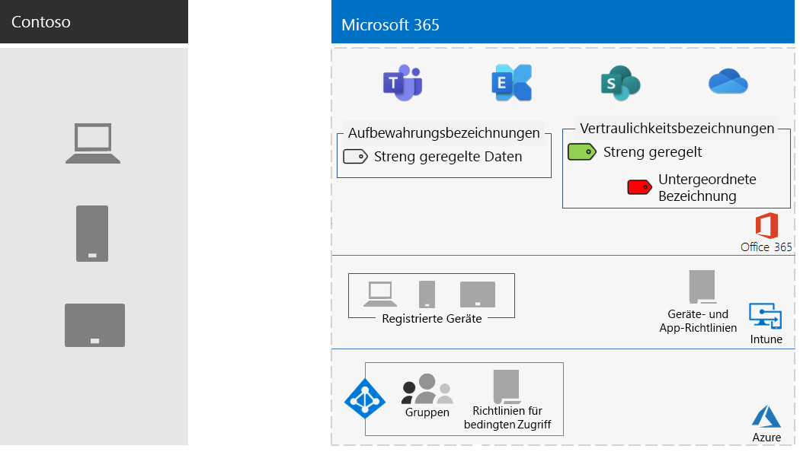

# Informationsschutz für die Contoso Corporation

Contoso ist die Sicherheit und der Schutz seiner Informationen äußerst wichtig. So würde zum Beispiel der unbefugte Zugriff auf das geistige Eigentum des Unternehmens, das heißt die Beschreibung von Produktdesigns und eigene Herstellungstechniken, oder dessen Zerstörung zu einem enormen Wettbewerbsnachteil führen.

Bevor das Unternehmen seine vertraulichen und wertvollen Datenbestände in die Cloud verschob, stellte es sicher, dass die seine lokalen Informationsklassifizierung und Schutzanforderungen in den cloudbasierten Diensten von Microsoft 365 Enterprise unterstützt und implementiert wurden.

## Contosos Datensicherheitsklassifizierung

Contoso führte eine Analyse der Daten durch und ermittelte die folgenden Stufen.

||||
|:-------|:-----|:-----|
| **Stufe 1: Baseline** | **Stufe 2: Vertraulich** | **Stufe 3: Hochgradig reguliert** |
| Daten sind verschlüsselt und nur für authentifizierte Benutzer verfügbar.     Dies gilt für alle Daten, die lokal und in cloudbasierten Speichern und Arbeitslasten gespeichert sind, z. B. Office 365. Daten werden verschlüsselt, während sie sich im Dienst und im Übergang zwischen dem Dienst und Clientgeräten befinden.    Beispiele für die Daten der Stufe 1 sind normale Geschäftskommunikation (E-Mail) und Dateien für Mitarbeiter in der Verwaltung, im Vertrieb oder im Kundendienst. | Stufe 1 plus strenger Authentifizierung und Schutz vor Datenverlust.     Eine starke Authentifizierung umfasst Azure Multi-Factor Authentication (MFA) mit SMS-Validierung. Durch eine Verhinderung von Datenverlust wird sichergestellt, dass vertrauliche oder kritische Informationen die Microsoft-Cloud nicht verlassen.    Beispiele für Daten der Stufe 2 sind Finanz- und rechtliche Informationen sowie Forschungs- und Entwicklungsdaten für neue Produkte. | Stufe 2 plus höchstmöglicher Verschlüsselung, Authentifizierung und Überwachung.      Die höchstmögliche, den regionalen Regelungen entsprechende Verschlüsselung für gespeicherte Daten oder Daten in der Cloud kombiniert mit MFA über Smartcards und präzise Überwachung und Benachrichtigung.     Beispiele für Daten der Stufe 3 sind personenbezogene Kunden- und Partnerdaten sowie technische Produktspezifikationen und proprietäre Fertigungsverfahren.  |
||||

## Contosos Datenrichtlinien
In der folgenden Tabelle sind die Informationsrichtlinien von Contoso aufgeführt.

|||||
|:-------|:-----|:-----|:-----|
|  | **Access** | **Datenaufbewahrung** | **Schutz von Daten** |
| Geringer Geschäftswert (Stufe 1: Baseline) | Zugriff auf alles zulassen  | 6 Monate | Verschlüsselung verwenden. |
| Mittlerer Geschäftswert (Stufe 2: Vertraulich) | Zugriff für Mitarbeiter, Subunternehmer und Partner von Contoso zulassen     MFA, Transport Layer Security (TLS) und mobile Anwendungsverwaltung (Mobile Application Management, MAM) verwenden. | 2 Jahre  | Hashwerte für Datenintegrität verwenden.  |
| Hoher Geschäftswert (Stufe 3: Hochgradig reguliert) | Zugriff für Manager und Führungskräfte in Technik und Fertigung zulassen.     Rechteverwaltungssystem (Rights Management System, RMS) nur mit verwalteten Netzwerkgeräten.  | 7 Jahre  | Digitale Signaturen für Nachweisbarkeit (Unleugbarkeit) verwenden.  |
|||||

## Contosos Weg zum Informationsschutz mit Microsoft 365 Enterprise

Contoso führte die folgenden Schritte aus, um Microsoft 365 Enterprise für seine Anforderungen zum Informationsschutz vorzubereiten:

1. Ermitteln, welche Informationen geschützt werden müssen

   Contoso führte eine umfassende Prüfung der vorhandenen digitalen Datenbestände durch, die sich auf lokalen SharePoint-Websites und auf Dateifreigaben befinden, und klassifizierte sie einzeln.

2. Festlegen des Zugriffs, der Aufbewahrung und der Informationsschutzrichtlinien für Datenstufen

   Basierend auf den Datenstufen ermittelte Contoso detaillierte Richtlinienanforderungen, die zum Schützen vorhandener digitaler Datenbestände während des Verschiebens in die Cloud verwendet wurden.

3. Erstellen von Vertraulichkeitsbezeichnungen und Einstellungen für die verschiedenen Informationsstufen

   Contoso hat Vertraulichkeitsbezeichnungen (hochgradig reguliert) für seine Datenstufen erstellt, die Verschlüsselung, Berechtigungen und Wasserzeichen umfasst.

4. Erstellen geschützter SharePoint-Websites für vertrauliche und hochgradig regulierten Daten mit Berechtigungen, die den Zugriff einschränken

   Sowohl vertrauliche als auch streng regulierte Websites wurden als private Teamwebsites mit zusätzlichen Berechtigungseinschränkungen konfiguriert. Vertrauliche und hochgradig regulierte SharePoint-Websites wurden auch mit einer entsprechenden Aufbewahrungsbezeichnung konfiguriert. Auf hochgradig regulierten SharePoint-Websites gespeicherte Dateien werden durch eine Vertraulichkeitsunterbezeichnung der Bezeichnung "Hochgradig reguliert" geschützt. Weitere Informationen finden Sie im Szenario [SharePoint-Websites für streng regulierte Daten](teams-sharepoint-online-sites-highly-regulated-data.md).

5.  Verschieben der Daten von den lokalen SharePoint-Websites und Dateifreigaben in die neuen SharePoint-Websites

    Die Dateien, die zu den neuen SharePoint-Websites migriert wurden, übernahmen die standardmäßigen Aufbewahrungsbezeichnungen, die der Website zugewiesen waren.

6.  Schulen der Mitarbeiter im Hinblick auf die Verwendung von Aufbewahrungsbezeichnungen für neue Dokumente, die Interaktion mit den Contoso-IT-Mitarbeitern beim Erstellen neuer SharePoint-Websites und das stetige Speichern von digitalen Assets auf SharePoint-Websites

    Folgendes galt als der schwierigste Teil des Informationsschutzübergangs in die Cloud: Die IT-Mitarbeiter von Contoso und das Management mussten die schlechten Angewohnheiten der Mitarbeiter, wenn es um Informationsspeicherung geht, ändern und sie anhalten, digitale Assets immer mit Bezeichnungen zu versehen und zu speichern, keine lokalen Dateifreigaben und nie Cloudspeicherdienste von Drittanbietern oder USB-Laufwerke zu verwenden.

## Bedingte Zugriffsrichtlinien für Informationsschutz

Contoso konfigurierte zusammen mit seiner Infrastruktur für die Verwaltung von Identitäten und mobilen Geräten sowie als Teil des Exchange Online- und SharePoint-Rollouts die folgenden Sätze von bedingten Zugriffsrichtlinien und wendete sie auf die entsprechenden Gruppen an:

- [Richtlinien für den verwalteten und nicht verwalteten Zugriff auf Geräteanwendungen](identity-access-policies.md)
- [Exchange Online-Zugriffsrichtlinien](secure-email-recommended-policies.md)
- [SharePoint-Zugriffsrichtlinien](sharepoint-file-access-policies.md)

Hier sehen Sie den von Contoso erstellten Satz von Informationsschutzrichtlinien.

>[!Note]
>Contoso konfigurierte darüber hinaus zusätzliche bedingte Zugriffsrichtlinien für Identität und Anmeldung. Siehe [Identität für die Contoso Corporation](contoso-identity.md#conditional-access-policies-for-identity-and-device-access).
>

Diese Richtlinien stellen Folgendes sicher:

- Apps sind zulässig und die Aktionen, die diese Apps mit den Unternehmensdaten ausführen können, werden durch die App-Schutzrichtlinien definiert.
- PCs und mobile Geräte müssen diesen Richtlinien entsprechen.
- Exchange Online verwendet die Nachrichtenverschlüsselung von Office 365 für Exchange Online.
- SharePoint verwendet die durch die App erzwungenen Einschränkungen.
- SharePoint verwendet Zugriffssteuerungsrichtlinien für den reinen Browserzugriff und zum Blockieren des Zugriffs über nicht verwaltete Geräte.

## Zuordnen von Microsoft 365 Enterprise-Features zu den Datenstufen von Contoso

Die folgende Tabelle ordnet die Datenstufen von Contoso zu den Informationsschutzfeatures in Microsoft 365 Enterprise zu.

|||||
|:-------|:-----|:-----|:-----|
| | **Office 365** | **Windows 10 und Microsoft 365 Apps for Enterprise** | **EMS** |
| Stufe 1: Baseline  | Bedingte Zugriffsrichtlinien für SharePoint und Exchange Online   Berechtigungen für SharePoint-Websites | Vertraulichkeitsbezeichnungen   BitLocker   Windows Information Protection | Bedingte Zugriffsrichtlinien für Geräte und MAM-Richtlinien (Mobile Application Management) |
| Stufe 2: Vertraulich | Stufe 1 plus:     Vertraulichkeitsbezeichnungen   Microsoft 365-Aufbewahrungsbezeichnungen auf SharePoint-Websites   Verhinderung von Datenverlust für SharePoint und Exchange Online   Isolierte SharePoint-Websites  | Stufe 1 plus:     Vertraulichkeitsbezeichnungen auf digitalen Assets  | Stufe 1 |
| Stufe 3: Hochgradig reguliert | Stufe 2 plus:    BYOK-Verschlüsselung („Bring Your Own Key“, Bereitstellen eines eigenen Schlüssels) und Schutz von Geschäftsgeheimnissen   Azure Key Vault für Branchenlösungen, die mit Diensten von Microsoft 365 interagieren | Stufe 2 | Stufe 1 |
|||||

Hier sehen Sie die resultierende Informationsschutzkonfiguration von Contoso.

## Nächster Schritt

[Sehen Sie sich an](contoso-security-summary.md), wie Contoso das volle Spektrum der Microsoft 365 Enterprise-Sicherheitsfeatures für Identitäts- und Zugriffsverwaltung, Bedrohungsschutz, Informationsschutz und Sicherheitsverwaltung verwendet.

## Siehe auch

[Informationsschutz für Microsoft 365 Enterprise](infoprotect-infrastructure.md)

[Bereitstellungshandbuch](deploy-microsoft-365-enterprise.md)

[Testumgebungsanleitungen](m365-enterprise-test-lab-guides.md)

