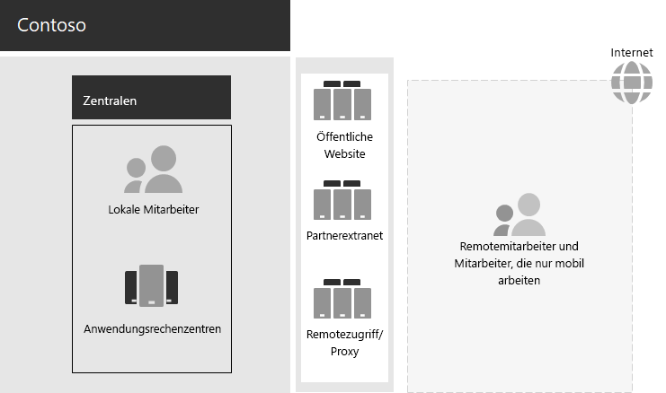

# IT-Infrastruktur und geschäftliche Anforderungen von ContosoContoso's IT infrastructure and business needs

**Zusammenfassung:** Informationen zur grundlegenden Struktur der lokalen IT-Infrastruktur von Contoso und wie die Unternehmensanforderungen mithilfe von Microsoft 365 Enterprise erfüllt wurden.**Summary:** Understand the basic structure of Contoso's on-premises IT infrastructure and how its business needs can be met by Microsoft 365 Enterprise.

Contoso ist dabei, von der lokalen zentralen IT-Infrastruktur auf eine cloudeinschließende Infrastruktur umzustellen, die aus cloudbasierten persönlichen Produktivitätsarbeitslasten und Anwendungen besteht.Contoso has been transitioning from an on-premises, centralized IT infrastructure to a cloud-inclusive one that incorporates cloud-based personal productivity workloads and applications.

## Contosos vorhandene IT-InfrastrukturContoso's existing IT infrastructure

Contoso nutzt eine weitestgehend zentrale lokale IT-Infrastruktur mit Anwendungsrechenzentren in der Pariser Zentrale.Contoso uses a mostly centralized on-premises IT infrastructure, with application datacenters in the Paris headquarters.

Abbildung 1 zeigt eine Unternehmenszentrale mit Anwendungsrechenzentren, einer DMZ und Internet.Figure 1 shows a headquarters office with application datacenters, a DMZ, and the Internet.

**Abbildung 1: Contosos vorhandene IT-Infrastruktur****Figure 1: Contoso's existing IT infrastructure**
 
In den lokalen Anwendungsrechenzentren wird Folgendes gehostet:The on-premises application datacenters host: 

- Benutzerdefinierte Branchenanwendungen, die SQL Server und andere Linux-Datenbanken verwenden.Custom line of business applications that use SQL Server and other Linux databases.
- Eine Reihe von älteren SharePoint-Servern.A set of legacy SharePoint servers.
- Server auf Organisations- und Teamebene für das Speichern von Dateien.Organization and team-level servers for file storage.

Darüber hinaus unterstützt jedes regionales Hub-Büro eine Reihe von Servern mit einer ähnlichen Gruppe von Anwendungen.Additionally, each regional hub office that supports a set of servers with a similar set of applications. These servers are under the control of regional IT departments. Diese Server werden von regionalen IT-Abteilungen gesteuert.These servers are under the control of regional IT departments.

Die Durchsuchbarkeit über die Anwendungen und Daten dieser separaten Rechenzentren an mehreren geografischen Standorten hinweg bleibt eine Herausforderung.Searchability across the applications and data of these separate multi-geographical datacenters continues to be a challenge.

In der DMZ am Hauptsitz von Contoso bieten verschiedene Servergruppen Folgendes:In Contoso's headquarters DMZ, different sets of servers provide:

- Hosting der öffentlichen Contoso-Website, über die Kunden Produkte, Teile, Zubehör oder Dienstleistungen bestellen können.Hosting for the Contoso public web site, from which customers can order products, parts, supplies, or service.
- Hosting für das Contoso-Partnerextranet für die Kommunikation und Zusammenarbeit mit Partnern.Hosting for the Contoso partner extranet for partner communication and collaboration.
- VPN-basierter Remotezugriff (virtuelles privates Netzwerk) auf das Contoso-Intranet und Webproxyfunktion für Mitarbeiter in der Pariser Zentrale.VPN-based remote access to the Contoso intranet and web proxying for workers in the Paris headquarters.

## Contosos GeschäftsanforderungenContoso's business needs

Die Geschäftsanforderungen von Contoso können in fünf Hauptkategorien unterteilt werden.Contoso's business needs fall into five main categories.

Produktivität:Productivity:

- Vereinfachen der ZusammenarbeitMake collaboration easier

  Ersetzen Sie die auf E-Mails und Dateifreigaben basierte Zusammenarbeit durch ein Onlinemodell, das Echtzeitänderungen an Dokumenten, einfachere Onlinebesprechungen und erfasste Unterhaltungsthreads ermöglicht.Replace the email and file share-based collaboration with an online model that allows real-time changes on documents, easier online meetings, and captured conversation threads.
- Mehr Produktivität für Telearbeiter und MobilmitarbeiterImprove productivity for remote and mobile workers

  Viele Mitarbeiter arbeiten von zu Hause aus oder unterwegs – ersetzen Sie daher die zu Engpässen führende VPN-Lösung durch leistungsstarken Zugriff auf Contoso-Daten und -Ressourcen in der Cloud.With many employees working from homes or in the field, replace the bottlenecked VPN solution with performant access to Contoso data and resources in the cloud.
- Mehr Kreativität und InnovationIncrease creativity and innovation

  Nutzen Sie die Vorteile der neuesten visuellen Lern- und Ideenfindungsmethoden, einschließlich Freihand und 3D-Visualisierung.Take advantage of the latest visual learning and idea development methods, including inking and 3D visualization.

Sicherheit:Security:

- Identitäts- und ZugriffsverwaltungIdentity and access management

  Erzwingen Sie die mehrstufige Authentifizierung und andere Formen der Authentifizierung, und schützen Sie Anmeldeinformationen von Benutzer- und Administratorkonten.Enforce multi-factor and other forms of authentication and protect user and administrator account credentials.

- BedrohungsschutzThreat protection

  Schutz vor externen Sicherheitsrisiken, einschließlich Schadsoftware, die auf E-Mails oder dem Betriebssystem basiert.Protect against external security threats, including email and operating system-based malware.

- Schutz von DatenInformation protection

  Sperren Sie den Zugriff auf wichtige digitale Ressourcen, und verschlüsseln Sie diese (z. B. Kundendaten, Entwurfs- und Fertigungsspezifikationen und Mitarbeiterinformationen).Lock down access to and encrypt high-value digital assets, such as customer data, design specifications, and employee information.

- SicherheitsverwaltungSecurity management

  Überwachen des Sicherheitszustands und Ermitteln von sowie Reagieren auf Bedrohungen in Echtzeit.Monitor security posture and be able to detect and respond to threats in real time.

Remote- und Mobilzugriff und Geschäftspartner:Remote and mobile access and business partners:

- Mehr Sicherheit für Telearbeiter und MobilmitarbeiterBetter security for remote and mobile workers

  Führen Sie BYOD (Bring Your Own Device) und die Verwaltung von firmeneigenen Geräten ein, um einen sicheren Zugriff, ein korrektes Anwendungsverhalten sowie den Schutz von Unternehmensdaten zu gewährleisten.Institute Bring Your Own Device (BYOD) and company-owned device management to ensure secured access, correct application behavior, and company data protection.

- Verkleinern der Remotezugriffsinfrastruktur für MitarbeiterReduce remote access infrastructure for employees

  Senken Sie die Wartungs- und Supportkosten, und verbessern Sie die Leistung für Remotezugriffslösungen, indem Sie Ressourcen, auf die häufig zugegriffen wird, in die Cloud verschieben.Reduce maintenance and support costs and improve performance for remote access solution by moving resources commonly accessed to the cloud.

- Bessere Konnektivität und weniger Aufwand für Business-to-Business-Transaktionen (B2B)Provide better connectivity and lower overhead for Business-to-Business (B2B) transactions

  Ersetzen Sie das in die Jahre gekommene Partnerextranet durch eine cloudbasierte Lösung, für die Verbundauthentifizierung verwendet wird.Replace aging and expensive partner extranet with a cloud-based solution that uses federated authentication.

Compliance:Compliance:

- Einhalten von regionalen gesetzlichen VorschriftenAdhere to regional regulatory requirements

  Halten Sie branchenübliche und regionale Vorschriften für Datenspeicherung, Verschlüsselung und Datenschutz sowie Vorschriften für personenbezogene Daten ein, z. B. die DSGVO für die Europäische Union.Become and remain compliant with industry and regional regulations for data storage, encryption, data privacy, and personal data regulations, such as the General Data Protection Regulation (GDPR) for the Europe Union.

Verwaltung:Management:

- Reduzieren des IT-Aufwands für die Verwaltung von Software, die auf Clientcomputern und -geräten ausgeführt wirdLower the IT overhead for managing software running on client PCs and devices

  Automatisieren Sie die Installation von Updates auf dem Windows-Betriebssystem und in Microsoft Office ProPlus in der gesamten Organisation.Automate the installation of updates to the Windows operating system and Microsoft Office across the organization.

## Zuordnen der Geschäftsanforderungen von Contoso zu Microsoft 365 EnterpriseMapping Contoso's business needs to Microsoft 365 Enterprise

Von der IT-Abteilung von Contoso wurde vor der Bereitstellung die folgende Zuordnung von Geschäftsanforderungen zu den Features von Microsoft 365 Enterprise E5 vorgenommen:Contoso's IT department determined the following mapping of business needs to Microsoft 365 Enterprise E5 features prior to deployment:

||||
|:-------|:-----|:-----|
| **Kategorie****Category** | **Geschäftsanforderung****Business need** | **Produkte oder Features von Microsoft 365 Enterprise****Microsoft 365 Enterprise products or features** |
| ProduktivitätProductivity |  |  |
|  | Vereinfachen der ZusammenarbeitMake collaboration easier | Microsoft Teams, SharePoint, OneDriveMicrosoft Teams, SharePoint, OneDrive |
|  | Mehr Produktivität für Telearbeiter und MobilmitarbeiterImprove productivity for remote and mobile workers | Microsoft 365-Arbeitslasten und cloudbasierte DatenOffice 365 workloads and cloud-based data |
|  | Mehr Kreativität und InnovationIncrease creativity and innovation | Windows Ink, Cortana at Work, PowerPointWindows Ink, Cortana at Work, PowerPoint |
| SicherheitSecurity |  |  |
|  | Identitäts- und ZugriffsverwaltungIdentity & access management | Dedizierte globale Administratorkonten mit Azure Multi-Factor Authentication (MFA) und Azure AD Privileged Identity Management (PIM)Dedicated global administrator accounts with Multi-factor authentication (MFA) and Azure AD Privileged Identity Management (PIM)   Mehrstufige Authentifizierung (MFA) für alle BenutzerkontenMFA for all user accounts   Bedingter ZugriffConditional access   Windows HelloWindows Hello   Windows Credential GuardWindows Credential Guard |
|  | BedrohungsschutzThreat protection | Advanced Threat AnalyticsAdvanced Threat Analytics   Windows DefenderWindows Defender   Advanced Threat ProtectionAdvanced Threat Protection   Office 365 Advanced Threat ProtectionOffice 365 Advanced Threat Protection   Untersuchung von und Antwort auf Bedrohungen in Office 365Office 365 threat investigation and response   |
|  | Schutz von DatenInformation protection | Azure Information ProtectionAzure Information Protection   Verhinderung von Datenverlust in Office 365Office 365 Data Loss Prevention (DLP)   Windows Information Protection (WIP)Windows Information Protection DataRecoveryCertificate   Microsoft Cloud App SecurityMicrosoft Cloud App Security   Microsoft IntuneMicrosoft Intune |
|  | SicherheitsverwaltungSecurity management | Azure Security CenterAzure Security Center    Windows Defender Security CenterWindows Defender Security Center |
| Remote- und Mobilzugriff und GeschäftspartnerRemote and mobile access and business partners |  |  |
|  | Mehr Sicherheit für Telearbeiter und MobilmitarbeiterBetter security for remote and mobile workers | Microsoft IntuneMicrosoft Intune |
|  | Verkleinern der Remotezugriffsinfrastruktur für MitarbeiterReduce remote access infrastructure for employees | Microsoft 365-Arbeitslasten und cloudbasierte DatenOffice 365 workloads and cloud-based data |
|  | Bessere Konnektivität und weniger Aufwand für B2B-TransaktionenProvide better connectivity and lower overhead for B2B transactions | Verbundauthentifizierung und cloudbasierte RessourcenFederated authentication and cloud-based resources |
| ComplianceCompliance |  |  |
|  | Einhalten von regionalen gesetzlichen VorschriftenAdhere to regional regulatory requirements | DSGVO-Features in Office 365GDPR features in Office 365 |
| VerwaltungManagement |  |  |
|  | Reduzieren des IT-Aufwands für die Installation von ClientupdatesLower the IT overhead for installing client updates | BereitstellungsringeDeployment rings   Windows 10 Enterprise-UpdatesWindows 10 Enterprise   Office 365 ProPlus-UpdatesOffice 365 ProPlus |
||||

## Nächster SchrittNext step

[Erfahren Sie mehr](contoso-networking.md) über das lokale Netzwerk von Contoso und wie dieses im Hinblick auf Zugriff und Latenz für cloudbasierte Microsoft 365-Ressourcen optimiert wurde.[Learn](contoso-networking.md) about the Contoso Corporation’s on-premises network and how it was optimized for access and latency to Microsoft 365 cloud-based resources across its organization.

## Siehe auchSee also

[BereitstellungshandbuchDeployment guide](deploy-microsoft-365-enterprise.md)

[TestumgebungsanleitungenTest lab guides](m365-enterprise-test-lab-guides.md)
