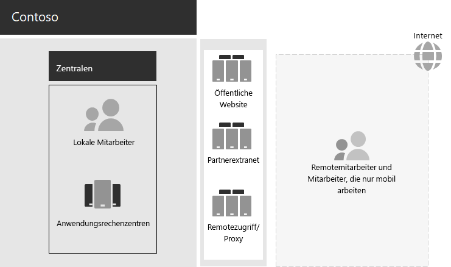

# Contoso IT-Infrastruktur und Geschäftsanforderungen

Contoso wandelt von einer lokalen, zentralisierten IT-Infrastruktur zu einem cloud-inklusiven Setup um, das cloudbasierte Arbeitsauslastungen und Anwendungen für persönliche Produktivität umfasst.

## Vorhandene Contoso-IT-Infrastruktur

Contoso nutzt eine weitestgehend zentrale lokale IT-Infrastruktur mit Anwendungsrechenzentren in der Pariser Zentrale.

Hier ist die Zentrale mit Anwendungsdatencentern, einer DMZ und dem Internet.

In den lokalen Anwendungsrechenzentren wird Folgendes gehostet: 

- Benutzerdefinierte Geschäftsanwendungen, die SQL Server und andere Linux-Datenbanken verwenden.
- Eine Reihe von älteren SharePoint-Servern.
- Server auf Organisations- und Teamebene für das Speichern von Dateien.

Darüber hinaus unterstützt jedes regionales Hub-Büro eine Reihe von Servern mit einer ähnlichen Gruppe von Anwendungen. Diese Server werden von regionalen IT-Abteilungen gesteuert.

Die Durchsuchbarkeit über die Anwendungen und Daten dieser separaten Rechenzentren an mehreren geografischen Standorten hinweg bleibt eine Herausforderung.

In der Contoso-Zentrale DMZ bieten verschiedene Servergruppen:

- Hosting für die öffentliche Contoso-Website, auf der Kunden Produkte, Teile, Lieferungen und Dienste bestellen können.
- Hosting für das Contoso-Partnerextranet für die Kommunikation und Zusammenarbeit mit Partnern.
- VPN-basierter Remotezugriff (virtuelles privates Netzwerk) auf das Contoso-Intranet und Webproxyfunktion für Mitarbeiter in der Pariser Zentrale.

## Contoso-Geschäftsanforderungen

Die Unternehmensanforderungen von Contoso sind in fünf Hauptkategorien unterteilt:

**Produktivität**

- Vereinfachen der Zusammenarbeit

  Ersetzen Sie die E-Mail- und Dateifreigabe-basierte Zusammenarbeit durch ein Onlinemodell, das Echtzeitänderungen an Dokumenten, einfachere Onlinebesprechungen und aufgezeichnete Unterhaltungsthreads ermöglicht.
- Mehr Produktivität für Telearbeiter und Mobilmitarbeiter

  Da viele Mitarbeiter von zu Hause oder in der Umgebung arbeiten, ersetzen Sie die eng engpässe VPN-Lösung durch einen performanten Zugriff auf Contoso-Daten und -Ressourcen in der Cloud.
- Mehr Kreativität und Innovation

  Nutzen Sie die Vorteile der neuesten visuellen Lern- und Ideenfindungsmethoden, einschließlich Freihand und 3D-Visualisierung.

**Sicherheit**

- Identitäts- und Zugriffsverwaltung

  Erzwingen Sie mehrstufige und andere Authentifizierungsmethoden, und schützen Sie Die Anmeldeinformationen für Benutzer- und Administratorkonten.

- Bedrohungsschutz

  Schutz vor externen Sicherheitsrisiken, einschließlich Schadsoftware, die auf E-Mails oder dem Betriebssystem basiert.

- Schutz von Daten

  Sperren Sie den Zugriff auf wichtige digitale Ressourcen, und verschlüsseln Sie diese (z. B. Kundendaten, Entwurfs- und Fertigungsspezifikationen und Mitarbeiterinformationen).

- Sicherheitsverwaltung

  Überwachen Sie die Sicherheitslage, erkennen und reagieren Sie auf Bedrohungen in Echtzeit.

**Remote- und Mobilzugriff und Geschäftspartner**

- Verbessern der Sicherheit für Remote- und mobile Mitarbeiter

  Implementieren Sie bring your own device (BYOD) and company-owned device management, um sicheren Zugriff, korrektes Anwendungsverhalten und Unternehmensdatenschutz sicherzustellen.

- Verkleinern der Remotezugriffsinfrastruktur für Mitarbeiter

  Reduzieren Sie Wartungs- und Supportkosten, und verbessern Sie die Leistung der Remotezugriffslösung, indem Sie häufig verwendete Ressourcen in die Cloud verschieben.

- Bessere Konnektivität und geringerer Aufwand für Business-to-Susiness (B2B)-Transaktionen

  Ersetzen Sie ein veraltetes und teures Partner-Extranet durch eine cloudbasierte Lösung, die die Verbundauthentifizierung verwendet.

**Compliance**

- Einhalten von regionalen gesetzlichen Vorschriften

  Sicherstellen der Einhaltung der branchen- und regionalen Vorschriften für Datenspeicherung, Verschlüsselung, Datenschutz und personenbezogene Daten, wie z. B. die DSGVO für die Europäische Union.

**Verwaltung**

- Geringerer IT-Aufwand für die Verwaltung von Software, die auf Client-PCs und -Geräten ausgeführt wird

  Automatisieren Sie die Installation von Updates Windows Betriebssystem und Microsoft 365 Apps for Enterprise in der gesamten Organisation.

## Zuordnung von Contoso-Unternehmen muss Microsoft 365 unternehmen

Die Contoso-IT-Abteilung hat die folgende Zuordnung der Geschäftsanforderungen für Microsoft 365 E5 vor der Bereitstellung bestimmt:

| Kategorie | Geschäftsanforderung | Microsoft 365 für Enterprise-Produkte oder -Features |
|:-------|:-----|:-----|
| Produktivität |  |  |
|  | Vereinfachen der Zusammenarbeit | Microsoft Teams, SharePoint, OneDrive |
|  | Mehr Produktivität für Telearbeiter und Mobilmitarbeiter | Microsoft 365-Arbeitslasten und cloudbasierte Daten |
|  | Mehr Kreativität und Innovation | Windows Ink, Cortana at Work, PowerPoint |
| Sicherheit |  |  |
|  | Identitäts- und Zugriffsverwaltung | Dedizierte globale Administratorkonten mit Azure AD Multi-Factor Authentication (MFA) und Azure AD Privileged Identity Management (PIM)   Mehrstufige Authentifizierung (MFA) für alle Benutzerkonten   Bedingter Zugriff   Windows Hello   Windows Credential Guard |
|  | Bedrohungsschutz | Advanced Threat Analytics   Windows Defender   Microsoft Defender für Office 365   Microsoft Defender für Office 365   Microsoft 365 und Reaktion auf Bedrohungen   |
|  | Schutz von Daten | Azure Information Protection   Verhinderung von Datenverlust (Data Loss Prevention, DLP)   Windows Information Protection (WIP)   Microsoft Cloud App Security   Microsoft Intune |
|  | Sicherheitsverwaltung | Azure Defender    Windows Defender Security Center |
| Remote- und Mobilzugriff und Geschäftspartner |  |  |
|  | Mehr Sicherheit für Telearbeiter und Mobilmitarbeiter | Microsoft Intune |
|  | Verkleinern der Remotezugriffsinfrastruktur für Mitarbeiter | Microsoft 365-Arbeitslasten und cloudbasierte Daten |
|  | Verbessern der Konnektivität und geringerer Aufwand für B2B-Transaktionen | Verbundauthentifizierung und cloudbasierte Ressourcen |
| Compliance |  |  |
|  | Einhalten von regionalen gesetzlichen Vorschriften | DSGVO-Features in Microsoft 365 |
| Verwaltung |  |  |
|  | Geringerer IT-Aufwand für die Installation von Clientupdates | Windows 10 Enterprise-Updates   Microsoft 365 Apps for Enterprise-Updates |
||||

## Nächster Schritt

Erfahren Sie mehr über das lokale Netzwerk der Contoso [Corporation](contoso-networking.md) und darüber, wie es für den Zugriff und die Wartezeit auf Microsoft 365 cloudbasierten Ressourcen optimiert wurde.

## Siehe auch

[Übersicht über Microsoft 365 Enterprise](microsoft-365-overview.md)

[Testumgebungsanleitungen](m365-enterprise-test-lab-guides.md)
