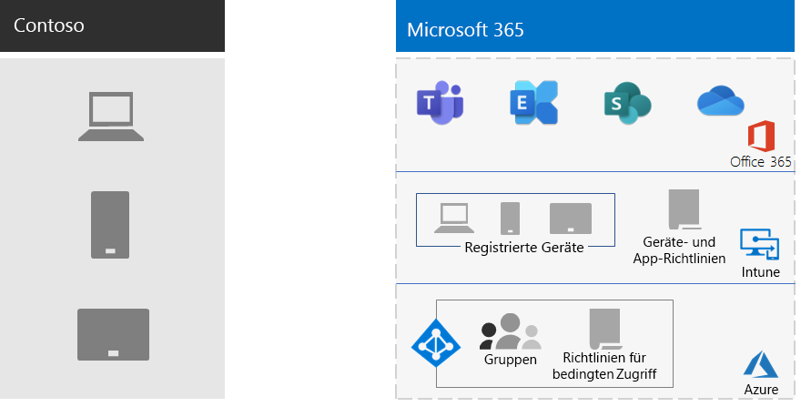

# Verwaltung mobiler Geräte bei ContosoMobile device management for Contoso

Microsoft 365 für Unternehmen umfasst InTune und eine Gruppe von Azure-Diensten, die die Verwaltung mobiler Geräte und Anwendungen sowie die Sicherheit unterstützen.Microsoft 365 for enterprise includes Intune and a set of Azure services that support mobile device and application management and security.

Contoso verfügt über viele Mobil aktivierte Mitarbeiter. Einige haben Niederlassungen an Contoso-Standorten und einige haben keine Büros. Contoso benötigte eine Möglichkeit, die Mitarbeiterproduktivität zu ermöglichen, aber die Geräte, die auf diesen Geräten gespeicherten Contoso-Daten und das Anwendungsverhalten sicher zu halten.Contoso has many mobile-enabled employees. Some have offices in Contoso locations, and some have no offices. Contoso needed a way to enable employee productivity but keep the devices, the Contoso data stored on those devices, and application behavior secure.

## PlanPlan

Contoso hat die folgenden InTune-Anwendungsfälle für die Verwaltung mobiler Geräte für Microsoft 365 für Unternehmen identifiziert:Contoso identified the following Intune use cases of mobile device management for Microsoft 365 for enterprise:

- Schützen Sie Exchange Online e-Mails und Daten, damit Sie auf mobilen Geräten sicher zugänglich sind.Protect Exchange Online email and data so it can be safely accessed by mobile devices.
- Implementieren Sie ein BYOD-Programm ("Holen Sie Ihr eigenes Gerät") für Contoso-Mitarbeiter.Implement a bring-your-own-device (BYOD) program for Contoso employees.
- Stellen Sie die unternehmenseigenen Telefone und die Limited-use Shared Tablets für Contoso-Mitarbeiter aus.Issue organization-owned phones and limited-use shared tablets to Contoso employees.

Contoso verwendet InTune nicht für Folgendes:Contoso doesn't use Intune to:

- Ermöglichen Sie Mitarbeitern den sicheren Zugriff auf Microsoft 365 von einem nicht verwalteten öffentlichen Kiosk aus.Allow employees to securely access Microsoft 365 from an unmanaged public kiosk.
- Schützen Sie lokale e-Mails und Daten, damit Sie auf mobilen Geräten sicher zugegriffen werden kann, da keine lokalen Microsoft Exchange Server vorhanden sind.Protect on-premises email and data so it can be safely accessed by mobile devices, because there are no on-premises Microsoft Exchange servers.

## BereitstellenDeploy

Contoso hat seine Infrastruktur für die Verwaltung mobiler Geräte folgendermaßen eingerichtet:This is how Contoso set up their mobile device management infrastructure:

- Festlegen von InTune als MDM-Autorität (Mobile Device Management) und Verwenden von InTune in Azure zum Verwalten von Inhalten und Verwalten der GeräteSet Intune as the Mobile Device Management (MDM) authority, and use Intune on Azure to administer content and manage the devices
- Erstellt Azure Active Directory (Azure AD) Gruppen für Geräte für die Registrierung und InTune-Einstellungen und gerätebasierte Richtlinien für bedingten ZugriffCreated Azure Active Directory (Azure AD) groups for devices for enrollment and Intune settings and device-based Conditional Access policies

  Weitere Informationen finden Sie unter [bedingte Zugriffsrichtlinien für Contoso](contoso-identity.md#conditional-access-policies-for-identity-and-device-access).For more information, see [Contoso Conditional Access policies](contoso-identity.md#conditional-access-policies-for-identity-and-device-access).

- Die Apple-Geräteplattform wurde aktiviert, um Mitarbeiter mit iPads, iMacs und iPhones sowie unternehmenseigenen iPhones zu unterstützen.Enabled the Apple device platform to support employees with iPads, iMacs, and iPhones, and corporate-owned iPhones
- Es wurden Contoso-spezifische Nutzungsbedingungen erstellt, die während der Installation des Unternehmensportals für Contoso auf mobilen Geräten angezeigt werden.Created Contoso-specific terms and conditions policies, which are seen during the installation of the Company Portal for Contoso on mobile devices
- Für Geräte, die nicht registriert sind, wurde eine Reihe von MAM-Richtlinien (Mobile Application Management) implementiert, um die Authentifizierung für den Zugriff auf Microsoft 365-Dienste zu erfordern.For devices that aren't enrolled, implemented a set of Mobile Application Management (MAM) policies to require authentication for access to Microsoft 365 services
- Es wurden Intune-Richtlinien erstellt, die Folgendes erzwingen:Created Intune policies that enforce:
  - Zugelassene apps.Allowed apps.
  - Geräteverschlüsselung zur Verhinderung von nicht autorisiertem Zugriff.Device encryption to help prevent unauthorized access.
  - Eine sechsstellige PIN oder ein Kennwort.A six-digit PIN or password.
  - Ein Timeoutzeitraum für Inaktivität.An inactivity-timeout period.
  - Antiviren-und Malware Schutz sowie Signaturupdates mit Windows Defender auf Windows 10-Geräten.Antivirus and malware protection, and signature updates with Windows Defender on Windows 10 devices.
  - Automatische Updates auf Windows 10-Geräten, die die neuesten Sicherheitsupdates enthalten.Automatic updates on Windows 10 devices that include the latest security updates.
  - Pushing Certificates to Managed Devices.Pushing certificates to managed devices.
  - Eine klare Trennung der geschäftlichen und persönlichen Daten. Benutzer oder Administratoren können Unternehmensdaten selektiv vom Gerät löschen, aber persönliche Daten wie Bilder, persönliche E-Mail-Konten und persönliche Dateien unberührt lassen.A clear separation of business and personal data. Users or admins can selectively wipe corporate data from the device, while leaving personal data such as pictures, personal email accounts, and personal files untouched.

Contoso hat bereitgestellte PCs und unternehmenseigene Smartphones und Tablets registriert, indem Sie Sie den entsprechenden InTune-Gerätegruppen hinzugefügt haben.Contoso enrolled deployed PCs and company-owned smartphones and tablets by adding them to the appropriate Intune device groups. Sie haben außerdem ein BYOD-Programm für Mitarbeiter eingerichtet, die Ihre persönlichen Geräte registrieren.They also established a BYOD program for employees to enroll their personal devices. Für registriertes Gerät werden InTune-Richtlinien empfangen, die verwaltete und gesicherte Geräte und deren Anwendungen zur Folge haben.Enrolled devices receive Intune policies, which results in managed and secured devices and their applications. Für Geräte, die nicht registriert sind, gibt es Richtlinien für Mobile Anwendungsverwaltung (MAM), die zugelassene Anwendungen angeben.Devices that aren't enrolled have Mobile Application Management (MAM) policies that specify allowed applications.

Hier ist die Bereitstellungsarchitektur für die Mobile Geräteverwaltung von contoso.Here is the Contoso mobile device management deployment architecture.

## Nächster SchrittNext step

[Erfahren Sie](contoso-info-protect.md) , wie Contoso die Informationen Schutzfunktionen von Microsoft 365 für Unternehmen verwendet, um wichtige digitale Objekte in Ihrer Organisation zu klassifizieren, zu identifizieren und zu schützen.[Learn](contoso-info-protect.md) how Contoso uses the information protection capabilities of Microsoft 365 for enterprise to classify, identify, and protect crucial digital assets across its organization.

## Siehe auchSee also

[Geräteverwaltung für Microsoft 365Device management for Microsoft 365](device-management-roadmap-microsoft-365.md)

[Übersicht über Microsoft 365 EnterpriseMicrosoft 365 for enterprise overview](microsoft-365-overview.md)

[TestumgebungsanleitungenTest lab guides](m365-enterprise-test-lab-guides.md)

