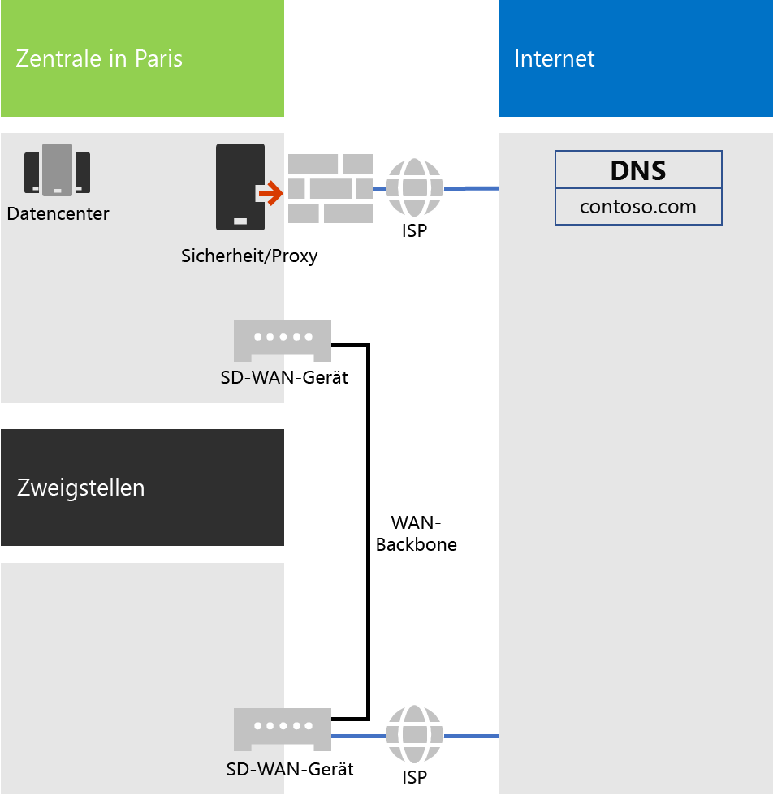
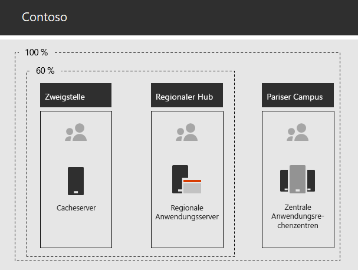

# Netzwerkfunktionen für die Contoso CorporationNetworking for the Contoso Corporation

**Zusammenfassung:** Informationen zur Contoso-Netzwerkinfrastruktur und dazu, wie die SD-WAN-Technologie für eine optimale Netzwerkkonnektivität für cloudbasierte Microsoft 365 Enterprise-Dienste verwendet wird.**Summary:** Understand the Contoso networking infrastructure and how it uses its SD WAN technology for optimal performance network connectivity to Microsoft 365 Enterprise cloud based services.

Zur Einführung einer cloudeinschließenden Infrastruktur erkannten die Netzwerktechniker bei Contoso die grundlegende Änderung in der Art und Weise, wie Netzwerkdatenverkehr zu cloudbasierten Diensten fließt. Anstelle eines Speichenmodells, das sich auf die Netzwerkkonnektivität am Hauptsitz konzentriert, wurden Benutzerstandorte lokalen Internetausgängen und lokale Verbindungen Microsoft-Netzwerkspeicherorten im Internet zugeordnet.To adopt a cloud-inclusive infrastructure, Contoso's network engineers realized the fundamental shift in the way that network traffic to cloud-based services travels. Instead of a hub and spoke model that focusses network connectivity on the head office, they worked to map user locations to local Internet egress and local connections to Microsoft network locations on the Internet.

## Contosos NetzwerkinfrastrukturContoso's networking infrastructure

Die Büros von Contoso werden über die folgenden Elemente des Contoso-Netzwerks miteinander verbunden:The elements of Contoso's network that links their offices across the globe are the following:

- MPLS-WAN-NetzwerkMPLS WAN network

  Ein MPLS-WAN-Netzwerk verbindet die Zentrale in Paris mit regionalen Niederlassungen und regionale Niederlassungen mit Zweigstellen in einer Speichenkonfiguration. Auf diese Weise können Benutzer auf lokale Server zugreifen, aus denen Branchen-Apps im Pariser Büro bestehen. Außerdem wird der allgemeine Internetdatenverkehr an das Pariser Büro weitergeleitet, wenn Netzwerksicherheitsgeräte die Anforderungen bereinigen. In jedem Büro senden Router Datenverkehr an Hosts oder Funkzugriffspunkte in Subnetzen, für die der private IP-Adressraum verwendet wird.An MPLS WAN network connects the Paris headquarters to regional offices and regional offices to satellite offices in a spoke and hub configuration. This is for users to access on-premises servers that make up line of business applications in the Paris office. It also routes any generic Internet traffic to the Paris office where network security devices scrub the requests. Within each office, routers deliver traffic to hosts or wireless access points on subnets, which use the private IP address space.

- Lokaler direkter Internetzugriff für Office 365-DatenverkehrLocal direct Internet access for Office 365 traffic

  Jede Niederlassung verfügt über ein SD-WAN-Gerät mit einem oder mehreren ISP-Netzwerkschaltern mit eigener Internetverbindung über einen Proxyserver. Dies wird in der Regel als eine WAN-Verbindung zu einem lokalen ISP implementiert, der auch öffentliche IP-Adressen und IP-Adressen von lokalen DNS-Servern für den Proxyserver bereitstellt.Each office has an SD WAN device with one of more local Internet ISP network circuits, with its own Internet connectivity through a proxy server. This is typically implemented as a WAN link to a local ISP that also provides public IP addresses and local DNS server IP addresses for the proxy server.

- InternetauftrittInternet presence

  Contoso ist im Besitz des öffentlichen Domänennamens „contoso.com“. Die öffentliche Contoso-Website zum Bestellen von Produkten besteht aus einer Gruppe von Servern in einem mit dem Internet verbundenen Rechenzentrum auf dem Pariser Campus. Contoso verwendet einen öffentlichen /24-IP-Adressbereich im Internet.Contoso owns the contoso.com public domain name. The Contoso public web site for ordering products is a set of servers in an Internet-connected datacenter in the Paris campus. Contoso uses a /24 public IP address range on the Internet.

Abbildung 1 zeigt die Contoso-Netzwerkinfrastruktur und die dazugehörigen Verbindungen mit dem Internet.Figure 1 shows Contoso's networking infrastructure and its connections to the Internet.

 
**Abbildung 1: Contoso-Netzwerk****Figure 1: Contoso's network**

## Verwenden des SD-WAN für eine optimale Netzwerkkonnektivität mit MicrosoftUse of SD WAN for optimal network connectivity to Microsoft

Contoso folgte den folgenden [Prinzipien von Office 365-Netzwerkverbindungen](https://docs.microsoft.com/office365/enterprise/office-365-network-connectivity-principles):Contoso followed [Office 365 network connectivity principles](https://docs.microsoft.com/office365/enterprise/office-365-network-connectivity-principles):

1. Identifizieren und Unterscheiden von Office 365-NetzwerkdatenverkehrIdentify and differentiate Office 365 network traffic
2. Lokaler Ausgang von NetzwerkverbindungenEgress network connections locally
3. Vermeiden von Spitzkehren für NetzwerkeAvoid network hairpins
4. Umgehen von doppelten NetzwerksicherheitsgerätenBypass duplicate network security devices

Es gibt drei Kategorien von Netzwerkdatenverkehr für Office 365: „Optimize“, „Allow“ und „Default“. Bei „Optimize“ und „Allow“ handelt es sich um vertrauenswürdigen Netzwerkdatenverkehr, der verschlüsselt und an den Endpunkten geschützt ist und an Microsoft-Rechenzentren gerichtet ist.There are three categories of network traffic for Office 365: Optimize, Allow, and Default. Optimize and Allow traffic is trusted network traffic that is encrypted and secured at the endpoints and is destined for Microsoft datacenters.

Contoso hat beschlossen, den direkten Internetausgang für Datenverkehr der Kategorie „Optimize“ und „Allow“ zu verwenden und den gesamten Datenverkehr der Kategorie „Default“ an die zentrale Internetverbindung in Paris weiterzuleiten.Contoso decided to use direct Internet egress for Optimize and Allow category traffic and to forward all Default category traffic to the Paris-based central Internet connection.

An jedem Standort wurden SD-WAN-Geräte bereitgestellt, damit diese Prinzipien problemlos umgesetzt werden konnten und eine optimale Netzwerkleistung für cloudbasierte Microsoft 365-Dienste erzielt werden kann.They decided to deploy SD WAN devices at each of their office locations as a simple way to follow these principles and achieve optimal network performance for Microsoft 365 cloud-based services.

Die SD-WAN-Geräte verfügen über einen LAN-Port für das lokale Niederlassungsnetzwerk und über mehrere WAN-Ports. Ein WAN-Port stellt eine Verbindung zu dem MPLS-Netzwerk her, und andere WAN-Ports stellen eine Verbindung zu lokalen ISP-Schaltungen her. Das SD-WAN-Gerät leitet den Netzwerkdatenverkehr der Kategorie „Optimize“ und „Allow“ an die ISP-Links um.The SD WAN devices have a LAN port for the local office network and multiple WAN ports. One WAN port connects to their MPLS network and other WAN ports connect to local ISP circuits. The SD WAN device routes Optimize and Allow category network traffic to the ISP links.

## Contosos Infrastruktur für Branchen-AppsContoso's line of business app infrastructure

Contoso hat seine Infrastruktur für Branchen-Apps und Server für Folgendes konzipiert:Contoso has architected its line of business application and server infrastructure for the following:

- Zweigstellen verwenden lokale Cacheserver, um Dokumente und interne Websites zu speichern, auf die häufig zugegriffen wird.Satellite offices use local caching servers to store frequently accessed documents and internal web sites.
- Regionalstellen verwenden regionale Anwendungsserver für die Regional- und Zweigstellenbüros. Diese Server werden mit den Servern in der Pariser Zentrale synchronisiert.Regional hubs use regional application servers for the regional and satellite offices. These servers synchronize with servers in the Paris headquarters.
- Auf dem Pariser Campus befinden sich die Rechenzentren mit den zentralen-Anwendungsservern, die das gesamte Unternehmen bedienen.The Paris campus has the datacenters that contain the centralized application servers that serve the entire organization.

Abbildung 2 zeigt den Prozentsatz des Netzwerkdatenverkehrs beim Zugriff auf Server im Intranet von Contoso.Figure 1 shows the percentage of network traffic when accessing servers across Contoso’s intranet.

 
**Abbildung 2: Contoso-Infrastruktur für die interne Anwendung****Figure 2: Contoso's infrastructure for internal applications**

Für Benutzer in Zweigstellen- oder Regionalbüros können 60 % der von ihnen benötigten Ressourcen von den Zweigstellen- oder Regionalbüroservern bereitgestellt werden.
 Die weiteren 40 % der Ressourcenanforderungen werden über die WAN-Verbindung mit dem Pariser Campus abgedeckt.For users in satellite or regional hub offices, 60% of the resources needed by employees can be served by satellite and regional hub office servers. The additional 40% of resource requests must go over the WAN link to the Paris campus.

## Netzwerkanalyse und Vorbereitung des Netzwerks auf Microsoft 365 Enterprise bei ContosoContoso's network analysis and preparation of their network for Microsoft 365 Enterprise

Eine erfolgreiche Einführung von Microsoft 365 Enterprise-Diensten bei den Benutzern von Contoso ist von einer hochverfügbaren und leistungsstarken Verbindung zum Internet oder von einer Verbindung direkt mit Microsoft-Clouddiensten abhängig. Contoso hat diese Schritte bei der Planung und Implementierung einer optimierten Verbindung mit Microsoft 365 Enterprise-Clouddiensten berücksichtigt:Successful adoption of Microsoft 365 Enterprise services by Contoso’s users depend on highly available and performant connectivity to the Internet, or directly to Microsoft cloud services. Contoso took these steps to plan for and implement optimized connectivity to Microsoft 365 Enterprise cloud services:

1. Es wurde ein WAN-Netzwerkdiagramm für das Unternehmen zur Unterstützung der Planung erstellt.Created a company WAN network diagram to aid with planning

   Contoso startete die Netzwerkplanung durch Erstellung eines Diagramms, in dem die Standorte, die vorhandene Netzwerkverbindung, die vorhandenen Netzwerkumkreisgeräte sowie die Dienstklassen dargestellt wurden, die im Netzwerk verwaltet werden. Dieses Diagramm wurde für alle nachfolgenden Schritte bei der Planung und Implementierung der Netzwerkkonnektivität verwendet.Contoso started their network planning by creating a diagram showing their locations, the existing network connectivity, their existing network perimeter devices and classes of service that are managed on the network. They used this diagram for each subsequent step in the planning and implementation of networking connectivity.

2. Es wurde ein Plan für die Microsoft 365 Enterprise-Netzwerkkonnektivität erstellt.Created a plan for Microsoft 365 Enterprise network connectivity

   Contoso verwendete die [Prinzipien von Office 365-Netzwerkverbindungen](https://docs.microsoft.com/office365/enterprise/office-365-network-connectivity-principles) und stellte Referenznetzwerkarchitekturen bereit, um SD-WAN als bevorzugte Topologie für Office 365-Konnektivität zu bestimmen.Contoso used the [Office 365 network connectivity principles](https://docs.microsoft.com/office365/enterprise/office-365-network-connectivity-principles) and provided reference network architectures to determine SD WAN as their preferred topology for Office 365 connectivity.

3. In jeder Niederlassung wurde die Auslastung der Internetverbindung und die MPLS-WAN-Bandbreite analysiert und bei Bedarf erhöht.Analyzed Internet connection utilization and MPLS WAN bandwidth at each office and increased bandwidth as needed

   In jeder Niederlassung wurde die aktuelle Nutzung analysiert, und Schaltungen wurden so erhöht, dass der vorhergesagte cloudbasierte Microsoft 365-Datenverkehr mit durchschnittlich 20 % nicht genutzter Kapazität ausgeführt wurde.Each office was analyzed for the current usage and circuits were increased so that predicted Microsoft 365 cloud-based traffic would be operating with an average of 20% of unused capacity.

4. Optimierte Leistung für Microsoft-NetzwerkdiensteOptimized performance to Microsoft network services

   Contoso bestimmte die Gruppe von Office 365-, Intune- und Azure-Endpunkten, konfigurierte Firewalls, Sicherheitsgeräte und andere System im Internetpfad für optimale Leistung. Endpunkte für Office 365-Datenverkehr der Kategorie „Optimize“ und „Allow“ wurden in den SD-WAN-Geräten konfiguriert, die direkten Internetzugriff boten.Contoso determined the set of Office 365, Intune, and Azure endpoints and configured firewalls, security devices, and other systems in the Internet path for optimal performance. Endpoints for Office 365 Optimize and Allow category traffic was configured into the SD WAN devices that provided direct Internet access.

5. Es wurde ein internes DNS konfiguriert.Configured internal DNS

   Das DNS muss betriebsbereit sein und für Office 365-Datenverkehr lokal nachgeschlagen werden.DNS is required to be functional and to be looked up locally for Office 365 traffic.

6. Netzwerkendpunkt und Portkonnektivität wurden überprüft.Validated network endpoint and port connectivity

   Contoso führte Testtools für die Netzwerkkonnektivität aus, die von Microsoft zur Überprüfung der Konnektivität für Microsoft 365 Enterprise-Clouddienste bereitgestellt wurden.Contoso ran network connectivity test tools provided by Microsoft to validate connectivity for Microsoft 365 Enterprise cloud services.

7. Die Netzwerkverbindungen der Computer der Mitarbeiter wurden optimiert.Optimized employee computers for network connectivity

   Einzelne Computer wurden überprüft, um sicherzustellen, dass die neuesten Betriebssystemupdates installiert wurden und dass die Endpunkt-Sicherheitsüberwachung auf allen Clients aktiv ist.Individual computers were checked to ensure that the latest operating system updates were installed and that endpoint security monitoring is active on all clients.

## Nächster SchrittNext step

[Erfahren Sie](contoso-identity.md), wie Contoso seine lokalen Identitätsanbieter in der Cloud für Mitarbeiter und Verbundauthentifizierung für Kunden und Geschäftspartner nutzt.[Learn](contoso-identity.md) how Contoso is leveraging its on-premises identity provider in the cloud for employees and federating authentication for customers and business partners.

## Siehe auchSee also

[Microsoft 365 EnterpriseNetworking for Microsoft 365 Enterprise](networking-infrastructure.md)

[BereitstellungshandbuchDeployment guide](deploy-microsoft-365-enterprise.md)

[TestumgebungsanleitungenTest lab guides](m365-enterprise-test-lab-guides.md)
