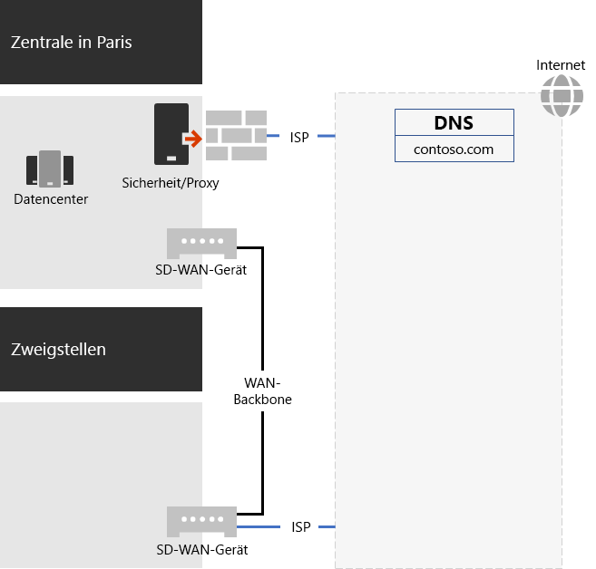
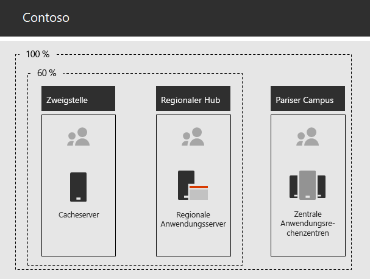

# Netzwerkfunktionen für die Contoso CorporationNetworking for the Contoso Corporation

Zur Einführung einer cloudeinschließenden Infrastruktur erkannten die Netzwerktechniker bei Contoso die grundlegende Änderung in der Art und Weise, wie Netzwerkdatenverkehr zu Clouddiensten fließt. Anstelle eines internen Hub-and-Spoke-Modells, das sich auf die Netzwerkkonnektivität und -datenverkehr für die nächste Ebene der Contoso-Bürohierarchie konzentriert, wurden Benutzerstandorte lokalen Internetausgängen und lokale Verbindungen den nächstgelegenen Microsoft 365-Netzwerkspeicherorten im Internet zugeordnet.To adopt a cloud-inclusive infrastructure, Contoso's network engineers realized the fundamental shift in the way that network traffic to cloud services travels. Instead of an internal hub and spoke model that focusses network connectivity and traffic for the next level of the Contoso office hierarchy, they worked to map user locations to local Internet egress and local connections to the closest Microsoft 365 network location on the Internet.

## Contosos NetzwerkinfrastrukturContoso's networking infrastructure

Die Büros von Contoso werden über die folgenden Elemente des Contoso-Netzwerks miteinander verbunden:The elements of Contoso's network that links their offices across the globe are the following:

- MPLS-WAN-Netzwerk (Multiprotocol Label Switching)Multiprotocol Label Switching (MPLS) WAN network

  Ein MPLS-WAN-Netzwerk verbindet die Zentrale in Paris mit regionalen Niederlassungen und regionale Niederlassungen mit Zweigstellen in einer Hub-and-Spoke-Konfiguration. Auf diese Weise können Benutzer auf lokale Server zugreifen, aus denen Branchen-Apps im Pariser Büro bestehen. Außerdem wird der allgemeine Internetdatenverkehr an das Pariser Büro weitergeleitet, wenn Netzwerksicherheitsgeräte die Anforderungen bereinigen. In jedem Büro senden Router Datenverkehr an kabelgebundene Hosts oder Funkzugriffspunkte in Subnetzen, für die der private IP-Adressraum verwendet wird.An MPLS WAN network connects the Paris headquarters to regional offices and regional offices to satellite offices in a spoke and hub configuration. This is for users to access on-premises servers that make up line of business applications in the Paris office. It also routes any generic Internet traffic to the Paris office where network security devices scrub the requests. Within each office, routers deliver traffic to wired hosts or wireless access points on subnets, which use the private IP address space.

- Lokaler direkter Internetzugriff für Microsoft 365-DatenverkehrLocal direct Internet access for Microsoft 365 traffic

  Jede Niederlassung verfügt über ein Software-Defined-WAN (SD-WAN)-Gerät mit einem oder mehreren ISP-Netzwerkschaltern mit eigener Internetverbindung über einen Proxyserver. Dies wird in der Regel als eine WAN-Verbindung zu einem lokalen ISP implementiert, der auch öffentliche IP-Adressen und einen lokalen DNS-Server bereitstellt.Each office has a Software-Defined WAN (SD-WAN) device with one of more local Internet ISP network circuits, with its own Internet connectivity through a proxy server. This is typically implemented as a WAN link to a local ISP that also provides public IP addresses and a local DNS server.

- InternetauftrittInternet presence

  Contoso ist im Besitz des öffentlichen Domänennamens „contoso.com“. Die öffentliche Contoso-Website zum Bestellen von Produkten besteht aus einer Gruppe von Servern in einem mit dem Internet verbundenen Rechenzentrum auf dem Pariser Campus. Contoso verwendet einen öffentlichen /24-IP-Adressbereich im Internet.Contoso owns the contoso.com public domain name. The Contoso public web site for ordering products is a set of servers in an Internet-connected datacenter in the Paris campus. Contoso uses a /24 public IP address range on the Internet.

Abbildung 1 zeigt die Contoso-Netzwerkinfrastruktur und die dazugehörigen Verbindungen mit dem Internet.Figure 1 shows Contoso's networking infrastructure and its connections to the Internet.

 
**Abbildung 1: Contoso-Netzwerk****Figure 1: Contoso's network**

## Verwenden des SD-WAN für eine optimale Netzwerkkonnektivität mit MicrosoftUse of SD-WAN for optimal network connectivity to Microsoft

Contoso folgte den folgenden [Prinzipien von Microsoft 365-Netzwerkverbindungen](microsoft-365-network-connectivity-principles.md) bei folgende Aufgaben:Contoso followed [Microsoft 365 network connectivity principles](microsoft-365-network-connectivity-principles.md) to:

1. Identifizieren und Unterscheiden von Microsoft 365-NetzwerkdatenverkehrIdentify and differentiate Microsoft 365 network traffic
2. Lokaler Ausgang von NetzwerkverbindungenEgress network connections locally
3. Vermeiden von Spitzkehren für NetzwerkeAvoid network hairpins
4. Umgehen von doppelten NetzwerksicherheitsgerätenBypass duplicate network security devices

Es gibt drei Kategorien von Netzwerkdatenverkehr für Microsoft 365: „Optimize“, „Allow“ und „Default“.There are three categories of network traffic for Microsoft 365: Optimize, Allow, and Default. Bei "Optimize" und "Allow" handelt es sich um vertrauenswürdigen Netzwerkdatenverkehr, der verschlüsselt und an den Endpunkten geschützt und an das Microsoft 365-Netzwerk gerichtet ist.Optimize and Allow traffic is trusted network traffic that is encrypted and secured at the endpoints and is destined for the Microsoft 365 network.

Contoso hat Folgendes beschlossen:Contoso decided to:

- Der direkte Internetausgang für Datenverkehr der Kategorie "Optimize" und "Allow" wird verwendet und der gesamte Datenverkehr der Kategorie "Default" wird an die zentrale Internetverbindung in Paris weitergeleitet.Use direct Internet egress for Optimize and Allow category traffic and to forward all Default category traffic to the Paris-based central Internet connection.

- An jedem Standort wurden SD-WAN-Geräte bereitgestellt, damit diese Prinzipien problemlos umgesetzt werden konnten und eine optimale Netzwerkleistung für cloudbasierte Microsoft 365-Dienste erzielt werden kann.Deploy SD-WAN devices at each of their office locations as a simple way to follow these principles and achieve optimal network performance for Microsoft 365 cloud-based services.

  Die SD-WAN-Geräte weisen einen LAN-Port für das lokale Netzwerk und mehrere WAN-Ports auf.The SD-WAN devices have a LAN port for the local office network and multiple WAN ports. Ein WAN-Port stellt eine Verbindung mit dem MPLS-Netzwerk her, und ein weiterer WAN-Port stellt eine Verbindung mit einem lokalen ISP-Schaltkreis her.One WAN port connects to their MPLS network and another WAN port connects to a local ISP circuit. Die SD-WAN-Geräte leiten Netzwerkdatenverkehr der Kategorie "Optimize" und "Allow" über die ISP-Verbindung.The SD-WAN device routes Optimize and Allow category network traffic over the ISP link.

## Contosos Infrastruktur für Branchen-AppsContoso's line of business app infrastructure

Contoso hat seine Intranetinfrastruktur für Branchen-Apps und Server für Folgendes konzipiert:Contoso has architected its line of business application and server intranet infrastructure for the following:

- Zweigstellen verwenden lokale Cacheserver, um Dokumente und interne Websites zu speichern, auf die häufig zugegriffen wird.Satellite offices use local caching servers to store frequently accessed documents and internal web sites.
- Regionalstellen verwenden regionale Anwendungsserver für die Regional- und Zweigstellenbüros. Diese Server werden mit den Servern in der Pariser Zentrale synchronisiert.Regional hubs use regional application servers for the regional and satellite offices. These servers synchronize with servers in the Paris headquarters.
- Auf dem Pariser Campus befinden sich die Rechenzentren mit den zentralen-Anwendungsservern, die das gesamte Unternehmen bedienen.The Paris campus has the datacenters that contain the centralized application servers that serve the entire organization.

Abbildung 2 zeigt den Prozentsatz des Netzwerkdatenverkehrs beim Zugriff auf Server im Intranet von Contoso.Figure 2 shows the percentage of network traffic when accessing servers across Contoso’s intranet.

 
**Abbildung 2: Contoso-Infrastruktur für die interne Anwendung****Figure 2: Contoso's infrastructure for internal applications**

Für Benutzer in Zweigstellen- oder Regionalbüros können 60 % der von ihnen benötigten Ressourcen von den Zweigstellen- oder Regionalbüroservern bereitgestellt werden.
 Die weiteren 40 % der Ressourcenanforderungen werden über die WAN-Verbindung mit dem Pariser Campus abgedeckt.For users in satellite or regional hub offices, 60% of the resources needed by employees can be served by satellite and regional hub office servers. The additional 40% of resource requests must go over the WAN link to the Paris campus.

## Contosos Netzwerkanalyse und Vorbereitung Ihres Netzwerks für Microsoft 365 for EnterpriseContoso's network analysis and preparation of their network for Microsoft 365 for enterprise

Die erfolgreiche Einführung von Microsoft 365 für Enterprise-Dienste durch die Benutzer von Contoso hängt von der hochgradig verfügbaren und leistungsfähigen Konnektivität mit dem Internet oder direkt mit Microsoft Cloud Services ab. Contoso hat die folgenden Schritte ausgeführt, um eine optimierte Konnektivität mit Microsoft 365 für Enterprise-Cloud-Dienste zu planen und zu implementieren:Successful adoption of Microsoft 365 for enterprise services by Contoso’s users depend on highly available and performant connectivity to the Internet, or directly to Microsoft cloud services. Contoso took these steps to plan for and implement optimized connectivity to Microsoft 365 for enterprise cloud services:

1. Es wurde ein WAN-Netzwerkdiagramm für das Unternehmen zur Unterstützung der Planung erstellt.Created a company WAN network diagram to aid with planning

   Contoso startete die Netzwerkplanung durch Erstellung eines Diagramms, in dem die Standorte, die vorhandene Netzwerkverbindung, die vorhandenen Netzwerkumkreisgeräte sowie die Dienstklassen dargestellt wurden, die im Netzwerk verwaltet werden. Dieses Diagramm wurde für alle nachfolgenden Schritte bei der Planung und Implementierung der Netzwerkkonnektivität verwendet.Contoso started their network planning by creating a diagram showing their locations, the existing network connectivity, their existing network perimeter devices and classes of service that are managed on the network. They used this diagram for each subsequent step in the planning and implementation of networking connectivity.

2. Plan für Microsoft 365 für Enterprise-Netzwerkkonnektivität erstelltCreated a plan for Microsoft 365 for enterprise network connectivity

   Contoso verwendete die [Prinzipien von Microsoft 365-Netzwerkverbindungen](microsoft-365-network-connectivity-principles.md) und stellte Referenznetzwerkarchitekturen bereit, um SD-WAN als bevorzugte Topologie für Microsoft 365-Konnektivität zu bestimmen.Contoso used the [Microsoft 365 network connectivity principles](microsoft-365-network-connectivity-principles.md) and provided reference network architectures to determine SD-WAN as their preferred topology for Microsoft 365 connectivity.

3. In jeder Niederlassung wurde die Auslastung der Internetverbindung und die MPLS-WAN-Bandbreite analysiert und bei Bedarf erhöht.Analyzed Internet connection utilization and MPLS WAN bandwidth at each office and increased bandwidth as needed

   In jeder Niederlassung wurde die aktuelle Nutzung analysiert, und Schaltungen wurden so erhöht, dass der vorhergesagte cloudbasierte Microsoft 365-Datenverkehr mit durchschnittlich 20 % nicht genutzter Kapazität ausgeführt wurde.Each office was analyzed for the current usage and circuits were increased so that predicted Microsoft 365 cloud-based traffic would be operating with an average of 20% of unused capacity.

4. Optimierte Leistung für Microsoft-NetzwerkdiensteOptimized performance to Microsoft network services

   Contoso bestimmte die Gruppe von Office 365-, Intune- und Azure-Endpunkten, konfigurierte Firewalls, Sicherheitsgeräte und andere Systeme im Internetpfad für optimale Leistung.Contoso determined the set of Office 365, Intune, and Azure endpoints and configured firewalls, security devices, and other systems in the Internet path for optimal performance. Endpunkte für Office 365-Datenverkehr der Kategorie "Optimize" und "Allow" wurden in den SD-WAN-Geräten für das Routing über den ISP-Schaltkreis konfiguriert.Endpoints for Office 365 Optimize and Allow category traffic was configured into the SD-WAN devices for routing over the ISP circuit.

5. Es wurde ein internes DNS konfiguriert.Configured internal DNS

   Das DNS muss betriebsbereit sein und für Microsoft 365-Datenverkehr lokal nachgeschlagen werden.DNS is required to be functional and to be looked up locally for Microsoft 365 traffic.

6. Netzwerkendpunkt und Portkonnektivität wurden überprüft.Validated network endpoint and port connectivity

   Contoso hat die von Microsoft bereitgestellten Tools zur Netzwerkkonnektivität getestet, um die Konnektivität für Microsoft 365 for Enterprise Cloud Services zu überprüfen.Contoso ran network connectivity test tools provided by Microsoft to validate connectivity for Microsoft 365 for enterprise cloud services.

7. Die Netzwerkverbindungen der Computer der Mitarbeiter wurden optimiert.Optimized employee computers for network connectivity

   Einzelne Computer wurden überprüft, um sicherzustellen, dass die neuesten Betriebssystemupdates installiert wurden und dass die Endpunkt-Sicherheitsüberwachung auf allen Clients aktiv ist.Individual computers were checked to ensure that the latest operating system updates were installed and that endpoint security monitoring is active on all clients.

## Nächster SchrittNext step

[Erfahren Sie](contoso-identity.md), wie Contoso seine lokalen Active Directory Domain Services (AD DS) in der Cloud für Mitarbeiter und Verbundauthentifizierung für Kunden und Geschäftspartner nutzt.[Learn](contoso-identity.md) how Contoso is leveraging its on-premises Active Directory Domain Services (AD DS) in the cloud for employees and federating authentication for customers and business partners.

## Siehe auchSee also

[Roadmap für Netzwerke für Microsoft 365Networking roadmap for Microsoft 365](networking-roadmap-microsoft-365.md)

[Übersicht über Microsoft 365 EnterpriseMicrosoft 365 for enterprise overview](microsoft-365-overview.md)

[TestumgebungsanleitungenTest lab guides](m365-enterprise-test-lab-guides.md)
