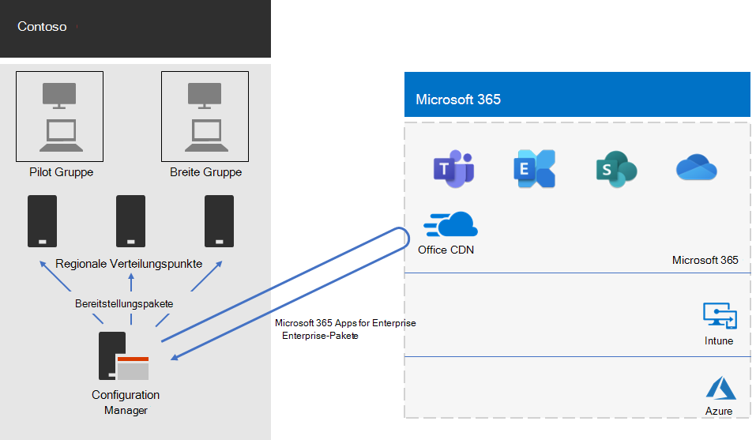

# Microsoft 365 Apps for Enterprise-Bereitstellung für Contoso

Contoso hat seine PCs auf Windows 10 Enterprise-und Microsoft 365-Apps für Unternehmen aktualisiert, um eine effizientere Zusammenarbeit, eine bessere Sicherheit und eine modernere Desktopumgebung zu ermöglichen. Nachdem die Infrastruktur und die geschäftlichen Anforderungen von Contoso bewertet wurden, wurden diese wichtigen Anforderungen für die Bereitstellung ermittelt:

- Auf allen PCs sollten Microsoft 365-Apps für Enterprise ausgeführt werden.
- Die Bereitstellung sollte, wenn möglich, vorhandene Verwaltungstools und Infrastruktur verwenden.
- Die Bereitstellung muss mehrere Sprachen und vorhandene Architekturen auf den Geräten der Benutzer unterstützen.
- PCs sollten stets auf dem neuesten Stand sein und mit minimalen IT-Verwaltungskosten und minimalen Auswirkungen auf die Benutzer sicherstellen.

## Bereitstellungstools

Basierend auf Ihren Anforderungen hat Contoso die Bereitstellung von Windows 10 Enterprise und Microsoft 365 apps for Enterprise über Configuration Manager (Current Branch) entschieden. Configuration Manager skaliert für große Umgebungen und bietet umfangreiche Steuerungsmöglichkeiten für Installation, Updates und Einstellungen. Außerdem verfügt es über integrierte Features, um die Bereitstellung und Verwaltung von Office einfacher und effizienter zu gestalten, einschließlich:

- Peer Cache, der bei der Bereitstellung auf Geräten an Remotestandorten bei der begrenzten Netzwerkkapazität helfen kann.
- Das Office-Client Verwaltungs Dashboard, das die Bereitstellung von Office und das Überwachen von Updates vereinfacht und Administratoren den Zugriff auf die neuesten Bereitstellungs-und Verwaltungsfunktionen ermöglicht.
- Intelligent Language Pack-Bereitstellung, einschließlich der automatischen Bereitstellung der gleichen Sprache wie das Betriebssystem.
- Eine vollständig unterstützte und einfach zu verwendende Methode zum Entfernen vorhandener Versionen von Office von einem Client während der Bereitstellung.

Neben Configuration Manager hat Contoso das [Readiness Toolkit für Office-Add-in und VBA](https://docs.microsoft.com/deployoffice/readiness-toolkit-application-compatibility-microsoft-365-apps), ein kostenloses Tool von Microsoft, verwendet, um Kompatibilitätsprobleme mit Ihren Office-Makros und-Add-Ins zu bewerten.

## Verwalten der Bereitstellung und Updates

Microsoft 365 apps for Enterprise verfügt über ein neues Veröffentlichungsmodell: Office as a Service. Mit dem Dienstmodell können Sie auf einfache Weise über neue Features auf dem Laufenden bleiben. Es ist jedoch häufig erforderlich, dass IT-Abteilungen die Art und Weise ändern, wie Sie neue Versionen bereitstellen und testen. Um Kompatibilitätsprobleme zu minimieren und um sicherzustellen, dass Ihre Computer auf dem neuesten Stand bleiben, hat Contoso Windows und Office in zwei Schritten bereitgestellt:

- Zunächst stellten Sie Microsoft 365-Apps für Unternehmen für eine kleine Gruppe von repräsentativen Geräten in der gesamten Organisation bereit. Diese Pilotgruppe wurde verwendet, um apps, Add-Ins und Hardware mit Microsoft 365 apps for Enterprise zu testen.
- Vier Monate später, nachdem alle kritischen Probleme mit Anwendungen, Add-Ins und Hardware in der Pilotgruppe gelöst waren, stellte Contoso Microsoft 365 Apps for Enterprise für die restlichen Geräte in der Organisation (die breite Gruppe) bereit.

Anstatt Office-Updates mithilfe von Configuration Manager zu verwalten, aktivierte Contoso automatische Updates aus der Cloud. Durch Cloud-basierte Updates wird der Verwaltungsaufwand reduziert und gleichzeitig sichergestellt, dass Geräte auf dem neuesten Stand bleiben.

Contoso hat den gleichen zweistufigen Ansatz für Feature-Updates wie für die Bereitstellung von Office befolgt: Geräte in der Pilotgruppe empfangen Feature-Updates vier Monate früher als Geräte in der restlichen Organisation (die breite Gruppe). Um dies für Office zu aktivieren, hat Contoso zwei empfohlene [Update Kanäle](https://docs.microsoft.com/DeployOffice/overview-update-channels)verwendet:

- Halbjährlicher Enterprise-Kanal (Vorschau) für Updates für die Pilotgruppe
- Semi-Annual Enterprise-Kanal für Updates für die breite Gruppe

Da der halbjährliche Enterprise-Kanal (Vorschau) vier Monate früher als der halbjährliche Enterprise-Kanal eine Version von Microsoft 365 Apps for Enterprise veröffentlicht, hat Contoso Zeit, die Updates zu validieren, ohne sie verwalten zu müssen.

## Bereitstellungsprozess

Um die Bereitstellung von Office abzuschließen, hat Contoso den folgenden Prozess implementiert, der Empfehlungen zu bewährten Vorgehensweisen von Microsoft umfasst:

1. Vor der Bereitstellung hat Contoso das Readiness Toolkit für Office-Add-in und VBA verwendet, um Ihre apps und Office-Add-Ins zu testen, um deren Kompatibilität mit Microsoft 365 apps for Enterprise zu bewerten.
1. In Configuration Manager haben Sie den Peer Cache auf Ihren Clientgeräten aktiviert, was bei der Bereitstellung auf Clientgeräten an Remotestandorten bei einer begrenzten Netzwerkkapazität hilft. 
1. Contoso hat in Configuration Manager zwei Bereitstellungsgruppen als Geräte Auflistungen definiert: eine Pilotgruppe und eine umfassende Gruppe. Die Pilotgruppe, die eine kleine Gruppe von repräsentativen Geräten in der gesamten Organisation umfasste, wurde für weitere Tests von apps, Add-Ins und Hardware mit Windows 10 Enterprise und Microsoft 365 apps for Enterprise verwendet.
1. Sie haben Bereitstellungspakete für Office mithilfe des Office-Client Verwaltungs Dashboards und des Assistenten für die Office 365 Installation erstellt, die beide Teil der Configuration Manager-Konsole sind. Sie haben zwei Microsoft 365-Apps für Enterprise-Pakete erstellt, eine für die Pilotgruppe im Semi-Annual Enterprise-Kanal (Preview) und eine für die breite Gruppe im Semi-Annual Enterprise-Kanal.
2. Jedes Office-Paket umfasste Sprachpakete für Englisch, Französisch und Deutsch. Wenn ein Gerät eine Sprache benötigt, die nicht im Office-Paket enthalten war, wurde das Sprachpaket automatisch aus dem Office-Inhalts Zustellungs Netzwerk (CDN) heruntergeladen.
3. Das Unternehmen nutzte die integrierte Funktion im Office-Paket, um automatisch alle vorhandenen MSI-Versionen von Office zu entfernen, bevor Microsoft 365 Apps for Enterprise installiert wurde.
4. In Configuration Manager wurden die Windows-und Office-Pakete für Verteilungspunkte in Ihrem Netzwerk bereitgestellt. Anschließend wurden die Tasksequenzen des Configuration Manager-Bereitstellungstasks ausgeführt, um das Pilotprogramm Microsoft 365 apps for Enterprise für die Pilotgruppe bereitzustellen.
5. Nachdem die Kompatibilitätsprobleme mit der Pilotgruppe behoben wurden, hat Contoso die Tasksequenzen ausgeführt, um das Microsoft 365-Apps für Enterprise-Paket für die breite Gruppe bereitzustellen.

Da sich Contoso entschlossen hat, Geräte automatisch aus der Cloud zu aktualisieren, war es nicht erforderlich, den Prozess im Configuration Manager zu verwalten. Ihre Geräte werden automatisch direkt aus der Cloud basierend auf dem Update Kanal aktualisiert, der in der anfänglichen Bereitstellung definiert wurde.

Hier finden Sie die Bereitstellungsarchitektur von Contoso Microsoft 365 apps for Enterprise und laufende Updates.

 
## Nächster Schritt

[Erfahren Sie](contoso-mdm.md) , wie Contoso Microsoft InTune in Microsoft 365 für Unternehmen verwendet, um die Geräte und die apps zu verwalten, die Sie in der Organisation ausführen.

## Siehe auch

[Microsoft 365 Apps for Enterprise](https://docs.microsoft.com/deployoffice/deployment-guide-microsoft-365-apps)

[Übersicht über Microsoft 365 Enterprise](microsoft-365-overview.md)

[Testumgebungsanleitungen](m365-enterprise-test-lab-guides.md)
