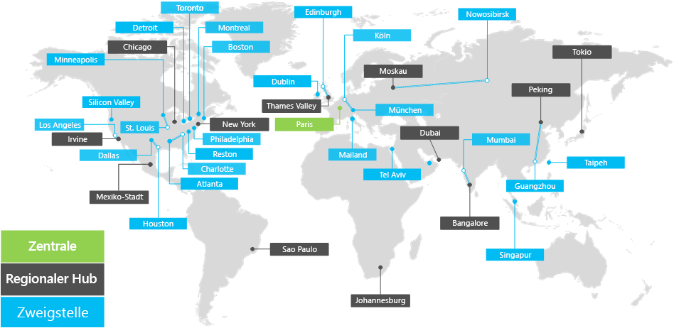

# Übersicht über die Contoso CorporationOverview of the Contoso Corporation

Die Contoso Corporation ist ein multinationales Unternehmen mit der Zentrale in Paris, Frankreich. Sie ist ein Mischkonzern aus Herstellungs-, Vertriebs- und Supportunternehmen mit mehr als 100.000 Produkten.The Contoso Corporation is a multi-national business with headquarters in Paris, France. It is a conglomerate manufacturing, sales, and support organization with over 100,000 products.

## Contoso auf der ganzen WeltContoso around the world

Abbildung 1 zeigt die Unternehmenszentrale in Paris und Regionalstellen und Zweigstellen auf unterschiedlichen Kontinenten.Figure 1 shows the headquarters office in Paris and regional hub and satellite offices in various continents.

**Abbildung 1: Contoso-Niederlassungen weltweit****Figure 1: Contoso's offices around the world**
 
Für Contosos Niederlassungen (Büros) auf der Welt gibt es eine dreistufige Hierarchie.Contoso's offices around the world follow a three-tier design.

- ZentraleHeadquarters

  Die Unternehmenszentrale von Contoso Corporation ist ein großer Unternehmenscampus am Stadtrand von Paris mit Dutzenden von Verwaltungs-, Technologie- und Fertigungsgebäuden. Alle Rechenzentren und der Internetauftritt von Contoso sind in der Pariser Zentrale angesiedelt.The Contoso Corporation headquarters is a large corporate campus on the outskirts of Paris with dozens of buildings for administrative, engineering, and manufacturing facilities. All of Contoso's datacenters and its Internet presence are housed in the Paris headquarters.

  Die Zentrale hat 25.000 Mitarbeiter.The headquarters has 25,000 workers.

- RegionalstellenRegional hubs

  Regionalstellen bedienen mit 60 % Verkaufs- und Supportmitarbeitern eine bestimmte Region. Jede Regionalstelle ist mit der Zentrale in Paris mit einer WAN-Verbindung mit hoher Bandbreite verbunden. Regional hub offices serve a specific region of the world with 60% sales and support staff. Each regional hub is connected to the Paris headquarters with a high-bandwidth WAN link.

  Jede Regionalstelle hat im Durchschnitt 2.000 Arbeitskräfte.
Each regional hub has an average of 2,000 workers.

- ZweigstellenSatellite offices

  Eine Zweigstelle hat jeweils 80 % Verkaufs- und Supportmitarbeiter und fungiert als lokale Präsenz für Contoso-Kunden in einer wichtigen Stadt oder Unterregion. Jede Zweigstelle ist über eine WAN-Verbindung mit hoher Bandbreite mit einer Regionalstelle verbunden.Satellite offices contain 80% sales and support staff and provide an on-site presence for Contoso customers in key cities or sub-regions. Each satellite office is connected to a regional hub with a high-bandwidth WAN link.

  Jede Zweigstelle hat im Durchschnitt 250 Mitarbeiter.Each satellite office has an average of 250 workers.

25 % der Belegschaft von Contoso sind Mobilmitarbeiter, wobei der Prozentsatz der Mobilmitarbeiter in Regional- und Zweigstellen höher ist.
Das Bereitstellen von besserer Unterstützung für Mobilmitarbeiter ist ein wichtiges Geschäftsziel für Contoso.25% of Contoso's workforce is mobile-only, with a higher percentage of mobile-only workers in the regional hubs and satellite offices. Providing better support for mobile-only workers is an important business goal for Contoso.

## Entwurfsüberlegungen für Microsoft 365 für UnternehmenDesign considerations for Microsoft 365 for enterprise

Die IT-Architekten von Contoso haben die folgenden Entwurfsanforderungen und-Überlegungen bei der Bereitstellung von Microsoft 365 für Unternehmen ermittelt:Contoso's IT architects identified the following design requirements and considerations when deploying Microsoft 365 for enterprise: 

- Mehrere geografische Standorte mit lokalen Vorschriften und Compliance-AnforderungenMultiple geographic locations with local regulations and compliance requirements
- Ein zentrales Intranetrechenzentrum in der Unternehmenszentrale und regionale Anwendungsserver, auf der interne Branchenanwendungen gehostet werden.A central intranet datacenter in the headquarters office and regional application servers that host internal line of business applications
- Eine vorhandene Microsoft Endpoint Configuration Manager-InfrastrukturAn existing Microsoft Endpoint Configuration Manager infrastructure
- Eine Kombination aus Clientcomputinggeräten wie Windows, Mac und Linux.A mix of client computing devices, including Windows, Mac, and Linux
- Eine Kombination aus persönlichen und firmeneigenen mobilen Geräten wie iOS (iPhone und iPad), Android-Smartphones und TabletsA mix of personal and company-owned mobile devices, including iOS (iPhone and iPad) and Android smart phones and tablets
- Viele Remote- und MobilmitarbeiterMany remote and mobile workers
- Viele GeschäftspartnerMany business partners
- Viele Kunden und personenbezogene InformationenA large amount of customer and personally identifiable information
- Geistiges Eigentum in der Form von Entwurfsspezifikationen für Produkte und GeschäftsgeheimnisseA large amount of high-value intellectual property in the form of design specifications for products and manufacturing trade secrets

## Nächster SchrittNext step

[Erfahren Sie mehr](contoso-infra-needs.md) über die lokale IT-Infrastruktur von Contoso Corporation und darüber, wie Ihre geschäftlichen Anforderungen mit Microsoft 365 for Enterprise behandelt wurden.[Learn](contoso-infra-needs.md) about the Contoso Corporation’s on-premises IT infrastructure and how their business needs were addressed with Microsoft 365 for enterprise.

## Siehe auchSee also

[Übersicht über Microsoft 365 EnterpriseMicrosoft 365 for enterprise overview](microsoft-365-overview.md)

[TestumgebungsanleitungenTest lab guides](m365-enterprise-test-lab-guides.md)

