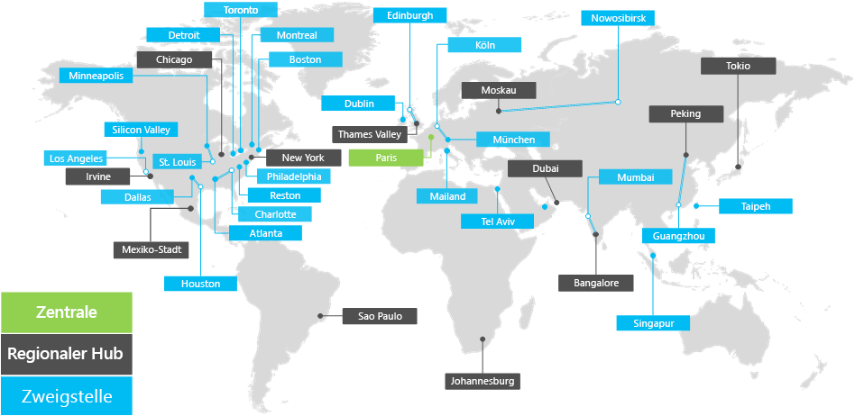

# Übersicht über die Contoso Corporation

**Zusammenfassung:** Verstehen der Contoso Corporation als Unternehmen und Informationen zu der mehrstufigen Struktur ihrer weltweiten Büros.

Die Contoso Corporation ist ein multinationales Unternehmen mit der Zentrale in Paris, Frankreich. Sie ist ein Mischkonzern aus Herstellungs-, Vertriebs- und Supportunternehmen mit mehr als 100.000 Produkten.

## Contoso auf der ganzen Welt

Abbildung 1 zeigt die Unternehmenszentrale in Paris und Regionalstellen und Zweigstellen auf unterschiedlichen Kontinenten.

**Abbildung 1: Contoso-Niederlassungen weltweit**
 
Für Contosos Niederlassungen (Büros) auf der Welt gibt es eine dreistufige Hierarchie.

- Zentrale

  Die Unternehmenszentrale von Contoso Corporation ist ein großer Unternehmenscampus am Stadtrand von Paris mit Dutzenden von Verwaltungs-, Technologie- und Fertigungsgebäuden. Alle Rechenzentren und der Internetauftritt von Contoso sind in der Pariser Zentrale angesiedelt.

  Die Zentrale hat 25.000 Mitarbeiter.

- Regionalstellen

  Regionalstellen bedienen mit 60 % Verkaufs- und Supportmitarbeitern eine bestimmte Region. Jede Regionalstelle ist mit der Zentrale in Paris mit einer WAN-Verbindung mit hoher Bandbreite verbunden. 

  Jede Regionalstelle hat im Durchschnitt 2.000 Arbeitskräfte.

- Zweigstellen

  Eine Zweigstelle hat jeweils 80 % Verkaufs- und Supportmitarbeiter und fungiert als lokale Präsenz für Contoso-Kunden in einer wichtigen Stadt oder Unterregion. Jede Zweigstelle ist über eine WAN-Verbindung mit hoher Bandbreite mit einer Regionalstelle verbunden.

  Jede Zweigstelle hat im Durchschnitt 250 Mitarbeiter.

25 % der Belegschaft von Contoso sind Mobilmitarbeiter, wobei der Prozentsatz der Mobilmitarbeiter in Regional- und Zweigstellen höher ist.
Das Bereitstellen von besserer Unterstützung für Mobilmitarbeiter ist ein wichtiges Geschäftsziel für Contoso.

## Entwurfsaspekte für Microsoft 365 Enterprise

Die IT-Architekten von Contoso haben die folgenden Entwurfsaspekte bei der Bereitstellung von Microsoft 365 Enterprise identifiziert: 

- Mehrere geografische Standorte mit lokalen Vorschriften und Compliance-Anforderungen
- Ein zentrales Intranetrechenzentrum in der Unternehmenszentrale und regionale Anwendungsserver, auf der interne Branchenanwendungen gehostet werden.
- Eine vorhandene Infrastruktur von System Center Configuration Manager
- Eine Kombination aus Clientcomputinggeräten wie Windows, Mac und Linux.
- Eine Kombination aus persönlichen und firmeneigenen mobilen Geräten wie iOS (iPhone und iPad), Android-Smartphones und Tablets
- Viele Remote- und Mobilmitarbeiter
- Viele Geschäftspartner
- Viele Kunden und personenbezogene Daten
- Geistiges Eigentum in der Form von Entwurfsspezifikationen für Produkte und Geschäftsgeheimnisse

## Nächster Schritt

[Erfahren Sie mehr](contoso-infra-needs.md) über die lokale IT-Infrastruktur der Contoso Corporation und wie ihre Unternehmensanforderungen mit Microsoft 365 Enterprise erfüllt werden können.

## Siehe auch

[Bereitstellungshandbuch](deploy-microsoft-365-enterprise.md)

[Testumgebungsanleitungen](m365-enterprise-test-lab-guides.md)

