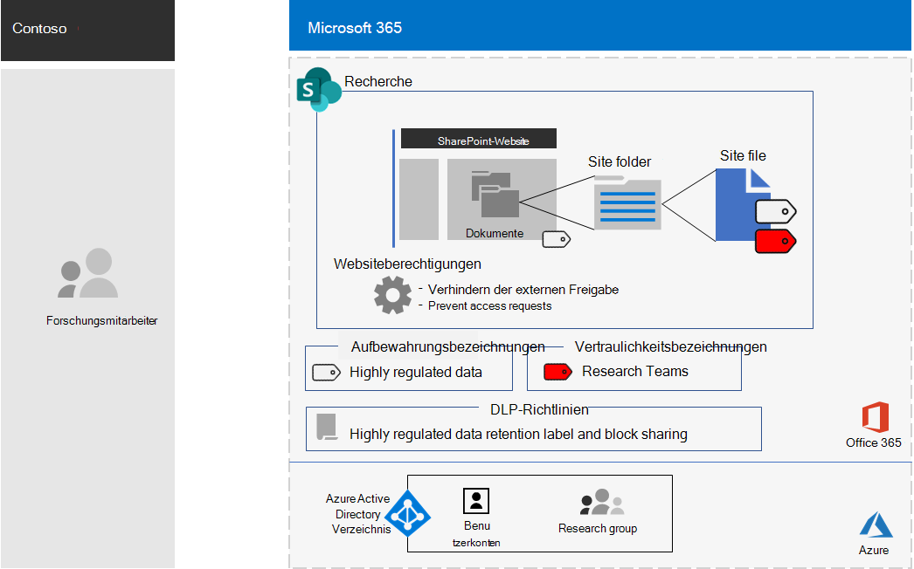
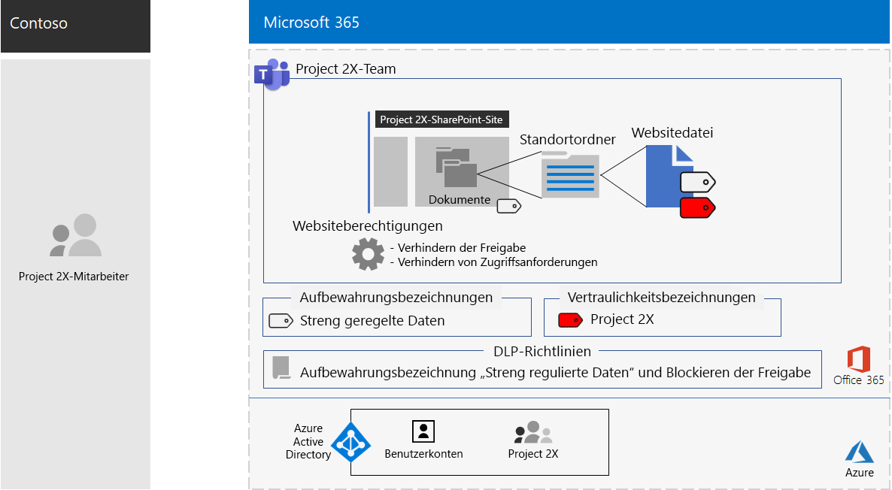

# Team für ein streng geheimes Projekt in der Contoso CorporationTeam for a top-secret project of the Contoso Corporation

Nach einem externen Geschäftsführer ordnete der CEO von Contoso die Entwicklung einer neuen Produkt-und Dienst Suite an, die die Gewinne von Contoso in den nächsten fünf Jahren verdoppeln könnte.After an executive offsite, Contoso’s CEO ordered the development of a new suite of products and services that could double Contoso’s profits in the next five years. Das streng geheime Projekt zur Entwicklung des Geschäfts-, Ingenieur-und Marktplans wurde mit dem Namen **Project 2X** und den wichtigsten Mitarbeitern im gesamten Unternehmen rekrutiert.The top-secret project to develop the business, engineering, and market plan was named **Project 2X** and key staff across the company were recruited. 

Die Zeitrahmen für Forschung und Entwicklung waren eng, was bedeutete, dass die Zusammenarbeit effizient sein und für sichere Besprechungen, laufende Unterhaltungen und Dateispeicherung sorgen musste.The timelines for research and development were tight, which meant that collaboration had to be efficient and provide for secure meetings, ongoing conversations, and file storage.

Die daraus resultierenden Lieferumfänge für Project 2X Warengeschäfts Pläne, Produkt-und Engineering-Spezifikationen sowie Marketingmaterialien und-Zeitpläne in Form von Word-, Excel-und PowerPoint-Dateien.The resulting deliverables for Project 2X were business plans, product and engineering specifications, and marketing materials and schedules in the form of Word, Excel, and PowerPoint files. 

Der Zugriff auf diese Dateien erfolgte aufgrund Ihrer sensiblen Eigenschaften wie folgt:Due to their sensitive nature, access to these files were:

- Beschränkt auf Project 2X-Teammitglieder.Restricted to Project 2X team members.
- Durch eine DLP-Richtlinie (Data Loss Prevention) geschützt, um zu verhindern, dass Project 2X-Teammitglieder Sie außerhalb des Teams freigeben.Protected with a Data Loss Prevention (DLP) policy to prevent Project 2X team members from sharing them outside the team.
- Verschlüsselt und mit Berechtigungen geschützt, um den Zugriff nur für Project 2X-Teammitglieder zu gewähren, auch wenn die Dateien außerhalb von Contoso verteilt wurden.Encrypted and protected with permissions to allow access only to Project 2X team members, even if the files were distributed outside of Contoso.

Contoso-IT-Mitarbeiter haben ein [Team für hochregulierte Daten](secure-teams-highly-regulated-data-scenario.md) für Project 2X und diese Schritte verwendet.Contoso IT staff used a [team for highly-regulated data](secure-teams-highly-regulated-data-scenario.md) for Project 2X and these steps.

## Schritt 1: Erstellen eines privaten Teams und Sperren der zugrunde liegenden SharePoint-WebsiteStep 1: Created a private team and locked down the underlying SharePoint site

Um den Zugriff auf die zugrunde liegende SharePoint-Website für das Team zu schützen, haben Contoso-IT-Administratoren die [empfohlenen SharePoint-Zugriffsrichtlinien](sharepoint-file-access-policies.md)konfiguriert.To protect access to the underlying SharePoint site for the team, Contoso IT administrators configured the [recommended SharePoint access policies](sharepoint-file-access-policies.md).

Als nächstes hat ein IT-Administrator von Contoso ein neues privates Team namens "Project 2X" erstellt und die Benutzerkonten von Project 2X-Mitarbeitern als Mitglieder hinzugefügt.Next, a Contoso IT administrator created a new private team named Project 2X and added the user accounts of Project 2X staff as members.

Als nächstes haben Sie zusätzliche Berechtigungseinstellungen für die Website konfiguriert, um zu verhindern, dass Project 2X den Zugriff auf die Website freigibt und andere Benutzer den Zugriff auf die Website anfordern.Next, they configured additional permission settings for the site to prevent Project 2X from sharing access to the site and to prevent other from requesting access to the site.

Informationen zu den Konfigurationsdetails finden Sie unter [SharePoint-Einstellungen für ein stark reguliertes Team](https://docs.microsoft.com/microsoft-365/security/office-365-security/deploy-teams-three-tiers#highly-confidential-teams).For the configuration details, see [SharePoint settings for a highly regulated team](https://docs.microsoft.com/microsoft-365/security/office-365-security/deploy-teams-three-tiers#highly-confidential-teams).

## Schritt 2: Konfigurieren einer DLP-Richtlinie und des zugrunde liegenden Standorts für eine Aufbewahrungs BezeichnungStep 2: Configured a DLP policy and the underlying site for a retention label 

Zunächst wendeten Contoso-Administratoren die vorhandene **streng vertrauliche** Office 365 Aufbewahrungs Bezeichnung auf den Abschnitt **Documents** der zugrunde liegenden SharePoint-Website des Project 2X-Teams an.First, Contoso admins applied the existing **Highly Confidential** Office 365 retention label to the **Documents** section of the underlying SharePoint site of the Project 2X team.

Als nächstes haben Sie eine neue Office 365 DLP-Richtlinie mit dem Namen " **Project 2X** " erstellt, die:Next, they created a new Office 365 DLP policy named **Project 2X** that:

- Verwendet die Office 365 Aufbewahrungs Bezeichnung mit hoher Vertraulichkeit.Uses the Highly Confidential Office 365 retention label.
- Blockiert Benutzer, wenn Sie versuchen, eine Datei im Team des Projekts 2X außerhalb von Contoso freizugeben.Blocks users when they attempt to share a file in the Project 2X team outside of Contoso.

Informationen zu den Konfigurationsdetails finden Sie unter [Protect Files in Teams with Retention Labels and DLP](https://docs.microsoft.com/microsoft-365/security/office-365-security/deploy-teams-retention-dlp).For the configuration details, see [Protect files in teams with retention labels and DLP](https://docs.microsoft.com/microsoft-365/security/office-365-security/deploy-teams-retention-dlp).

## Schritt 3: Erstellen einer Office 365 Sensitivitäts Bezeichnung für das Team des Projekts 2xStep 3: Created an Office 365 sensitivity label for the Project 2X team

Contoso-Administratoren haben eine neue Office 365 Sensitivitäts Bezeichnung " **Project 2X** " erstellt, die:Contoso admins created a new Office 365 sensitivity label named **Project 2X** that:

- Verschlüsselung erforderlich.Requires encryption.
- Erlaubt gemeinsame Author-Berechtigungen für das Projekt 2X Office 365 Gruppe.Allows Co-Author permissions for the Project 2X Office 365 group.

Hier ist die resultierende Konfiguration des Project 2X-Teams.Here is the resulting configuration of the Project 2X team.

 
Dateien im Abschnitt "Dokumente" der zugrunde liegenden Project 2X SharePoint-Website wurden durch Folgendes geschützt:Files in the Documents section of the underlying Project 2X SharePoint site were protected by:

- Die Websiteberechtigungen, die nur den Zugriff auf Mitglieder des Projekts 2X Office 365 Gruppe ermöglichen.The site permissions, which only allow access to members of the Project 2X Office 365 group.
- Die streng vertrauliche Aufbewahrungs Bezeichnung, die automatisch neuen Dateien zugewiesen wird.The  Highly Confidential retention label, which is automatically assigned to new files.
- Eine DLP-Richtlinie, die die streng vertrauliche Aufbewahrungs Bezeichnung und Einstellungen verwendet, mit denen verhindert wird, dass die Datei für externe Benutzer freigegeben wird.A DLP policy that uses the Highly Confidential retention label and settings that block the file from being shared with external users.
- Die Bezeichnung "Project 2X Sensitivity" mit Verschlüsselung und Berechtigungen, die mit der Datei transportiert werden, wenn Sie von der Website verschoben oder kopiert wird.The Project 2X sensitivity label, with encryption and permissions that travel with the file if it is moved or copied from the site.

Im folgenden finden Sie ein Beispiel für eine Datei, die im zugrunde liegenden Projekt 2X-Standort mit der streng regulierten Aufbewahrungs Bezeichnung und der zugewiesenen 2-fachen Vertraulichkeits Bezeichnung gespeichert istHere is an example of a file stored in the underlying Project 2X site with the Highly Regulated retention label and the Project 2X sensitivity label assigned.

 
## Schritt 4: geschulte Project 2X-TeammitgliederStep 4: Trained Project 2X team members

Contoso-Sicherheitsmitarbeiter haben die Teammitglieder des Projekts 2X in einem obligatorischen Kurs geschult, der Sie durchschritten hat:Contoso security staff trained the Project 2X team members in a mandatory course that stepped them through:

- Wie Sie auf das neue Project 2X-Team zugreifen, Besprechungen und Chats verwenden und wie Sie an Team Dateien zusammenarbeiten können.How to access the new Project 2X team, use meetings and chats, and how to collaborate on team files.
- Erstellen neuer Dateien im Team und Hochladen neuer Dateien, die lokal erstellt wurden.How to create new files in the team and upload new files created locally.
- Ein Beispiel dafür, wie die DLP-Richtlinie verhindert, dass Dateien extern freigegeben werden.A demonstration of how the DLP policy blocks files from being shared externally.
- Vorgehensweise Beschriften von Dateien mit der Sensitivitäts Bezeichnung Project 2x.How to label files with the Project 2X sensitivity label.
- Eine Demonstration der Art und Weise, wie die Bezeichnung des Projekts 2X eine Datei schützt, auch wenn Sie das Team verlässt.A demonstration of how the Project 2X  label protects a file even when it leaves the team.

Das Endergebnis war eine sichere Umgebung, in der Project 2X-Teammitglieder in einer sicheren Umgebung für Chats, Besprechungen und Dateien zusammengearbeitet haben.The end result was a secure environment in which Project 2X team members collaborated in a secure environment for chats, meetings, and files.

In einigen Fällen haben Project 2X-Teammitglieder Dateien heruntergeladen, die von der Bezeichnung "Project 2X" auf ein lokales Laufwerk für die Offlinearbeit geschützt wurden.In a couple of instances, Project 2X team members downloaded files protected by the Project 2X label to a local drive for offline work. Nachdem Sie jedoch beim Öffnen zur Eingabe von Anmeldeinformationen aufgefordert wurden, wurde der Fehler erkannt und gelöscht.However, after being prompted for credentials when opening them, they realized their mistake and deleted them.

Aufgrund der Zusammenarbeitsumgebung von Teams und der Sicherheitsfeatures von Microsoft 365 wurden die Details von Project 2X für die Dauer des Projekts vertraulich behandelt.Because of the collaboration environment of Teams and the security features of Microsoft 365, the details of Project 2X were kept secret for the duration of the project. Contoso kündigte seine Pläne an und ist dabei, die neuen Produkte und Dienstleistungen zur Freude seiner Kunden und Investoren und zum Leidwesen seiner Konkurrenten bereitzustellen.Contoso announced its plans and is in the process of rolling out the new products and services to the delight of its customers and investors and the chagrin of its competitors.

## Nächster SchrittNext step

[Bereitstellen](deploy-microsoft-365-enterprise.md) Microsoft 365 Enterprise in Ihrer Organisation.[Deploy](deploy-microsoft-365-enterprise.md) Microsoft 365 Enterprise in your organization.

## Siehe auchSee also

[Microsoft 365-Produktivitätsbibliothek](https://aka.ms/productivitylibrary) (https://aka.ms/productivitylibrary)[Microsoft 365 Productivity Library](https://aka.ms/productivitylibrary) (https://aka.ms/productivitylibrary)
