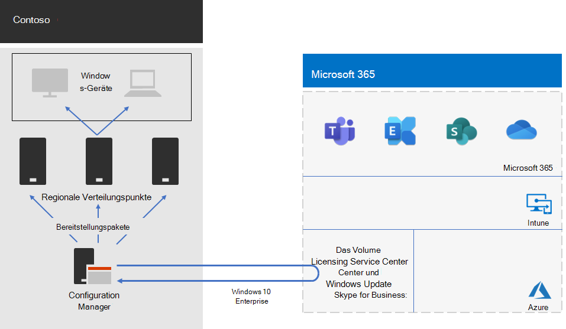

# Bereitstellung von Windows 10 Enterprise für ContosoWindows 10 Enterprise deployment for Contoso

Vor der unternehmensweiten Einführung von Microsoft 365 Enterprise verfügte Contoso über Windows-kompatible Computer und Geräte, auf denen eine Mischung aus Windows 7 (10 %), Windows 8.1 (65 %) und Windows 10 (25 %) ausgeführt wurde. Contoso wollte seine Computer auf Windows 10 Enterprise aktualisieren, um die erweiterte Sicherheit sowie den niedrigeren IT-Aufwand der automatisierten Bereitstellung von Updates nutzen zu können.Prior to the wide rollout of Microsoft 365 Enterprise, Contoso had Windows-compatible PCs and devices running a mixture of Windows 7 (10%), Windows 8.1 (65%), and Windows 10 (25%). Contoso wanted to upgrade their PCs for Windows 10 Enterprise take advantage of advanced security and lowered IT overhead from automated deployments of updates. 

Nach der Bewertung der Infrastruktur und der Geschäftsanforderungen identifizierte Contoso die folgenden Hauptanforderungen für die Bereitstellung:After assessing their infrastructure and business needs, Contoso identified these key requirements for the deployment:

- Windows 10 Enterprise soll auf so vielen Computern und Geräten wie möglich ausgeführt werden.As many PCs and devices as possible should run Windows 10 Enterprise
- Die Einführung von direkten Upgrades nutzt die vorhandene Configuration Manager-Infrastruktur.Rollout of the in-place upgrades leverages existing Configuration Manager infrastructure
- Die Steuerung, welche Versionen von Windows 10 Enterprise bereitgestellt und aktualisiert werden sollen, erfolgt über Ringe.Control over which versions of Windows 10 Enterprise to deploy and updates are done through rings
- Computer und Geräte sollen mit minimalen IT-Verwaltungskosten und minimalen Auswirkungen auf die Endbenutzer auf dem aktuellen Stand gehalten werden.PCs and devices should stay up to date with minimal IT administrative costs and with minimal impact to end-users

„Auf dem neuesten Stand“ wird definiert als die unterstützte Version von Windows 10 Enterprise, die den Geschäftsanforderungen von Contoso entspricht; dabei muss es nicht unbedingt darum gehen, dass auf allen Windows-kompatiblen Computern die neueste Version von Windows 10 Enterprise ausgeführt wird.Up to date is defined as the supported version of Windows 10 Enterprise that meets Contoso’s business needs, which can be different from having all Windows-compatible PCs running the latest version of Windows 10 Enterprise.

## BereitstellungstoolsDeployment tools

Vor und während direkter Upgrades von Windows 10 Enterprise verwendete Contoso die folgenden Lösungen von Windows Analytics:Prior to and during in-place upgrades of Windows 10 Enterprise, Contoso used the following solutions of Windows Analytics:

- UpgradebereitschaftUpgrade Readiness  

  Es werden System-, Anwedungs- und Treiberdaten für die Analyse erfasst und dann Kompatibilitätsprobleme identifiziert, durch die ein Upgrade und vorgeschlagene Korrekturen blockiert werden können, die Microsoft bekannt sind.Collects system, application, and driver data for analysis, and then identifies compatibility issues that can block an upgrade and suggested fixes the issues are known to Microsoft.

- Update-ComplianceUpdate Compliance  

  Zeigt den Status Ihrer Geräte in Bezug auf die Windows-Updates an, so dass Sie sicherstellen können, dass diese gegebenenfalls auf den aktuellsten Updates sind.Shows you the state of your devices with respect to the Windows updates so that you can ensure that they are on the most current updates as appropriate.

- GeräteintegritätDevice Health  

  Identifiziert Geräte, die häufig abstürzen und daher möglicherweise neu aufgebaut oder ersetzt werden müssen, und Gerätetreiber, die Geräteabstürze verursachen, mit Vorschlägen für alternative Versionen dieser Treiber, welche die Anzahl der Abstürze reduzieren könnten.Identifies devices that crash frequently, and therefore might need to be rebuilt or replaced and device drivers that are causing device crashes, with suggestions of alternative versions of those drivers that might reduce the number of crashes. Bietet eine Benachrichtigung über Fehlkonfigurationen des Windows Information Protection, die Eingabeaufforderungen an Endbenutzer senden.Provides notification of Windows Information Protection misconfigurations that send prompts to end users.
 
Contoso verfügt über eine vorhandene Infrastruktur von Configuration Manager (Current Branch). Configuration Manager kann an große Umgebungen angepasst werden und bietet eine umfassende Kontrolle über Installation, Updates und Einstellungen. Er verfügt außerdem über integrierte Features, um die Bereitstellung und Verwaltung von Windows 10 Enterprise zu vereinfachen und effizienter zu gestalten.Contoso has an existing Configuration Manager (Current Branch) infrastructure. Configuration Manager scales for large environments and provides extensive control over installation, updates, and settings. It also has built-in features to make it easier and more efficient to deploy and manage Windows 10 Enterprise.

## PlanungsprozessPlanning process

Vor der Bereitstellung hat Contoso die folgenden Ringe definiert:Prior to deployment, Contoso defined the following rings:

- Drei Ringe für die Überprüfung und das Staging der BereitstellungThree rings for validation and deployment staging 
  - Ein Ring für Vorschau-BuildsOne for preview builds 
  - Ein Ring für die Builds von neuen VersionenOne for new release builds
  - Ein Ring für einen früheren BuildOne for a previous build 
- Ein Ring für die allgemeine Bereitstellung von Windows 10 Enterprise basierend auf Daten aus den ÜberprüfungsringenOne ring for broad deployment of Windows 10 Enterprise based on data from the validation rings

Contoso hat auch die Lösung für die Upgradebereitschaft von Windows Analytics verwendet, um installierte Apps und deren Kompatibilität mit Windows 10 Enterprise zu bestimmen.Contoso also used the Upgrade Readiness solution of Windows Analytics to determine the set of installed apps and their compatibility with Windows 10 Enterprise.

## BereitstellungsprozessDeployment process

Um die Bereitstellung des direkten Upgrades von Windows 10 Enterprise abzuschließen, hat Contoso den folgenden Prozess implementiert, der Empfehlungen zu bewährten Vorgehensweisen von Microsoft umfasst:To complete the in-place upgrade deployment of Windows 10 Enterprise, Contoso implemented the following process, which includes best practice recommendations from Microsoft:

1. Der Peercache für Configuration Manager wurde aktiviert.Enabled peer cache for Configuration Manager.
2. Es wurden angepasste Windows-Pakete basierend auf Images aus dem Volume Licensing Service Center erstellt.Created customized Windows packages based on images from the Volume Licensing Service Center.
3. Configuration Manager wurde zur Bereitstellung der Windows-Pakete an Verteilungspunkten im Netzwerk verwendet, und es wurden Builds an den drei Ringen für Überprüfung und Staging der Bereitstellung bereitgestellt.Used Configuration Manager to deploy the Windows packages to distribution points across their network and deployed builds to the three validation and deployment staging rings.
4. Mithilfe der Lösungen für Geräteintegrität und Updatebereitschaft von Windows Analytics wurden der Erfolg von Computern und Geräten in den drei Ringen für Überprüfung und Staging der Bereitstellung bewertet.Performed assessment of success for PCs and devices in the three validation and deployment staging rings using the Device Health and Update Compliance solutions of Windows Analytics.
5. Contoso ermittelte (basierend auf den Windows Analytics-Informationen) die Version von Windows 10 Enterprise, die im Ring der Bereitstellung auf breiter Basis bereitgestellt werden soll.Based on the Windows Analytics information, Contoso determined the version of Windows 10 Enterprise to deploy to the broad deployment ring.
6. Es wurden die Bereitstellungsaufgabenfolgen von Configuration Manager ausgeführt, um das ausgewählte Windows-Paket im Ring der Bereitstellung auf breiter Basis bereitzustellen.Ran the Configuration Manager deployment task sequences to deploy the selected Windows package to the broad deployment ring.
7. Die Computer und Geräte im Ring der Bereitstellung auf breiter Basis wurden mithilfe der Lösungen für Geräteintegrität und Updatebereitschaft überwacht, die zur Behebung von Problemen bereitgestellt werden.Monitored PCs and devices in the broad deployment ring using the Device Health and Update Compliance solutions to address issues.

Hier ist Contosos Bereitstellungsarchitektur für das direkte Upgrade und fortlaufende Updates.Here is Contoso’s in-place upgrade and ongoing updates deployment architecture.

Diese Infrastruktur besteht aus:This infrastructure consists of:

- Configuration Manager, der:Configuration Manager, which:
  - Images für Windows 10 Enterprise-Pakete aus dem Microsoft Volume Licensing Center im Microsoft Network abruft.Obtains images for Windows 10 Enterprise packages from the Microsoft Volume Licensing Center in the Microsoft Network.
  - Als zentraler Verwaltungspunkt für Bereitstellungspakete fungiert.Is the central administration point for deployment packages.
- Regionale Verteilungspunkte befinden sich in der Regel in den regionalen Hub-Büros von Contoso.Regional distribution points that are typically located in Contoso’s regional hub offices.
- Windows-PCs und Geräte an verschiedenen Standorten, die die Bereitstellungspakete für das direkte Upgrade oder für laufende Updates basierend auf der Ringmitgliedschaft empfangen und installieren.Windows PCs and devices in various locations that receive and install the deployment packages for the in-place upgrade or ongoing updates based on ring membership.

## Nächster SchrittNext step

[Erfahren Sie mehr](contoso-o365pp.md) darüber, wie Contoso seine Configuration Manager-Infrastruktur verwendet, um Office 365 ProPlus in der gesamten Organisation bereitzustellen und auf dem neuesten Stand zu halten.[Learn](contoso-o365pp.md) how Contoso is leveraging its Configuration Manager infrastructure to deploy and keep current Office 365 ProPlus across its organization. 

## Siehe auchSee also

[Windows 10 Enterprise für Microsoft 365 EnterpriseWindows 10 Enterprise for Microsoft 365 Enterprise](windows10-infrastructure.md)

[BereitstellungshandbuchDeployment guide](deploy-microsoft-365-enterprise.md)

[TestumgebungsanleitungenTest lab guides](m365-enterprise-test-lab-guides.md)
