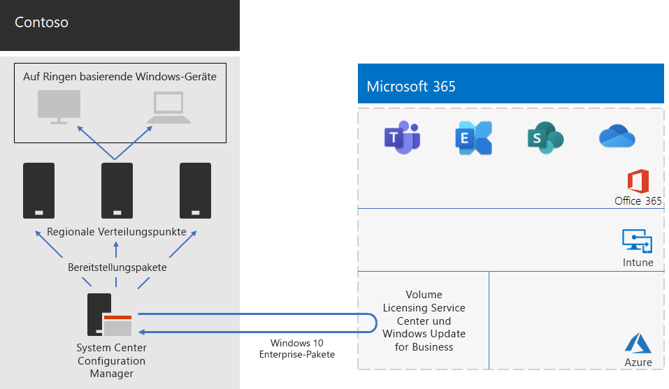

# Bereitstellung von Windows 10 Enterprise für Contoso

**Zusammenfassung:** Informationen dazu, wie Contoso System Center Configuration Manager zur Bereitstellung von direkten Upgrades für Windows 10 Enterprise verwendete.

Vor der unternehmensweiten Einführung von Microsoft 365 Enterprise verfügte Contoso über Windows-kompatible Computer und Geräte, auf denen eine Mischung aus Windows 7 (10 %), Windows 8.1 (65 %) und Windows 10 (25 %) ausgeführt wurde. Contoso wollte seine Computer auf Windows 10 Enterprise aktualisieren, um die erweiterte Sicherheit sowie den niedrigeren IT-Aufwand der automatisierten Bereitstellung von Updates nutzen zu können. 

Nach der Bewertung der Infrastruktur und der Geschäftsanforderungen identifizierte Contoso die folgenden Hauptanforderungen für die Bereitstellung:

- Windows 10 Enterprise soll auf so vielen Computern und Geräten wie möglich ausgeführt werden.
- Die Einführung von direkten Upgrades nutzt die vorhandene System Center Configuration Manager-Infrastruktur.
- Die Steuerung, welche Versionen von Windows 10 Enterprise bereitgestellt und aktualisiert werden sollen, erfolgt über Ringe.
- Computer und Geräte sollen mit minimalen IT-Verwaltungskosten und minimalen Auswirkungen auf die Endbenutzer auf dem aktuellen Stand gehalten werden.

„Auf dem neuesten Stand“ wird definiert als die unterstützte Version von Windows 10 Enterprise, die den Geschäftsanforderungen von Contoso entspricht; dabei muss es nicht unbedingt darum gehen, dass auf allen Windows-kompatiblen Computern die neueste Version von Windows 10 Enterprise ausgeführt wird.

## Bereitstellungstools

Vor und während direkter Upgrades von Windows 10 Enterprise verwendete Contoso die folgenden Lösungen von Windows Analytics:

- Upgradebereitschaft  

  Es werden System-, Anwedungs- und Treiberdaten für die Analyse erfasst und dann Kompatibilitätsprobleme identifiziert, durch die ein Upgrade und vorgeschlagene Korrekturen blockiert werden können, die Microsoft bekannt sind.

- Update-Compliance  

  Zeigt den Status Ihrer Geräte in Bezug auf die Windows-Updates an, so dass Sie sicherstellen können, dass diese gegebenenfalls auf den aktuellsten Updates sind.

- Geräteintegrität  

  Identifiziert Geräte, die häufig abstürzen und daher möglicherweise neu aufgebaut oder ersetzt werden müssen, und Gerätetreiber, die Geräteabstürze verursachen, mit Vorschlägen für alternative Versionen dieser Treiber, welche die Anzahl der Abstürze reduzieren könnten. Bietet eine Benachrichtigung über Fehlkonfigurationen des Windows Information Protection, die Eingabeaufforderungen an Endbenutzer senden.
 
Contoso verfügt über eine vorhandene Infrastruktur von System Center Configuration Manager (Current Branch). Configuration Manager kann an große Umgebungen angepasst werden und bietet eine umfassende Kontrolle über Installation, Updates und Einstellungen. Er verfügt außerdem über integrierte Features, um die Bereitstellung und Verwaltung von Windows 10 Enterprise zu vereinfachen und effizienter zu gestalten.

## Planungsprozess

Vor der Bereitstellung hat Contoso die folgenden Ringe definiert:

- Drei Ringe für die Überprüfung und das Staging der Bereitstellung 
  - Ein Ring für Vorschau-Builds 
  - Ein Ring für die Builds von neuen Versionen
  - Ein Ring für einen früheren Build 
- Ein Ring für die allgemeine Bereitstellung von Windows 10 Enterprise basierend auf Daten aus den Überprüfungsringen

Contoso hat auch die Lösung für die Upgradebereitschaft von Windows Analytics verwendet, um installierte Apps und deren Kompatibilität mit Windows 10 Enterprise zu bestimmen.

## Bereitstellungsprozess

Um die Bereitstellung des direkten Upgrades von Windows 10 Enterprise abzuschließen, hat Contoso den folgenden Prozess implementiert, der Empfehlungen zu bewährten Vorgehensweisen von Microsoft umfasst:

1. Der Peercache für Configuration Manager wurde aktiviert.
2. Es wurden angepasste Windows-Pakete basierend auf Images aus dem Volume Licensing Service Center erstellt.
3. Configuration Manager wurde zur Bereitstellung der Windows-Pakete an Verteilungspunkten im Netzwerk verwendet, und es wurden Builds an den drei Ringen für Überprüfung und Staging der Bereitstellung bereitgestellt.
4. Mithilfe der Lösungen für Geräteintegrität und Updatebereitschaft von Windows Analytics wurden der Erfolg von Computern und Geräten in den drei Ringen für Überprüfung und Staging der Bereitstellung bewertet.
5. Contoso ermittelte (basierend auf den Windows Analytics-Informationen) die Version von Windows 10 Enterprise, die im Ring der Bereitstellung auf breiter Basis bereitgestellt werden soll.
6. Es wurden die Bereitstellungsaufgabenfolgen von Configuration Manager ausgeführt, um das ausgewählte Windows-Paket im Ring der Bereitstellung auf breiter Basis bereitzustellen.
7. Die Computer und Geräte im Ring der Bereitstellung auf breiter Basis wurden mithilfe der Lösungen für Geräteintegrität und Updatebereitschaft überwacht, die zur Behebung von Problemen bereitgestellt werden.

Hier ist Contosos Bereitstellungsarchitektur für das direkte Upgrade und fortlaufende Updates.

Diese Infrastruktur besteht aus:

- System Center Configuration Manager, der:
  - Images für Windows 10 Enterprise-Pakete aus dem Microsoft Volume Licensing Center im Microsoft Network abruft.
  - Als zentraler Verwaltungspunkt für Bereitstellungspakete fungiert.
- Regionale Verteilungspunkte befinden sich in der Regel in den regionalen Hub-Büros von Contoso.
- Windows-PCs und Geräte an verschiedenen Standorten, die die Bereitstellungspakete für das direkte Upgrade oder für laufende Updates basierend auf der Ringmitgliedschaft empfangen und installieren.

## Nächster Schritt

[Erfahren Sie mehr](contoso-o365pp.md) darüber, wie Contoso seine System Center Configuration Manager-Infrastruktur verwendet, um Office 365 ProPlus in der gesamten Organisation bereitzustellen und auf dem neuesten Stand zu halten. 

## Siehe auch

[Windows 10 Enterprise für Microsoft 365 Enterprise](windows10-infrastructure.md)

[Bereitstellungshandbuch](deploy-microsoft-365-enterprise.md)

[Testumgebungsanleitungen](m365-enterprise-test-lab-guides.md)
