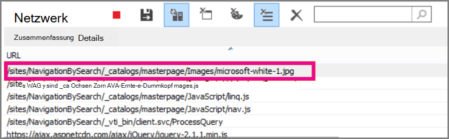
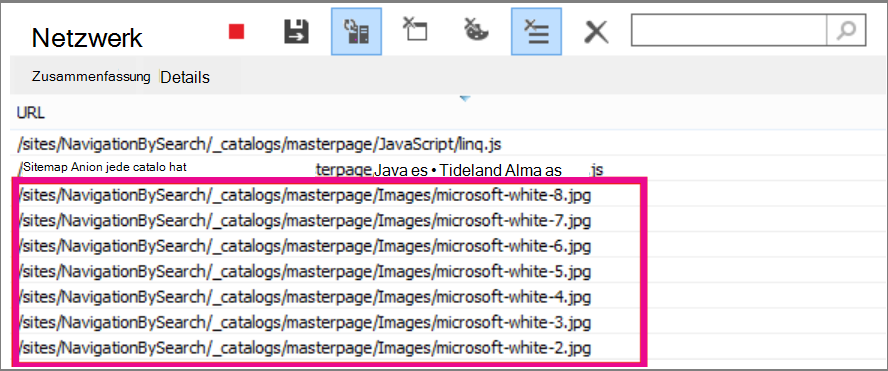

# <a name="delay-loading-images-and-javascript-in-sharepoint-online"></a>Verzögerung beim Laden von Bildern und JavaScript in SharePoint Online

In diesem Artikel wird beschrieben, wie Sie die Ladezeit für SharePoint Onlineseiten verringern können, indem Sie JavaScript verwenden, um das Laden von Bildern zu verzögern und auch darauf zu warten, dass nicht essentielles JavaScript bis nach dem Laden der Seite geladen wird.
  
Bilder können sich negativ auf die Seitenladegeschwindigkeit in SharePoint Online auswirken. Standardmäßig rufen die meisten modernen Internetbrowser Bilder beim Laden einer HTML-Seite vorab ab. Dies kann dazu führen, dass die Seite unnötig langsam geladen wird, wenn die Bilder nicht auf dem Bildschirm angezeigt werden, bis der Benutzer einen Bildlauf nach unten durchführen kann. Die Bilder können verhindern, dass der Browser den sichtbaren Teil der Seite lädt. Um dieses Problem zu beheben, können Sie javaScript verwenden, um das Laden der Bilder zuerst zu überspringen. Darüber hinaus kann das Laden nicht wesentlicher JavaScript-Dateien die Downloadzeiten auf Ihren SharePoint verlangsamen. In diesem Thema werden einige Methoden beschrieben, mit deren Hilfe Sie die Ladezeiten von Seiten mit JavaScript in SharePoint Online verbessern können.
  
## <a name="improve-page-load-times-by-delaying-image-loading-in-sharepoint-online-pages-by-using-javascript"></a>Verbessern sie die Ladezeiten von Seiten, indem Sie das Laden von Bildern in SharePoint Onlineseiten mithilfe von JavaScript verzögern

Sie können JavaScript verwenden, um zu verhindern, dass ein Webbrowser Bilder vorab abruft. Dadurch wird das gesamte Dokumentrendering beschleunigt. Dazu entfernen Sie den Wert des src-Attributs aus dem Tag und ersetzen ihn durch den Pfad zu einer Datei in einem \ Datenattribut wie: data-src. Beispiel:
  
```html

```

Mithilfe dieser Methode wird der Browser die Bilder nicht sofort herunterladen. Wenn sich das Bild bereits im Viewport befindet, weist JavaScript den Browser an, die URL aus dem Data-Attribut abzurufen und als Wert für das src-Attribut einfüge. Das Bild wird nur geladen, wenn der Benutzer einen Bildlauf durchblättert, und es wird angezeigt.
  
Um all dies zu geschehen, müssen Sie JavaScript verwenden.
  
Definieren Sie in einer Textdatei die **isElementInViewport()-Funktion,** um zu überprüfen, ob sich ein Element im Browserteil befindet, der für den Benutzer sichtbar ist.
  
```javascript
function isElementInViewport(el) {
  if (!el)
    return false;
  var rect = el.getBoundingClientRect();
  return (
    rect.top >= 0 &amp;&amp;
    rect.left >= 0 &amp;&amp;
    rect.bottom <= (window.innerHeight || document.documentElement.clientHeight) &amp;&amp;
    rect.right <= (window.innerWidth || document.documentElement.clientWidth)
  );
}
```

Verwenden Sie als Nächstes **isElementInViewport()** in der **loadItemsInView()-Funktion.** Die **loadItemsInView()-Funktion** laden alle Bilder, die einen Wert für das data-src-Attribut haben, wenn sie sich im Für den Benutzer sichtbaren Teil des Browsers befinden. Fügen Sie der Textdatei die folgende Funktion hinzu:
  
```javascript
function loadItemsInView() {
  //Select elements by the row id.
  $("#row [data-src]").each(function () {
      var isVisible = isElementInViewport(this);
      if (isVisible) {
          if ($(this).attr("src") == undefined) {
              $(this).attr("src", $(this).data("src"));
          }
      }
  });
}
```

Rufen Sie **schließlich loadItemsInView()** aus **dem Fenster window.onscroll()** auf, wie im folgenden Beispiel gezeigt. Dadurch wird sichergestellt, dass alle Bilder, die sich im Viewport befinden, nach Bedarf des Benutzers geladen werden, aber nicht zuvor. Fügen Sie der Textdatei Folgendes hinzu:
  
```javascript
//Example of calling loadItemsInView() from within window.onscroll()
$(window).on("scroll", function () {
    loadItemsInView();
});

```

For SharePoint Online, you need to attach the following function to the scroll event on the #s4-workspace \<div\> tag. Dies liegt daran, dass die Fensterereignisse überschrieben werden, um sicherzustellen, dass das Menüband am oberen Rand der Seite angefügt bleibt.
  
```javascript
//Keep the ribbon at the top of the page
$('#s4-workspace').on("scroll", function () {
    loadItemsInView();
});
```

Speichern Sie die Textdatei als JavaScript-Datei mit der .js, z. B. delayLoadImages.js.
  
Nachdem Sie das Schreiben der delayLoadImages.js abgeschlossen haben, können Sie den Inhalt der Datei einer Masterseite in SharePoint Online hinzufügen. Dazu fügen Sie der Kopfzeile auf der Masterseite einen Skriptlink hinzu. Sobald es sich in einer Gestaltungsgestaltungsseite ist, wird das JavaScript auf alle Seiten in Ihrer SharePoint Online-Website angewendet, die dieses Gestaltungsgestaltungslayout verwenden. Wenn Sie dies nur auf einer Seite Ihrer Website verwenden möchten, verwenden Sie alternativ das Skript-Editor-Web part, um javaScript in die Seite einzubetten. Weitere Informationen finden Sie in den folgenden Themen:
  
- [Vorgehensweise: Anwenden einer Gestaltungsvorlage auf eine Website in SharePoint 2013](/sharepoint/dev/general-development/how-to-apply-a-master-page-to-a-site-in-sharepoint)

- [Vorgehensweise: Erstellen eines Seitenlayouts in SharePoint 2013](/sharepoint/dev/general-development/how-to-create-a-page-layout-in-sharepoint)

### <a name="example-referencing-the-javascript-delayloadimagesjs-file-from-a-master-page-in-sharepoint-online"></a>Beispiel: Verweisen auf die JavaScript-delayLoadImages.js von einer Masterseite in SharePoint Online
  
Damit dies funktioniert, müssen Sie auf der Masterseite auch auf jQuery verweisen. Im folgenden Beispiel sehen Sie in der ersten Seitenlade, dass nur ein Bild geladen ist, aber es sind mehrere weitere auf der Seite.
  

  
Der folgende Screenshot zeigt die restlichen Bilder, die nach dem Bildlauf in die Ansicht heruntergeladen werden.
  

  
Das Verzögern des Ladens von Bildern mithilfe von JavaScript kann eine effektive Technik zur Leistungssteigerung sein. Wenn die Technik jedoch auf einer öffentlichen Website angewendet wird, können Suchmaschinen die Bilder nicht auf die gleiche Weise durchforsten, wie sie ein regelmäßig gebildetes Bild durchforsten würden. Dies kann sich auf die Rangfolge von Suchmaschinen auswirken, da Metadaten auf dem Bild selbst erst wirklich verfügbar sind, wenn die Seite geladen wird. Suchmaschinencrawler lesen nur den HTML-Code und sehen daher die Bilder nicht als Inhalt auf der Seite. Bilder sind einer der Faktoren, die zum Rangieren von Seiten in Suchergebnissen verwendet werden. Eine Möglichkeit, dies zu umarbeiten, ist die Verwendung von Einführungstext für Ihre Bilder.
  
## <a name="github-code-sample-injecting-javascript-to-improve-performance"></a>GitHub code sample: Injecting JavaScript to improve performance

Verpassen Sie nicht den Artikel und das Codebeispiel für [die JavaScript-Injection,](https://go.microsoft.com/fwlink/p/?LinkId=524759) die auf der GitHub.
  
## <a name="see-also"></a>Siehe auch

[Unterstützte Browser in Office 2013 und Microsoft 365 Apps for Enterprise](https://support.office.com/article/57342811-0dc4-4316-b773-20082ced8a82)
  
[Vorgehensweise: Anwenden einer Gestaltungsvorlage auf eine Website in SharePoint 2013](/sharepoint/dev/general-development/how-to-apply-a-master-page-to-a-site-in-sharepoint)
  
[Vorgehensweise: Erstellen eines Seitenlayouts in SharePoint 2013](/sharepoint/dev/general-development/how-to-create-a-page-layout-in-sharepoint)