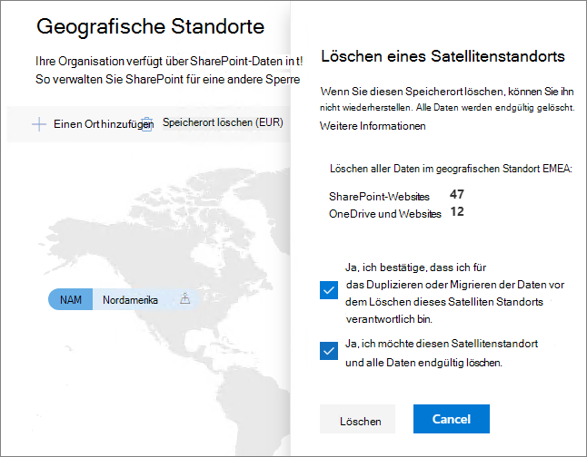

# Löschen eines Satellitenstandorts in Microsoft 365 Multi-Geo.Delete a satellite location in Microsoft 365 Multi-Geo

Wenn Sie einen Satellitenstandort nicht mehr benötigen, können Sie diesen von Ihrem Mandanten über das SharePoint Admin Center löschen.If you no longer need a satellite location, you can delete it from your tenant from the SharePoint admin center.

> [!WARNING]
> Alle Benutzerdaten an dem Satellitenstandort werden dauerhaft gelöscht.All user data in the satellite location will be permanently deleted. Dazu gehören alle OneDrive for Business-Inhalte, SharePoint-Websites und Exchange-Postfächer, einschließlich Microsoft 365-Gruppenpostfächern.This includes all OneDrive for Business content, SharePoint sites and Exchange mailboxes including Microsoft 365 Group mailboxes. Vor dem Löschen des Satellitenstandorts müssen alle Daten zu einem anderen Satellitenstandort oder an den zentralen Speicherort migriert werden.You must migrate any data to another satellite location or the central location before you delete the satellite location. Diese Aktion kann nicht rückgängig gemacht werden.This action cannot be undone.

Nur globale Administratoren können Satellitenstandorte löschen.Only global administrators can delete satellite locations.

So löschen Sie einen SatellitenstandortTo delete a satellite location

1. Öffnen Sie das SharePoint Admin Center.Open the SharePoint admin center

2. Navigieren Sie zu der Registerkarte **Geografische Standorte**.Navigate to the **Geo locations** tab.

3. Klicken Sie auf der Karte auf den geografischen Standort, den Sie löschen möchten.On the map, click the geo location that you want to delete.

4. Klicken Sie auf **Ort löschen**.Click **Delete location**.

5. Bestätigen Sie den Löschvorgang, indem Sie die Bestätigungskontrollkästchen aktivieren.Confirm the deletion by selecting the confirmation check boxes.

6. Klicken Sie auf **Löschen**.Click **Delete**.
