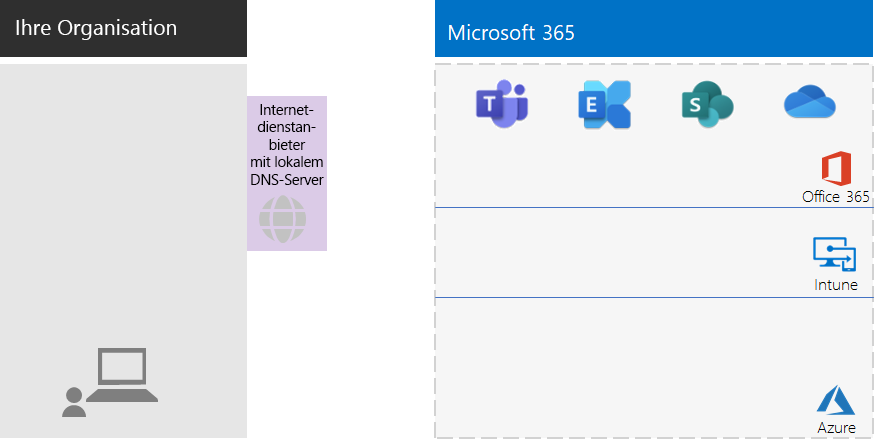
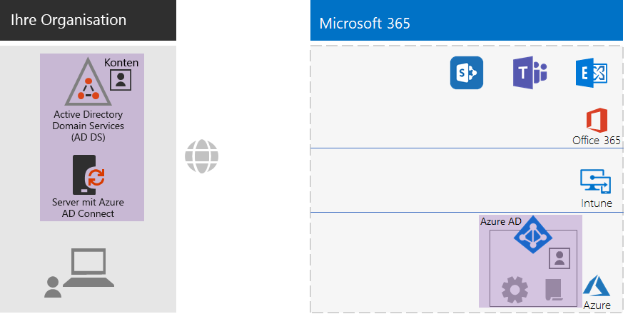
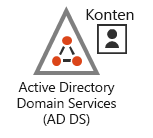
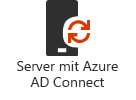
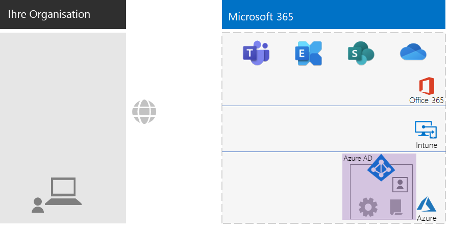
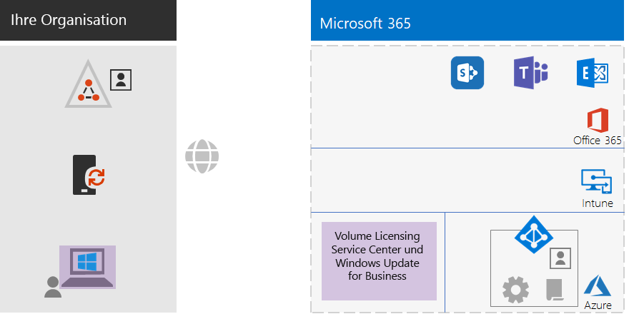
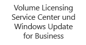
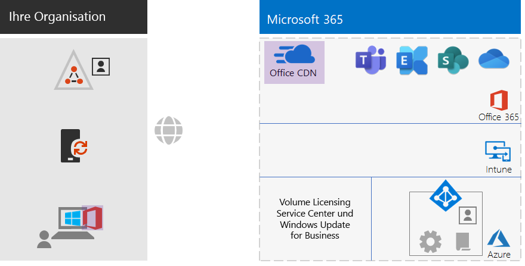
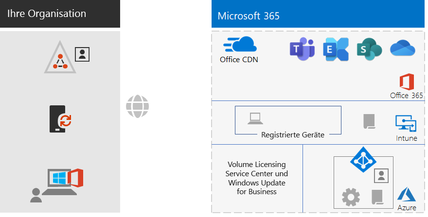
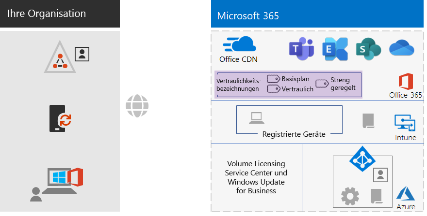

# Microsoft 365 Enterprise Foundation-Infrastruktur für Nicht-Unternehmen

Auch Nicht-Unternehmen können Microsoft 365 Enterprise einsetzen und den Geschäftswert einer integrierten und sicheren Infrastruktur nutzen, die Teamarbeit ermöglicht und Kreativität freisetzt. Ein Nicht-Unternehmen hat in der Regel:

- Eine kleine oder gar keine lokale IT-Infrastruktur, wie E-Mail- und Dateiserver und eine Active Directory Domain Services (AD DS)-Domäne.
- Ein kleines IT-Team, von dem die meisten Informatiker sind, und nicht Spezialisten für eine bestimmte Technologie oder Arbeitsbelastung wie Vernetzung oder E-Mail senden.

Für Ihre Nicht-Unternehmen stellt Microsoft [Microsoft 365 Business](https://www.microsoft.com/microsoft-365/business) bereit. Es gibt jedoch Gründe, warum Sie Microsoft 365 Enterprise benötigen, wie z. B.:

- Ihre Organisation benötigt jetzt oder später mehr als 300 Microsoft 365-Lizenzen, was das Maximum für Microsoft 365 Business darstellt.
- Ihre Organisation benötigt die fortschrittliche Produktivität, Sprach-, Sicherheits- und Analysefunktionen, die mit Microsoft 365 Business nicht verfügbar sind.

Dieser Artikel führt Sie durch eine vereinfachte Bereitstellung der für Ihr Nicht-Unternehmen geeigneten Foundation-Infrastruktur von Microsoft 365 Enterprise.

## Erstens: Einrichten Ihres Abonnements

Sie müssen die DNS-Domänen (Domain Name System) für Ihr Abonnement einrichten. Wenn Sie bereits ein Office 365-Abonnement haben, sollte dies geschehen sein. Wenn dies nicht der Fall ist, folgen Sie den Anweisungen unter [Hinzufügen einer Domäne zu Office 365](https://docs.microsoft.com/office365/admin/setup/add-domain?view=o365-worldwide).

Als nächstes müssen Sie zusätzliche Sicherheit für Microsoft 365 konfigurieren. Folgen Sie den Anweisungen unter [Konfigurieren der erhöhten Sicherheit](https://docs.microsoft.com/office365/securitycompliance/tenant-wide-setup-for-increased-security).

## Phase 1: Vernetzung

Nicht-Unternehmen verfügen in der Regel über lokale Internetverbindungen in jedem Büro und verwenden keine Proxy-Server, Firewalls oder Paket-Inspektionsgeräte. Der Internetdienstanbieter (Internet Service Provider, ISP), der die einzelnen Büros versorgt, verfügt über einen regional lokalen DNS-Server, so dass der Datenverkehr an den Microsoft 365-Netzwerkstandort geleitet wird, die Ihren Büros und deren lokalen Benutzern am nächsten sind. Weitere Informationen finden Sie unter [Konfigurieren von lokalen Internetverbindungen für jedes Büro](networking-dns-resolution-same-location.md).

Daher müssen Sie nur bei Ihrem ISP überprüfen, ob die Verbindung an jedem Ihrer Standorte:

- Einen regional lokalen DNS-Server verwendet.
- Für aktuelle und zukünftige Anforderungen geeignet ist, da Ihre Benutzer mehr Microsoft 365-Clouddienste nutzen.

Wenn Sie Proxyserver, Firewalls oder Paketüberprüfungsgeräte verwenden, finden Sie Informationen zur Optimierung der Leistung von Microsoft 365-Diensten unter [Konfigurieren von Datenverkehrumgehungen](networking-configure-proxies-firewalls.md).

### Ihre bisherige Konfiguration

Hier ist eine visuelle Zusammenfassung, in der das Element "Phase 1" hervorgehoben ist. **Ihre Organisation** kann aus mehreren Büros bestehen, von denen jedes eine lokale Internetverbindung mit einem ISP hat, der einen regional lokalen DNS-Server verwendet. Über den ISP können Benutzer in jedem Büro den nächstgelegenen Microsoft 365-Netzwerkstandort und die Ressourcen Ihres Microsoft 365-Abonnements erreichen.

## Phase 2: Identität

Jeder Mitarbeiter Ihrer Organisation muss sich anmelden können, was ein Benutzerkonto im Azure Active Directory (Azure AD)-Mandanten Ihres Microsoft 365 Enterprise-Abonnements erfordert. Gruppen werden dann verwendet, um Benutzerkonten und andere Gruppen zu enthalten, um zu kommunizieren oder Zugang zu berechtigten Ressourcen zu erhalten, wie beispielsweise einer SharePoint Online-Website oder einem Team. 

### Administratorkonten

Schützen Sie Ihre globalen Administrator-Benutzerkonten, indem Sie sichere Kennwörter und Multi-Faktor-Authentifizierung (MFA) erfordern. Weitere Informationen finden Sie unter [Schützen von globalen Administratorkonten](identity-create-protect-global-admins.md#protect-global-administrator-accounts).

Wenn Ihre Organisation hohe Sicherheitsanforderungen hat und Sie über Microsoft 365 E5 verfügen, verwenden Sie Azure AD Privileged Identity Management, um den Just-in-Time-Administratorzugriff zu ermöglichen. Weitere Informationen finden Sie unter [Einrichten von globalen Administratoren bei Bedarf](identity-create-protect-global-admins.md#identity-pim).

### Empfehlungen für Gruppen

Wenn Sie über eine lokale AD DS-Domäne verfügen, verwenden Sie diese Gruppen in Microsoft 365 Enterprise weiterhin als Gruppen in Azure AD.

Wenn Sie keine lokale AD DS-Domäne haben, erstellen Sie Sicherheitsgruppen in Azure AD mit diesen Sicherheitsebenen.

| Sicherheitsstufe | Beschreibung | Beispiele |
|:-------|:-----|:-----|
| Basisplan | Dies ist ein minimaler und voreingestellter Standard für den Schutz von Daten und den Identitäten und Geräten, die auf Ihre Daten zugreifen.    Dies sind in der Regel die meisten Daten Ihrer Organisation, die von den meisten Ihrer Benutzer verwaltet werden. | Gruppen für wichtige Arbeitskräfte, wie Vertrieb, Marketing, Kundendienst, Verwaltung und Produktion. |
| Vertraulich | Dies ist ein zusätzlicher Schutz für eine Teilmenge Ihrer Daten, die über den Basisplan hinaus geschützt werden muss. Diese Gruppen enthalten Benutzer, die vertrauliche Daten verwenden und erstellen, die spezifisch für Abteilungen und Projekte sind, die nicht für alle zugänglich sein sollen. | Produkt- oder Marketingteams, die zukünftige Produkte entwickeln |
| Streng geregelt | Dies ist die höchste Schutzstufe für in der Regel eine kleine Datenmenge, die hochgradig klassifiziert ist, als geistiges Eigentum oder Geschäftsgeheimnisse gilt oder Daten, die den Sicherheitsvorschriften entsprechen müssen. |  Teams in Forschungs-, Rechts- und Finanzabteilungen oder Teams, die Kunden- oder Partnerdaten speichern oder nutzen. |
||||

### Hybrididentität

Wenn Sie über eine lokale AD DS-Domäne verfügen, müssen Sie die Gruppe der Benutzerkonten, Gruppen und Kontakte Ihrer Domäne mit dem Azure AD-Mandanten Ihres Microsoft 365 Enterprise-Abonnements synchronisieren. Für Ihr Nicht-Unternehmen konfigurieren Sie Azure AD Connect auf einem Server mit Kennwort-Hash-Synchronisierung (Password Hash Synchronization, PHS). Weitere Informationen finden Sie unter [Synchronisieren von Identitäten](identity-add-user-accounts.md#synchronize-identities-for-hybrid-identity).

### Mehr Sicherheit für den Benutzerzugriff mit Richtlinien für bedingten Zugriff

Azure AD bewertet die Bedingungen für die Anmeldung von Benutzern und kann Richtlinien für den bedingten Zugriff verwenden, um den Zugang zu gewähren oder zu verweigern sowie weitere Aktionen ausführen, die zum Abschließen der Anmeldung erforderlich sind. Wenn Azure AD beispielsweise feststellt, dass die Anmeldung unter mittleren oder hohen Risikobedingungen erfolgt, kann es erforderlich sein, dass der Benutzer eine MFA durchführt, um die Anmeldung abzuschließen.

Sie wenden Richtlinien für den bedingten Zugriff auf Benutzerkonten oder Gruppen an. Um eine einfachere Zuordnung von Richtlinien für den bedingten Zugriff zu erleichtern, erstellen Sie diese Azure AD-Sicherheitsgruppen in Ihrer Organisation:

- BASISPLAN

  Enthält die Gruppen oder Benutzerkonten für Benutzer mit Zugriff auf Basisplandaten.

- VERTRAULICH

  Enthält die Gruppen oder Benutzerkonten für Benutzer mit Zugriff auf vertrauliche Daten.

- STRENG GEREGELT

  Enthält die Gruppen oder Benutzerkonten für Benutzer mit Zugriff auf streng geregelte Daten.

- BEDINGTEN ZUGRIFF AUSSCHLIEßEN

  Eine leere Gruppe, mit der Sie einen Benutzer vorübergehend von den Richtlinien für den bedingten Zugriff ausschließen können.

Hier ist die Liste der Richtlinien für den bedingten Zugriff von Azure AD, die aktiviert oder erstellt werden müssen.

| Azure AD-Richtlinie für den bedingten Zugriff | Gruppen, auf die Sie angewendet wird |
|:------|:-----|
| Basisplan-Richtlinie: MFA für Administratoren erforderlich | Diese Richtlinie gilt für Administratorrollen, daher müssen keine Gruppen angegeben werden. Diese Richtlinie muss nur aktiviert werden. Alle nachfolgenden Richtlinien müssen erstellt und aktiviert werden. |
| Sperrt Clients, die moderne Authentifizierung nicht unterstützen | Wählen Sie in den Richtlinieneinstellungen "alle Benutzer" aus. |
| MFA anfordern, wenn das Anmelderisiko mittel oder hoch ist (erfordert Microsoft 365 E5). | BASISPLAN |
| MFA anfordern, wenn das Anmelde-Risiko niedrig, mittel oder hoch ist (erfordert Microsoft 365 E5). | VERTRAULICH |
| Eine MFA ist immer erforderlich | STRENG GEREGELT |
| Genehmigte Apps auf iOS- und Android-Geräten erforderlich | BASISPLAN, VERTRAULICH, STRENG GEREGELT |
| Kompatible PCs erforderlich | BASISPLAN |
| Kompatible PCs und iOS- und Android-Geräte erforderlich | VERTRAULICH, STRENG GEREGELT |
|||

Hier ist die Azure AD Identity Protection-Richtlinie zum Benutzerrisiko (erfordert Microsoft 365 E5), um dies zu erstellen und zu aktivieren.

| Azure AD Identity Protection-Richtlinie zum Benutzerrisiko | Gruppen, auf die Sie angewendet wird |
|:------|:-----|
| Benutzer mit hohem Risiko müssen die Kennwörter ändern | Wählen Sie in den Richtlinieneinstellungen "alle Benutzer" aus. |
|||

Siehe [Allgemeine Identitäts- und Gerätezugriffsrichtlinien](identity-access-policies.md) für die Anweisungen.

### Gruppen zur einfacheren Verwaltung

Hier sind einige Features, die Ihnen die Gruppen- und Lizenzverwaltung erleichtern können.

| Feature | Verwendung |
|:------|:-----|
| Gruppenverwaltung durch den Benutzer | Ermöglicht die Verwaltung von Azure AD-Gruppen durch Gruppenbesitzer anstelle von IT-Mitarbeitern. Weitere Informationen finden Sie unter [Self-Service-Gruppenverwaltung](identity-use-group-management.md#allow-users-to-create-and-manage-their-own-groups). |
| Dynamische Gruppenmitgliedschaft | Konfigurieren Sie das automatische Hinzufügen oder Entfernen von Benutzerkonten aus Azure AD-Gruppen basierend auf Benutzerkontoattributen wie Abteilung oder Land. Weitere Informationen finden Sie unter [Dynamische Gruppenmitgliedschaft](identity-use-group-management.md#set-up-dynamic-group-membership). |
| Gruppenbasierte Lizenzierung | Verwenden Sie die Gruppenmitgliedschaft, um Lizenzen automatisch den Benutzerkonten zuzuordnen oder aufzuheben. Weitere Informationen finden Sie unter [Gruppenbasierte Lizenzierung](identity-use-group-management.md#set-up-automatic-licensing). |
|  |  |

Wenn Sie gruppenbasierte Lizenzierung verwenden, erstellen Sie eine Gruppe mit dem Namen LIZENZIERT, die Benutzerkontonamen enthält, denen eine Microsoft 365 Enterprise-Lizenz zugeordnet ist.

### Überwachen des Benutzerzugriffs

Wenn Sie über Microsoft 365 E5 verfügen, können Sie Azure AD Identity Protection verwenden, um die Benutzeranmeldungen zu überwachen und zu analysieren. Weitere Informationen hierzu finden Sie unter [Schutz vor Kompromittierung von Anmeldeinformationen](identity-secure-user-sign-ins.md#protect-against-credential-compromise).

### Ihre bisherige Konfiguration

Hier ist eine visuelle Zusammenfassung der Phase "Identität" für hybride Identität, in der die vorhandenen und neuen Elemente hervorgehoben sind.

 
Zu den neuen und hervorgehobenen Elementen der hybriden Identität gehören:
 
|||
|:------:|:-----|
|  | Eine lokale AD DS-Domäne mit Benutzerkonten und Gruppen. |
|  | Ein Windows-basierter Server mit Azure AD Connect. |
|  | Der synchronisierte Satz von AD DS-Benutzerkonten und Gruppen in Azure AD. |
|  | Azure AD-Einstellungen für die Authentifizierung, die Sicherung globaler Konten und die Vereinfachung der Verwaltung von Gruppen und Lizenzen. |
|  | Azure AD-Richtlinien für den bedingten Zugriff. |
|||

Hier ist eine visuelle Zusammenfassung der Phase "Identität" für reine Cloudidentität, in der die neuen Elemente hervorgehoben sind.

 
Zu den neuen und hervorgehobenen Elementen der reinen Cloudidentität gehören:
 
|||
|:------:|:-----|
|  | Die Benutzerkonten und -gruppen in Azure AD. |
|  | Azure AD-Einstellungen für die Authentifizierung, die Sicherung globaler Konten und die Vereinfachung der Verwaltung von Gruppen und Lizenzen. |
|  | Azure AD-Richtlinien für den bedingten Zugriff. |
|||

## Phase 3: Windows 10 Enterprise

Um sicherzustellen, dass Ihre Windows 10 Enterprise-Geräte in die Identitäts- und Sicherheitsinfrastruktur von Microsoft 365 Enterprise integriert sind, haben Sie folgende Möglichkeiten:

- Hybrid (Sie verfügen über eine lokale AD DS-Domäne)

  Für jedes vorhandene Windows 10 Enterprise-Gerät, das bereits mit Ihrer AD DS-Domäne verknüpft ist, verbinden Sie es mit dem Azure AD-Mandanten. Siehe [Konfigurieren von in Azure Active Directory eingebundenen Hybridgeräten](https://go.microsoft.com/fwlink/p/?linkid=872870) für die Anweisungen.

  Für jedes neue Windows 10 Enterprise-Gerät verknüpfen Sie diese mit Ihrer AD DS-Domäne und verbinden Sie diese anschließend mit dem Azure AD-Mandanten.

  Für jedes Windows 10 Enterprise-Gerät müssen Sie es für die Verwaltung mobiler Geräte registrieren. Siehe [Registrieren eines Windows 10-Geräts mit Intune unter Verwendung einer Gruppenrichtlinie](https://go.microsoft.com/fwlink/p/?linkid=872871) für die Anweisungen.

- Reine Cloud (Sie verfügen nicht über eine lokale AD DS-Domäne)

  Verbinden Sie jedes Windows 10 Enterprise-Gerät mit dem Azure AD-Mandanten Ihres Abonnements.

  Weitere Informationen finden Sie unter [Einbinden von geschäftlichen Geräten in das Netzwerk der Organisation](https://docs.microsoft.com/azure/active-directory/user-help/user-help-join-device-on-network).

Nach der Installation und Verknüpfung installiert jedes Windows 10 Enterprise-Gerät automatisch Updates aus dem Windows Update for Business-Clouddienst. In der Regel ist es in einem Nicht-Unternehmen nicht erforderlich, eine Infrastruktur für die Verteilung und Installation von Windows 10-Updates einzurichten.

### Ihre bisherige Konfiguration

Hier ist eine visuelle Zusammenfassung der Phase "Windows 10 Enterprise", in der die neuen Elemente hervorgehoben sind.

 
Zu den neuen und hervorgehobenen Elementen von Windows 10 Enterprise gehören:

|||
|:------:|:-----|
|  | Windows 10 Enterprise wurde auf Windows-Geräten installiert, beispielsweise auf einem lokalen Laptop. |
|  | Das Volume Licensing Service Center, das Bilder für Neuinstallationen von Windows 10 Enterprise bereitstellt, und der Windows Update for Business Service, der die neuesten Updates bereitstellt. |
|||

## Phase 4: Office 365 ProPlus

Microsoft 365 Enterprise enthält Office 365 ProPlus, die Abonnementversion von Microsoft Office. Wie Office 2016 oder Office 2019 wird Office 365 ProPlus direkt auf Ihren Clientgeräten installiert. Office 365 ProPlus erhält jedoch in regelmäßigen Abständen mit neuen Features. Weitere Informationen finden Sie unter [Informationen zu Office 365 ProPlus im Unternehmen](https://docs.microsoft.com/deployoffice/about-office-365-proplus-in-the-enterprise).

Für Ihr Nicht-Unternehmen installieren Sie Office 365 ProPlus manuell auf Geräten, beispielsweise auf Windows-, iOS- und Android-Geräten. Dies kann im Rahmen der Vorbereitung eines neuen Geräts für den Gebrauch oder durch den Benutzer im Rahmen seines Onboarding-Prozesses erfolgen.

In beiden Fällen meldet sich der Administrator oder der Benutzer am Office 365-Portal unter https://portal.office.com an. Klicken Sie auf der Registerkarte **Microsoft Office-Startseite** auf **Office installieren**, und durchlaufen Sie den Installationsvorgang.

Feature-Updates für Office 365 ProPlus werden monatlich von jedem Computer heruntergeladen, auf dem sie installiert sind. In der Regel ist es in einem Nicht-Unternehmen nicht erforderlich, eine Infrastruktur für die Verteilung von Office 365 ProPlus-Updates einzurichten. 

### Ihre bisherige Konfiguration

Hier ist eine visuelle Zusammenfassung der Phase "Office 365 ProPlus", in der die neuen Elemente hervorgehoben sind.

 
Zu den neuen und hervorgehobenen Office 365 ProPlus-Elementen gehören:
 
|||
|:------:|:-----|
|  | Office 365 ProPlus wurde auf Geräten installiert, beispielsweise auf einem lokalen Laptop. |
|  | Das Office Content Delivery Network (CDN) für Office 365 ProPlus, auf das die Geräte für Office 365 ProPlus-Updates zugreifen. |
|||

## Phase 5: Verwaltung mobiler Geräte

Microsoft 365 Enterprise enthält Microsoft Intune für die Verwaltung mobiler Geräte. Mit Intune können Sie Windows-, iOS-, Android- und macOS-Geräte verwalten, um den Zugriff auf die Ressourcen Ihrer Organisation, einschließlich Ihrer Daten, zu schützen. Intune verwendet die Benutzer-, Gruppen- und Computerkonten von Azure AD.

Intune bietet zwei Arten der Verwaltung mobiler Geräte:

- Bei der Verwaltung mobiler Geräte (Mobile Device Management, MDM) handelt es sich um Geräte, die in Intune registriert werden. Nach der Registrierung sind sie verwaltete Geräte und können die von Ihrer Organisation verwendeten Richtlinien, Regeln und Einstellungen empfangen. Diese Geräte sind in der Regel im Besitz Ihrer Organisation und werden an Ihre Mitarbeiter ausgegeben.

- Benutzer mit ihren eigenen persönlichen Geräten möchten möglicherweise nicht ihre Geräte registrieren oder von Intune mit Ihren Richtlinien und Einstellungen verwaltet werden. Allerdings müssen Sie die Ressourcen und Daten Ihrer Organisation schützen. Für dieses Szenario können Sie Ihre Anwendungen mit der mobilen Anwendungsverwaltung (Mobile Application Management, MAM) schützen.  

Intune-Richtlinien können Gerätekompatibilität und App-Schutz erzwingen. Hier ist die Liste der zu erstellenden Intune-Richtlinien.

| Intune-Richtlinien | Gruppen, auf die Sie angewendet wird |
|:------|:-----|
| Gerätekompatibilitätsrichtlinie für Windows | BASISPLAN, VERTRAULICH, STRENG GEREGELT |
| Gerätekompatibilitätsrichtlinie für iOS | VERTRAULICH, STRENG GEREGELT |
| Gerätekompatibilitätsrichtlinie für macOS | VERTRAULICH, STRENG GEREGELT |
| Gerätekompatibilitätsrichtlinie für Android und Android Enterprise | VERTRAULICH, STRENG GEREGELT |
| App-Schutzrichtlinie für iOS | BASISPLAN, VERTRAULICH, STRENG GEREGELT |
| App-Schutzrichtlinie für macOS | BASISPLAN, VERTRAULICH, STRENG GEREGELT |
| App-Schutzrichtlinie für Android und Android Enterprise | BASISPLAN, VERTRAULICH, STRENG GEREGELT |
|||
    
Siehe [Allgemeine Identitäts- und Gerätezugriffsrichtlinien](identity-access-policies.md) für die Anweisungen.

### Ihre bisherige Konfiguration

Hier ist eine visuelle Zusammenfassung der Phase "Verwaltung mobiler Geräte", in der die neuen Elemente hervorgehoben sind.

 
Die neuen und hervorgehobenen Elemente für die Verwaltung mobiler Geräte umfassen:

|||
|:------:|:-----|
|  | In Intune registrierte Geräte, die beispielsweise Windows 10 Enterprise auf einem lokalen Laptop ausführen. |
|  | Intune-Richtlinien für die Gerätekompatibilität und den App-Schutz. |
|||

## Phase 6: Informationsschutz

Microsoft 365 Enterprise verfügt über eine Vielzahl von Features zum Informationsschutz, mit denen Sie Klassifizierungen von Daten unterschiedlich behandeln können, indem Sie verschiedene Ebenen von Governance, Sicherheit und Schutz anwenden. 

So benötigt beispielsweise die normale Korrespondenz zwischen den meisten Mitarbeitern und den Dokumenten, an denen sie arbeiten, eine gewisse Basis-Schutzebene. Finanzunterlagen, Kundendaten und Ihr geistiges Eigentum benötigen eine höhere Schutzebene.

Der erste Schritt zu einer Informationsschutzstrategie ist die Festlegung der Sicherheitsebenen. Viele Organisationen verwenden diese Ebenen, die bereits für Richtlinien für den bedingten Zugriff verwendet werden:

- Basisplan

  Beispiele sind normale Geschäftskommunikation (E-Mail) und Dateien für Mitarbeiter in der Verwaltung, im Vertrieb oder im Kundendienst.

- Vertraulich

  Beispiele sind Finanz- und rechtliche Informationen sowie Forschungs- und Entwicklungsdaten für neue Produkte oder Dienste.

- Hochgradig reguliert

  Beispiele sind personenbezogene Daten von Kunden und Partnern sowie strategische Pläne oder das geistige Eigentum Ihrer Organisation.

Basierend auf diesen Ebenen der Datensicherheit ist der nächste Schritt die Identifizierung und Implementierung von:

- Benutzerdefinierten Typen vertraulicher Informationen

  Microsoft 365 bietet eine große Auswahl an vertraulichen Datentypen, wie z. B. Krankenversicherungs- und Kreditkartennummern. Wenn Sie in der bereitgestellten Liste keinen finden, den Sie benötigen, können Sie einen eigenen erstellen.

- Aufbewahrungsbezeichnungen

  Um die Organisationsrichtlinien und regionalen Vorschriften einzuhalten, müssen Sie möglicherweise angeben, wie lange bestimmte Arten von Dokumenten oder Dokumente mit bestimmten Inhalten aufbewahrt werden sollen. Sie können dies für E-Mails und Dokumente mit Aufbewahrungsbezeichnungen implementieren. Aufbewahrungsbezeichnungen können auch in Verbindung mit Richtlinien zur Verhinderung von Datenverlust (Data Loss Prevention, DLP) verwendet werden, die die Freigabe von Dateien oder E-Mails außerhalb Ihrer Organisation einschränken können.

- Vertraulichkeitsbezeichnungen

  Sie können E-Mails oder Dokumente mit einer benannten Vertraulichkeitsbezeichnung kennzeichnen, so dass zusätzliche Sicherheitsebenen angewendet werden können. Beispiele sind Wasserzeichen, Verschlüsselung und Berechtigungen, die angeben, wer auf die E-Mail bzw. das Dokument und die zulässigen Aktionen zugreifen darf.

Weitere Informationen hierzu finden Sie unter [Microsoft 365-Klassifizierungstypen](infoprotect-configure-classification.md#microsoft-365-classification-types).

Wenn Sie Vertraulichkeitsbezeichnungen mit Berechtigungen verwenden, müssen Sie möglicherweise zusätzliche Office 365-Sicherheitsgruppen erstellen, um zu definieren, wer was mit E-Mails und Dokumenten tun darf, auf die die Vertraulichkeitsbezeichnung angewendet wurde. 

Beispielsweise müssen Sie eine Vertraulichkeitsbezeichnung FORSCHUNG erstellen, um die E-Mails und Dokumente Ihres Forschungsteams zu schützen. Sie bestimmen Folgendes:

- Forscher müssen die Möglichkeit haben, Dokumente zu ändern, die mit der Vertraulichkeitsbezeichnung "FORSCHUNG" gekennzeichnet sind.
- Angestellte, die nicht der Forschungsabteilung angehören, müssen Dokumente, die mit der Vertraulichkeitsbezeichnung "FORSCHUNG" gekennzeichnet sind, anzeigen können. 

Dies bedeutet, dass Sie zwei zusätzliche Office 365-Gruppen erstellen und verwalten müssen:

- FORSCHUNG – ALLE
- FORSCHUNG – ANZEIGEN

Diese Gruppen und ihre Berechtigungen werden Teil der Konfiguration der Vertraulichkeitsbezeichnung FORSCHUNG.

Bei Vertraulichkeitsbezeichnung, die mit gruppenbasierten Berechtigungen konfiguriert sind, müssen Sie die Zugehörigkeit zu diesen Gruppen verwalten.

### Ihre bisherige Konfiguration

Hier ist eine visuelle Zusammenfassung der Phase "Informationsschutz", in der die neuen Elemente hervorgehoben sind.

 
Zu den neuen und hervorgehobenen Elementen des Informationsschutzes gehören:
 
|||
|:------:|:-----|
|  | Vertraulichkeitsbezeichnungen für die drei Sicherheitsebenen, die Benutzer auf Dokumente und E-Mails anwenden können. |
|||

Benutzerdefinierte Informationstypen und Aufbewahrungsbezeichnungen werden nicht angezeigt.

## Onboarding

Mit Ihrer Microsoft 365 Enterprise-Infrastruktur können Sie Ihre Mitarbeiter mühelos integrieren.

### Ein neues Windows 10 Enterprise-Gerät

Bevor Sie einem Mitarbeiter ein neues Windows 10 Enterprise-Gerät zuweisen:

- Für hybride Identität

  Verbinden Sie das Gerät mit Ihrer AD DS-Domäne, verbinden Sie das Gerät mit Ihrem Azure AD-Mandanten und registrieren Sie das Gerät anschließend in Intune.

- Für reine Cloudidentität

  Verknüpfen Sie das Gerät mit Ihrem Azure AD-Mandanten.

### Vorhandene Mitarbeiter mit einem AD DS-Benutzerkonto

Als Teil des ersten Onboardings für Ihre Organisation bei der Verwendung von Hybrididentität fügen Sie das AD DS-Benutzerkonto zu diesen Azure AD-Gruppen hinzu:

- LIZENZIERT
- Die entsprechenden AD DS- oder Azure AD-Sicherheitsgruppen, die Mitglieder der Azure AD-Gruppen BASELINE, VERTRAULICH und STRENG GEREGELT sind.
- Gruppen mit Vertraulichkeitsbezeichnung (nach Bedarf)

Der bestehende Mitarbeiter sollte bereits zu den entsprechenden Arbeitsgruppen, Abteilungs- und regionalen AD DS-Gruppen hinzugefügt werden.

Sie können ein Benutzerkonto zu mehreren Azure Ad-Gruppen im Microsoft 365 Admin Center hinzufügen. Klicken Sie in den Eigenschaften des Benutzerkontos auf **Gruppen verwalten > Mitgliedschaften hinzufügen**.

Wenn Sie PowerShell verwenden möchten, schauen Sie sich diese [herunterladbare Excel-Arbeitsmappe](https://github.com/MicrosoftDocs/microsoft-365-docs/raw/public/microsoft-365/enterprise/media/deploy-foundation-infrastructure-non-enterprises/Group-License-Mgmt-PowerShell.xlsx) an, die die PowerShell-Befehle basierend auf einem angegebenen Benutzerkonto und ausgewählten Gruppennamen generiert.

### Neuer Mitarbeiter mit einem reinen Cloudbenutzerkonto

Fügen Sie im Rahmen des ersten Onboardings für Ihre Organisation bei der Verwendung von reinen Cloudidentitäten das neue Benutzerkonto zu diesen Gruppen hinzu:

- LIZENZIERT
- Die entsprechenden Azure AD-Sicherheitsgruppen, die Mitglieder der Azure AD-Gruppen BASELINE, VERTRAULICH und STRENG GEREGELT sind.
- Arbeitsgruppen-, Abteilungs- und Regionalgruppen
- Gruppen mit Vertraulichkeitsbezeichnung (nach Bedarf)

### Erstmalige Anmeldung bei Microsoft 365

Geben Sie Angestellten, die sich zum ersten Mal bei Microsoft 365 anmelden, die folgenden Anweisungen:

1. Sich auf ihren Geräten mit ihren Benutzerkonto-Anmeldeinformationen anzumelden.
2. Sich mit einem Browser am Office 365-Portal unter https://portal.office.com anzumelden.
3. Auf der Registerkarte **Office 365 Home** auf **Office installieren** zu klicken, um Office 365 ProPlus auf Ihrem Gerät zu installieren.

## Endergebnisse

Hier sind die Ergebnisse der Konfiguration der Microsoft 365 Enterprise Foundation-Infrastruktur für Ihr Nicht-Unternehmen.

### Infrastrukturergebnisse

Nach dem Aufbau und der Konfiguration Ihrer Microsoft 365 Enterprise-Infrastruktur sollten Sie Folgendes haben:

- Eine lokale Internetverbindung für jedes Ihrer Büros mit ausreichender Bandbreite, die von einem ISP bereitgestellt wird, der einen regional lokalen DNS-Server verwendet.
- Für eine Hybrididentität läuft Azure AD Connect auf einem Server, der Ihre lokale AD DS-Domäne mit Ihrem Azure AD-Mandanten synchronisiert.
- Diese Gruppen sind:
  - LIZENZIERT
  - BEDINGTEN ZUGRIFF AUSSCHLIEßEN
  - Die entsprechenden AD DS- oder Azure AD-Sicherheitsgruppen, die auch Mitglieder der Azure AD-Gruppen BASISPLAN, VERTRAULICH und STRENG GEREGELT sind 
  - Arbeitsgruppen-, Abteilungs- und Regionalgruppen
  - Office 365-Gruppen mit Vertraulichkeitsbezeichnung (nach Bedarf)
- Azure AD-Richtlinien für den bedingten Zugriff melden sich an, der die Azure AD-Gruppen BASISPLAN, VERTRAULICH und STRENG GEREGELT sowie BEDINGTEN ZUGRIFF AUSSCHLIEßEN verwenden.
- Intune-Richtlinien für Anwendungen und Gerätekompatibilität.
- Benutzerdefinierte Typen vertraulicher Informationen (nach Bedarf).
- Aufbewahrungsbezeichnungen (nach Bedarf).
- Vertraulichkeitsbezeichnungen (nach Bedarf).

Hier ist eine visuelle Zusammenfassung der Infrastruktur, wenn Ihre Organisation eine Hybrididentität verwendet, die Ihre AD DS-Domäne, einen Azure AD Connect-Server und synchronisierte AD DS-Benutzer und -Gruppen umfasst.

 
Hier ist eine visuelle Zusammenfassung der Infrastruktur, wenn Ihre Organisation eine reine Cloud-Identität verwendet.
 

### Mitarbeiterergebnisse

Nach dem Onboarding sollte jeder Mitarbeiter Folgendes haben:

- Einen leistungsfähigen, lokalen Netzwerkpfad von ihrem Gerät zu den Microsoft 365-Clouddienste in ihrer Region.
- Ein Benutzerkonto mit diesen Gruppenmitgliedschaften:
   - LIZENZIERT
   - Die entsprechenden AD DS- oder Azure AD-Sicherheitsgruppen, die auch Mitglieder der Azure AD-Gruppen BASISPLAN, VERTRAULICH und STRENG GEREGELT für Richtlinien für den bedingten Zugriff sind. 
   - Die entsprechenden Arbeitsgruppen-, Abteilungs- und Regionalgruppen
   - Office 365-Gruppen mit Vertraulichkeitsbezeichnung (nach Bedarf)
- Ein Windows 10 Enterprise-Gerät, das:
   - Mit dem Azure AD-Mandanten (nur Cloud) oder mit dem Azure AD-Mandanten und Ihrer AD DS-Domäne (Hybrid) verbunden ist.
   - Sich automatisch mit den neuesten Produktverbesserungen und Sicherheitserweiterungen von Windows 10 Enterprise aktualisiert.
   - Office 365 ProPlus installiert hat, welches sich automatisch mit den neuesten Produktverbesserungen und Sicherheitserweiterungen von Office aktualisiert.
   - In Intune registriert ist und den Intune-Richtlinien für die Gerätekompatibilität und den App-Schutzrichtlinien unterliegt.

## Nächster Schritt

Bereitstellen Ihrer [Workloads und Szenarien](deploy-workloads.md), um von den Features und der Konfiguration Ihrer Microsoft 365 Enterprise Foundation-Infrastruktur zu profitieren.
