# Microsoft 365 Enterprise-Foundation-Infrastruktur für Nicht-UnternehmenMicrosoft 365 Enterprise foundation infrastructure

Nicht-Unternehmen können auch Microsoft 365 Enterprise einsetzen und den Geschäftswert einer integrierten und sicheren Infrastruktur erkennen, die Teamarbeit ermöglicht und Kreativität freisetzt.Non-enterprise organizations can also deploy Microsoft 365 Enterprise and realize the business value of an integrated and secure infrastructure that enables teamwork and unlocks creativity. Ein Nicht-Unternehmen hat in der Regel:A non-enterprise typically has:

- Eine kleine oder gar keine lokale IT-Infrastruktur, wie E-Mail- und Dateiserver und eine Active Directory Domain Services (AD DS)-Domäne.A small amount of on-premises IT infrastructure, such as email and file servers and an Active Directory Domain Services (AD DS) domain, or none at all.
- Ein kleines IT-Team, von dem die meisten Informatiker sind, und nicht Spezialisten für eine bestimmte Technologie oder Arbeitsbelastung wie Vernetzung oder E-Mail senden.A small IT staff, most of whom are IT generalists, rather than specialists in a specific technology or workload such as networking or email.

Für Ihr kleineres Nicht-Unternehmen bietet Microsoft das [Microsoft 365 Business](https://www.microsoft.com/microsoft-365/business).For your smaller, non-enterprise organization, Microsoft offers [Microsoft 365 Business](https://www.microsoft.com/microsoft-365/business). Es gibt jedoch Gründe, warum Sie Microsoft 365 Enterprise benötigen, wie z. B.:However, there are reasons why you might need Microsoft 365 Enterprise, such as:

- Ihre Organisation benötigt oder wird mehr als 300 Microsoft 365-Lizenzen benötigen, was das Maximum für Microsoft 365 Business darstellt.Your organization needs more or will need more than 300 Microsoft 365 licenses, which is the maximum for Microsoft 365 Business.
- Ihre Organisation benötigt die fortschrittliche Produktivität, Sprach-, Sicherheits- und Analysefunktionen, die mit Microsoft 365 Business nicht verfügbar sind.Your organization needs the advanced productivity, voice, security, and analytics that are not available with Microsoft 365 Business.

Dieser Artikel führt Sie durch eine vereinfachte Bereitstellung der für Ihr Nicht-Unternehmen geeigneten Foundation-Infrastruktur von Microsoft 365 Enterprise.This article steps you through a simplified deployment of the foundation infrastructure of Microsoft 365 Enterprise suitable for your non-enterprise.

## Erstens: Einrichten Ihres AbonnementsFirst, set up your subscription

Sie müssen die DNS-Domänen (Domain Name System) für Ihr Abonnement einrichten.You must set up the Domain Name System (DNS) domains for your subscription. Wenn Sie bereits ein Office 365-Abonnement haben, sollte dies geschehen sein.If you already have an Office 365 subscription, this should have been done. Wenn dies nicht der Fall ist, folgen Sie den Anweisungen unter [Hinzufügen einer Domäne zu Office 365](https://docs.microsoft.com/office365/admin/setup/add-domain?view=o365-worldwide).If not, follow the instructions in [Add a domain to Office 365](https://docs.microsoft.com/office365/admin/setup/add-domain?view=o365-worldwide).

Als nächstes müssen Sie zusätzliche Sicherheit für Microsoft 365 konfigurieren.Next, you need to configure additional security for Microsoft 365. Folgen Sie den Anweisungen unter [Konfigurieren der erhöhten Sicherheit](https://docs.microsoft.com/office365/securitycompliance/tenant-wide-setup-for-increased-security).Follow the instructions in [Configure increased security](https://docs.microsoft.com/office365/securitycompliance/tenant-wide-setup-for-increased-security).

## Phase 1: VernetzungPhase 1: Networking

Nicht-Unternehmen verfügen in der Regel über lokale Internetverbindungen in jedem Büro und verwenden keine Proxy-Server, Firewalls oder Paket-Inspektionsgeräte.Non-enterprise organizations typically have local Internet connections in each office and do not use proxy servers, firewalls, or packet inspection devices. Der Internetdienstanbieter (Internet Service Provider, ISP), der die einzelnen Büros versorgt, verfügt über einen regional lokalen DNS-Server, so dass der Datenverkehr an den Microsoft 365-Netzwerkstandort geleitet wird, die Ihren Büros und deren lokalen Benutzern am nächsten sind.The Internet service provider (ISP) serving each office has a regionally local DNS server so that traffic is directed to the Microsoft 365 network location that is closest to your offices and their on-premises users.

Daher müssen Sie nur bei Ihrem ISP überprüfen, ob die Verbindung an jedem Ihrer Standorte Folgendes tut:Therefore, you only need to verify with your ISP that the connection at each of your office locations:

- Einen regional lokalen DNS-Server verwendet.Uses a regionally local DNS server.
- Ist für aktuelle und zukünftige Anforderungen geeignet, da Ihre Benutzer mehr Microsoft 365-Clouddienste nutzen.Is adequate for current and future needs as your users begin using more Microsoft 365 cloud services.

Wenn Sie Proxyserver, Firewalls oder Paket-Inspektionsgeräte verwenden, finden Sie weitere Informationen unter [Netzwerkinfrastruktur für Microsoft 365 Enterprise](networking-infrastructure.md).If you do use proxy servers, firewalls, or packet inspection devices, see [Networking infrastructure for Microsoft 365 Enterprise](networking-infrastructure.md) for more information.

### Ihre bisherige KonfigurationYour configuration so far

Hier ist eine visuelle Zusammenfassung, in der das Element "Phase 1" hervorgehoben ist.Here is a visual summary with the Phase 1 element highlighted. **Ihre Organisation** kann aus mehreren Büros bestehen, von denen jedes eine lokale Internetverbindung mit einem ISP hat, der einen regional lokalen DNS-Server verwendet.**Your organization** can be multiple offices, each of which has a local Internet connection with an ISP that uses a regionally local DNS server. Über den ISP können Benutzer in jedem Büro den nächstgelegenen Microsoft 365-Netzwerkstandort und die Ressourcen Ihres Microsoft 365-Abonnements erreichen.Through the ISP, users in each office can reach the nearest Microsoft 365 network location and the resources of your Microsoft 365 subscription.

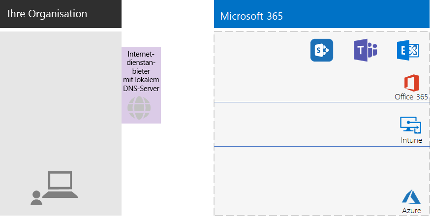

## Phase 2: IdentitätPhase 2: Identity

Jeder Mitarbeiter Ihrer Organisation muss sich anmelden können, was ein Benutzerkonto im Azure Active Directory (Azure AD)-Mandanten Ihres Microsoft 365 Enterprise-Abonnements erfordert.Each of the employees of your organization must be able to sign in, which requires a user account in the Azure Active Directory (Azure AD) tenant of your Microsoft 365 Enterprise subscription. Gruppen werden dann verwendet, um Benutzerkonten und andere Gruppen zu enthalten, um zu kommunizieren oder Zugang zu berechtigten Ressourcen zu erhalten, wie beispielsweise einer SharePoint Online-Website oder einem Team.Groups are then used to contain user accounts and other groups to communicate or gain access to permissioned resources, such as a SharePoint Online site or a team. 

### AdministratorkontenAdministrator accounts

Schützen Sie Ihre globalen Administrator-Benutzerkonten, indem Sie sehr sichere Kennwörter und Multi-Faktor-Authentifizierung (MFA) erfordern.Protect your global administrator user accounts by requiring very strong passwords and multi-factor authentication (MFA). Weitere Informationen finden Sie unter [Schützen von globalen Administratorkonten](identity-designate-protect-admin-accounts.md#protect-global-administrator-accounts).See [Protect your Office 365 global administrator accounts](identity-designate-protect-admin-accounts.md#protect-global-administrator-accounts) for more information about configuration.

Wenn Ihre Organisation hohe Sicherheitsanforderungen hat und Sie über Microsoft 365 Enterprise E5 verfügen, verwenden Sie Azure AD Privileged Identity Management, um den Just-in-time-Administratorzugriff zu ermöglichen.If your organization requires high security and you have Microsoft 365 Enterprise E5, use Azure AD Privileged Identity Management to enable just-in-time administrator access. Weitere Informationen finden Sie unter [Einrichten von globalen Administratoren bei Bedarf](identity-designate-protect-admin-accounts.md#set-up-on-demand-global-administrators).See [Set up on-demand global administrators](identity-designate-protect-admin-accounts.md#set-up-on-demand-global-administrators) for more information.

### Empfehlungen für GruppenRecommendations for groups

Wenn Sie eine lokale AD DS-Domäne haben, verwenden Sie diese Gruppen in Microsoft 365 Enterprise weiterhin als Gruppen in Azure AD.If you have an on-premises AD DS domain, continue to use those groups in Microsoft 365 Enterprise as groups in Azure AD.

Wenn Sie keine lokale AD DS-Domäne haben, erstellen Sie Sicherheitsgruppen in Azure AD mit diesen Sicherheitsebenen.If you don’t have an on-premises AD DS domain, create security groups in Azure AD using these levels of security.

| SicherheitsstufeSecurity level | BeschreibungDescription | BeispieleExamples |
|:-------|:-----|:-----|
| BasisplanBaseline | Dies ist ein minimaler und voreingestellter Standard für den Schutz von Daten und den Identitäten und Geräten, die auf Ihre Daten zugreifen.This is a minimum and default  standard for protecting data and the identities and devices that access your data.    Dies sind in der Regel die meisten Daten Ihrer Organisation, die von den meisten Ihrer Benutzer verwaltet werden.This is typically most of your organization’s data managed by most of your users. | Gruppen für wichtige Arbeitskräfte, wie Vertrieb, Marketing, Kundendienst, Verwaltung und Produktion.Groups for first line workers, such as sales, marketing, support, administration, and manufacturing. |
| VertraulichSensitive | Dies ist ein zusätzlicher Schutz für eine Teilmenge Ihrer Daten, die über den Basisplan hinaus geschützt werden muss.This is additional protection for a subset of your data that must be protected beyond the baseline level. Diese Gruppen enthalten Benutzer, die vertrauliche Daten verwenden und erstellen, die spezifisch für Abteilungen und Projekte sind, die nicht für alle zugänglich sein sollen.These groups contain users that use and create sensitive data that is specific to departments and projects that are not meant to be available to everyone. | Produkt- oder Marketingteams, die zukünftige Produkte entwickelnProduct or marketing teams that are developing future products |
| Streng geregeltHighly regulated | Dies ist die höchste Schutzstufe für in der Regel eine kleine Datenmenge, die hochgradig klassifiziert ist, als geistiges Eigentum oder Geschäftsgeheimnisse gilt oder Daten, die den Sicherheitsvorschriften entsprechen müssen.Highly regulated: This is the highest level of protection for organizations that typically have a very small amount of data that is highly classified, considered intellectual property or trade secrets, or data that must adhere to strict security regulations. Microsoft 365 Enterprise has capabilities to help organizations meet these high security requirements, including equivalent protection for identities and devices. |  Teams in Forschungs-, Rechts- und Finanzabteilungen oder Teams, die Kunden- oder Partnerdaten speichern oder nutzen.Research, legal, and financial teams, or teams storing or using customer or partner data. |
||||

### HybrididentitätHybrid identity

Wenn Sie über eine lokale AD DS-Domäne verfügen, müssen Sie die Gruppe der Benutzerkonten, Gruppen und Kontakte Ihrer Domäne mit dem Azure AD-Mandanten Ihres Microsoft 365 Enterprise-Abonnements synchronisieren.If you have an on-premises AD DS domain, you need to synchronize the set of user accounts, groups, and contacts of your domain with the Azure AD tenant of your Microsoft 365 Enterprise subscription. Für Ihr Nicht-Unternehmen konfigurieren Sie Azure AD Connect auf einem Server mit Kennwort-Hash-Synchronisierung (Password Hash Synchronization, PHS).For your non-enterprise, you configure Azure AD Connect on a server with password hash synchronization (PHS). Weitere Informationen finden Sie unter [Synchronisieren von Identitäten](identity-azure-ad-connect.md).See [Synchronize identities](identity-azure-ad-connect.md) for more information.

### Mehr Sicherheit für den Benutzerzugriff mit Richtlinien für bedingten ZugriffMore secure user access with conditional access policies

Azure AD bewertet die Bedingungen für die Anmeldung von Benutzern und kann Richtlinien für den bedingten Zugriff verwenden, um den Zugang zu gewähren oder zu verweigern sowie weitere Aktionen ausführen, die zum Abschließen der Anmeldung erforderlich sind.Azure AD evaluates the conditions of user sign-ins and can use conditional access policies to grant or deny access and impose further actions that must be taken to complete the sign-in. Wenn Azure AD beispielsweise feststellt, dass die Anmeldung unter mittleren oder hohen Risikobedingungen erfolgt, kann es erforderlich sein, dass der Benutzer eine MFA durchführt, um die Anmeldung abzuschließen.For example, if Azure AD determines that the sign-in is happening under medium or high-risk conditions, it can require the user to perform MFA to complete the sign-in.

Sie wenden Richtlinien für den bedingten Zugriff auf Benutzerkonten oder Gruppen an.You apply conditional access policies to user accounts or groups. Um eine einfachere Zuordnung von Richtlinien für den bedingten Zugriff zu erleichtern, erstellen Sie diese Azure AD-Sicherheitsgruppen in Ihrer Organisation:To facilitate an easier assignment of conditional access policies, create these Azure AD security groups in your organization:

- BASISPLANBaseline

  Enthält die Gruppen oder Benutzerkonten für Benutzer mit Zugriff auf Basisplandaten.Contains the groups or user accounts for users with access to baseline data.

- VERTRAULICHSensitive

  Enthält die Gruppen oder Benutzerkonten für Benutzer mit Zugriff auf vertrauliche Daten.Contains the groups or user accounts for users with access to sensitive data.

- STRENG GEREGELTHIGHLY-REGULATED

  Enthält die Gruppen oder Benutzerkonten für Benutzer mit Zugriff auf streng geregelte Daten.Contains the groups or user accounts for users with access to highly regulated data.

- BEDINGTEN ZUGRIFF AUSSCHLIEßENCOND-ACCESS-EXCLUDE

  Eine leere Gruppe, mit der Sie einen Benutzer vorübergehend von den Richtlinien für den bedingten Zugriff ausschließen können.An empty group that you can use to temporarily exclude a user from conditional access policies.

Hier ist die Liste der Richtlinien für den bedingten Zugriff von Azure AD, die aktiviert oder erstellt werden müssen.Here is the list of Azure AD conditional access policies to enable or create.

| Azure AD-Richtlinie für den bedingten ZugriffAzure AD conditional access policy | Gruppen, auf die Sie angewendet wirdGroups to which it applies |
|:------|:-----|
| Basisplan-Richtlinie: MFA für Administratoren erforderlichBaseline policy: Require MFA for admins | Diese Richtlinie gilt für Administratorrollen, daher müssen keine Gruppen angegeben werden.This policy applies to admin roles, so no groups need to be specified. Diese Richtlinie muss nur aktiviert werden.This policy just needs to be enabled. Alle nachfolgenden Richtlinien müssen erstellt und aktiviert werden.All subsequent policies need to be created and enabled. |
| Sperrt Clients, die moderne Authentifizierung nicht unterstützenBlock clients that don't support modern authentication | Wählen Sie in den Richtlinieneinstellungen "alle Benutzer" aus.Select “All users” in the policy settings. |
| Eine MFA ist erforderlich, wenn das Anmelde-Risiko mittel oder hoch ist (erfordert Microsoft 365 Enterprise E5).Require MFA when sign-in risk is medium or high (requires Microsoft 365 Enterprise E5) | BASISPLANBaseline |
| Eine MFA ist erforderlich, wenn das Anmelde-Risiko niedrig, mittel oder hoch ist (erfordert Microsoft 365 Enterprise E5).Require MFA when sign-in risk is low, medium, or high (requires Microsoft 365 Enterprise E5) | VERTRAULICHSensitive |
| Eine MFA ist immer erforderlichAlways require MFA | STRENG GEREGELTHIGHLY-REGULATED |
| Genehmigte Apps auf iOS- und Android-Geräten erforderlichRequire approved apps on iOS and Android devices | BASISPLAN, VERTRAULICH, STRENG GEREGELTBASELINE, SENSITIVE, HIGHLY-REGULATED |
| Kompatible PCs erforderlichRequire compliant PCs | BASISPLANBaseline |
| Kompatible PCs und iOS- und Android-Geräte erforderlichRequire compliant PCs and iOS and Android devices | VERTRAULICH, STRENG GEREGELTSENSITIVE, HIGHLY-REGULATED |
|||

Hier ist die Azure AD Identity Protection-Richtlinie zum Benutzerrisiko (erfordert Microsoft 365 Enterprise E5), um dies zu erstellen und zu aktivieren.Here is the Azure AD Identity Protection (requires Microsoft 365 Enterprise E5) user risk policy to create and enable.

| Azure AD Identity Protection-Richtlinie zum BenutzerrisikoAzure AD Identity Protection user risk policy | Gruppen, auf die Sie angewendet wirdGroups to which it applies |
|:------|:-----|
| Benutzer mit hohem Risiko müssen die Kennwörter ändernHigh risk users must change passwords | Wählen Sie in den Richtlinieneinstellungen "alle Benutzer" aus.Select “All users” in the policy settings. |
|||

Siehe [Allgemeine Identitäts- und Gerätezugriffsrichtlinien](identity-access-policies.md) für die Anweisungen.See [Common identity and device access policies](identity-access-policies.md) for the instructions.

### Gruppen zur einfacheren VerwaltungGroups for easier management

Hier sind einige Features, die Ihnen die Gruppen- und Lizenzverwaltung erleichtern können.Here are some features that can make group and licensing management easier for you.

| FeatureFeature | VerwendungUse |
|:------|:-----|
| Gruppenverwaltung durch den BenutzerSelf-service group management | Ermöglicht die Verwaltung von Azure AD-Gruppen durch Gruppenbesitzer anstelle von IT-Mitarbeitern.Allow management of Azure AD groups by group owners instead of IT staff. Weitere Informationen finden Sie unter [Self-Service-Gruppenverwaltung](identity-self-service-group-management.md#allow-users-to-create-and-manage-their-own-groups).See [Self-service group management](identity-self-service-group-management.md#allow-users-to-create-and-manage-their-own-groups) for more information. |
| Dynamische GruppenmitgliedschaftDynamic group membership | Konfigurieren Sie das automatische Hinzufügen oder Entfernen von Benutzerkonten aus Azure AD-Gruppen basierend auf Benutzerkontoattributen wie Abteilung oder Land.Configure automatic addition or removal of user accounts from Azure AD groups based on user account attributes, such as Department or Country. Weitere Informationen finden Sie unter [Dynamische Gruppenmitgliedschaft](identity-self-service-group-management.md#set-up-dynamic-group-membership).See [Dynamic group membership](identity-self-service-group-management.md#set-up-dynamic-group-membership) for more information. |
| Gruppenbasierte LizenzierungGroup-based licensing | Verwenden Sie die Gruppenmitgliedschaft, um Lizenzen automatisch den Benutzerkonten zuzuordnen oder aufzuheben.Use group membership to automatically assign or unassign licenses to user accounts. Weitere Informationen finden Sie unter [Gruppenbasierte Lizenzierung](identity-self-service-group-management.md#set-up-automatic-licensing).See [Group-based licensing](identity-self-service-group-management.md#set-up-automatic-licensing) for more information. |
|  |  |

Wenn Sie eine gruppenbasierte Lizenzierung verwenden, erstellen Sie eine Gruppe mit dem Namen LIZENZIERT, die Benutzerkontennamen enthält, denen eine Microsoft 365 Enterprise-Lizenz zugeordnet ist.If you are using group-based licensing, create a group named LICENSED to contain user account names that are assigned a Microsoft 365 Enterprise license.

### Überwachen des BenutzerzugriffsMonitor user access

Wenn Sie über Microsoft 365 Enterprise E5 verfügen, können Sie Azure AD Identity Protection verwenden, um die Benutzeranmeldungen zu überwachen und zu analysieren.If you have Microsoft 365 Enterprise E5, you can use Azure AD Identity Protection to monitor and analyze user sign-ins for credential compromise. Weitere Informationen hierzu finden Sie unter [Schutz vor Kompromittierung von Anmeldeinformationen](identity-multi-factor-authentication.md#protect-against-credential-compromise).See [Protect against credential compromise](identity-multi-factor-authentication.md#protect-against-credential-compromise) for more information.

### Ihre bisherige KonfigurationYour configuration so far

Hier ist eine visuelle Zusammenfassung der Phase "Identität" für hybride Identität, in der die neuen Elemente hervorgehoben sind.Here is a visual summary of the Identity phase for hybrid identity, with the new elements highlighted.

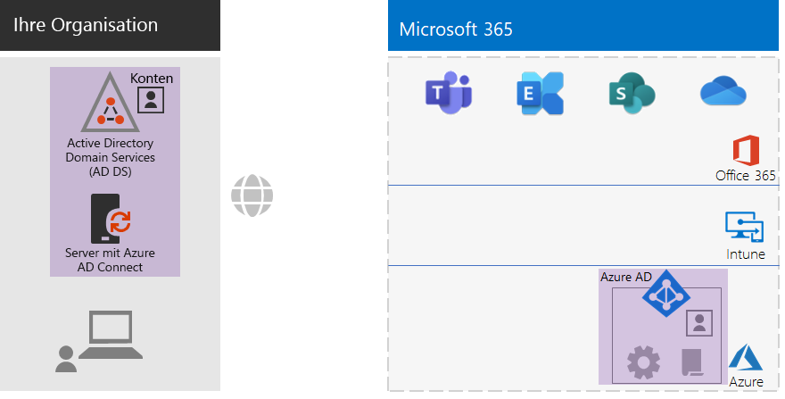
 
Zu den neuen und hervorgehobenen Elementen der hybriden Identität gehören:The new and highlighted hybrid identity elements include:
 
|||
|:------:|:-----|
| 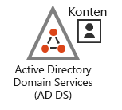 | Eine lokale AD DS-Domäne mit Benutzerkonten und Gruppen.An on-premises AD DS domain with user accounts and groups. |
| 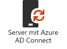 | Ein Windows-basierter Server mit Azure AD Connect.A Windows-based server running Azure AD Connect. |
|  | Der synchronisierte Satz von AD DS-Konten und Gruppen in Azure AD.The synchronized set of AD DS accounts and groups in Azure AD. |
|  | Azure AD-Einstellungen für die Authentifizierung, die Sicherung globaler Konten und die Vereinfachung der Verwaltung von Gruppen und Lizenzen.Azure AD settings for authentication, securing global accounts, and making it easier to manage groups and licenses. |
|  | Azure AD-Richtlinien für den bedingten Zugriff.Azure AD conditional access policies. |
|||

Hier ist eine visuelle Zusammenfassung der Phase "Identität" für reine Cloudidentität, in der die neuen Elemente hervorgehoben sind.Here is a visual summary of the Identity phase for cloud-only identity, with the new elements highlighted.

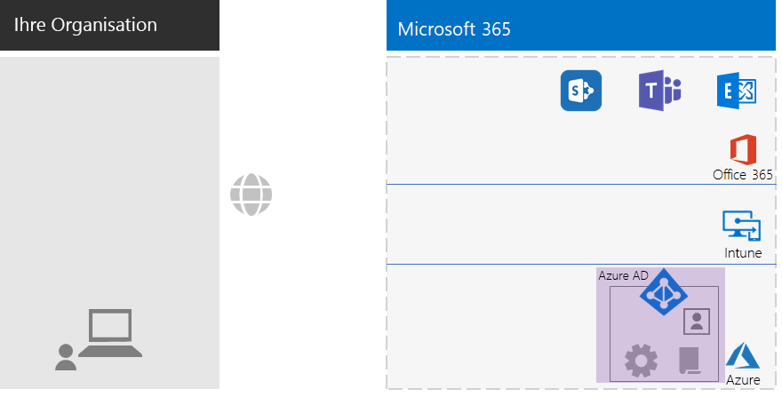
 
Zu den neuen und hervorgehobenen Elementen der reinen Cloudidentität gehören:The new and highlighted cloud-only identity elements include:
 
|||
|:------:|:-----|
|  | Azure AD-Einstellungen für die Authentifizierung, die Sicherung globaler Konten und die Vereinfachung der Verwaltung von Gruppen und Lizenzen.Azure AD settings for authentication, securing global accounts, and making it easier to manage groups and licenses. |
|  | Azure AD-Richtlinien für den bedingten Zugriff.Azure AD conditional access policies. |
|||

## Phase 3: Windows 10 EnterprisePhase 3: Windows 10 Enterprise

Um sicherzustellen, dass Ihre Windows 10 Enterprise-Geräte in die Identitäts- und Sicherheitsinfrastruktur von Microsoft 365 integriert sind, haben Sie folgende Möglichkeiten:To ensure that your Windows 10 Enterprise devices are integrated into the identity and security infrastructure of Microsoft 365, here are your options:

- Hybrid (Sie verfügen über eine lokale AD DS-Domäne)Hybrid (you have an on-premises AD DS domain)

  Für jedes vorhandene Windows 10 Enterprise-Gerät, das bereits mit Ihrer AD DS-Domäne verknüpft ist, verbinden Sie es mit dem Azure AD-Mandanten.For each existing Windows 10 Enterprise device already joined to your AD DS domain, join them to the Azure AD tenant. Siehe [Konfigurieren von in Azure Active Directory eingebundenen Hybridgeräten](https://go.microsoft.com/fwlink/p/?linkid=872870) für die Anweisungen.See [How to configure hybrid Azure Active Directory joined devices](https://go.microsoft.com/fwlink/p/?linkid=872870) for the instructions.

  Für jedes neue Windows 10 Enterprise-Gerät verknüpfen Sie diese mit Ihrer AD DS-Domäne und verbinden Sie diese anschließend mit dem Azure AD-Mandanten.For each new Windows 10 Enterprise device, join them to your AD DS domain, and then join them to the Azure AD tenant.

  Für jedes Windows 10 Enterprise-Gerät müssen Sie es für die Verwaltung mobiler Geräte registrieren.For each Windows 10 Enterprise device, enroll them for mobile device management. Siehe [Registrieren eines Windows 10-Geräts mit Intune unter Verwendung einer Gruppenrichtlinie](https://go.microsoft.com/fwlink/p/?linkid=872871) für die Anweisungen.See [Enroll a Windows 10 device with Intune by using a Group Policy](https://go.microsoft.com/fwlink/p/?linkid=872871) for the instructions.

- Reine Cloud (Sie verfügen nicht über eine lokale AD DS-Domäne)Cloud-only (you do not have an on-premises AD DS domain)

  Verbinden Sie jedes Windows 10 Enterprise-Gerät mit dem Azure AD-Mandanten Ihres Abonnements.Join each Windows 10 Enterprise device to the Azure AD tenant of your subscription.

  Weitere Informationen finden Sie unter [Einbinden von geschäftlichen Geräten in das Netzwerk der Organisation](https://docs.microsoft.com/de-DE/azure/active-directory/user-help/user-help-join-device-on-network).See [Join your work device to your organization's network](https://docs.microsoft.com/en-us/azure/active-directory/user-help/user-help-join-device-on-network) for more information.

Nach der Installation und Verknüpfung installiert jedes Windows 10 Enterprise-Gerät automatisch Updates aus dem Windows Update for Business-Clouddienst.Once installed and joined, each Windows 10 Enterprise device automatically installs updates from the Windows Update for Business cloud service. In der Regel ist es in einem Nicht-Unternehmen nicht erforderlich, eine Infrastruktur für die Verteilung und Installation von Windows 10-Updates einzurichten.There is typically no need in a non-enterprise organization to set up an infrastructure to distribute and install Windows 10 updates.

### Ihre bisherige KonfigurationYour configuration so far

Hier ist eine visuelle Zusammenfassung der Phase "Windows 10 Enterprise", in der die neuen Elemente hervorgehoben sind.Here is a visual summary of the Windows 10 Enterprise phase with the new elements highlighted.

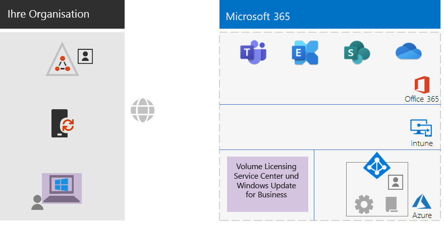
 
Zu den neuen und hervorgehobenen Elementen von Windows 10 Enterprise gehören:The new and highlighted Windows 10 Enterprise elements include:

|||
|:------:|:-----|
|  | Windows 10 Enterprise wurde auf Windows-Geräten installiert, beispielsweise auf einem lokalen Laptop.Windows 10 Enterprise installed on Windows devices, with an on-premises laptop as an example. |
| 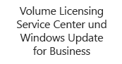 | Das Volume Licensing Service Center, das Bilder für Neuinstallationen von Windows 10 Enterprise bereitstellt, und der Windows Update for Business Service, der die neuesten Updates bereitstellt.The Volume Licensing Service Center, which provides images for new installations of Windows 10 Enterprise, and the Windows Update for Business service, which provides the latest updates. |
|||

## Phase 4: Office 365 ProPlusPhase 4: Office 365 ProPlus

Microsoft 365 Enterprise enthält Office 365 ProPlus, die Abonnementversion von Microsoft Office.Microsoft 365 Enterprise includes Office 365 ProPlus, the subscription version of Microsoft Office. Wie Office 2016 oder Office 2019 wird Office 365 ProPlus direkt auf Ihren Clientgeräten installiert.Like Office 2016 or Office 2019, Office 365 ProPlus is installed directly on your client devices. Office 365 ProPlus erhält jedoch in regelmäßigen Abständen mit neuen Features.However, Office 365 ProPlus receives updates that include new features on a regular basis. Weitere Informationen finden Sie unter [Informationen zu Office 365 ProPlus im Unternehmen](https://docs.microsoft.com/deployoffice/about-office-365-proplus-in-the-enterprise).See [About Office 365 ProPlus in the enterprise](https://docs.microsoft.com/deployoffice/about-office-365-proplus-in-the-enterprise) for more information.

Für Ihr Nicht-Unternehmen installieren Sie Office 365 ProPlus manuell auf Geräten.For your non-enterprise organization, you manually install Office 365 ProPlus on devices. Dies kann im Rahmen der Vorbereitung eines neuen Geräts für den Gebrauch oder durch den Benutzer im Rahmen seines Onboarding-Prozesses erfolgen.This can be done as part of preparing a new device for use, or by the user as part of their onboarding process.

In beiden Fällen meldet sich der Administrator oder der Benutzer am Office 365-Portal unter https://portal.office.com an.In either case, the administrator or the user signs in to the Office 365 portal at https://portal.office.com. Klicken Sie auf der Registerkarte **Microsoft Office-Startseite** auf **Office installieren**, und durchlaufen Sie den Installationsvorgang.On the **Microsoft Office Home** tab, click **Install Office** and step through the installation process.

Feature-Updates für Office 365 ProPlus werden monatlich von jedem Computer heruntergeladen, auf dem sie installiert sind.Feature updates to Office 365 ProPlus are downloaded monthly by each computer on which it is installed. In der Regel ist es in einem Nicht-Unternehmen nicht erforderlich, eine Infrastruktur für die Verteilung von Office 365 ProPlus-Updates einzurichten.There is typically no need in a non-enterprise organization to set up an infrastructure to distribute Office 365 ProPlus updates. 

### Ihre bisherige KonfigurationYour configuration so far

Hier ist eine visuelle Zusammenfassung der Phase "Office 365 ProPlus", in der die neuen Elemente hervorgehoben sind.Here is a visual summary of the Office 365 ProPlus phase with the new elements highlighted.

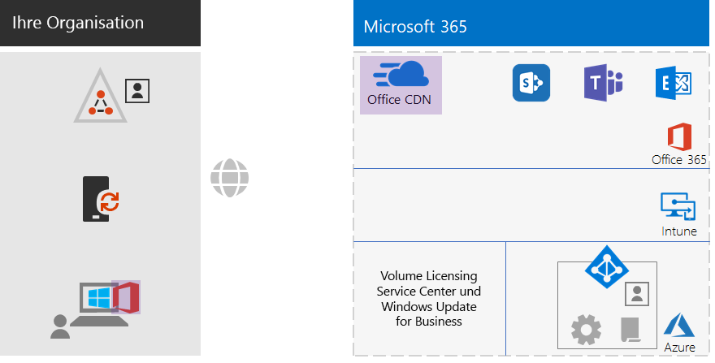
 
Zu den neuen und hervorgehobenen Office 365 ProPlus-Elementen gehören:The new and highlighted Office 365 ProPlus elements include:
 
|||
|:------:|:-----|
|  | Office 365 ProPlus wurde auf Geräten installiert, beispielsweise auf einem lokalen Laptop.Office 365 ProPlus installed on devices, with an on-premises laptop as an example. |
|  | Das Office Content Delivery Network (CDN) für Office 365 ProPlus, auf das die Geräte für Office 365 ProPlus-Updates zugreifen.The Office Content Delivery Network (CDN) for Office 365 ProPlus, which devices access for Office 365 ProPlus updates. |
|||

## Phase 5: Verwaltung mobiler GerätePhase 5: Mobile device management

Microsoft 365 Enterprise enthält Microsoft Intune für die Verwaltung mobiler Geräte.Microsoft 365 Enterprise includes Microsoft Intune for mobile device management. Mit Intune können Sie Windows-, iOS-, Android- und macOS-Geräte verwalten, um den Zugriff auf die Ressourcen Ihrer Organisation, einschließlich Ihrer Daten, zu schützen.With Intune, you can manage Windows, iOS, Android, and macOS devices to protect access to your organization's resources, including your data. Intune verwendet die Benutzer-, Gruppen- und Computerkonten von Azure AD.Intune uses the user, group, and computer accounts of Azure AD.

Intune bietet zwei Arten der Verwaltung mobiler Geräte:Intune provides two types of mobile device management:

- Bei der Verwaltung mobiler Geräte (Mobile Device Management, MDM) handelt es sich um Geräte, die in Intune registriert werden.Mobile device management (MDM) is when devices get enrolled in Intune. Nach der Registrierung sind sie verwaltete Geräte und können die von Ihrer Organisation verwendeten Richtlinien, Regeln und Einstellungen empfangen.Once enrolled, they are managed devices and can receive the policies, rules, and settings used by your organization. Diese Geräte sind in der Regel im Besitz Ihrer Organisation und werden an Ihre Mitarbeiter ausgegeben.These types of devices are typically owned by your organization and issued to your employees.

- Benutzer mit ihren eigenen persönlichen Geräten möchten möglicherweise nicht ihre Geräte registrieren oder von Intune mit Ihren Richtlinien und Einstellungen verwaltet werden.Users with their own personal devices may not want to enroll their devices or be managed by Intune with your policies and settings. Allerdings müssen Sie die Ressourcen und Daten Ihrer Organisation schützen.However, you still need to protect your organization's resources and data. Für dieses Szenario können Sie Ihre Anwendungen mit der mobilen Anwendungsverwaltung (Mobile Application Management, MAM) schützen.For this scenario, you can protect your apps with mobile application management (MAM).  

Intune-Richtlinien können Gerätekompatibilität und App-Schutz erzwingen.Intune policies can enforce device compliance and app protection. Hier ist die Liste der zu erstellenden Intune-Richtlinien.Here is the list of Intune policies to create.

| Intune-RichtlinienIntune policies | Gruppen, auf die Sie angewendet wirdGroups to which it applies |
|:------|:-----|
| Gerätekompatibilitätsrichtlinie für WindowsDevice compliance policy for Windows | BASISPLAN, VERTRAULICH, STRENG GEREGELTBASELINE, SENSITIVE, HIGHLY-REGULATED |
| Gerätekompatibilitätsrichtlinie für iOSDevice compliance policy for iOS | VERTRAULICH, STRENG GEREGELTSENSITIVE, HIGHLY-REGULATED |
| Gerätekompatibilitätsrichtlinie für macOSDevice compliance for macOS | VERTRAULICH, STRENG GEREGELTSENSITIVE, HIGHLY-REGULATED |
| Gerätekompatibilitätsrichtlinie für Android und Android EnterpriseDevice compliance policy for Android and Android Enterprise | VERTRAULICH, STRENG GEREGELTSENSITIVE, HIGHLY-REGULATED |
| App-Schutzrichtlinie für iOSApp protection policy for iOS | BASISPLAN, VERTRAULICH, STRENG GEREGELTBASELINE, SENSITIVE, HIGHLY-REGULATED |
| App-Schutzrichtlinie für macOSApp protection policy for macOS | BASISPLAN, VERTRAULICH, STRENG GEREGELTBASELINE, SENSITIVE, HIGHLY-REGULATED |
| App-Schutzrichtlinie für Android und Android EnterpriseApp protection policy for Android and Android Enterprise | BASISPLAN, VERTRAULICH, STRENG GEREGELTBASELINE, SENSITIVE, HIGHLY-REGULATED |
|||
    
Siehe [Allgemeine Identitäts- und Gerätezugriffsrichtlinien](identity-access-policies.md) für die Anweisungen.See [Common identity and device access policies](identity-access-policies.md) for the instructions.

### Ihre bisherige KonfigurationYour configuration so far

Hier ist eine visuelle Zusammenfassung der Phase "Verwaltung mobiler Geräte", in der die neuen Elemente hervorgehoben sind.Here is a visual summary of the Mobile Device Management phase with the new elements highlighted.

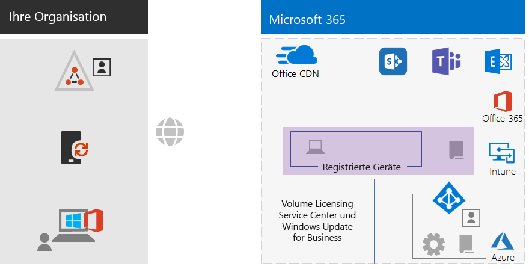
 
Die neuen und hervorgehobenen Elemente für die Verwaltung mobiler Geräte umfassen:The new and highlighted mobile device management elements include:

|||
|:------:|:-----|
|  | In Intune registrierte Geräte, die beispielsweise Windows 10 Enterprise auf einem lokalen Laptop ausführen.Devices that are enrolled in Intune, showing an on-premises laptop running Windows 10 Enterprise as an example. |
|  | Intune-Richtlinien für die Gerätekompatibilität und den App-Schutz.Intune policies for device compliance and app protection. |
|||

## Phase 6: InformationsschutzPhase 6: Information protection

Microsoft 365 Enterprise verfügt über eine Vielzahl von Features zum Informationsschutz, mit denen Sie Klassifizierungen von Daten unterschiedlich behandeln können, indem Sie verschiedene Ebenen der Governance, Sicherheit und des Schutzes anwenden.Microsoft 365 Enterprise has a host of information protection features that allow you to treat classifications of data differently by applying different levels of governance, security, and protection. 

So benötigt beispielsweise die normale Korrespondenz zwischen den meisten Mitarbeitern und den Dokumenten, an denen sie arbeiten, eine gewisse Basis-Schutzebene.For example, normal correspondence between most employees and the documents on which they work need a certain baseline level of protection. Finanzunterlagen, Kundendaten und Ihr geistiges Eigentum benötigen eine höhere Schutzebene.Financial records, customer data, and your intellectual property need a higher level of protection.

Der erste Schritt zu einer Informationsschutzstrategie ist die Festlegung der Sicherheitsebenen.The first step to an information protection strategy is to determine the levels of protection. Viele Organisationen verwenden diese Ebenen, die bereits für Richtlinien für den bedingten Zugriff verwendet werden:Many organizations use these levels, which are already being used for conditional access policies:

- BasisplanBaseline

  Beispiele sind normale Geschäftskommunikation (E-Mail) und Dateien für Mitarbeiter in der Verwaltung, im Vertrieb oder im Kundendienst.Examples of Level 1 data are normal business communications (email) and files for administrative, sales, and support workers.

- VertraulichSensitive

  Beispiele sind Finanz- und rechtliche Informationen sowie Forschungs- und Entwicklungsdaten für neue Produkte oder Dienste.Examples of Level 2 data are financial and legal information and research and development data for new products.

- Streng geregeltHighly regulated

  Beispiele sind personenbezogene Daten von Kunden und Partnern sowie Finanzdaten oder geistiges Eigentum Ihrer Organisation.Examples include customer and partner personally identifiable information and your organization’s financial information or intellectual property.

Basierend auf diesen Ebenen der Datensicherheit ist der nächste Schritt die Identifizierung und Implementierung von:Based on these levels of data security, the next step is to identify and implement:

- Benutzerdefinierten Typen vertraulicher InformationenCustom sensitive information types

  Microsoft 365 bietet eine große Auswahl an vertraulichen Datentypen, wie z. B. Krankenversicherungs- und Kreditkartennummern.Microsoft 365 supplies a wide selection of sensitive information types, such as health service and credit card numbers. Wenn Sie in der bereitgestellten Liste keinen finden, den Sie benötigen, können Sie einen eigenen erstellen.If you do not find one that you need in the supplied list, you can create your own.

- AufbewahrungsbezeichnungenRetention labels

  Um die Organisationsrichtlinien und regionalen Vorschriften einzuhalten, müssen Sie möglicherweise angeben, wie lange bestimmte Arten von Dokumenten oder Dokumente mit bestimmten Inhalten aufbewahrt werden sollen.To comply with organization policies and regional regulations, you might have to specify how long specific types of documents or documents with specific contents should be retained. Sie können dies für E-Mails und Dokumente mit Aufbewahrungsbezeichnungen implementieren.You can implement this for email and documents using retention labels.

- VertraulichkeitsbezeichnungenSensitivity labels

  Sie können E-Mails oder Dokumente mit einer benannten Vertraulichkeitsbezeichnung kennzeichnen, so dass zusätzliche Sicherheitsebenen angewendet werden können.You can label email or documents with a named sensitivity label so that additional levels of security can be applied. Beispiele sind Wasserzeichen, Verschlüsselung und Berechtigungen, die angeben, wer auf die E-Mail bzw. das Dokument und die zulässigen Aktionen zugreifen darf.Examples are watermarks, encryption, and permissions, which specify who is allowed to access the email or document and what they are allowed to do.

Weitere Informationen hierzu finden Sie unter [Microsoft 365-Klassifizierungstypen](infoprotect-configure-classification.md#microsoft-365-classification-types).See [Microsoft 365 classification types](infoprotect-configure-classification.md#microsoft-365-classification-types) for more information.

Wenn Sie Vertraulichkeitsbezeichnungen mit Berechtigungen verwenden, müssen Sie möglicherweise zusätzliche Azure AD-Sicherheitsgruppen erstellen, um zu definieren, wer was mit E-Mails und Dokumenten tun darf.If you use sensitivity labels with permissions, you might have to create additional Azure AD security groups to define who is allowed to do what with email and documents. 

Beispielsweise müssen Sie eine Vertraulichkeitsbezeichnung FORSCHUNG erstellen, um die E-Mails und Dokumente Ihres Forschungsteams zu schützen.For example, you need to create a RESEARCH sensitivity label to protect the email and documents of your research team. Sie bestimmen Folgendes:You determine that:

- Forscher müssen die Möglichkeit haben, Dokumente zu ändern, die mit der Vertraulichkeitsbezeichnung "FORSCHUNG" gekennzeichnet sind.Researchers must have the ability to change documents marked with the RESEARCH sensitivity label.
- Angestellte, die nicht der Forschungsabteilung angehören, müssen Dokumente, die mit der Vertraulichkeitsbezeichnung "FORSCHUNG" gekennzeichnet sind, anzeigen können.Non-research employees only need to have the ability to view documents marked with the RESEARCH sensitivity label. 

Dies bedeutet, dass Sie zwei zusätzliche Gruppen erstellen und verwalten müssen:This means you need to create and manage two additional groups:

- FORSCHUNG – ALLERESEARCH-ALL
- FORSCHUNG – ANZEIGENRESEARCH-VIEW

Diese Gruppen und ihre Berechtigungen werden Teil der Konfiguration der Vertraulichkeitsbezeichnung FORSCHUNG.These groups and their permissions become part of the RESEARCH sensitivity label's configuration.

Bei Vertraulichkeitsbezeichnung, die mit gruppenbasierten Berechtigungen konfiguriert sind, müssen Sie die Zugehörigkeit zu diesen Gruppen verwalten.For sensitivity labels configured with group-based permissions, you must manage the membership of these groups.

### Ihre bisherige KonfigurationYour configuration so far

Hier ist eine visuelle Zusammenfassung der Phase "Informationsschutz", in der die neuen Elemente hervorgehoben sind.Here is a visual summary of the Information Protection phase with the new elements highlighted.

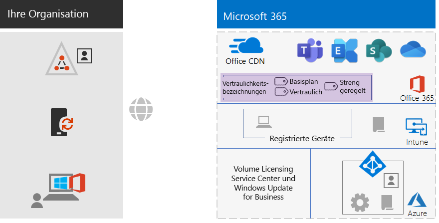
 
Zu den neuen und hervorgehobenen Elementen des Informationsschutzes gehören:The new and highlighted information protection elements include:
 
|||
|:------:|:-----|
|  | Vertraulichkeitsbezeichnungen für die drei Sicherheitsebenen, die Benutzer auf Dokumente anwenden können.Sensitivity labels for the three levels of security that users can apply to documents. |
|||

Benutzerdefinierte Informationstypen und Aufbewahrungsbezeichnungen werden nicht angezeigt.Custom information types and retention labels are not shown.

## OnboardingOnboarding

Mit Ihrer Microsoft 365 Enterprise-Infrastruktur können Sie Ihre Mitarbeiter mühelos integrieren.With your Microsoft 365 Enterprise infrastructure in place, you can easily onboard your employees.

### Ein neues Windows 10 Enterprise-GerätA new Windows 10 Enterprise device

Bevor Sie einem Mitarbeiter ein neues Windows 10 Enterprise-Gerät zuweisen:Before giving an employee a new Windows 10 Enterprise device:

- Für hybride IdentitätFor hybrid identity

  Verbinden Sie das Gerät mit Ihrer AD DS-Domäne, verbinden Sie das Gerät mit Ihrem Azure AD-Mandanten und registrieren Sie das Gerät anschließend in Intune.Join the device to your AD DS domain, join the device to your Azure AD tenant, and then enroll the device in Intune.

- Für reine CloudidentitätFor cloud-only identity

  Verbinden Sie das Gerät an den Azure AD-Mandanten Ihres Microsoft 365 Enterprise-Abonnements.Next, join the WIN10 computer to the Azure AD tenant of your Microsoft 365 E5 subscription.

### Vorhandene Mitarbeiter mit einem AD DS-BenutzerkontoExisting employee with an AD DS user account

Als Teil des ersten Onboardings für Ihre Organisation bei der Verwendung von Hybrididentität fügen Sie das AD DS-Benutzerkonto zu diesen Azure AD-Gruppen hinzu:As part of the initial onboarding for your organization when using hybrid identity, add the AD DS user account to these Azure AD groups:

- LIZENZIERTLicensed
- Die entsprechenden AD DS- oder Azure AD-Sicherheitsgruppen, die Mitglieder der Azure AD-Gruppen BASELINE, VERTRAULICH und STRENG GEREGELT sind.The appropriate AD DS or Azure AD security groups that are members of the BASELINE, SENSITIVE, and HIGHLY-REGULATED Azure AD groups
- Gruppen mit Vertraulichkeitsbezeichnung (nach Bedarf)Sensitivity label groups (as needed)

Der bestehende Mitarbeiter sollte bereits zu den entsprechenden Arbeitsgruppen, Abteilungs- und regionalen AD DS-Gruppen hinzugefügt werden.The existing employee should already be added to the appropriate workgroup, departmental, and regional AD DS groups.

Sie können ein Benutzerkonto zu mehreren Azure Ad-Gruppen im Microsoft 365 Admin Center hinzufügen.You can add a user account to multiple Azure AD groups in the Microsoft 365 admin center. Klicken Sie in den Eigenschaften des Benutzerkontos auf **Gruppen verwalten > Mitgliedschaften hinzufügen**.From the properties of the user account, click **Manage groups > Add memberships**.

Wenn Sie PowerShell verwenden möchten, schauen Sie sich diese [herunterladbare Excel-Arbeitsmappe](https://github.com/MicrosoftDocs/microsoft-365-docs/blob/public/microsoft-365/enterprise/media/Group-License-Mgmt-PowerShell.xlsx?raw=true) an, die die PowerShell-Befehle basierend auf einem angegebenen Benutzerkonto und ausgewählten Gruppennamen generiert.If you want to use PowerShell, see this [downloadable Excel workbook](https://github.com/MicrosoftDocs/microsoft-365-docs/blob/public/microsoft-365/enterprise/media/Group-License-Mgmt-PowerShell.xlsx?raw=true), which generates the PowerShell commands based on a specified user account and selected group names.

### Neuer Mitarbeiter mit einem reinen CloudbenutzerkontoNew employee with a cloud-only user account

Fügen Sie im Rahmen des ersten Onboardings für Ihre Organisation bei der Verwendung von reinen Cloudidentitäten das neue Benutzerkonto zu diesen Gruppen hinzu:As part of the initial onboarding for your organization when using cloud-only identity, add the new user account to these groups:

- LIZENZIERTLicensed
- Die entsprechenden Azure AD-Sicherheitsgruppen, die Mitglieder der Azure AD-Gruppen BASELINE, VERTRAULICH und STRENG GEREGELT sind.The appropriate Azure AD security groups that are members of the BASELINE, SENSITIVE, and HIGHLY-REGULATED Azure AD groups
- Arbeitsgruppen-, Abteilungs- und RegionalgruppenWorkgroup, departmental, and regional groups
- Gruppen mit Vertraulichkeitsbezeichnung (nach Bedarf)Sensitivity label groups (as needed)

### Erstmalige Anmeldung bei Microsoft 365Initial sign-in to Microsoft 365

Geben Sie Angestellten, die sich zum ersten Mal bei Microsoft 365 anmelden, die folgenden Anweisungen:For the first time employees sign in to Microsoft 365, instruct them to:

1. Sich auf ihren Geräten mit ihren Benutzerkonto-Anmeldeinformationen anzumelden.Sign into their devices with their user account credentials.
2. Sich mit einem Browser am Office 365-Portal unter https://portal.office.com anzumelden.Using a browser on your local computer, sign in to the Office 365 portal using your global administrator account.
3. Auf der Registerkarte **Office 365 Home** auf **Office installieren** zu klicken, um Office 365 ProPlus auf Ihrem Gerät zu installieren.From the **Office 365 Home** tab, click **Install Office** to install Office 365 ProPlus on their device.

## EndergebnisseEnd results

Hier sind die Ergebnisse der Konfiguration der Microsoft 365 Enterprise Foundation-Infrastruktur für Ihr Nicht-Unternehmen.Here are the results of configuring the Microsoft 365 Enterprise foundation infrastructure for your non-enterprise organization.

### InfrastrukturergebnisseInfrastructure results

Nach dem Aufbau und der Konfiguration Ihrer Microsoft 365 Enterprise-Infrastruktur sollten Sie Folgendes haben:After the build-out and configuration of your Microsoft 365 Enterprise infrastructure, you should have:

- Eine lokale Internetverbindung für jedes Ihrer Büros mit ausreichender Bandbreite, die von einem ISP bereitgestellt wird, der einen regional lokalen DNS-Server verwendet.A local Internet connection for each of your offices with sufficient bandwidth supplied by an ISP that uses a regionally local DNS server.
- Für eine Hybrididentität läuft Azure AD Connect auf einem Server, der Ihre lokale AD DS-Domäne mit Ihrem Azure AD-Mandanten synchronisiert.For hybrid identity, Azure AD Connect running on a server that synchronizes your on-premises AD DS domain with your Azure AD tenant.
- Diese Gruppen sind:These universal groups include:
  - LIZENZIERTLicensed
  - BEDINGTEN ZUGRIFF AUSSCHLIEßENCOND-ACCESS-EXCLUDE
  - Die entsprechenden AD DS- oder Azure AD-Sicherheitsgruppen, die auch Mitglieder der Azure AD-Gruppen BASISPLAN, VERTRAULICH und STRENG GEREGELT sindThe appropriate AD DS or Azure AD security groups that are also members of the BASELINE, SENSITIVE, and HIGHLY-REGULATED Azure AD groups 
  - Arbeitsgruppen-, Abteilungs- und RegionalgruppenWorkgroup, departmental, and regional groups
  - Gruppen mit Vertraulichkeitsbezeichnung (nach Bedarf)Sensitivity label groups (as needed)
- Azure AD-Richtlinien für den bedingten Zugriff melden sich an, der die Azure AD-Gruppen BASISPLAN, VERTRAULICH und STRENG GEREGELT sowie BEDINGTEN ZUGRIFF AUSSCHLIEßEN verwenden.Azure AD sign-in conditional access policies that use the BASELINE, SENSITIVE, and HIGHLY-REGULATED, and COND-ACCESS-EXCLUDE Azure AD groups.
- Intune-Richtlinien für Anwendungen und Gerätekompatibilität.Intune application and device compliance policies.
- Benutzerdefinierte Typen vertraulicher Informationen (nach Bedarf).Custom sensitive information types (as needed).
- Aufbewahrungsbezeichnungen (nach Bedarf).Retention labels (as needed).
- Vertraulichkeitsbezeichnungen (nach Bedarf).Sensitivity labels (as needed).

Hier ist eine visuelle Zusammenfassung der Infrastruktur, wenn Ihre Organisation eine Hybrididentität verwendet, die Ihre AD DS-Domäne, einen Azure AD Connect-Server und synchronisierte AD DS-Benutzer und -Gruppen umfasst.Here is a visual summary of the infrastructure if your organization uses hybrid identity, which includes your AD DS domain, an Azure AD Connect server, and synchronized AD DS users and groups.

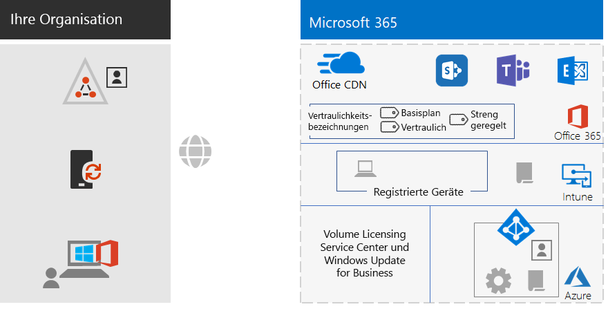
 
Hier ist eine visuelle Zusammenfassung der Infrastruktur, wenn Ihre Organisation eine reine Cloud-Identität verwendet.Here is a visual summary of the infrastructure if your organization uses cloud-only identity.
 

### MitarbeiterergebnisseEmployee results

Nach dem Onboarding sollte jeder Mitarbeiter Folgendes haben:After their onboarding, each employee should have:

- Einen leistungsfähigen, lokalen Netzwerkpfad von ihrem Gerät zu den Microsoft 365-Clouddienste in ihrer Region.A performant, on-premises network path from their device to the Microsoft 365 cloud services in their region.
- Ein Benutzerkonto mit diesen Gruppenmitgliedschaften:A user account with these group memberships:
   - LIZENZIERTLicensed
   - Die entsprechenden AD DS- oder Azure AD-Sicherheitsgruppen, die auch Mitglieder der Azure AD-Gruppen BASISPLAN, VERTRAULICH und STRENG GEREGELT für Richtlinien für den bedingten Zugriff sind.The appropriate AD DS or Azure AD security groups, which are also members of the BASELINE, SENSITIVE, and HIGHLY-REGULATED Azure AD groups for conditional access policies 
   - Die entsprechenden Arbeitsgruppen-, Abteilungs- und RegionalgruppenThe appropriate workgroup, departmental, and regional groups
   - Gruppen mit Vertraulichkeitsbezeichnung (nach Bedarf)Sensitivity label groups (as needed)
- Ein Windows 10 Enterprise-Gerät, das:A Windows 10 Enterprise device that:
   - Mit dem Azure AD-Mandanten (nur Cloud) oder mit dem Azure AD-Mandanten und Ihrer AD DS-Domäne (Hybrid) verbunden ist.Is joined to the Azure AD tenant (cloud-only) or to both the Azure AD tenant and your AD DS domain (hybrid).
   - Sich automatisch mit den neuesten Produktverbesserungen und Sicherheitserweiterungen von Windows 10 Enterprise aktualisiert.Automatically updates itself with the latest Windows 10 Enterprise product improvements and security enhancements.
   - Office 365 ProPlus installiert hat, welches sich automatisch mit den neuesten Produktverbesserungen und Sicherheitserweiterungen von Office aktualisiert.Has Office 365 ProPlus installed, which automatically updates itself with the latest Office product improvements and security enhancements.
   - In Intune registriert ist und den Intune-Richtlinien für die Gerätekompatibilität und den App-Schutzrichtlinien unterliegt.Is enrolled in Intune and subject to Intune device compliance policies and app protection policies.

## Nächster SchrittNext step

Bereitstellen Ihrer [Arbeitslasten und Szenarien](deploy-workloads.md), um von den Features und der Konfiguration Ihrer Microsoft 365 Enterprise Foundation-Infrastruktur zu profitieren.If you're following the end-to-end deployment of Microsoft 365 Enterprise, you're now ready to have your [workloads and scenarios](deploy-workloads.md) take advantage of all the features and configuration of your foundation infrastructure.
