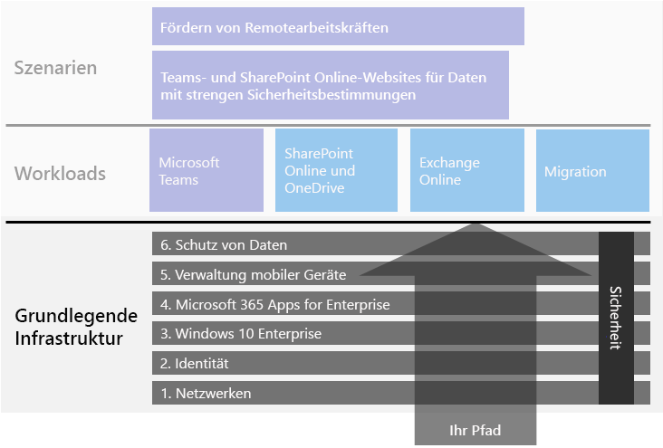
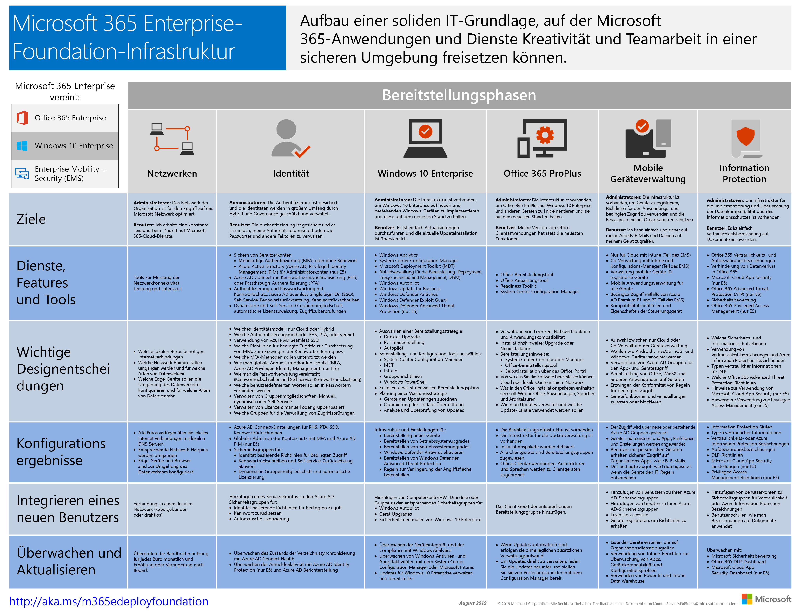

# Microsoft 365 Enterprise Foundation-Infrastruktur

Wenn Sie die End-to-End-Bereitstellung von Microsoft 365 Enterprise selbst durchführen, sollten Sie zunächst eine solide Grundlage schaffen, auf der Anwendungen und Dienste Kreativität und Teamarbeit in einer sicheren Umgebung freisetzen können. Diese Grundlage wird manchmal als die *zentrale Bereitstellung* bezeichnet.

Für einen definierten End-to-End-Pfad für die Bereitstellung können Sie diese Phasen verwenden, um die Foundation-Infrastruktur von Microsoft 365 Enterprise zu planen und bereitzustellen:

| | Phase | Ergebnisse |
|:-------|:-----|:-----|
||[Phase 1: Netzwerke](networking-infrastructure.md)| Ihr Netzwerk ist für den Zugriff auf die cloudbasiert Dienste von Microsoft 365 optimiert. |
||[Phase 2: Identität](identity-infrastructure.md)| Ihre Admin-Konten sind geschützt, Ihre Benutzer und Gruppen sind synchronisiert, und Ihre Benutzerauthentifizierung ist stark. |
||[Phase 3: Windows 10 Enterprise](windows10-infrastructure.md)| Ihre vorhandenen Windows-basierten Computer können auf Windows 10 Enterprise aktualisiert werden, und neue Geräte sind mit Windows 10 Enterprise ausgestattet. |
||[Phase 4: Microsoft 365 Apps for Enterprise](office365proplus-infrastructure.md)| Ihre vorhandenen Benutzer von Microsoft Office können ein Upgrade auf Microsoft 365 Apps for Enterprise durchführen. |
||[Phase 5: Verwaltung mobiler Geräte](mobility-infrastructure.md)| Ihre Geräte können registriert und verwaltet werden. |
||[Phase 6: Schutz von Daten](infoprotect-infrastructure.md)| Microsoft 365-Sicherheitsfunktionen sind aktiviert, und Ihre Bezeichnungen und Richtlinien sind bereit, Dokumente und E-Mail zu schützen. |

Die Phasen beginnen mit den grundlegendsten Elementen (Netzwerk und Identität), und erstellen dann Schichten von Infrastruktur-Einstellungen und Gruppen zu:

- Installieren Sie die aktuellste und sicherste Version von Windows auf Ihren Geräten, und halten Sie sie auf dem neuesten Stand.
- Installieren Sie die aktuellste Version von Microsoft Office auf Ihren Geräten, und halten Sie sie auf dem neuesten Stand.
- Verwalten Sie die Geräte Ihrer Organisation und den Zugriff auf Apps.
- Schützen Sie die Informationen auf diesen Geräten und in der Cloud.

Sie haben jedoch die Flexibilität, die Phasen oder Schritte innerhalb der Phasen zu konfigurieren und bereitzustellen, um sie Ihren IT-Ressourcen und Geschäftsanforderungen anzupassen.

- **Wenn Sie eine kleinere oder neueren Organisation sind**, folgen Sie den Phasen, die erforderlich sind, um Ihre Infrastruktur methodisch aufzubauen. Für eine vereinfachte Bereitstellung für Nicht-Unternehmen [klicken](deploy-foundation-infrastructure-non-enterprises.md) Sie hier.

-  **Wenn Sie eine Unternehmensorganisation sind**, betrachten Sie die Phasen als Schichten der IT-Infrastruktur und nicht als einen definierten Pfad, und bestimmen Sie, wie Sie am besten auf die Einhaltung der Anforderungen für jede Schicht in Ihrer Organisation hinarbeiten können.

Am Ende jeder Phase sollten Sie die *Beendigungskriterien* prüfen, einschließlich der erforderlichen Bedingungen, die Sie erfüllen müssen, und der optionalen Bedingungen, die Sie berücksichtigen müssen. Die Beendigungskriterien für jede Phase stellen sicher, dass Ihre lokale und Cloudinfrastruktur und die daraus resultierende End-to-End-Konfiguration die Anforderungen für eine Microsoft 365 Enterprise-Bereitstellung erfüllen.

Um zu erfahren, wie der Inhalt strukturiert ist, schauen Sie sich dieses kurze Video an.

> [!VIDEO https://www.microsoft.com/videoplayer/embed/RE23VRG]

Hier finden Sie die Foundation-Infrastruktur im allgemeinen Microsoft 365 Enterprise-Bereitstellungshandbuch:

## Auf einen Blick

Das [Poster "Microsoft 365 Enterprise Foundation-Infrastruktur"](../media/deploy-foundation-infrastructure/Microsoft365EnterpriseFoundInfra.pdf) bietet einen gute Übersicht über die einzelnen Phasen:

- Allgemeinen Ziele der Phase für Administratoren und Benutzer
- Dienste, Features und Tools
- Wichtige Entwurfsentscheidungen für die Planung
- Konfigurationsergebnisse
- Vorgehensweise für das Onboarding eines neuen Benutzers
- Überwachen und Aktualisieren

Zum Herunterladen einer Kopie des Posters klicken Sie [hier](https://github.com/MicrosoftDocs/microsoft-365-docs/raw/public/microsoft-365/media/deploy-foundation-infrastructure/Microsoft365EnterpriseFoundInfra.pdf).

## Konfiguration der Infrastruktur vs. Benutzer-Rollout

Die Foundation-Infrastruktur besteht aus einer Reihe von konfigurierter Software und Diensten, die wenn kombiniert, es einem Benutzer ermöglichen, das gesamte Spektrum der Funktionen und Schutzmaßnahmen von Microsoft 365 Enterprise zu nutzen. Das ultimative Ziel Ihrer End-to-End-Bereitstellung ist es, dass diese Infrastruktur für alle Ihre Benutzer und deren Windows-basierte Geräte verfügbar ist. 

Es ist jedoch wichtig zu beachten, dass die Microsoft 365 Enterprise Foundation-Infrastruktur unabhängig vom Rollout von Software und Diensten für Ihre Benutzer ist. ***Sie können die Schichten der Foundation-Infrastruktur konfigurieren, ohne diese Schichten für alle Ihre Benutzer bereitstellen zu müssen.***

Es ist möglich, Elemente der Foundation-Infrastruktur weit vor dem Rollout dieser Elemente für die Vielzahl Ihrer Benutzer in den Büros, Regionen oder Abteilungen Ihrer Organisation zu konfigurieren und zu testen.

Beispielsweise erstellen Sie die Einstellungen für:

| Phase | Ergebnisse |
|:-------|:-----|
| Identität | Kontosynchronisierung und Gruppen für identitätsbasierte Richtlinien für bedingten Zugriff. |
| Windows 10 Enterprise | Gruppen, die automatisch Computer mit Windows 7 oder Windows 8.1 auf Windows 10 Enterprise aktualisieren. |
| Microsoft 365 Apps for Enterprise | Gruppen, die Microsoft 365 Apps for Enterprise automatisch für Benutzer mit Office 2010, Office 2013 oder Office 2016 bereitstellen. |
| Verwaltung mobiler Geräte | Gruppen für Geräteregistrierung und gerätebasierte Richtlinien für bedingten Zugriff. |
| Information Protection | Gruppen für Vertraulichkeitsbezeichnungen. |

Wenn Sie bereit sind, Elemente dieser Infrastruktur für Benutzer bereitzustellen, können Sie:

| Phase | Rollouts Aktion |
|:-------|:-----|
| Identität | Hinzufügen von Benutzerkonten zu den Gruppen für identitätsbasierte Richtlinien für bedingten Zugriff. |
| Windows 10 Enterprise | Hinzufügen von Konten zu den Gruppen, um Windows 10 Enterprise automatisch für Benutzer mit Windows 7 oder Windows 8.1 bereitzustellen. |
| Microsoft 365 Apps for Enterprise | Fügen Sie Benutzerkonten zu den Gruppen hinzu, um Microsoft 365 Apps for Enterprise automatisch für Benutzer mit Office 2010, Office 2013 oder Office 2016 bereitzustellen. |
| Verwaltung mobiler Geräte | Hinzufügen von Konten zu den Gruppen für die Geräteregistrierung und gerätebasierte Richtlinien für bedingten Zugriff. |
| Schutz von Daten | Fügen Sie Benutzerkonten zu den Gruppen für Vertraulichkeitsbezeichnungen hinzu. |

Sobald die Phasen oder Elemente der Foundation-Infrastruktur fertiggestellt, getestet und erprobt sind, können Sie installierte Software, wie Windows 10 Enterprise und Microsoft 365 Apps for Enterprise, sowie cloudbasierte Dienste und Schutzmaßnahmen, wie Geräteregistrierung und Richtlinien für bedingten Zugriff, auf die Art und Weise für Ihre Benutzer bereitstellen, wie es Ihren Unternehmenszielen und IT-Ressourcen am besten entspricht.

## Bereitstellungs- und Projektmanagement-Strategien

Um Ihnen einige Ideen zu geben, wie Sie das Projektmanagement der verschiedenen Phasen der Foundation-Infrastruktur für Erstanwender und den Rest Ihrer Organisation angehen können, siehe[Bereitstellungsstrategien](deployment-strategies-microsoft-365-enterprise.md). 

## Bereitstellung für Nicht-Unternehmen

Wenn Ihre Organisation kleiner und Microsoft 365 for Business für Sie nicht geeignet ist, finden Sie unter [Bereitstellung für Nicht-Unternehmen](deploy-foundation-infrastructure-non-enterprises.md) eine vereinfachte Bereitstellungsmethode.

## Nächster Schritt

| Wo ich bin | Wo ich hin möchte |
|:-------|:-----|
| Ich verfüge über eine bestehende Infrastruktur für Office 365, Enterprise Mobility + Security (EMS) oder Windows 10 Enterprise. | Beginnen Sie mit [Bereitstellung mit vorhandener Infrastruktur](deploy-with-existing-infrastructure.md), die Sie durch die Beendigungskriterien für jede Phase führt. |
| Ich beginne als Unternehmen von Grund auf neu | Beginnen Sie Ihre End-to-End-Bereitstellung mit [Phase 1: Netzwerk](networking-infrastructure.md). |
| Ich beginne als Nicht-Unternehmen von Grund auf neu | Beginnen Sie Ihre End-to-End-Bereitstellung mit [Bereitstellung für Nicht-Unternehmen](deploy-foundation-infrastructure-non-enterprises.md). |
