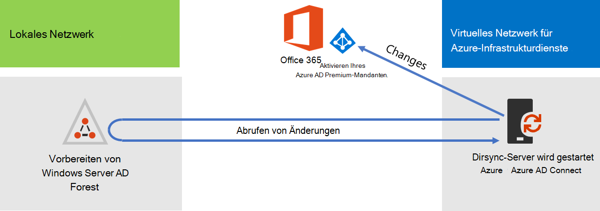
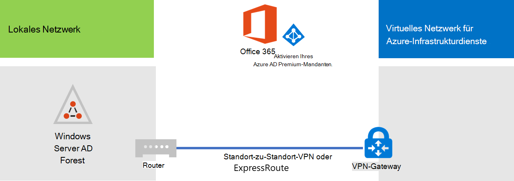
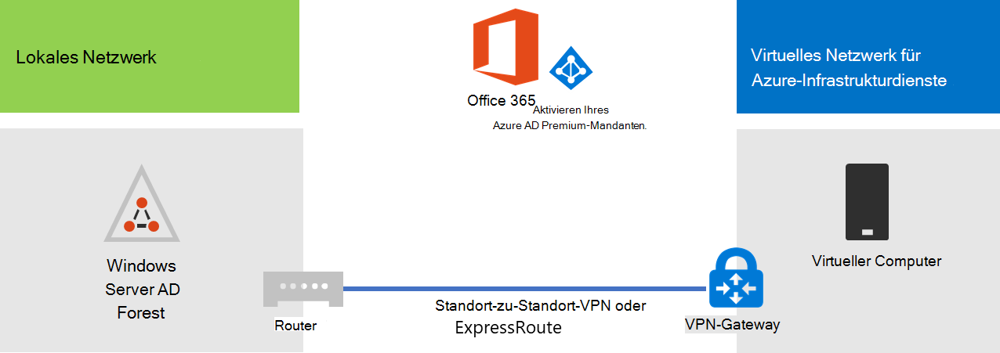

# Bereitstellen Microsoft 365 Verzeichnissynchronisierung in Microsoft AzureDeploy Microsoft 365 Directory Synchronization in Microsoft Azure

Azure Active Directory (Azure AD) Verbinden (früher als Verzeichnissynchronisierungstool, Verzeichnissynchronisierungstool oder DirSync.exe-Tool bezeichnet) ist eine Anwendung, die Sie auf einem Server installieren, der der Domäne beigetreten ist, um Ihre lokalen Active Directory Domain Services (AD DS)-Benutzer mit dem Azure AD-Mandanten Ihres Microsoft 365-Abonnements zu synchronisieren.Azure Active Directory (Azure AD) Connect (formerly known as the Directory Synchronization tool, Directory Sync tool, or the DirSync.exe tool) is an application that you install on a domain-joined server to synchronize your on-premises Active Directory Domain Services (AD DS) users to the Azure AD tenant of your Microsoft 365 subscription. Microsoft 365 verwendet Azure AD für seinen Verzeichnisdienst.Microsoft 365 uses Azure AD for its directory service. Ihr Microsoft 365 umfasst einen Azure AD-Mandanten.Your Microsoft 365 subscription includes an Azure AD tenant. Dieser Mandant kann auch für die Verwaltung der Identitäten Ihrer Organisation mit anderen Cloudworkloads verwendet werden, einschließlich anderer SaaS-Anwendungen und Apps in Azure.This tenant can also be used for management of your organization's identities with other cloud workloads, including other SaaS applications and apps in Azure.

Sie können Azure AD Connect auf einem lokalen Server installieren, doch wir empfehlen aus den folgenden Gründen die Installation auf einem virtuellen Computer in Azure:You can install Azure AD Connect on a on-premises server, but you can also install it on a virtual machine in Azure for these reasons:
  
- Sie können cloudbasierte Server schneller bereitstellen und konfigurieren und so die Dienste Ihren Benutzern schneller zur Verfügung stellen.You can provision and configure cloud-based servers faster, making the services available to your users sooner.
- Azure bietet eine bessere Verfügbarkeit von Websites mit weniger Aufwand.Azure offers better site availability with less effort.
- Sie können die Anzahl der lokalen Server in Ihrer Organisation verringern.You can reduce the number of on-premises servers in your organization.

Diese Lösung erfordert Konnektivität zwischen dem lokalen Netzwerk und Ihrem virtuellen Azure-Netzwerk. Weitere Informationen finden Sie unter [Verbinden eines lokalen Netzwerks mit einem virtuellen Microsoft Azure-Netzwerk](connect-an-on-premises-network-to-a-microsoft-azure-virtual-network.md).This solution requires connectivity between your on-premises network and your Azure virtual network. For more information, see [Connect an on-premises network to a Microsoft Azure virtual network](connect-an-on-premises-network-to-a-microsoft-azure-virtual-network.md). 
  
> [!NOTE]
> In diesem Artikel wird die Synchronisierung einer einzelnen Domäne in einer einzelnen Gesamtstruktur beschrieben.This article describes synchronization of a single domain in a single forest. Azure AD Verbinden synchronisiert alle AD DS-Domänen in Ihrer Active Directory-Gesamtstruktur mit Microsoft 365.Azure AD Connect synchronizes all AD DS domains in your Active Directory forest with Microsoft 365. Wenn Sie mehrere Active Directory-Gesamtstrukturen zum Synchronisieren mit Microsoft 365 haben, finden Sie weitere Informationen unter [Multi-Forest Directory Sync with Single Sign-On Scenario](/azure/active-directory/hybrid/whatis-hybrid-identity).If you have multiple Active Directory forests to synchronize with Microsoft 365, see [Multi-forest Directory Sync with Single Sign-On Scenario](/azure/active-directory/hybrid/whatis-hybrid-identity). 
  
## Übersicht über die Bereitstellung Microsoft 365 Verzeichnissynchronisierung in AzureOverview of deploying Microsoft 365 directory synchronization in Azure

Das folgende Diagramm zeigt Azure AD Verbinden, das auf einem virtuellen Computer in Azure (dem Verzeichnissynchronisierungsserver) ausgeführt wird, der eine lokale AD DS-Gesamtstruktur mit einem Microsoft 365 synchronisiert.The following diagram shows Azure AD Connect running on a virtual machine in Azure (the directory sync server) that synchronizes an on-premises AD DS forest to a Microsoft 365 subscription.
  

  
In diesem Diagramm gibt es zwei Netzwerke, die über eine Standort-zu-Standort-VPN- oder ExpressRoute-Verbindung verbunden sind. Es gibt ein lokales Netzwerk, in dem AD DS-Domänencontroller enthalten sind, und ein virtuelles Azure-Netzwerk mit einem Verzeichnissynchronisierungsserver, einem virtuellen Computer mit ausgeführtem [Azure AD Connect](https://www.microsoft.com/download/details.aspx?id=47594). Es gibt zwei Hauptdatenströme, die vom Verzeichnissynchronisierungsserver stammen:In the diagram, there are two networks connected by a site-to-site VPN or ExpressRoute connection. There is an on-premises network where AD DS domain controllers are located, and there is an Azure virtual network with a directory sync server, which is a virtual machine running [Azure AD Connect](https://www.microsoft.com/download/details.aspx?id=47594). There are two main traffic flows originating from the directory sync server:
  
-  Azure AD Connect fragt einen Domänencontroller im lokalen Netzwerk auf Änderungen an Benutzerkonten und Kennwörtern ab.Azure AD Connect queries a domain controller on the on-premises network for changes to accounts and passwords.
-  Azure AD Verbinden sendet die Änderungen an Konten und Kennwörtern an die Azure AD-Instanz Ihres Microsoft 365 Abonnements.Azure AD Connect sends the changes to accounts and passwords to the Azure AD instance of your Microsoft 365 subscription. Da sich der Verzeichnissynchronisierungsserver in einem erweiterten Teil Ihres lokalen Netzwerks befindet, werden diese Änderungen über den Proxyserver des lokalen Netzwerks gesendet.Because the directory sync server is in an extended portion of your on-premises network, these changes are sent through the on-premises network's proxy server.
    
> [!NOTE]
> Diese Lösung beschreibt die Synchronisierung einer einzelnen Active Directory-Domäne in einer einzelnen Active Directory-Gesamtstruktur.This solution describes synchronization of a single Active Directory domain, in a single Active Directory forest. Azure AD Verbinden synchronisiert alle Active Directory-Domänen in Ihrer Active Directory-Gesamtstruktur mit Microsoft 365.Azure AD Connect synchronizes all Active Directory domains in your Active Directory forest with Microsoft 365. Wenn Sie mehrere Active Directory-Gesamtstrukturen zum Synchronisieren mit Microsoft 365 haben, finden Sie weitere Informationen unter [Multi-Forest Directory Sync with Single Sign-On Scenario](/azure/active-directory/hybrid/whatis-hybrid-identity).If you have multiple Active Directory forests to synchronize with Microsoft 365, see [Multi-forest Directory Sync with Single Sign-On Scenario](/azure/active-directory/hybrid/whatis-hybrid-identity). 
  
Es gibt bei der Bereitstellung dieser Lösung zwei wichtige Schritte:There are two major steps when you deploy this solution:
  
1. Erstellen eines virtuellen Azure-Netzwerks und Einrichten einer Standort-zu-Standort-VPN-Verbindung mit dem lokalen Netzwerk. Weitere Informationen finden Sie unter [Verbinden eines lokalen Netzwerks mit einem virtuellen Microsoft Azure-Netzwerk](connect-an-on-premises-network-to-a-microsoft-azure-virtual-network.md).Create an Azure virtual network and establish a site-to-site VPN connection to your on-premises network. For more information, see [Connect an on-premises network to a Microsoft Azure virtual network](connect-an-on-premises-network-to-a-microsoft-azure-virtual-network.md).
    
2. Installieren [Sie Azure AD Verbinden](https://www.microsoft.com/download/details.aspx?id=47594) auf einem virtuellen Computer mit Domänen in Azure, und synchronisieren Sie dann den lokalen AD DS mit Microsoft 365.Install [Azure AD Connect](https://www.microsoft.com/download/details.aspx?id=47594) on a domain-joined virtual machine in Azure, and then synchronize the on-premises AD DS to Microsoft 365. Dies umfasst:This involves:
    
    Erstellen eines Virtueller Azure-Computer zum Ausführen von Azure AD Connect.Creating an Azure Virtual Machine to run Azure AD Connect.
    
    Installieren und Konfigurieren von [Azure AD Connect](https://www.microsoft.com/download/details.aspx?id=47594).Installing and configuring [Azure AD Connect](https://www.microsoft.com/download/details.aspx?id=47594).
    
    Das Konfigurieren von Azure AD Verbinden erfordert die Anmeldeinformationen (Benutzername und Kennwort) eines Azure AD-Administratorkontos und eines AD DS-Unternehmensadministratorkontos.Configuring Azure AD Connect requires the credentials (user name and password) of an Azure AD administrator account and a AD DS enterprise administrator account. Azure AD Verbinden wird sofort und kontinuierlich ausgeführt, um die lokale AD DS-Gesamtstruktur mit Microsoft 365.Azure AD Connect runs immediately and on an ongoing basis to synchronize the on-premises AD DS forest to Microsoft 365.
    
Bevor Sie diese Lösung in der Produktion bereitstellen, können Sie die Anweisungen unter [Die](simulated-ent-base-configuration-microsoft-365-enterprise.md) simulierte Unternehmensbasiskonfiguration verwenden, um diese Konfiguration als Nachweis für das Konzept, für Demonstrationen oder für Experimente zu konfigurieren.Before you deploy this solution in production, you can use the instructions in [The simulated enterprise base configuration](simulated-ent-base-configuration-microsoft-365-enterprise.md) to set this configuration up as a proof of concept, for demonstrations, or for experimentation.
  
> [!IMPORTANT]
> Wenn die Konfiguration von Azure AD Connect abgeschlossen ist, werden die Anmeldeinformationen für das AD DS-Unternehmensadministratorkonto nicht gespeichert.When Azure AD Connect configuration completes, it does not save the AD DS enterprise administrator account credentials. 
  
> [!NOTE]
> Diese Lösung beschreibt die Synchronisierung einer einzelnen AD DS-Gesamtstruktur mit Microsoft 365.This solution describes synchronizing a single AD DS forest to Microsoft 365. Die in diesem Artikel behandelte Topologie stellt nur eine Möglichkeit zum Implementieren dieser Lösung dar.The topology discussed in this article represents only one way to implement this solution. Die Topologie Ihrer Organisation kann sich je nach ihren eindeutigen Netzwerkanforderungen und Sicherheitsüberlegungen unterscheiden.Your organization's topology might differ based on your unique network requirements and security considerations. 
  
## Planen des Hostings eines Verzeichnissynchronisierungsservers für Microsoft 365 in AzurePlan for hosting a directory sync server for Microsoft 365 in Azure

### VoraussetzungenPrerequisites

Lesen Sie die folgenden Voraussetzungen für diese Lösung, ehe Sie mit diesem Vorgang beginnen:Before you begin, review the following prerequisites for this solution:
  
- Überprüfen Sie die dazugehörigen Planungsinhalte in [Planen des virtuellen Azure-Netzwerks](connect-an-on-premises-network-to-a-microsoft-azure-virtual-network.md#plan-your-azure-virtual-network).Review the related planning content in [Plan your Azure virtual network](connect-an-on-premises-network-to-a-microsoft-azure-virtual-network.md#plan-your-azure-virtual-network).
    
- Stellen Sie sicher, dass alle [Voraussetzungen](connect-an-on-premises-network-to-a-microsoft-azure-virtual-network.md#prerequisites) für die Konfiguration des virtuellen Azure-Netzwerks erfüllt sind.Ensure that you meet all [Prerequisites](connect-an-on-premises-network-to-a-microsoft-azure-virtual-network.md#prerequisites) for configuring the Azure virtual network.
    
- Verfügen Sie Microsoft 365 Abonnement, das das Active Directory-Integrationsfeature enthält.Have a Microsoft 365 subscription that includes the Active Directory integration feature. Weitere Informationen zu Microsoft 365 Abonnements finden Sie auf der [Seite Microsoft 365 Abonnements](https://products.office.com/compare-all-microsoft-office-products?tab=2).For information about Microsoft 365 subscriptions, go to the [Microsoft 365 subscription page](https://products.office.com/compare-all-microsoft-office-products?tab=2).
    
- Bereitstellen eines virtuellen Azure-Computers, auf dem Azure AD Verbinden, um Ihre lokale AD DS-Gesamtstruktur mit Microsoft 365.Provision one Azure Virtual Machine that runs Azure AD Connect to synchronize your on-premises AD DS forest with Microsoft 365.
    
    Sie benötigen die Anmeldeinformationen (Namen und Kennwörter) für das AD DS-Unternehmensadministratorkonto und ein Azure AD-Administratorkonto.You must have the credentials (names and passwords) for a AD DS enterprise administrator account and an Azure AD Administrator account.
    
### Entwurfsannahmen für die LösungsarchitekturSolution architecture design assumptions

In der folgenden Liste werden die für diese Lösung getroffenen Design-Entscheidungen beschrieben.The following list describes the design choices made for this solution.
  
- Diese Lösung verwendet ein einzelnes virtuelles Azure-Netzwerk mit einer einzelnen Standort-zu-Standort-VPN-Verbindung. Das virtuelle Azure-Netzwerk hostet ein einzelnes Subnetz, das einen Server, den Verzeichnissynchronisierungsserver mit ausgeführtem Azure AD Connect, enthält.This solution uses a single Azure virtual network with a site-to-site VPN connection. The Azure virtual network hosts a single subnet that has one server, the directory sync server that is running Azure AD Connect. 
    
- Im lokalen Netzwerk sind ein Domänencontroller und DNS-Server vorhanden.On the on-premises network, a domain controller and DNS servers exist.
    
- Azure AD Connect wird für die Kennworthashsynchronisierung anstatt für das einmalige Anmelden verwendet. Sie müssen keine Infrastruktur für Active Directory-Verbunddienste (AD FS) bereitstellen. Weitere Informationen zu Optionen für einmaliges Anmelden und Kennworthashsynchronisierung finden Sie unter [Wählen der richtigen Authentifizierungsmethode für Ihre Azure Active Directory-Hybrididentitätslösung](/azure/active-directory/hybrid/choose-ad-authn).Azure AD Connect performs password hash synchronization instead of single sign-on. You do not have to deploy an Active Directory Federation Services (AD FS) infrastructure. To learn more about password hash synchronization and single sign-on options, see [Choosing the right authentication method for your Azure Active Directory hybrid identity solution](/azure/active-directory/hybrid/choose-ad-authn).
    
Es folgen einige weitere Entwurfsoptionen, die Sie berücksichtigen sollten, wenn Sie diese Lösung in Ihrer Umgebung bereitstellen:There are additional design choices that you might consider when you deploy this solution in your environment. These include the following:
  
- Wenn es in einem vorhandenen virtuellen Azure-Netzwerk DNS-Server gibt, bestimmen Sie, ob der Verzeichnissynchronisierungsserver diese für die Namensauflösung anstelle der DNS-Server im lokalen Netzwerk verwenden soll.If there are existing DNS servers in an existing Azure virtual network, determine whether you want your directory sync server to use them for name resolution instead of DNS servers on the on-premises network.
    
- Wenn es Domänencontroller in einem vorhandenen virtuellen Azure-Netzwerk gibt, bestimmen Sie, ob die Konfiguration von Active Directory-Standorten und-Diensten ggf. eine bessere Option für Sie ist. Der Verzeichnissynchronisierungsserver kann die Domänencontroller im virtuellen Azure-Netzwerk anstatt die Domänencontroller im lokalen Netzwerk abfragen, um nach Änderungen an Benutzerkonten und Kennwörtern zu suchen.If there are domain controllers in an existing Azure virtual network, determine whether configuring Active Directory Sites and Services may be a better option for you. The directory sync server can query the domain controllers in the Azure virtual network for changes in accounts and passwords instead of domain controllers on the on-premises network.
    
## Fahrplan für die BereitstellungDeployment roadmap

Das Bereitstellen von Azure AD Connect auf einem virtuellen Computer in Azure umfasst drei Phasen:Deploying Azure AD Connect on a virtual machine in Azure consists of three phases:
  
- Phase 1: Erstellen und Konfigurieren des virtuellen Azure-NetzwerksPhase 1: Create and configure the Azure virtual network
    
- Phase 2: Erstellen und Konfigurieren des virtuellen Azure-ComputersPhase 2: Create and configure the Azure virtual machine
    
- Phase 3: Installieren und Konfigurieren von Azure AD ConnectPhase 3: Install and configure Azure AD Connect
    
Nach der Bereitstellung müssen Sie auch Speicherorte und Lizenzen für die neuen Benutzerkonten in Microsoft 365.After deployment, you must also assign locations and licenses for the new user accounts in Microsoft 365.

### Phase 1: Erstellen und Konfigurieren des virtuellen Azure-NetzwerksPhase 1: Create and configure the Azure virtual network

Zum Erstellen und Konfigurieren des virtuellen Azure-Netzwerks durchlaufen Sie [Phase 1: Vorbereitung Ihres lokalen Netzwerks](connect-an-on-premises-network-to-a-microsoft-azure-virtual-network.md#phase-1-prepare-your-on-premises-network) und [Phase 2: Erstellen des standortübergreifenden virtuellen Azure-Netzwerks](connect-an-on-premises-network-to-a-microsoft-azure-virtual-network.md#phase-2-create-the-cross-premises-virtual-network-in-azure) im Fahrplan für die Bereitstellung von [Verbinden eines lokalen Netzwerks mit einem virtuellen Microsoft Azure-Netzwerk](connect-an-on-premises-network-to-a-microsoft-azure-virtual-network.md).To create and configure the Azure virtual network, complete [Phase 1: Prepare your on-premises network](connect-an-on-premises-network-to-a-microsoft-azure-virtual-network.md#phase-1-prepare-your-on-premises-network) and [Phase 2: Create the cross-premises virtual network in Azure](connect-an-on-premises-network-to-a-microsoft-azure-virtual-network.md#phase-2-create-the-cross-premises-virtual-network-in-azure) in the deployment roadmap of [Connect an on-premises network to a Microsoft Azure virtual network](connect-an-on-premises-network-to-a-microsoft-azure-virtual-network.md).
  
Nachfolgend sehen Sie die daraus resultierende Konfiguration.This is your resulting configuration.
  

  
Diese Abbildung zeigt ein lokales Netzwerk, das über eine Standort-zu-Standort-VPN- oder ExpressRoute-Verbindung mit einem virtuellen Azure-Netzwerk verbunden ist.This figure shows an on-premises network connected to an Azure virtual network through a site-to-site VPN or ExpressRoute connection.
  
### Phase 2: Erstellen und Konfigurieren des virtuellen Azure-ComputersPhase 2: Create and configure the Azure virtual machine

Erstellen Sie den virtuellen Computer in Azure anhand der Anweisungen unter [Erstellen Ihres ersten virtuellen Windows-Computers im Azure-Portal](https://go.microsoft.com/fwlink/p/?LinkId=393098). Verwenden Sie die folgenden Einstellungen:Create the virtual machine in Azure using the instructions [Create your first Windows virtual machine in the Azure portal](https://go.microsoft.com/fwlink/p/?LinkId=393098). Use the following settings:
  
- Wählen Sie im Bereich **Grundlagen** das gleiche Abonnement, den gleichen Ort und die gleiche Ressourcengruppe als virtuelles Netzwerk aus. Bewahren Sie den Benutzernamen und das Kennwort an einem sicheren Ort auf. Sie benötigen diese Informationen später für die Verbindung mit dem virtuellen Computer.On the **Basics** pane, select the same subscription, location, and resource group as your virtual network. Record the user name and password in a secure location. You will need these later to connect to the virtual machine.
    
- Wählen Sie im Bereich zum Auswählen einer **Größe** die Größe **A2 Standard** aus.On the **Choose a size** pane, choose the **A2 Standard** size.
    
- Wählen Sie im Bereich **Einstellungen** im Abschnitt **Speicher** den Speichertyp **Standard** aus. Wählen Sie im Abschnitt **Netzwerk** den Namen des virtuellen Netzwerks und das Subnetz zum Hosten des Verzeichnissynchronisierungsservers (nicht das Gateway-Subnetz). Alle anderen Einstellungen bleiben bei ihren Standardwerten.On the **Settings** pane, in the **Storage** section, select the **Standard** storage type. In the **Network** section, select the name of your virtual network and the subnet for hosting the directory sync server (not the GatewaySubnet). Leave all other settings at their default values.
    
Stellen Sie sicher, dass der Verzeichnissynchronisierungsserver DNS ordnungsgemäß verwendet. Überprüfen Sie dazu Ihr internes DNS, und vergewissern Sie sich, dass für den virtuellen Computer ein Adresseintrag (A-Datensatz) mit seiner IP-Adresse hinzugefügt wurde.Verify that your directory sync server is using DNS correctly by checking your internal DNS to make sure that an Address (A) record was added for the virtual machine with its IP address. 
  
Befolgen Sie die Anweisungen unter [Herstellen einer Verbindung mit dem virtuellen Computer und Anmelden](/azure/virtual-machines/windows/connect-logon), um über eine Remotedesktopverbindung eine Verbindung mit dem Verzeichnissynchronisierungsserver herzustellen. Fügen Sie den virtuellen Computer nach dem Anmelden der lokalen AD DS-Domäne hinzu.Use the instructions in [Connect to the virtual machine and sign on](/azure/virtual-machines/windows/connect-logon) to connect to the directory sync server with a Remote Desktop Connection. After signing in, join the virtual machine to the on-premises AD DS domain.
  
Damit Azure AD Connect auf Internetressourcen zugreifen kann, müssen Sie den Verzeichnissynchronisierungsserver für die Verwendung des lokalen Netzwerkproxyservers konfigurieren. Wenden Sie sich für mögliche zusätzlichen Konfigurationsschritte an Ihren Netzwerkadministrator.For Azure AD Connect to gain access to Internet resources, you must configure the directory sync server to use the on-premises network's proxy server. You should contact your network administrator for any additional configuration steps to perform.
  
Nachfolgend sehen Sie die daraus resultierende Konfiguration.This is your resulting configuration.
  

  
Diese Abbildung zeigt den virtuellen Computer des Verzeichnissynchronisierungsservers im lokalen virtuellen Azure-Netzwerk.This figure shows the directory sync server virtual machine in the cross-premises Azure virtual network.
  
### Phase 3: Installieren und Konfigurieren von Azure AD ConnectPhase 3: Install and configure Azure AD Connect

Gehen Sie wie folgt vor:Complete the following procedure:
  
1. Stellen Sie mithilfe einer Remotedesktopverbindung mit einem AD DS-Domänenkonto, das über lokale Administratorberechtigungen verfügt, eine Verbindung mit dem Verzeichnissynchronisierungsserver her. Siehe [Herstellen einer Verbindung mit dem virtuellen Computer und Anmelden](/azure/virtual-machines/windows/connect-logon).Connect to the directory sync server using a Remote Desktop Connection with an AD DS domain account that has local administrator privileges. See [Connect to the virtual machine and sign on](/azure/virtual-machines/windows/connect-logon).
    
2. Öffnen Sie auf dem Verzeichnissynchronisierungsserver den Artikel Verzeichnissynchronisierung für [Microsoft 365](set-up-directory-synchronization.md) einrichten, und befolgen Sie die Anweisungen für die Verzeichnissynchronisierung mit Kennworthashsynchronisierung.From the directory sync server, open the [Set up directory synchronization for Microsoft 365](set-up-directory-synchronization.md) article and follow the directions for directory synchronization with password hash synchronization.
    
> [!CAUTION]
> Setup erstellt das Konto **AAD_xxxxxxxxxxxx** in der Organisationseinheit (OU) Lokale Benutzer. Verschieben oder entfernen Sie dieses Konto nicht, da dann die Synchronisierung misslingt.Setup creates the **AAD_xxxxxxxxxxxx** account in the Local Users organizational unit (OU). Do not move or remove this account or synchronization will fail.
  
Nachfolgend sehen Sie die daraus resultierende Konfiguration.This is your resulting configuration.
  

  
Diese Abbildung zeigt den Verzeichnissynchronisierungsserver mit Azure AD Connect im lokalen virtuellen Azure-Netzwerk.This figure shows the directory sync server with Azure AD Connect in the cross-premises Azure virtual network.
  
### Zuweisen von Speicherorten und Lizenzen zu Benutzern in Microsoft 365Assign locations and licenses to users in Microsoft 365

Azure AD Verbinden fügt Ihrem Microsoft 365-Abonnement Konten aus dem lokalen AD DS hinzu. Damit sich Benutzer jedoch bei Microsoft 365 anmelden und ihre Dienste nutzen können, müssen die Konten mit einem Standort und Lizenzen konfiguriert werden.Azure AD Connect adds accounts to your Microsoft 365 subscription from the on-premises AD DS, but in order for users to sign in to Microsoft 365 and use its services, the accounts must be configured with a location and licenses. Verwenden Sie die folgenden Schritte, um den Speicherort hinzuzufügen und Lizenzen für die entsprechenden Benutzerkonten zu aktivieren:Use these steps to add the location and activate licenses for the appropriate user accounts:
  
1. Melden Sie sich beim [Microsoft 365 Admin Center an,](https://admin.microsoft.com)und klicken Sie dann auf **Admin**.Sign in to the [Microsoft 365 admin center](https://admin.microsoft.com), and then click **Admin**.
    
2. Klicken Sie im linken Navigationsbereich auf **Benutzer > Aktive Benutzer**.In the left navigation, click **Users > Active users**.
    
3. Aktivieren Sie in der Liste der Benutzerkonten das Kontrollkästchen neben dem zu aktivierenden Benutzer.In the list of user accounts, select the check box next to the user you want to activate.
    
4. Klicken Sie auf der Seite für den Benutzer auf **Bearbeiten** für **Produktlizenzen**.On the page for the user, click **Edit** for **Product licenses**.
    
5. Wählen Sie auf der Seite **Produktlizenzen** unter **Speicherort** einen Speicherort für den Benutzer aus, und aktivieren Sie dann die entsprechenden Lizenzen für den Benutzer.On the **Product licenses** page, select a location for the user for **Location**, and then enable the appropriate licenses for the user.
    
6. Wenn Sie fertig sind, klicken Sie auf **Speichern**, und klicken Sie dann zweimal auf **Schließen**.When complete, click **Save**, and then click **Close** twice.
    
7. Kehren Sie zu Schritt 3 zurück, um weitere Benutzer zu bearbeiten.Go back to step 3 for additional users.
    
## Siehe auchSee also

[Microsoft 365-Lösungs- und ArchitekturcenterMicrosoft 365 solution and architecture center](../solutions/index.yml)
  
[Verbinden eines lokalen Netzwerks mit einem virtuellen Microsoft Azure-NetzwerkConnect an on-premises network to a Microsoft Azure virtual network](connect-an-on-premises-network-to-a-microsoft-azure-virtual-network.md)

[Herunterladen von Azure AD ConnectDownload Azure AD Connect](https://www.microsoft.com/download/details.aspx?id=47594)
  
[Einrichten der Verzeichnissynchronisierung für Microsoft 365Set up directory synchronization for Microsoft 365](set-up-directory-synchronization.md)
