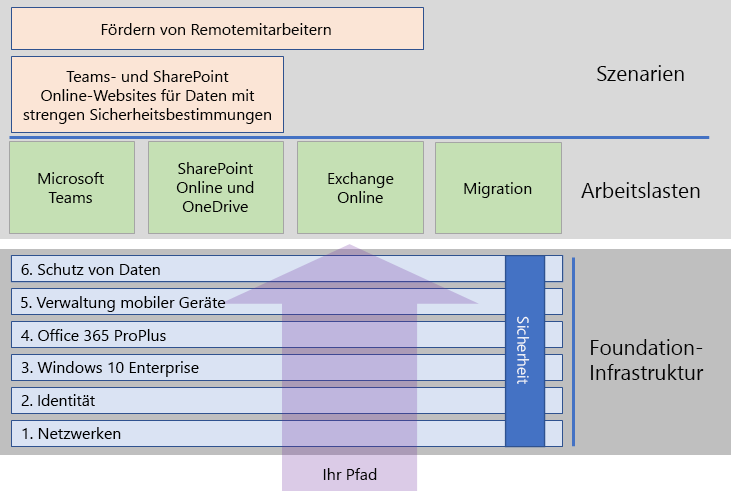

# Bereitstellen von Microsoft 365 EnterpriseDeploy Microsoft 365 for enterprise

Microsoft 365 Enterprise ist eine Kombination aus lokalen und cloudbasierten Produktivitäts-Apps und -Diensten mit Windows 10 Enterprise, und bietet folgende Features:Microsoft 365 for enterprise is a combination of local and cloud-based productivity apps and services with Windows 10 Enterprise that:  

- Es bietet Intelligente Sicherheit.Has intelligent security.
- Es ist für Einfachheit integriert.Is integrated for simplicity.
- Es fördert die Kreativität.Unlocks creativity.
- Es wurde für die Teamarbeit entwickelt.Is built for teamwork.

Von diesen Vorteilen können Sie profitieren, indem Sie die Infrastruktur und Produktivitätsworkloads auf integrierte Weise bereitstellen, wobei die neuesten Sicherheitsdienste und -features verwendet werden.You can realize these benefits by deploying the infrastructure and productivity workloads in an integrated way that includes state-of-the-art security services and features.

Es gibt drei Hauptmöglichkeiten zum Bereitstellen von Microsoft 365 Enterprise:There are three main ways to deploy Microsoft 365 for enterprise:

- In Zusammenarbeit mit Microsoft-Technikern über [FastTrack für Microsoft 365](#fasttrack-for-microsoft-365).Do it with Microsoft engineers using [FastTrack for Microsoft 365](#fasttrack-for-microsoft-365).
- Mit Hilfe der Microsoft Consulting Services oder eines [Microsoft-Partners](https://partner.microsoft.com/).Do it with help from Microsoft Consulting Services or a [Microsoft partner](https://partner.microsoft.com/).
- Alleine unter Verwendung des [Microsoft 365 Enterprise-Bereitstellungshandbuchs](#microsoft-365-for-enterprise-deployment-guide).Do it yourself with the [Microsoft 365 for enterprise deployment guide](#microsoft-365-for-enterprise-deployment-guide).

## FastTrack für Microsoft 365FastTrack for Microsoft 365

FastTrack bietet fortlaufend und wiederholt einen Vorteil und ist\* im Rahmen Ihres Abonnements kostenlos verfügbar\*. Microsoft-Techniker unterstützen Sie beim Wechsel in die Cloud in Ihrem eigenen Tempo.FastTrack is an ongoing and repeatable benefit—*available for free as part of your subscription*—that is delivered by Microsoft engineers to help you move to the cloud at your own pace. FastTrack bietet auch Zugang zu kompetenten Partnern für zusätzliche Dienste.FastTrack also gives you access to qualified partners for additional services. Für mehr als 40.000 Kunden maximiert FastTrack aktuell den ROI, beschleunigt die Bereitstellung und steigert die Akzeptanz in der Organisation.With over 40,000 customers enabled to date, FastTrack helps maximize ROI, accelerate deployment, and increase adoption across your organization. Siehe [FastTrack für Microsoft 365](https://fasttrack.microsoft.com/microsoft365).See [FastTrack for Microsoft 365](https://fasttrack.microsoft.com/microsoft365).

Wenn Sie von FastTrack für die Bereitstellung von Microsoft 365 Enterprise profitieren möchten, können Sie den FastTrack [Microsoft 365-Bereitstellungsratgeber](https://aka.ms/microsoft365setupguide) für Anleitung zum Bereitstellen und Einrichten Ihrer Foundation-Infrastruktur verwenden.If you want to take advantage of FastTrack to deploy Microsoft 365 for enterprise, you can use the FastTrack [Microsoft 365 deployment advisor](https://aka.ms/microsoft365setupguide) for guidance on how to deploy and set up your foundation infrastructure. Sie müssen als globaler Administrator in einem Office 365- oder Microsoft 365-Mandanten angemeldet sein, um auf diese Seite zugreifen zu können.You must be signed in as a global administrator in an Office 365 or Microsoft 365 tenant to access this page.

Beginnen Sie Ihre End-to-End-Bereitstellung mit FastTrack [hier](https://fasttrack.microsoft.com/microsoft365).Get started on your end-to-end deployment journey with FastTrack [here](https://fasttrack.microsoft.com/microsoft365).

## Microsoft 365 Enterprise-BereitstellungshandbuchMicrosoft 365 for enterprise deployment guide

Das Microsoft 365 Enterprise-Bereitstellungshandbuch leitet Sie durch die korrekte und erforderliche Konfiguration von Microsoft 365 Enterprise-Produkten und -Features.The Microsoft 365 for enterprise deployment guide steps you through the correct and required configuration of Microsoft 365 for enterprise products and features.

Wenn Sie Microsoft 365 Enterprise selbst bereitstellen möchten, können Sie:To deploy Microsoft 365 for enterprise yourself, you can:

- die erforderliche [Foundation-Infrastruktur](deploy-foundation-infrastructure.md) für integrierte Sicherheit und Integration für eine vereinfachte Verwaltung bereitstellen. Dies vereinfacht die Aktualisierung Ihrer Client-Software mit den neuesten Produktivitäts- und Sicherheitsverbesserungen.Deploy the [foundation infrastructure](deploy-foundation-infrastructure.md) for built-in security and integration for simplified management, which makes it easier to ensure your client software is updated with the latest productivity and security enhancements. 
 
  Die Foundation-Infrastruktur ist als eine Reihe von nummerierten Phasen organisiert, die aufeinander aufbauen und eine Umgebung schaffen, die Microsoft 365 Enterprise-Workloads und -Szenarien unterstützt.The foundation infrastructure is organized as a series of numbered phases that build upon each other and towards an environment that supports Microsoft 365 for enterprise workloads and scenarios. 

  **Wenn Sie eine kleinere oder neuere Organisation sind**, folgen Sie den Phasen, die erforderlich sind, um Ihre Infrastruktur methodisch aufzubauen.**If you are a smaller or newer organization**, follow the phases in order to methodically build out your infrastructure.

  Sie können jedoch Phasen oder Teile der Phasen dieser Infrastruktur in beliebiger Reihenfolge, [eine nach der anderen oder parallel](deployment-strategies-microsoft-365-enterprise.md) bereitstellen, um sie in Ihre aktuelle Infrastruktur zu integrieren, sie an Ihre IT-Pläne und -Ressourcen anzupassen und Ihre Geschäftsanforderungen zu erfüllen.However, you can deploy phases or the portions of phases of this infrastructure in any order as needed, [one after the other or in parallel](deployment-strategies-microsoft-365-enterprise.md), to integrate with your current infrastructure, fit your IT plans and resources, and meet your business needs. Für eine vereinfachte Bereitstellung für Nicht-Unternehmen [klicken](deploy-foundation-infrastructure-non-enterprises.md) Sie hier.For a simplified deployment for non-enterprises, click [here](deploy-foundation-infrastructure-non-enterprises.md).

  **Wenn Sie eine Unternehmensorganisation sind**, betrachten Sie die Phasen als Schichten der IT-Infrastruktur und nicht als einen definierten Pfad, und bestimmen Sie, wie Sie am besten auf die Einhaltung der Anforderungen für jede Schicht in Ihrer Organisation hinarbeiten können.**If you are an enterprise organization**, view the phases as layers of IT infrastructure, rather than a defined path, and determine how to best work toward eventual adherence to the requirements of each layer across your organization.

- Stellen Sie wichtige [Arbeitslasten und Szenarios](deploy-workloads.md) für Produktivität zusätzlich zu Ihrer Infrastruktur bereit.Deploy key productivity [workloads and scenarios](deploy-workloads.md) on top of your infrastructure. Diese setzen Kreativität und Teamwork in Ihrer Organisation frei.These unlock creativity and teamwork in your organization.

Die Beziehung zwischen der Foundation-Infrastruktur und den Arbeitslasten und Szenarien ist wie folgt.Here's the relationship between the foundation infrastructure and the workloads and scenarios.

Arbeitslasten und Szenarios agieren auf Grundlage der Foundation-Infrastruktur.Workloads and scenarios operate over the top of the foundation infrastructure. Sie müssen jedoch nicht alle Phasen der Foundation-Infrastruktur vollständig durchlaufen haben, um Arbeitslasten für Produktivität und Zusammenarbeit verwenden zu können.However, you do not have to have all of the foundation infrastructure phases built out to begin using workloads for productivity and collaboration.

Beginnen Sie Ihre End-to-End-Bereitstellung [hier](deploy-foundation-infrastructure.md).Get self-started on your end-to-end deployment journey [here](deploy-foundation-infrastructure.md).

## TestenTake a test drive

„*Es gibt Dinge, die wir lernen müssen, bevor wir sie tun können. Und wir lernen sie, indem wir sie tun.*““*For the things we have to learn before we can do them, we learn by doing them.*” - Aristoteles- Aristotle

Wenn Sie Microsoft 365 Enterprise oder einem bestimmten Produkt oder Feature noch nicht kennen, besteht eine der besten Möglichkeiten, sich damit vertraut zu machen, darin, eine Testumgebung zu erstellen und auszuprobieren.If you're new to Microsoft 365 for enterprise or to a specific product or feature, one of the best ways to gain understanding is to build it out yourself and see it working.

Wir haben dies mit Testumgebungsanleitungen einfacher gestaltet, die Sie durch die Konfiguration der Infrastruktur oder einer Funktion in einer vereinfachten, aber repräsentativen Testumgebung über Testversionen oder bezahlte Abonnements unterstützen.We've made this easier with Test Lab Guides (TLGs), which step you through the configuration of infrastructure or a feature in a simplified but representative test environment using trial or paid subscriptions.

Mit Testumgebungsanleitungen können Sie eine Machbarkeitsstudie einer komplexen Konfiguration, einer Arbeitslast oder eines End-to-End-Szenarios selbst erarbeiten, demonstrieren, anpassen oder erstellen.With TLGs, you can self-learn, demonstrate, customize, or build a proof of concept (PoC) of a complex configuration, workload, or end-to-end scenario.

Weitere Informationen finden Sie unter [Microsoft 365 Enterprise-Testumgebungsanleitungen](m365-enterprise-test-lab-guides.md).For more information, see [Microsoft 365 for enterprise Test Lab Guides](m365-enterprise-test-lab-guides.md).

## Umstellung Ihrer gesamten OrganisationTransition your entire organization

Einen besseren Überblick darüber, wie Sie Ihre gesamte Organisation auf die Produkte und Dienste von Microsoft 365 Enterprise umstellen können, erhalten Sie auf dem Poster [Überführen Ihrer Organisation zu Microsoft 365](../media/deploy-microsoft-365-enterprise/transition-org-to-m365.pdf).To get a better picture of how to move your entire organization to the products and services in Microsoft 365 for enterprise, see the [Transition Your Organization to Microsoft 365](../media/deploy-microsoft-365-enterprise/transition-org-to-m365.pdf) poster.

Dieses zweiseitige Poster ist eine schnelle Methode, um eine Übersicht Ihrer vorhandenen Infrastruktur zu erstellen, und bietet Anweisungen für den Wechsel zum entsprechenden Produkt oder Dienst in Microsoft 365 Enterprise.This two-page poster is a quick way to inventory your existing infrastructure and get to the guidance for moving to the corresponding product or service in Microsoft 365 for enterprise. Es enthält Windows- und Office-Produkte sowie weitere Infrastruktur- und Sicherheitselemente wie Geräteverwaltung, sowie Identitäts-, Daten- und Bedrohungsschutz.It includes Windows and Office products and other infrastructure and security elements such as device management, identity, and information and threat protection.

Sie können [das Poster zur Überführung auch herunterladen](https://github.com/MicrosoftDocs/microsoft-365-docs/raw/public/microsoft-365/enterprise/media/deploy-microsoft-365-enterprise/transition-org-to-m365.pdf) und in den Formaten "Brief", "Legal" oder "Tabloid" (27,94 x 43,18 cm) ausdrucken.You can also [download the transition poster](https://github.com/MicrosoftDocs/microsoft-365-docs/raw/public/microsoft-365/enterprise/media/deploy-microsoft-365-enterprise/transition-org-to-m365.pdf) and print it in letter, legal, or tabloid (11 x 17) formats.

## Wie haben andere Personen es gemacht?How did others do it?

Verwenden Sie diese Ressourcen, um zu verstehen, wie andere Personen Microsoft 365 Enterprise bereitgestellt haben und verwenden.Use these resources to understand how others have deployed and are using Microsoft 365 for enterprise.

### Verwendung von Microsoft 365 Enterprise bei KundenHow customers use Microsoft 365 for enterprise

Auf der Website "Erfahrungsberichte von Kunden" erfahren Sie, wie Microsoft-Kunden Microsoft 365 Enterprise verwenden.Use the Customer Stories site to see how Microsoft customers are using Microsoft 365 for enterprise.

1. Wechseln Sie zu[https://customers.microsoft.com/](https://customers.microsoft.com/) und klicken Sie auf **Suchen**.Go to [https://customers.microsoft.com/](https://customers.microsoft.com/) and click **Search**.
2. Wählen Sie im linken Bereich unter **Sprache** Ihre Sprache aus.In the left pane, select your language in **Language**.
3. Wählen Sie unter **Branche** die Branche Ihrer Organisation aus.Select your organization's industry in **Industry**.
4. Wählen Sie unter **Produkt** **Microsoft 365** aus.Select **Microsoft 365** in **Product**.
5. Klicken Sie auf eine Karte für die Fallstudie des Kunden.Click on a card for the customer's case study.

### Verwendung von Microsoft 365 Enterprise bei MicrosoftHow Microsoft uses Microsoft 365 for enterprise

Die Definition einer digitalen Kultur hat für jede Führungskraft, die sich für einen modernen Arbeitsplatz einsetzt, höchste Priorität.Defining a digital culture is a major priority for every leader who strives to foster a modern workplace. Microsoft 365 wurde entwickelt, um diese Art von kulturellem Wandel zu unterstützen und Führungskräften dabei zu helfen, alle Mitarbeiter in ihren Unternehmen zu befähigen, Kreativität und Zusammenarbeit zu entfalten.Microsoft 365 was designed to support this kind of cultural shift helping leaders empower everyone at their companies to unleash creativity and collaboration. Die Etablierung der Foundation-Infrastruktur von Microsoft hat genau diese Art von digitalem Kulturwandel ausgelöst.Establishing Microsoft's foundational infrastructure has sparked precisely this kind of digital culture shift. Die Implementierung von Microsoft 365 Enterprise hat es uns ermöglicht, Technologien für die Zusammenarbeit wie Microsoft Teams und Exchange Online einzusetzen und sensible Daten online über sichere SharePoint-Intranetseiten zu teilen.Implementing Microsoft 365 for enterprise has allowed us to deploy collaboration technology, like Microsoft Teams and Exchange Online, and to share sensitive data online across secure SharePoint intranet sites.

Gleichzeitig helfen intelligente Sicherheitsfunktionen und Produktintegration, die Verwaltungsanforderungen zu rationalisieren und die Gesamtbetriebskosten über den gesamten IT-Lebenszyklus hinweg zu minimieren.At the same time, intelligent security features and product integration helps streamline management needs and minimize the total cost of ownership across the IT lifecycle. 

Erfahren Sie, wie Core Services Engineering and Operations (ehemals Microsoft IT) eine Grundlage für die Unterstützung von Anwendungen und Diensten [geplant und implementiert](https://www.microsoft.com/itshowcase/deploying-and-managing-microsoft-365) hat, die Kreativität freisetzen und die Teamarbeit in einer sicheren Umgebung fördern.Learn how Core Services Engineering and Operations (formerly Microsoft IT) [planned and deployed a foundation](https://www.microsoft.com/itshowcase/deploying-and-managing-microsoft-365) to support the applications and services that unlock creativity and foster teamwork in a secure environment.

> [!Note]
> Diese Webseite steht nur in Englisch zur Verfügung.This web page is only available in English.

### Bereitstellung von Microsoft 365 Enterprise für die Contoso CorporationHow the Contoso Corporation deployed Microsoft 365 for enterprise

Die Contoso Corporation ist ein fiktiver, aber repräsentativer globaler Mischkonzern im Bereich Fertigung mit Hauptsitz in Paris.The Contoso Corporation is a fictional but representative global manufacturing conglomerate with its headquarters in Paris, France. Erfahren Sie, wie [Contoso Microsoft 365 Enterprise bereitgestellt](contoso-case-study.md) und dabei wichtige Designentscheidungen und Implementierungsdetails für Netzwerk, Identität, Windows 10 Enterprise, Office 365 ProPlus, Verwaltung mobiler Geräte, Datenschutz und Sicherheit berücksichtigt hat.See how [Contoso deployed Microsoft 365 for enterprise](contoso-case-study.md) and addressed major design decisions and implementation details for networking, identity, Windows 10 Enterprise, Office 365 ProPlus, mobile device management, information protection, and security. 

## Immer auf dem neuesten Stand mit BereitstellungsinhaltenStay current with deployment content

Die neuesten Änderungen am Inhalt finden Sie in [diesem Artikel](microsoft-365-deploment-guide-changes.md).For the latest changes in content, see [this article](microsoft-365-deploment-guide-changes.md).

## Nächster SchrittNext step

Um direkte Unterstützung von Microsoft zu erhalten, verwenden Sie [FastTrack](https://fasttrack.microsoft.com/microsoft365).To do it with direct Microsoft assistance, use [FastTrack](https://fasttrack.microsoft.com/microsoft365).

Um dies mit einem Berater zu tun, wenden Sie sich an Microsoft Consulting Services oder einen [Microsoft-Partner](https://partner.microsoft.com/).To do it with a consultant, contact Microsoft Consulting Services or a [Microsoft partner](https://partner.microsoft.com/).

Um selbst zu starten, sehen Sie sich die [Foundation-Infrastruktur](deploy-foundation-infrastructure.md) an.To get started doing it yourself, see the [foundation infrastructure](deploy-foundation-infrastructure.md).
