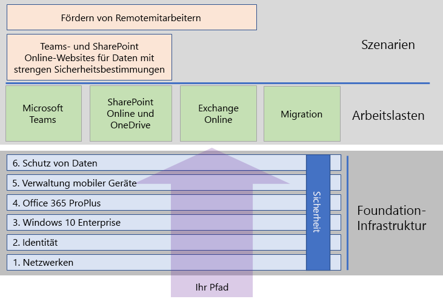
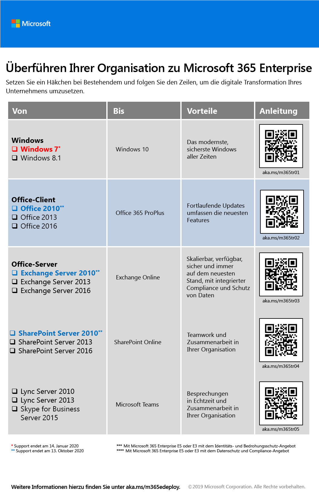

# Bereitstellen von Microsoft 365 Enterprise

Microsoft 365 Enterprise ist eine Kombination aus lokalen und cloudbasierten Produktivitäts-Apps und -Diensten mit Windows 10 Enterprise, und bietet folgende Features:  

- Es bietet Intelligente Sicherheit.
- Es ist für Einfachheit integriert.
- Es fördert die Kreativität.
- Es wurde für die Teamarbeit entwickelt.

Von diesen Vorteilen können Sie profitieren, indem Sie die Infrastruktur und Produktivitätsworkloads auf integrierte Weise bereitstellen, wobei die neuesten Sicherheitsdienste und -features verwendet werden.

Es gibt drei Hauptmöglichkeiten zum Bereitstellen von Microsoft 365 Enterprise:

- In Zusammenarbeit mit Microsoft-Technikern über [FastTrack für Microsoft 365](#fasttrack-for-microsoft-365).
- Mit Hilfe der Microsoft Consulting Services oder eines [Microsoft-Partners](https://partner.microsoft.com/).
- Alleine unter Verwendung des [Microsoft 365 Enterprise-Bereitstellungshandbuchs](#microsoft-365-enterprise-deployment-guide).

## FastTrack für Microsoft 365

FastTrack bietet fortlaufend und wiederholt einen Vorteil und ist* im Rahmen Ihres Abonnements kostenlos verfügbar*. Microsoft-Techniker unterstützen Sie beim Wechsel in die Cloud in Ihrem eigenen Tempo. FastTrack bietet auch Zugang zu kompetenten Partnern für zusätzliche Dienste. Für mehr als 40.000 Kunden maximiert FastTrack aktuell den ROI, beschleunigt die Bereitstellung und steigert die Akzeptanz in der Organisation. Siehe [FastTrack für Microsoft 365](https://fasttrack.microsoft.com/microsoft365).

Wenn Sie von FastTrack für die Bereitstellung von Microsoft 365 Enterprise profitieren möchten, können Sie den FastTrack [Microsoft 365 Deployment Advisor](https://aka.ms/microsoft365setupguide) für Anleitung zum Bereitstellen und Einrichten Ihrer Foundation-Infrastruktur verwenden. Sie müssen als globaler Administrator in einem Office 365- oder Microsoft 365-Mandanten angemeldet sein, um auf diese Seite zugreifen zu können.

Beginnen Sie Ihre End-to-End-Bereitstellung mit FastTrack [hier](https://fasttrack.microsoft.com/microsoft365).

## Microsoft 365 Enterprise-Bereitstellungshandbuch

Das Microsoft 365 Enterprise-Bereitstellungshandbuch leitet Sie durch die korrekte und erforderliche Konfiguration von Microsoft 365 Enterprise-Produkten und -Funktionen.

Wenn Sie Microsoft 365 Enterprise selbst bereitstellen möchten, können Sie:

- die erforderliche [Foundation-Infrastruktur](deploy-foundation-infrastructure.md) für integrierte Sicherheit und Integration für eine vereinfachte Verwaltung bereitstellen. Dies vereinfacht die Aktualisierung Ihrer Client-Software mit den neuesten Produktivitäts- und Sicherheitsverbesserungen. 
 
  Die Foundation-Infrastruktur ist als eine Reihe von nummerierten Phasen organisiert, die aufeinander aufbauen und eine Umgebung bilden, die Microsoft 365 Enterprise-Arbeitslasten und -Szenarien unterstützt. 

  **Wenn Sie eine kleinere oder neuere Organisation sind**, folgen Sie den Phasen, die erforderlich sind, um Ihre Infrastruktur methodisch aufzubauen.

  Sie können jedoch Phasen oder Teile der Phasen dieser Infrastruktur in beliebiger Reihenfolge, [eine nach der anderen oder parallel](deployment-strategies-microsoft-365-enterprise.md) bereitstellen, um sie in Ihre aktuelle Infrastruktur zu integrieren, sie an Ihre IT-Pläne und -Ressourcen anzupassen und Ihre Geschäftsanforderungen zu erfüllen. Für eine vereinfachte Bereitstellung für Nicht-Unternehmen [klicken](deploy-foundation-infrastructure-non-enterprises.md) Sie hier.

  **Wenn Sie eine Unternehmensorganisation sind**, betrachten Sie die Phasen als Schichten der IT-Infrastruktur und nicht als einen definierten Pfad, und bestimmen Sie, wie Sie am besten auf die Einhaltung der Anforderungen für jede Schicht in Ihrer Organisation hinarbeiten können.

- Stellen Sie wichtige [Arbeitslasten und Szenarios](deploy-workloads.md) für Produktivität zusätzlich zu Ihrer Infrastruktur bereit. Diese setzen Kreativität und Teamwork in Ihrer Organisation frei.

Die Beziehung zwischen der Foundation-Infrastruktur und den Arbeitslasten und Szenarien ist wie folgt.

Arbeitslasten und Szenarios agieren auf Grundlage der Foundation-Infrastruktur. Sie müssen jedoch nicht alle Phasen der Foundation-Infrastruktur vollständig durchlaufen haben, um Arbeitslasten für Produktivität und Zusammenarbeit verwenden zu können.

Beginnen Sie Ihre End-to-End-Bereitstellung [hier](deploy-foundation-infrastructure.md).

## Testen

„*Es gibt Dinge, die wir lernen müssen, bevor wir sie tun können. Und wir lernen sie, indem wir sie tun.*“ - Aristoteles

Wenn Sie Microsoft 365 Enterprise oder ein bestimmtes Produkt oder Feature nicht kennen, ist eine der besten Methoden, es selbst zu konfigurieren und zu sehen, wie es funktioniert.

Wir haben dies mit Testumgebungsanleitungen einfacher gestaltet, die Sie durch die Konfiguration der Infrastruktur oder einer Funktion in einer vereinfachten, aber repräsentativen Testumgebung über Testversionen oder bezahlte Abonnements unterstützen.

Mit Testumgebungsanleitungen können Sie eine Machbarkeitsstudie einer komplexen Konfiguration, einer Arbeitslast oder eines End-to-End-Szenarios selbst erarbeiten, demonstrieren, anpassen oder erstellen.

Weitere Informationen finden Sie unter [Microsoft 365 Enterprise-Testumgebungsanleitungen](m365-enterprise-test-lab-guides.md).

## Umstellung Ihrer gesamten Organisation

Einen besseren Überblick darüber, wie Sie Ihre gesamte Organisation auf die Produkte und Dienste von Microsoft 365 Enterprise umstellen können, erhalten Sie auf dem Poster [Überführen Ihrer Organisation zu Microsoft 365](media/deploy-microsoft-365-enterprise/transition-org-to-m365.pdf).

Dieses zweiseitige Poster ist eine schnelle Methode, um eine Aufstellung Ihrer vorhandenen Infrastruktur zu erstellen und die Anweisungen für den Wechsel zum entsprechenden Produkt oder Dienst in Microsoft 365 Enterprise zu finden. Es enthält Windows- und Office-Produkte sowie weitere Infrastruktur- und Sicherheitselemente wie Geräteverwaltung, sowie Identitäts-, Daten- und Bedrohungsschutz.

Sie können [das Poster zur Überführung auch herunterladen](https://github.com/MicrosoftDocs/microsoft-365-docs/raw/public/microsoft-365/enterprise/media/deploy-microsoft-365-enterprise/transition-org-to-m365.pdf) und in den Formaten "Brief", "Legal" oder "Tabloid" (27,94 x 43,18 cm) ausdrucken.

## Wie haben andere Personen es gemacht?

Verwenden Sie diese Ressourcen, um zu verstehen, wie andere Personen Microsoft 365 Enterprise bereitgestellt haben und verwenden.

### Wie Kunden Microsoft 365 Enterprise verwenden

Auf der Website „Erfahrungsberichte von Kunden“ erfahren Sie, wie Microsoft-Kunden Microsoft 365 Enterprise verwenden.

1. Wechseln Sie zu[https://customers.microsoft.com/](https://customers.microsoft.com/) und klicken Sie auf **Suchen**.
2. Wählen Sie im linken Bereich unter **Sprache** Ihre Sprache aus.
3. Wählen Sie unter **Branche** die Branche Ihrer Organisation aus.
4. Wählen Sie unter **Produkt** **Microsoft 365** aus.
5. Klicken Sie auf eine Karte für die Fallstudie des Kunden.

### Funktionsweise von Microsoft 365 Enterprise bei Microsoft

Die Definition einer digitalen Kultur hat für jede Führungskraft, die sich für einen modernen Arbeitsplatz einsetzt, höchste Priorität. Microsoft 365 wurde entwickelt, um diese Art von kulturellem Wandel zu unterstützen und Führungskräften dabei zu helfen, alle Mitarbeiter in ihren Unternehmen zu befähigen, Kreativität und Zusammenarbeit zu entfalten. Die Etablierung der Foundation-Infrastruktur von Microsoft hat genau diese Art von digitalem Kulturwandel ausgelöst. Die Implementierung von Microsoft 365 Enterprise hat es uns ermöglicht, Technologien für die Zusammenarbeit wie Microsoft Teams und Exchange Online einzusetzen und sensible Daten online über sichere SharePoint-Intranetseiten zu teilen.

Gleichzeitig helfen intelligente Sicherheitsfunktionen und Produktintegration, die Verwaltungsanforderungen zu rationalisieren und die Gesamtbetriebskosten über den gesamten IT-Lebenszyklus hinweg zu minimieren. 

Erfahren Sie, wie Core Services Engineering and Operations (ehemals Microsoft IT) eine Grundlage für die Unterstützung von Anwendungen und Diensten [geplant und implementiert](https://www.microsoft.com/de-DE/itshowcase/deploying-and-managing-microsoft-365) hat, die Kreativität freisetzen und die Teamarbeit in einer sicheren Umgebung fördern.

> [!Note]
> Diese Webseite steht nur in Englisch zur Verfügung.

### Bereitstellen von Microsoft 365 Enterprise für die Contoso Corporation

Die Contoso Corporation ist ein fiktiver, aber repräsentativer globaler Mischkonzern im Bereich Fertigung mit Hauptsitz in Paris. Erfahren Sie, wie [Contoso Microsoft 365 Enterprise bereitgestellt](contoso-case-study.md) und dabei wichtige Designentscheidungen und Implementierungsdetails für Netzwerk, Identität, Windows 10 Enterprise, Office 365 ProPlus, Verwaltung mobiler Geräte, Datenschutz und Sicherheit berücksichtigt. 

## Immer auf dem neuesten Stand mit Bereitstellungsinhalten

Die neuesten Änderungen am Inhalt finden Sie in [diesem Artikel](microsoft-365-deploment-guide-changes.md).

## Nächster Schritt

Um direkte Unterstützung von Microsoft zu erhalten, verwenden Sie [FastTrack](https://fasttrack.microsoft.com/microsoft365).

Um dies mit einem Berater zu tun, wenden Sie sich an Microsoft Consulting Services oder einen [Microsoft-Partner](https://partner.microsoft.com/).

Um selbst zu starten, sehen Sie sich die [Foundation-Infrastruktur](deploy-foundation-infrastructure.md) an.
