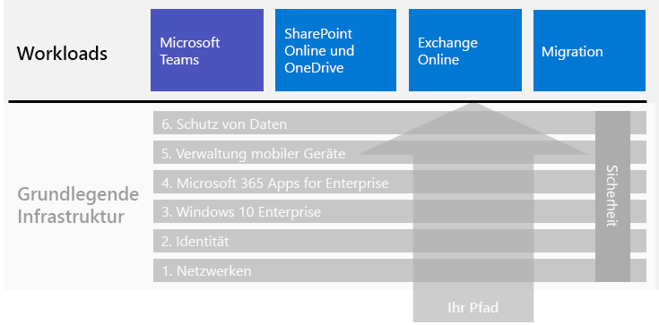

# Microsoft 365 Enterprise-WorkloadsMicrosoft 365 for enterprise workloads

Um die Vorteile für Kreativität und Teamwork von Microsoft 365 Enterprise zu realisieren, stellen Sie die folgenden Workloads über Ihre Foundation-Infrastruktur bereit:To get the creativity and teamwork benefits of Microsoft 365 for enterprise, deploy these workloads over your foundation infrastructure:

- [Microsoft TeamsMicrosoft Teams](teams-workload.md)
- [Exchange OnlineExchange Online](exchangeonline-workload.md)
- [SharePoint und OneDriveSharePoint and OneDrive](sharepoint-online-onedrive-workload.md)

Im Artikel [Migration](migration-microsoft-365-enterprise-workload.md) finden Sie eine allgemeine Roadmap zum Migrieren Ihrer gesamten Organisation zu Microsoft 365 Enterprise. Dies beinhaltet Microsoft Office-Client-Produkte, lokale Office-Serverprodukte und Microsoft Windows-basierte Geräte.See the [migration](migration-microsoft-365-enterprise-workload.md) article for a general roadmap to migrate your entire organization to Microsoft 365 for enterprise, which includes Microsoft Office client products, on-premises Office Server products, and Microsoft Windows-based devices.

Dies sind die Workloads im allgemeinen Microsoft 365 Enterprise-Bereitstellungshandbuch:Here are the workloads in the overall Microsoft 365 for enterprise deployment guide:

## Foundation-Infrastruktur – VoraussetzungenFoundation infrastructure prerequisites

*Idealerweise* sollten Sie Workloads bereitstellen, nachdem Sie alle Phasen der [Foundation-Infrastruktur](deploy-foundation-infrastructure.md) konfiguriert haben.*Ideally*, you should deploy workloads after you have configured all of the phases of the [foundation infrastructure](deploy-foundation-infrastructure.md). Dadurch wird sichergestellt, dass alle zugrunde liegenden Foundation-Ebenen vorhanden sind, um Integration, Sicherheit und die besten Ergebnisse für die Benutzer und deren Geräte bereitzustellen.This ensures that all of the underlying foundation layers are in place to provide integration, security, and the best experience for your users and their devices.

| PhasePhase | ErgebnisResult |
|:-------|:-----|
| NetzwerkNetwork | Ihr Netzwerk wird für optimale Leistung auf Microsoft 365-Clouddienste aktualisiert.Your network is updated for optimum performance to Microsoft 365 cloud services. |
| IdentitätIdentity | Die Identität wird mit starker Authentifizierung für Benutzerkonten und Schutz für Administratorkonten synchronisiert und gesichert.Identity is synchronized and secured with strong authentication for user accounts and protection for admin accounts. |
| Windows 10 EnterpriseWindows 10 Enterprise | Ihre Computer mit Windows 7 oder Windows 8.1 können auf Windows 10 Enterprise aktualisiert werden, und neue Geräte sind mit Windows 10 Enterprise ausgestattet.Your computers running Windows 7 or Windows 8.1 can upgrade to Windows 10 Enterprise and new devices are installed with Windows 10 Enterprise. |
| Microsoft 365 Apps for EnterpriseMicrosoft 365 Apps for enterprise | Ihre vorhandenen Benutzer von Microsoft Office können ein Upgrade auf Microsoft 365 Apps for Enterprise durchführen.Your existing users of Microsoft Office can upgrade to Microsoft 365 Apps for enterprise. |
| Verwaltung mobiler GeräteMobile device management | Ihre Geräte können registriert und verwaltet werden.Your devices can be enrolled and managed. |
| Schutz von DatenInformation protection | Die Microsoft 365-Features zum Schutz von Informationen sind konfiguriert, und Ihre Vertraulichkeits- oder Azure Information Protection-Bezeichnungen sind bereit zum Schützen von Dokumenten und E-Mail.Microsoft 365 information protection features are configured and your sensitivity or Azure Information Protection labels are ready to protect documents and email. |

Denken Sie daran, dass dies der Idealzustand ist, der einige Zeit zum Planen, Konfigurieren, Testen und Durchführen einer Pilotphase erfordert, insbesondere in großen Organisationen mit vorhandener Infrastruktur und mehreren Standorten.Remember that this is ideal and can take some time to plan for, configure, test, and pilot, especially in large organizations with existing infrastructure and multiple locations. Die Durchführung dieser Phasen an allen Standorten ist nicht erforderlich, damit Sie schneller einen geschäftlichen Nutzen aus Microsoft 365 Enterprise ziehen.Completing all of these phases in all locations is not necessary for you to more quickly get business value from Microsoft 365 for enterprise. 

Hier einige allgemeine Arbeitslasten, die Sie sofort bereitstellen können:Here are some common workloads to deploy right away: 

- Nachdem die Phase **Identität** der Foundation-Infrastruktur für Benutzer bereitgestellt wurde, stellen viele Organisationen Folgendes bereit:After the **Identity** phase of the foundation infrastructure is rolled out to users, many organizations deploy:
  - [Microsoft 365 Apps for Enterprise](office365proplus-infrastructure.md) in Kombination mit [OneDrive](https://docs.microsoft.com/onedrive/plan-onedrive-enterprise).[Microsoft 365 Apps for enterprise](office365proplus-infrastructure.md) combined with [OneDrive](https://docs.microsoft.com/onedrive/plan-onedrive-enterprise). Microsoft 365 Apps for Enterprise bietet die Sicherheit der modernen Authentifizierung und die Benutzeroberfläche des neuesten Microsoft Office-Clients.Microsoft 365 Apps for enterprise provides the security of modern authentication and the user experience of the latest Microsoft Office client. Die Migration der persönlichen Dateien des Benutzers zu OneDrive verkleinert die Infrastruktur und reduziert die Notwendigkeit, Home-Ordner und Laufwerke zu unterstützen.The migration of user's personal files to OneDrive reduces infrastructure and the need to support home folders and drives.
  - [Exchange Online](exchangeonline-workload.md), damit Benutzer mithilfe von Cloud-basierter E-Mail beginnen können.[Exchange Online](exchangeonline-workload.md) so that users can begin using cloud-based email.
- Wenn Sie nicht sofort stark regulierte digitale Assets in der Cloud speichern müssen, stellen Sie [Microsoft Teams](teams-workload.md) und [SharePoint](sharepoint-online-onedrive-workload.md) für Ihre Benutzer vor der Phase **Informationsschutz** bereit.If you don't have an immediate need for storing highly regulated digital assets in the cloud, deploy [Microsoft Teams](teams-workload.md) and [SharePoint](sharepoint-online-onedrive-workload.md) for your users prior to the **Information protection** phase.

Sie müssen entscheiden, wie Sie die Konfiguration der erforderlichen Phasen der Foundation-Infrastruktur am besten anordnen und bereitstellen, um Ihre Geschäftsanforderungen zu erfüllen.You must decide on how to best order and deploy the configuration of prerequisite phases of foundation infrastructure to meet your business needs.

### Bewährte MethodeBest practice

Es wird dringend empfohlen, dass Sie die Phase **Identität** der Foundation-Infrastruktur vor dem Onboarding der Benutzer für alle Arbeitslasten oder Szenarien bereitstellen und implementieren.We highly recommend that you deploy and roll out the **Identity** phase of the foundation infrastructure prior to onboarding your users to any workloads or scenarios.

Die Phase **Identität** stellt sicher, dass Ihre Cloud-basierte Identität, sei es Cloud oder mit Ihren lokalen Active Directory Domain Services (AD DS) synchronisiert, die Konten und Gruppen (Benutzer und Computer) für die Verwaltung der Authentifizierung und den Zugriff enthält.The **Identity** phase ensures that your cloud-based identity, whether cloud-only or synchronized with your on-premises Active Directory Domain Services (AD DS), contains the user and computer accounts and groups to manage authentication and access. Starke Authentifizierung für alle Benutzer zusammen mit effizientem Schutz von Administratorkonten sind erforderlich, bevor Sie die digitalen Assets Ihrer Organisation in der Microsoft 365-Cloud platzieren.Strong authentication for all your users along with strong protection of admin accounts is required before placing your organization's digital assets in the Microsoft 365 cloud.

Obwohl sie grundlegend und sehr wichtig für die Gesamtleistung ist, kann die Implementierung der Phase **Netzwerk** während des Onboardings der Benutzer für Arbeitslasten durchgeführt werden, mit dem Wissen, dass die Leistung von Microsoft 365-Workload und -Dienst mit der Zeit besser wird.Although foundational and very important to overall performance, the rollout of the **Networking** phase can be in progress while onboarding your users to workloads, with the understanding that Microsoft 365 workload and service performance will improve over time. Dies gilt insbesondere für Unternehmen mit mehreren Standorten und eine Mischung von Edge-Geräte und Internet-Verbindungen.This is especially true for enterprise organizations with multiple locations and a mixture of edge devices and Internet connections.
