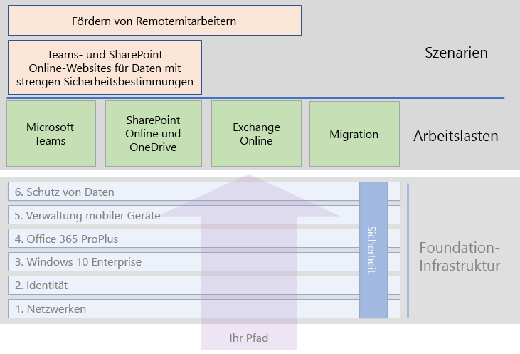

# Microsoft 365 Enterprise-Arbeitslasten und -Szenarien

Um die Vorteile für Kreativität und Teamwork von Microsoft 365 Enterprise zu realisieren, stellen Sie die folgenden Arbeitslasten über Ihre Foundation-Infrastruktur bereit:

- [Microsoft Teams](teams-workload.md)
- [Exchange Online](exchangeonline-workload.md)
- [SharePoint Online](sharepoint-online-onedrive-workload.md)

In der Arbeitslast [Migration](migration-microsoft-365-enterprise-workload.md)finden Sie eine allgemeine Roadmap zum Migrieren Ihrer gesamten Organisation zu Microsoft 365 Enterprise. Dies beinhaltet Microsoft Office-Client-Produkte, lokale Office-Serverprodukte und Microsoft Windows-basierte Geräte.

Szenarien verwenden Funktionen und Dienste aus Microsoft 365 Enterprise auf integrierte Art und Weise, um eine Geschäftsanforderung zu erfüllen. Eine derartige Anforderung ist, stark regulierte Daten, die in Microsoft 365 gespeichert sind, zu schützen. Stark regulierte Daten umfassen folgende digitale Assets:

- Daten, die regionalen Vorschriften unterliegen.
- Die wertvollsten Daten für Ihre Organisation, z. B. Geschäftsgeheimnisse, Informationen zu Finanzen oder Personalwesen und die Organisationsstrategie.

Um diese Daten vor internen und externen Bedrohungen zu schützen, gibt es Anweisungen unter [Microsoft Teams- und SharePoint Online-Websites für stark regulierte Daten](teams-sharepoint-online-sites-highly-regulated-data.md). Dieses Szenario leitet Sie durch die Konfiguration einer SharePoint Online-Website oder eines Microsoft Teams-Teams, um Ihre wertvollsten Daten sicher zu speichern.

Dies sind die Arbeitslasten und Szenarios im allgemeinen Microsoft 365 Enterprise-Bereitstellungshandbuch:

## Foundation-Infrastruktur – Voraussetzungen

*Idealerweise* sollten Sie Arbeitslasten und Szenarios bereitstellen, nachdem Sie alle Phasen der [Foundation-Infrastruktur](deploy-foundation-infrastructure.md) konfiguriert haben. Dadurch wird sichergestellt, dass alle zugrunde liegenden Ebenen vorhanden sind, um Integration, Sicherheit und die besten Ergebnisse für die Benutzer und deren Geräte bereitzustellen.

| Phase | Ergebnis |
|:-------|:-----|
| Netzwerk | Ihr Netzwerk wird für optimale Leistung auf Microsoft 365-Clouddienste aktualisiert. |
| Identität | Die Identität wird mit starker Authentifizierung für Benutzerkonten und Schutz für Administratorkonten synchronisiert und gesichert. |
| Windows 10 Enterprise | Ihre Computer mit Windows 7 oder Windows 8.1 können auf Windows 10 Enterprise aktualisiert werden, und neue Geräte sind mit Windows 10 Enterprise ausgestattet. |
| Office 365 ProPlus | Ihre vorhandenen Benutzer von Microsoft Office können ein Upgrade auf Office 365 ProPlus durchführen. |
| Verwaltung mobiler Geräte | Ihre Geräte können registriert und verwaltet werden. |
| Schutz von Daten | Office 365-Sicherheitsfunktionen sind aktiviert und Ihre Vertraulichkeits- oder Azure Information Protection-Bezeichnungen sind bereit zum Schützen von Dokumenten. |

Denken Sie daran, dass dies der Idealzustand ist, der einige Zeit zum Planen, Konfigurieren, Testen und Durchführen einer Pilotphase erfordert, insbesondere in großen Organisationen mit vorhandener Infrastruktur und mehreren Standorten. Die Implementierung all dieser Ebenen an allen Standorten ist nicht erforderlich, damit Sie schneller einen geschäftlichen Nutzen aus Microsoft 365 Enterprise ziehen. 

Hier einige allgemeine Arbeitslasten, die Sie sofort bereitstellen können: 

- Nachdem die Ebene **Identität** der Foundation-Infrastruktur für Benutzer bereitgestellt wurde, stellen viele Organisationen Folgendes bereit:
  - [Office 365 ProPlus](office365proplus-infrastructure.md) in Kombination mit [OneDrive for Business](https://docs.microsoft.com/onedrive/plan-onedrive-enterprise). Office 365 ProPlus bietet die Sicherheit der modernen Authentifizierung und die Benutzeroberfläche des neuesten Microsoft Office-Clients. Die Migration der persönlichen Dateien des Benutzers zu OneDrive for Business verkleinert die Infrastruktur und reduziert die Notwendigkeit, Home-Ordner und Laufwerke zu unterstützen.
  - [Exchange Online](exchangeonline-workload.md), damit Benutzer mithilfe von Cloud-basierter E-Mail beginnen können.
- Wenn Sie nicht sofort stark regulierte digitale Assets in der Cloud speichern müssen, stellen Sie [Microsoft Teams](teams-workload.md) und [SharePoint Online](sharepoint-online-onedrive-workload.md) für Ihre Benutzer vor der Ebene **Informationsschutz** bereit.

Sie müssen entscheiden, wie Sie die Konfiguration der erforderlichen Phasen der Foundation-Infrastruktur am besten anordnen und bereitstellen, um Ihre Geschäftsanforderungen optimal zu erfüllen.

### Bewährte Methode

Es wird dringend empfohlen, dass Sie die Phase **Identität** der Foundation-Infrastruktur vor dem Onboarding der Benutzer für alle Arbeitslasten oder Szenarien bereitstellen und implementieren.

Die Phase **Identität** stellt sicher, dass Ihre Cloud-basierte Identität, sei es Cloud oder mit Ihren lokalen Active Directory Domain Services (AD DS) synchronisiert, die Konten und Gruppen (Benutzer und Computer) für die Verwaltung der Authentifizierung und den Zugriff enthält. Starke Authentifizierung für alle Benutzer zusammen mit effizientem Schutz von Administratorkonten sind erforderlich, bevor Sie die digitalen Assets Ihrer Organisation in der Microsoft 365-Cloud platzieren.

Obwohl sie grundlegend und sehr wichtig für die Gesamtleistung ist, kann die Implementierung der Phase **Netzwerk** in Ihrem Netzwerk während dem Onboarding der Benutzer für Arbeitslasten durchgeführt werden, mit dem Wissen, dass die Leistung von Microsoft 365-Anwendung und -Dienst mit der Zeit besser wird.

Dies gilt insbesondere für Unternehmen mit mehreren Standorten und eine Mischung von Edge-Geräte und Internet-Verbindungen.
