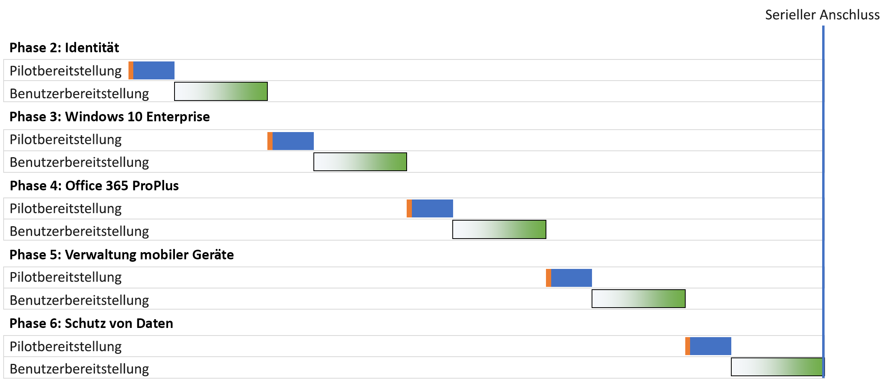
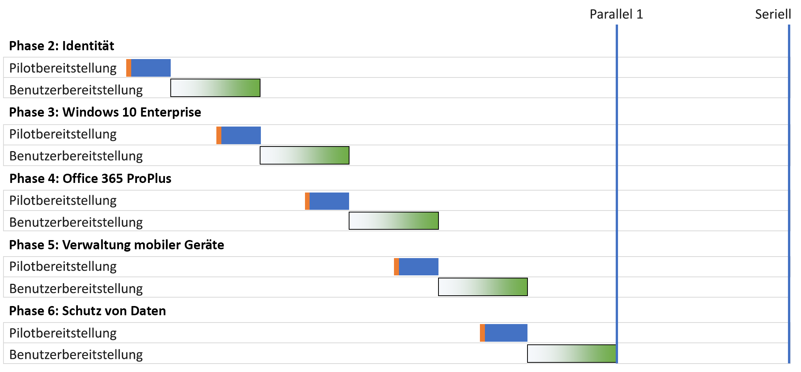
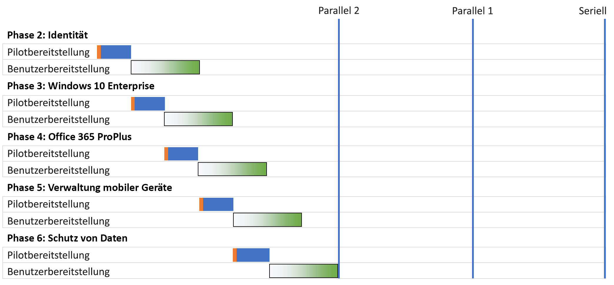
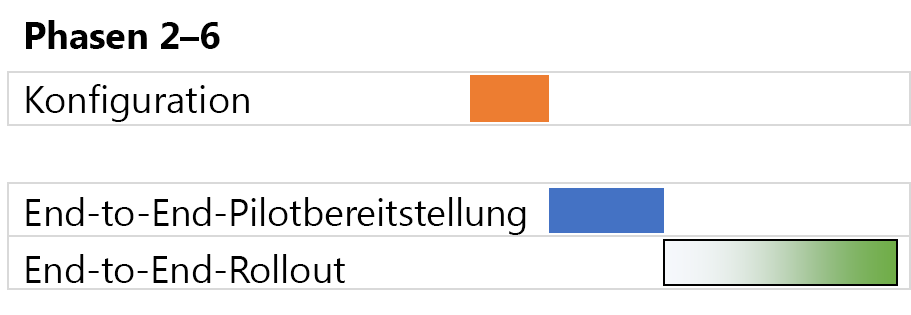

# Bereitstellungsstrategien für die Foundation-Infrastruktur von Microsoft 365 EnterpriseMicrosoft 365 Enterprise foundation infrastructure deployment strategies

Es gibt viele Möglichkeiten, die Phasen der [Foundation-Infrastruktur](deploy-foundation-infrastructure.md) von Microsoft 365 Enterprise zu nutzen und ihre Funktionen, Software und Dienste für Ihre Benutzer bereitzustellen. Um mit dem Projektmanagement dieses Vorhabens zu beginnen, das je nach Größe Ihres Unternehmens und der vorhandenen Infrastruktur groß und komplex sein kann, sollten Sie die folgenden Bereitstellungsstrategien in Betracht ziehen:There are many ways you can deploy the phases of the [foundation infrastructure](deploy-foundation-infrastructure.md) of Microsoft 365 Enterprise and roll out its capabilities, software, and services to your users. To get you started on the project management of this undertaking, which can be large and complex depending on the size of your organization and its existing infrastructure, consider the following deployment strategies:

- Serielle BereitstellungSerial deployment
- Parallele Bereitstellung mit nicht überlappendem BenutzerrolloutParallel deployment with non-overlapping user rollout
- Parallele Bereitstellung mit überlappendem BenutzerrolloutParallel deployment with overlapping user rollout
- Vorabinfrastruktur und Rollout der End-to-End-KonfigurationUp-front infrastructure and rollout of the end-to-end configuration

Nutzen Sie diese Strategien für Ideen, wie Sie das Gesamtprojekt verwalten und die Geschäftsvorteile von Microsoft 365 Enterprise schneller nutzen können.Use these strategies for ideas on how to manage the overall project and more quickly realize the business benefits of Microsoft 365 Enterprise.

>[!Note]
>Dieser Artikel enthält Annahmen und Vereinfachungen für eine einheitliche Beschreibung der Bereitstellungsstrategien. Diese Bereitstellungsstrategien sind verallgemeinert und sollen weder einen bestimmten Zeitrahmen implizieren, noch sollen sie für alle Organisationen und Situationen gelten.This article contains assumptions and simplifications for a consistent way to describe the deployment strategies. These deployment strategies are generalized and are not meant to imply any specific timeframes, nor are they meant to apply to all organizations and situations.
>

## Elemente des IT-Projektmanagements für typische UnternehmensorganisationenElements of IT project management for typical enterprise organizations

Die IT-Infrastruktur umfasst sowohl Back-End-Dienste als auch die Einführung neuer oder verbesserter Funktionen oder installierter Software für Endbenutzer. IT-Abteilungen setzen in der Regel Elemente einer IT-Infrastruktur methodisch ein. Ein Ansatz für die erfolgreiche Bereitstellung eines Elements der IT-Infrastruktur berücksichtigt die folgenden Aspekte:IT infrastructure includes both backend services and the rollout of new or improved capabilities or installed software to end users. IT departments typically deploy elements of an IT infrastructure in a methodical way. One approach to the successful deployment of an element of IT infrastructure consists of:

- Eine PilotbereitstellungA pilot rollout 

  Dazu gehören die anfängliche Infrastrukturkonfiguration und das Rollout für eine Pilotgruppe von Benutzern, das Testen und spätere Änderungen der Infrastrukturkonfiguration.This includes initial infrastructure configuration and rollout to a pilot set of users, testing, and subsequent modifications to the infrastructure configuration.

- Eine BenutzerbereitstellungA user rollout

  Dazu gehört auch das Rollout für den Rest Ihres Unternehmens basierend auf Regionen, Abteilungen, Gruppen oder anderen Arten der systematischen Verteilung von Konfiguration oder Software.This includes the rollout to the rest of your organization based on regions, departments, groups, or other types of systematic propagation of configuration or software.

Die Benutzergruppe im Pilotrollout ist nicht identisch mit derjenigen im Benutzerrollout.The set of users in the pilot rollout are not the same as those in the user rollout.

Dieser Artikel verwendet die folgenden Grafikelemente, um diese Definitionen darzustellen:This article uses the following graphics to depict these definitions: 

 

Die Schattierung für die Benutzerrolloutgrafik zeigt den Prozentanteil in Ihrem Unternehmen von 0 % bis 100 % mit einem strukturierten oder methodischen Ansatz wie Gruppen, Abteilungen oder Regionen.The shading for the user rollout graphic indicates the percentage across your organization from 0% to 100% using a structured or methodical approach such as groups, departments, or regions.

## BereitstellungsstrategienDeployment strategies

Ziehen Sie die folgenden Bereitstellungsstrategien in Betracht:Consider the following deployment strategies:

- Serielle BereitstellungSerial deployment
- Parallele Bereitstellung mit nicht überlappendem BenutzerrolloutParallel deployment with non-overlapping user rollout
- Parallele Bereitstellung mit überlappendem BenutzerrolloutParallel deployment with overlapping user rollout
- Vorabinfrastruktur und Rollout der End-to-End-KonfigurationUp-front infrastructure and rollout of the end-to-end configuration

### Serielle BereitstellungSerial deployment

Bei einer seriellen Bereitstellung führen Sie eine Phase vollständig aus, sodass die Phase einen 100%igen Abschluss der Bereitstellung für alle Ihre Benutzer erreicht, bevor Sie zur nächsten Phase übergehen. Im Folgenden finden Sie einige der Gründe, warum Sie diese Art der Bereitstellung wählen sollten:With a serial deployment, you completely roll out a phase, allowing the phase to reach 100% completion of deployment to all of your users, before moving on to the next one. Here are some of the reasons why you might deploy this way:

- RisikominderungRisk mitigation
- RessourceneinschränkungenResourcing constraints
- Finanzierungszyklen der IT-AbteilungIT department funding cycles
- IT-TechnologieabhängigkeitenIT technology dependencies
- Geschäftsänderungsverwaltung und EndbenutzerresistenzBusiness change management and end-user resistance

Dieses Gantt-Diagramm zeigt eine vereinfachte serielle Bereitstellung der Phasen 2 bis 6 der Foundation-Infrastruktur für Microsoft 365 Enterprise.This Gantt chart shows a simplified serial deployment of phases 2-6 of the foundation infrastructure for Microsoft 365 Enterprise.

 
 
Um die Erläuterung und das Beispiel zu vereinfachen, wird davon ausgegangen, dass jede Phase und jedes Einsatzsegment innerhalb jeder Phase die gleiche Zeit in Anspruch nimmt.To simplify the discussion and example, each phase and deployment segment within each phase are assumed to take the same amount of time.

>[!Note]
>Phase 1: Die Vernetzung der Microsoft 365 Enterprise Foundation-Infrastruktur ist eine reine Phase der IT-Abteilung. Benutzer profitieren von den Vorteilen einer optimierten Konnektivität mit den Cloudressourcen von Microsoft, werden aber nicht dazu gezwungen.Phase 1: Networking of the Microsoft 365 Enterprise Foundation Infrastructure is an IT department-only phase. Users reap the benefits of optimized connectivity to Microsoft’s cloud resources but are not imposed upon to achieve it.
>

Hier finden Sie ein Beispiel für eine vereinfachte Pilotbenutzeroberfläche:Here’s a simplified pilot user experience as an example:

- Im Dezember muss ich mein Smartphone für MFA verwenden.In December, I need to use my smart phone for MFA. (Identity) (Identität)Identity
- Im März wird Windows 10 Enterprise auf meinem Windows 8.1-Desktopcomputer installiert. (Windows 10 Enterprise)In March, I get Windows 10 Enterprise installed on my Windows 8.1 desktop. (Windows 10 Enterprise)
- Im Juni wird Office 365 ProPlus installiert und ersetzt Office 2013. (Office 365 ProPlus)In June, I get Office 365 ProPlus installed, replacing Office 2013. (Office 365 ProPlus)
- Im September erfolgt die Geräteregistrierung, und es werden App- und Geräterichtlinien angewendet.In September, I get device enrollment and app and conditional access policies applied. (Mobile device management) (Verwaltung mobiler Geräte)Mobile device management
- Im Dezember wird der Azure Information Protection-Client installiert, und ich erhalte Schulung, wie Bezeichnungen auf Dokumente angewendet werden. (Information Protection)In December, I get the Azure Information Protection client installed and get trained on how to apply labels to documents. (Information protection)

Das Ergebnis ist eine Kadenz von 90 Tagen zwischen den aufeinanderfolgenden Pilotrollouts.The result is a 90-day cadence between successive pilot rollouts.

Hier finden Sie ein Beispiel für eine vereinfachte Endbenutzeroberfläche:Here’s a simplified end-user experience as an example:

- Im Januar muss ich mein Smartphone für MFA verwenden.In January, I need to use my smart phone for MFA. (Identity) (Identität)Identity
- Im April wird Windows 10 Enterprise auf meinem Windows 8.1-Desktopcomputer installiert. (Windows 10 Enterprise)In April, I get Windows 10 Enterprise installed on my Windows 8.1 desktop. (Windows 10 Enterprise)
- Im Juli wird Office 365 ProPlus installiert und ersetzt Office 2013. (Office 365 ProPlus)In July, I get Office 365 ProPlus installed, replacing Office 2013. (Office 365 ProPlus)
- Im Oktober erfolgt die Geräteregistrierung, und es werden App- und Geräterichtlinien angewendet.In October, I get device enrollment and app and conditional access policies applied. (Mobile device management) (Verwaltung mobiler Geräte)Mobile device management
- Im Januar des Folgejahres wird der Azure Information Protection-Client installiert, und ich erhalte Schulung, wie Bezeichnungen auf Dokumente angewendet werden. (Information Protection)In January of the following year, I get the Azure Information Protection client installed and get trained on how to apply labels to documents. (Information protection)

Das Ergebnis ist eine Kadenz von 90 Tagen zwischen den aufeinanderfolgenden Benutzerrollouts.The result is a 90-day cadence between successive user rollouts.

Der Nachteil dieser Bereitstellungsstrategie besteht darin, dass es lange dauern kann, bis die Microsoft 365 Enterprise Foundation-Infrastruktur vollständig bereitgestellt wurde.The disadvantage to this deployment strategy is that it can take a long time to fully deploy the Microsoft 365 Enterprise foundation infrastructure.

### Parallele Bereitstellung mit nicht überlappendem Benutzerrollout (Parallel 1)Parallel deployment with non-overlapping user rollout (Parallel 1)

Für diese Bereitstellungsstrategie starten Sie das Pilotrollout der nächsten Phase im letzten Teil des Benutzerrollouts der aktuellen Phase. Hier findet die Bereitstellung der Phasen 2 bis 6 statt, wenn das Pilotrollout stattfindet, während das Benutzerrollout der vorherigen Phase abgeschlossen ist.For this deployment strategy, you start the pilot rollout of the next phase during the last part of the user rollout of the current phase. Here is the deployment of phases 2-6 when the pilot rollout occurs as the user rollout of the previous phase is wrapping up.

 
 
Das Endergebnis ist, dass das Benutzerrollout für die aktuelle Phase in Ihrem Unternehmen abgeschlossen ist, bevor die nächste Phase beginnt. Benutzer, die sich nicht in Pilotrollouts befinden, befassen sich nicht gleichzeitig mit den Rollouts mehrerer Phasen, aber Pilotrollouts werden parallel zu Benutzerrollouts durchgeführt.The end result is that user rollout for the current phase completes across your organization before the next one starts. Users that are not in pilot rollouts are not dealing with the rollouts of multiple phases at the same time, but pilot rollouts are done in parallel with user rollouts.

Hier finden Sie ein Beispiel für eine vereinfachte Pilotbenutzeroberfläche:Here’s a simplified pilot user experience as an example:

- Im Dezember muss ich mein Smartphone für MFA verwenden. (Identität)In December, I need to use my smart phone for MFA. (Identity)
- Im Februar wird Windows 10 Enterprise auf meinem Windows 8.1-Desktopcomputer installiert. (Windows 10 Enterprise)In February, I get Windows 10 Enterprise installed on my Windows 8.1 desktop. (Windows 10 Enterprise)
- Im April wird Office 365 ProPlus installiert und ersetzt Office 2013. (Office 365 ProPlus)In April, I get Office 365 ProPlus installed, replacing Office 2013. (Office 365 ProPlus)
- Im Juni erfolgt die Geräteregistrierung, und es werden App- und Geräterichtlinien angewendet.In June, I get device enrollment and app and conditional access policies applied. (Mobile device management) (Verwaltung mobiler Geräte)Mobile device management
- Im August wird der Azure Information Protection-Client installiert, und ich erhalte Schulung, wie Bezeichnungen auf Dokumente angewendet werden. (Information Protection)In August, I get the Azure Information Protection client installed and get trained on how to apply labels to documents. (Information protection)

Das Ergebnis ist eine Kadenz von 60 Tagen zwischen den aufeinanderfolgenden Pilotrollouts.The result is a 60-day cadence between successive pilot rollouts.

Hier finden Sie ein Beispiel für eine vereinfachte Endbenutzeroberfläche:Here’s a simplified end-user experience as an example:

- Im Januar muss ich mein Smartphone für MFA verwenden. (Identität)In January, I need to use my smart phone for MFA. (Identity)
- Im März wird Windows 10 Enterprise auf meinem Windows 8.1-Desktopcomputer installiert. (Windows 10 Enterprise)In March, I get Windows 10 Enterprise installed on my Windows 8.1 desktop. (Windows 10 Enterprise)
- Im Mai wird Office 365 ProPlus installiert und ersetzt Office 2013. (Office 365 ProPlus)In May, I get Office 365 ProPlus installed, replacing Office 2013. (Office 365 ProPlus)
- Im Juli erfolgt die Geräteregistrierung, und es werden App- und Geräterichtlinien angewendet.In July, I get device enrollment and app and conditional access policies applied. (Mobile device management) (Verwaltung mobiler Geräte)Mobile device management
- Im September wird der Azure Information Protection-Client installiert, und ich erhalte Schulung, wie Bezeichnungen auf Dokumente angewendet werden. (Information Protection)In September, I get the Azure Information Protection client installed and get trained on how to apply labels to documents. (Information protection)

Das Ergebnis ist eine Kadenz von 60 Tagen zwischen den aufeinanderfolgenden Benutzerrollouts.The result is a 60-day cadence between successive user rollouts.

Der Vorteil dieser Bereitstellungsstrategie besteht darin, dass die vollständige Bereitstellung der Microsoft 365 Enterprise Foundation-Infrastruktur in kürzerer Zeit erfolgen kann, ohne dass Ihre IT-Abteilung und Benutzer mehrere Rollouts gleichzeitig durchführen müssen.The advantage to this deployment strategy is that it can take less time to fully deploy the Microsoft 365 Enterprise foundation infrastructure, without having your IT department and users deal with multiple rollouts the same time.

### Parallele Bereitstellung mit überlappendem Benutzerrollout (Parallel 2)Parallel deployment with overlapping user rollout (Parallel 2)

Für diese Bereitstellungsstrategie beginnen Sie:For this deployment strategy, you start the:

- Das Pilotrollout der nächsten Phase während des letzten Teils des Benutzerrollouts der aktuellen Phase.Pilot rollout of the next phase during the last part of the user rollout of the current phase.
- Benutzerrollout der nächsten Phase während des Benutzerrollouts der aktuellen Phase, sodass sich kein Benutzer mit dem Rollout mehrerer Phasen gleichzeitig befassen muss.User rollout of the next phase during the user rollout of the current phase in such a way that no user is dealing with the rollouts of multiple phases at the same time. This assumes that you are rolling out each phase of the foundation infrastructure in the same way, via regions, departments, or other. Dies setzt voraus, dass das Rollout der einzelnen Phasen der Foundation-Infrastruktur auf die gleiche Weise wie Regionen, Abteilungen oder andere Gruppierungen erfolgt.This assumes that you are rolling out each phase of the foundation infrastructure in the same way, using regions, departments, or other groupings.

Dies ist ein vereinfachter Vergleich zwischen den verschiedenen Bereitstellungsstrategien.Here is a simplified comparison between the different deployment strategies.

 

Für das Endergebnis gilt Folgendes:The end result is that:

- Pilotrollouts gehen ohne Unterbrechung von einer Phase in die nächste über.Pilot rollouts go from one phase to the next without a pause.
- Das Benutzerrollout für eine Phase beginnt vor Abschluss des Benutzerrollouts der vorherigen Phase, aber kein einzelner Benutzer führt mehr als eine Phase gleichzeitig aus.The user rollout for a phase begins before the completion of the user rollout of the previous phase, but no individual user is rolling out more than one phase at a time.

Hier finden Sie ein Beispiel für eine vereinfachte Pilotbenutzeroberfläche:Here’s a simplified pilot user experience as an example:

- Im Dezember muss ich mein Smartphone für MFA verwenden. (Identität)In December, I need to use my smart phone for MFA. (Identity)
- Im Januar wird Windows 10 Enterprise auf meinem Windows 8.1-Desktopcomputer installiert. (Windows 10 Enterprise)In January, I get Windows 10 Enterprise installed on my Windows 8.1 desktop. (Windows 10 Enterprise)
- Im Februar wird Office 365 ProPlus installiert und ersetzt Office 2013. (Office 365 ProPlus)In February, I get Office 365 ProPlus installed, replacing Office 2013. (Office 365 ProPlus)
- Im März erfolgt die Geräteregistrierung, und es werden App- und Geräterichtlinien angewendet.In March, I get device enrollment and app and conditional access policies applied. (Mobile device management) (Verwaltung mobiler Geräte)Mobile device management
- Im April wird der Azure Information Protection-Client installiert, und ich erhalte Schulung, wie Bezeichnungen auf Dokumente angewendet werden. (Information Protection)In April, I get the Azure Information Protection client installed and get trained on how to apply labels to documents. (Information protection)

Das Ergebnis ist eine Kadenz von 30 Tagen zwischen den aufeinanderfolgenden Pilotrollouts.The result is a 30-day cadence between successive pilot rollouts.

Hier finden Sie ein Beispiel für eine vereinfachte Endbenutzeroberfläche:Here’s a simplified end-user experience as an example:

- Im Januar muss ich mein Smartphone für MFA verwenden. (Identität)In January, I need to use my smart phone for MFA. (Identity)
- Im Februar wird Windows 10 Enterprise auf meinem Windows 8.1-Desktopcomputer installiert. (Windows 10 Enterprise)In February, I get Windows 10 Enterprise installed on my Windows 8.1 desktop. (Windows 10 Enterprise)
- Im März wird Office 365 ProPlus installiert und ersetzt Office 2013. (Office 365 ProPlus)In March, I get Office 365 ProPlus installed, replacing Office 2013. (Office 365 ProPlus)
- Im April erfolgt die Geräteregistrierung, und es werden App- und Geräterichtlinien angewendet.In April, I get device enrollment and app and conditional access policies applied. (Mobile device management) (Verwaltung mobiler Geräte)Mobile device management
- Im Mai wird der Azure Information Protection-Client installiert, und ich erhalte Schulung, wie Bezeichnungen auf Dokumente angewendet werden. (Information Protection)In May, I get the Azure Information Protection client installed and get trained on how to apply labels to documents. (Information protection)

Das Ergebnis ist eine Kadenz von 30 Tagen zwischen den aufeinanderfolgenden Benutzerrollouts.The result is a 30-day cadence between successive user rollouts.

Der Vorteil dieser Bereitstellungsstrategie besteht darin, dass die vollständige Bereitstellung der Microsoft 365 Enterprise Foundation-Infrastruktur in noch kürzerer Zeit erfolgen kann, Ihre Benutzer aber trotzdem nicht mehrere Rollouts gleichzeitig durchführen müssen.The advantage to this deployment strategy is that it can take even less time to fully deploy the Microsoft 365 Enterprise foundation infrastructure, still without having individual users deal with multiple rollouts the same time. However, users don’t get a break between successive phases. Allerdings erhalten die Benutzer keine Pause zwischen den aufeinanderfolgenden Phasen.However, users don’t get a break between successive phases.

### Vorabinfrastruktur und Rollout der End-to-End-KonfigurationUp-front infrastructure and rollout of the end-to-end configuration

Für kleinere Unternehmen mit der Möglichkeit, die Phasen 2 bis 6 in einem einzigen Bereitstellungssegment zu komprimieren, sieht die sich ergebende Bereitstellung folgendermaßen aus:For smaller organizations with the ability to compress phases 2-6 into a single deployment segment, the resulting deployment looks like this:
 
 

Die IT-Abteilung konfiguriert die Infrastruktur für die Phasen 2 bis 6 und stellt sie dann für die Pilotbenutzer bereit, um die End-to-End-Funktionalität zu überprüfen. Beispielsweise erhalten Pilotbenutzer alle diese Funktionen gleichzeitig:The IT department configures the infrastructure for phases 2-6, then rolls out to the pilot users to check for the end-to-end functionality. For example, pilot users get all of this functionality at the same time:

- MFA und andere Identitätsfeatures (Identität)MFA and other identity features (Identity)
- Windows 10 Enterprise auf Windows-Geräten (Windows 10 Enterprise)Windows 10 Enterprise on Windows devices (Windows 10 Enterprise)
- Office 365 ProPlus für die Office-Suite (Office 365 ProPlus)Office 365 ProPlus for the Office suite (Office 365 ProPlus)
- App und Geräterichtlinien (Verwaltung mobiler Geräte)App and conditional access policies (Mobile device management)
- Installation des Azure Information Protection-Clients und Schulung, wie Bezeichnungen auf Dokumente angewendet werden (Information Protection)Azure Information Protection client installed and training on how to apply labels to documents (Information protection)

Nach Abschluss des Pilotrollouts beginnt das Benutzerrollout, bei dem jeder Benutzer alle Funktionen gleichzeitig erhält.Once the pilot rollout is concluded, the user rollout begins in which each user gets all the functionality the same time.

## Nächster SchrittNext step

Starten der Bereitstellung von Microsoft 365 Enterprise mit der [Foundation-Infrastruktur](deploy-foundation-infrastructure.md).Start your deployment of Microsoft 365 Enterprise with the [foundation infrastructure](deploy-foundation-infrastructure.md).
