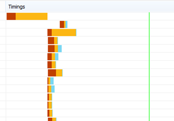

# Diagnose von Leistungsproblemen mit SharePoint OnlineDiagnosing performance issues with SharePoint Online

In diesem Artikel erfahren Sie, wie Sie häufig auftretende Probleme mit Ihrer SharePoint Online Website mithilfe Internet Explorer Entwicklertools diagnostizieren können.This article shows you how you can diagnose common issues with your SharePoint Online site using Internet Explorer developer tools.
  
Es gibt drei verschiedene Möglichkeiten, um festzustellen, ob eine Seite auf einer SharePoint Online Website ein Leistungsproblem mit den Anpassungen aufweist.There are three different ways that you can identify that a page on a SharePoint Online site has a performance problem with the customizations.
  
- Die F12-Toolleiste NetzwerkmonitorThe F12 tool bar network monitor

- Vergleich mit einer nicht angepassten BaselineComparison to a non-customized baseline

- Metriken für SharePoint Online AntwortheaderSharePoint Online response header metrics

In diesem Thema wird beschrieben, wie Sie diese Methoden zum Diagnostizieren von Leistungsproblemen verwenden.This topic describes how to use each of these methods to diagnose performance issues. Nachdem Sie die Ursache des Problems herausgefunden haben, können Sie mit den Artikeln zur Verbesserung der SharePoint-Leistung, die Sie finden können, auf eine Lösung hinarbeiten https://aka.ms/tune .Once you've figured out the cause of the problem, you can work toward a solution using the articles about improving SharePoint performance that you can find on https://aka.ms/tune.
  
## Diagnostizieren der Leistung in SharePoint Online mithilfe der F12-SymbolleisteUsing the F12 tool bar to diagnose performance in SharePoint Online

In diesem Artikel verwenden wir Internet Explorer 11.In this article we use Internet Explorer 11. Versionen der F12-Entwicklertools in anderen Browsern weisen ähnliche Features auf, die sich jedoch möglicherweise geringfügig unterscheiden.Versions of the F12 developer tools on other browsers have similar features though they may look slightly different. Informationen zu den F12-Entwicklertools finden Sie unter:For information on the F12 developer tools, see:
  
- [Neuerungen in F12-ToolsWhat's new in F12 Tools](https://go.microsoft.com/fwlink/p/?LinkId=522545)

- [Verwenden der F12-EntwicklertoolsUsing the F12 developer tools](https://go.microsoft.com/fwlink/p/?LinkId=522546)

Drücken Sie **F12** , um die Entwicklertools aufzurufen, und klicken Sie dann auf das Symbol WLAN:To bring up the developer tools press **F12** and then click the Wi-Fi icon:
  

  
Drücken Sie auf der Registerkarte **Netzwerk** die grüne Wiedergabe-Schaltfläche, um eine Seite zu laden.On the **Network** tab, press the green play button to load a page. Das Tool gibt alle Dateien zurück, die der Browser anfordert, um die von Ihnen gewünschte Seite abzurufen.The tool returns all of the files that the browser requests in order to get the page you asked for. Der folgende Screenshot zeigt eine solche Liste.The following screen shot shows one such list.
  

  
Sie können auch die Downloadzeiten der Dateien auf der rechten Seite sehen, wie in diesem Screenshot gezeigt.You can also see the download times of the files on the right side as shown in this screen shot.
  

  
Dadurch erhalten Sie eine visuelle Darstellung der Dauer der Datei zum Laden.This gives you a visual representation of how long the file took to load. Die grüne Leiste stellt dar, wann die Seite für den Browser gerendert werden kann.The green line represents when the page is ready to be rendered by the browser. Dadurch erhalten Sie einen schnellen Überblick über die verschiedenen Dateien, die zu langsamen Seitenlasten auf Ihrer Website führen könnten.This can give you a quick view of the different files that might be causing slow page loads on your site.
  
## Einrichten einer nicht angepassten Baseline für SharePoint OnlineSetting up a non-customized baseline for SharePoint Online

Die beste Möglichkeit, die Leistung Schwachstellen Ihrer Website zu ermitteln, besteht darin, eine vollständig vordefinierte Websitesammlung in SharePoint Online einzurichten.The best way to determine your site's performance weak points is to set up a completely out-of-the-box site collection in SharePoint Online. Auf diese Weise können Sie alle verschiedenen Aspekte Ihrer Website mit dem vergleichen, was Sie ohne Anpassung auf der Seite erhalten würden.This way you can compare all the various aspects of your site with what you would get with no customization on the page. Die OneDrive für Unternehmen Homepage ist ein gutes Beispiel für eine separate Websitesammlung, die wahrscheinlich keine Anpassungen aufweist.The OneDrive for Business home page is a good example of a separate site collection that is unlikely to have any customizations.
  
## Anzeigen von SharePoint-Antwortheader InformationenViewing SharePoint response header information

In SharePoint Online können Sie auf die Informationen zugreifen, die in der Antwort Kopfzeile für jede Datei an den Browser zurückgesendet werden.In SharePoint Online, you can access the information that is sent back to the browser in the response header for each file. Der nützlichste Wert für die Diagnose von Leistungsproblemen ist **SPRequestDuration**, mit dem die Zeitdauer angezeigt wird, die die Anforderung auf dem zu verarbeitenden Server benötigt.The most useful value for diagnosing performance issues is **SPRequestDuration**, which displays the amount of time that the request took on the server to be processed. Dies kann helfen, festzustellen, ob die Anforderung sehr schwer ist und ressourcenintensiv ist.This can help determine if the request is very heavy and resource intensive. Dies ist die beste Einblicke in die Arbeit, die der Server für die Bereitstellung der Seite leistet.This is the best insight you have into how much work the server is doing to serve the page.

### So zeigen Sie Informationen zum SharePoint-Antwortheader anTo view SharePoint response header information
  
1. Stellen Sie sicher, dass die F12-Tools installiert sind.Ensure that you have the F12 tools installed. Weitere Informationen zum herunterladen und Installieren dieser Tools finden Sie unter [What es New in F12 Tools](https://go.microsoft.com/fwlink/p/?LinkId=522545).For more information on downloading and installing these tools, see [What's new in F12 tools](https://go.microsoft.com/fwlink/p/?LinkId=522545).

2. Drücken Sie in den F12-Tools auf der Registerkarte **Netzwerk** die grüne Wiedergabe-Schaltfläche, um eine Seite zu laden.In the F12 tools, on the **Network** tab, press the green play button to load a page.

3. Klicken Sie auf eine der ASPX-Dateien, die vom Tool zurückgegeben werden, und klicken Sie dann auf **Details**.Click one of the .aspx files returned by the tool and then click **DETAILS**.

    
  
4. Klicken Sie auf **Antwortheader**.Click **Response headers**.

    
  
## Was verursacht Leistungsprobleme in SharePoint Online?What's causing performance issues in SharePoint Online?

Die Artikel [Navigationsoptionen für SharePoint Online](navigation-options-for-sharepoint-online.md) zeigen ein Beispiel für die Verwendung des SPRequestDuration-Werts, um festzustellen, ob die komplizierte strukturelle Navigation dazu führte, dass die Verarbeitung auf dem Server auf der Seite lange dauert.The article [Navigation options for SharePoint Online](navigation-options-for-sharepoint-online.md) shows an example of using the SPRequestDuration value to determine that the complicated structural navigation was causing the page to take a long time to process on the server. Durch die Verwendung eines Werts für eine Baseline-Website (ohne Anpassung) können Sie ermitteln, ob eine bestimmte Datei viel Zeit zum Laden braucht.By taking a value for a baseline site (without customization), it is possible to determine if any given file is taking a long time to load. Das Beispiel, das in [Navigationsoptionen für SharePoint Online](navigation-options-for-sharepoint-online.md) verwendet wird, ist die Datei "Main. aspx".The example used in [Navigation options for SharePoint Online](navigation-options-for-sharepoint-online.md) is the main .aspx file. Diese Datei enthält die meisten ASP.NET-Code, der für die Seiten Lade ausgeführt wird.That file contains most of the ASP.NET code that runs for your page load. Je nach verwendeter Websitevorlage kann dies "Start. aspx", "Home. aspx", "default. aspx" oder ein anderer Name sein, wenn Sie die Homepage anpassen.Depending on the site template you use, this could be start.aspx, home.aspx, default.aspx, or another name if you customize the home page. Wenn diese Zahl erheblich höher ist als die Baseline-Website, ist dies ein guter Hinweis darauf, dass in Ihrer Seite ein Komplex vorgeht, der Leistungsprobleme verursacht.If this number is considerably higher than your baseline site, then it's a good indication that there is something complex going on in your page that is causing performance issues.
  
Nachdem Sie festgestellt haben, dass es sich um ein für Ihre Website spezifisches Problem handelt, ist die empfohlene Vorgehensweise, um herauszufinden, was eine schlechte Leistung verursacht, darin, alle möglichen Ursachen wie Seiten Anpassungen zu beseitigen und Sie dann nacheinander wieder der Website hinzuzufügen.Once you have identified that an issue specific to your site, the recommended way to figure out what is causing poor performance is to eliminate all of the possible causes, like page customizations, and then add them back to the site one by one. Nachdem Sie genügend Anpassungen entfernt haben, die die Seite gut ausführt, können Sie einzelne Anpassungen nacheinander hinzufügen.Once you have removed enough customizations that the page is performing well, you can then add back specific customizations one by one.
  
Wenn Sie beispielsweise eine sehr komplexe Navigation haben, versuchen Sie, die Navigation so zu ändern, dass Unterwebsites nicht angezeigt werden, und überprüfen Sie die Entwicklertools, um zu sehen, ob dies einen Unterschied macht.For example, if you have a very complex navigation try changing the navigation to not show sub-sites then check the developer tools to see if this makes a difference. Oder wenn Sie eine große Menge an Inhalts-Roll-ups haben, versuchen Sie, diese von Ihrer Seite zu entfernen und zu sehen, ob dies die Dinge verbessert.Or if you have a large amount of content roll-ups try removing them from your page and see if this improves things. Wenn Sie alle möglichen Ursachen beseitigen und gleichzeitig wieder hinzufügen, können Sie ganz einfach ermitteln, welche Funktionen das größte Problem darstellen, und dann auf eine Lösung hinarbeiten.If you eliminate all of the possible causes and add them back in one at a time, you can easily identify which features are the biggest problem and then work towards a solution.
